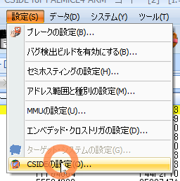
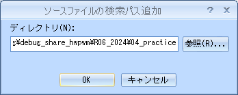

# 00.start

<!-- styleは、拡張機能 Markdown Preview Github Stylingをインストール-->
<!-- c:/Users/sfujimoto/.vscode/extensions/bierner.markdown-preview-github-styles-0.1.4/base.css -->
<!-- 参考URL: https://rui-log.com/vscode-markdown-preview-custom/ -->

[2024/7/15 Table of Contents]()

<!-- ctrl + ,  toc: level 1..3 へ変更-->

<div class="TOC">

<!-- @import "[TOC]" {cmd="toc" depthFrom=1 depthTo=2 orderedList=true} -->

<!-- code_chunk_output -->

1. [00.start](#00start)
    1. [目的](#目的)
    2. [履歴](#履歴)
    3. [ova インポート&スナップショット](#ova-インポートスナップショット)
    4. [組込みLinux アプリケーション開発を構成する各データについて](#組込みlinux-アプリケーション開発を構成する各データについて)

<!-- /code_chunk_output -->

</div>

<div style="page-break-before:always"></div>  <!-- PDFで改ページ-->

## 目的

組込みLinux アプリケーションデバッグ開発環境の構築

## 履歴

### R05_2023

| No| *.ova                     | 概要                | ドキュメント                       |
|---|---------------------------|--------------------|------------------------------------|
|Last| ArmadilloX1BusterNSK.ova | NSK導入研修後のDebugありHWPWM 構築| linux-4.9-x1-at27_dbg_hwpwm.md  |

保存場所: H:\VirtualMachines\ArmadilloX1Buster\20240424_ArmadilloX1Buster_bootmgLCD

### R06_2024

|No.| name                                    | 概要               | ドキュメント                       |
|---|-----------------------------------------|--------------------|-----------------------------------|
| 0 | ArmadilloX1BusterNSKhwpwm_start.ova ※1 | 20GBから100GBへ拡張 | 20240525_20GBto100GB.md           |
| 1 | ArmadilloX1BusterNSKhwpwm_org.ova       | 共有フォルダ、ATDE8のカスタマイズ |  20240602_ArmadilloX1BusterNSKhwpwm_org.md |
| 2 | ArmadilloX1BusterNSKhwpwm_base.ova      | カスタマイズ他               | 20240604_ArmadilloX1BusterNSKhwpwm_base.md  |
| 3 | ArmadilloX1BusterNSKhwpwm_start.ova     | ArmadilloX1起動             | 20240612_ArmadilloX1BusterNSKhwpwm_start.md |
| 4 | ArmadilloX1BusterNSKhwpwm_cside.ova     | CSIDEによるデバッグ環境構築   | 20240623_ArmadilloX1BusterNSKhwpwm_cside2.md |
| 5 | ArmadilloX1BusterNSKhwpwm_vscode.ova    | VSCodeによるRemoteSSH       | 20240627_ArmadilloX1BusterNSKhwpwm_vscode.md |
| 6 | ArmadilloX1BusterNSKhwpwm_appdbg.ova    | このドキュメント             | 20240702_00start.md |

※1 ArmadilloX1BusterNSKhwpwm_start.ova の _start は間違い

R5_2023はSWPWM（ソフトウェアPWM）のデバッグなしとデバッグあり で構築
R6_2024はHWPWM（ハードウェアPWM）のデバッグなしとデバッグあり で構築

## ova インポート&スナップショット

##### *.ova 履歴

|No.| name          | 保存場所    |
|---|---------------|------------|
| 1 | ArmadilloX1BusterNSKhwpwm_org.ova    | H:\VirtualMachines\ArmadilloX1Buster\20240531_ATDE8-20230127_org_*    |
| 2 | ArmadilloX1BusterNSKhwpwm_base.ova   | H:\VirtualMachines\ArmadilloX1Buster\20240531_ATDE8-20230127_base_*   |
| 3 | ArmadilloX1BusterNSKhwpwm_start.ova  | H:\VirtualMachines\ArmadilloX1Buster\20240604_ATDE8-20230127_start_*  |
| 4 | ArmadilloX1BusterNSKhwpwm_cside.ova  | H:\VirtualMachines\ArmadilloX1Buster\20240604_ATDE8-20230127_cside_*  |
| 5 | ArmadilloX1BusterNSKhwpwm_appdbg.ova | H:\VirtualMachines\ArmadilloX1Buster\20240624_ATDE8-20230127_appsbg_* |

※ 1204室と1405室の2種類ある

##### スナップショット履歴

|No.| name          | 説明    |
|---|---------------|---------|
| 1 | 20240623_appdbg_before  | ArmadilloX1BusterNSKhwpwm_appdbg.ova インポート直後 |

## 組込みLinux アプリケーション開発を構成する各データについて

### /media/sf_ArmadilloX1/hwpwm/work ディレクトリ

<details open><summary> ･･･/share/ArmadilloX1/hwpwm/<span style="color: red">work</span>/R06_2024/Application<span style="color: red">_debug</span>/ の構成 </span>/ </summary>

```bash{.line-numbers}
user@1204PC-Z490M:/mnt/v/VirtualBoxWork/share/ArmadilloX1/hwpwm/work$ tree -aF -L 3 R06_2024/
R06_2024//
├── Application/ <──────────────── Linuxアプリケーション開発（利用しないこと）
│   └── text/
│       ├── practice/ <─────────── 例題（利用しないこと）
│       └── practice-example/ <─── 課題のサンプルソース（利用しない）
├── Application_debug/ <────────── Linuxアプリケーションデバッグ開発（R06_2024はこちらのディレクトリ）
│   └── text/
│       ├── practice/ <─────────── 例題
│       └── practice-example/ <─── 課題のサンプルソース（配布時は空）
├── Extra/ <────────────────────── Webカメラを利用したLinuxアプリケーション開発
├── Extra_debug(未完成)/ <──────── Webカメラを利用したLinuxアプリケーションデバッグ開発
├── RemoteControl/ <────────────── 標準課題「遠隔監視システムの構築」
└── RemoteControl_debug(未完成)/ <─ 標準課題「遠隔監視システムの構築」デバッグ開発

```

</details>

### /media/sf_ArmadilloX1/hwpwm/work/R06_2024/Apllication_debug/text/practice ディレクトリ

!!! Note practice-example ディレクトリはサンプルソースあり

<details open><summary> ･･･/share/ArmadilloX1/hwpwm/<span style="color: red">work</span>/R06_2024/Application<span style="color: red">_debug</span>/<span style="color: red">text</span>/practice/ の構成</summary>

```bash{.line-numbers}
user@1204PC-Z490M:/mnt/v/VirtualBoxWork/share/ArmadilloX1/hwpwm/work/R06_2024/Application_debug/text/practice$ tree -aF -L 3
./
├── 01.hello/
│   ├── article.txt*            <───── 課題1 対象ファイル
│   ├── count.c*                <───── 課題1 ファイル読込み
│   ├── hello.c*                <───── 例題
│   ├── Makefile*               <───── /work/linux/nfsroot/debug/04_practice へコピー
│   ├── rot13.c*                <───── 課題2 ファイル書込み
│   └── sigtest.c*              <───── 課題3 シグナル
│
├── 02.led/
│   ├── drivers/
│   │   └── leds/
│   │       ├── leds.c*         <───── ドライバソース
│   │       └── Makefile*       <───── ドライバ用Makefile
│   ├── ldmeter.c*              <───── 例題 デバイス制御用ソース
│   ├── ledctl.c*               <───── 課題 デバイス制御用ソース
│   └── Makefile*               <───── デバイス制御用Makefile
│
├── 03.button/
│   ├── btevent.c*              <───── 例題 デバイス制御用ソース
│   ├── btlaunch.c*             <───── 課題2 デバイス制御用ソース
│   ├── btled.c*                <───── 課題1 デバイス制御用ソース
│   ├── button.cmd*             <───── 課題2 コマンドリスト
│   ├── drivers/
│   │   ├── buttons/
│   │   │   ├── buttons.c*      <───── ドライバソース
│   │   │   └── Makefile*       <───── ドライバ用Makefile
│   │   └── leds/
│   └── Makefile*               <───── デバイス制御用Makefile
│
├── 04.sensor/
│   ├── asevent.c*              <───── 例題 デバイス制御用ソース
│   ├── asled.c*                <───── 課題1 デバイス制御用ソース
│   ├── drivers/
│   │   ├── acceleration/
│   │   │   ├── acceleration.c* <───── ドライバソース
│   │   │   └── Makefile*       <───── ドライバ用Makefile
│   │   └── leds/
│   └── Makefile*               <───── デバイス制御用Makefile
│
├── 05.motor/
│   ├── drivers/
│   │   ├── buttons/
│   │   ├── leds/
│   │   └── motor/
│   │       ├── Makefile*       <───── ドライバ用Makefile
│   │       └── motor.c*        <───── ドライバソース
│   ├── Makefile*               <───── デバイス制御用Makefile
│   ├── mtctl.c*                <───── 例題 デバイス制御用ソース
│   ├── mtfan2.c*               <───── 課題2 デバイス制御用ソース
│   └── mtfan.c*                <───── 課題1 デバイス制御用ソース
│
├── 06.d7seg/
│   ├── d7ctl.c*                <───── 例題 デバイス制御用ソース
│   ├── d7fan.c*                <───── 課題1 デバイス制御用ソース
│   ├── drivers/
│   │   ├── buttons/
│   │   ├── d7seg/
│   │   │   ├── d7seg.c*        <───── ドライバソース
│   │   │   └── Makefile*       <───── ドライバ用Makefile
│   │   ├── leds/
│   │   └── motor/
│   └── Makefile*               <───── デバイス制御用Makefile
│
├── 07.charlcd/
│   ├── clclock.c*              <───── 課題1 デバイス制御用ソース
│   ├── clctl.c*                <───── 例題 デバイス制御用ソース
│   ├── drivers/
│   │   └── clcd/
│   │       ├── cgram/
│   │       │   ├── default.h*  <─────
│   │       │   └── swedish.h*  <─────
│   │       ├── charmap.h*      <─────
│   │       ├── commands.h*     <─────
│   │       ├── compat.h*       <─────
│   │       ├── config.h*       <─────
│   │       ├── hardware.h*     <─────
│   │       ├── hd44780.c*      <───── モジュールソース
│   │       ├── hd44780.h*      <───── モジュールヘッダ
│   │       ├── Kconfig*        <─────
│   │       ├── lcd-linux.c*    <───── ドライバソース
│   │       ├── lcd-linux.h*    <───── ドライバヘッダ
│   │       ├── Makefile*       <───── ドライバ用Makefile
│   │       └── Makefile-2.6*
│   └── Makefile*               <───── デバイス制御用Makefile
│
├── 08.lcd/
│   ├── bitmap/
│   │   ├── 1-sea.bmp*          <───── 課題2用ビットマップファイル
│   │   ├── 2-park.bmp*         <───── 課題2用ビットマップファイル
│   │   ├── 3-church.bmp*       <───── 課題2用ビットマップファイル
│   │   └── 4-factory.bmp*      <───── 課題2用ビットマップファイル
│   ├── colorbar.c*             <───── 課題1 デバイス制御用ソース
│   ├── dispbmp.c*              <───── 課題2 デバイス制御用ソース
│   ├── lcdclear.c*             <───── 例題 デバイス制御用ソース
│   ├── Makefile*               <───── デバイス制御用Makefile
│   └── primcol.rgb*            <───── 24ビット非圧縮ビットマップ画像ファイル
│
├── 09.touchpanel/
│   ├── Makefile*               <───── デバイス制御用Makefile
│   ├── stamp.bmp*              <───── 課題2用ビットマップファイル
│   ├── tpevent2.c*             <───── 課題1 デバイス制御用ソース
│   ├── tpevent.c*              <───── 例題 デバイス制御用ソース
│   └── tpstamp.c*              <───── 課題1 デバイス制御用ソース
│
├── 10.gui/
│   ├── drivers/
│   │   ├── leds/
│   │   └── motor/
│   ├── guipanel.c*             <───── 課題 デバイス制御用ソース
│   ├── image.bmp*              <───── 課題用ビットマップファイル
│   └── Makefile*               <───── デバイス制御用Makefile
│
├── 11.network/
│   ├── dccli.c*                <───── クライアントアプリケーション(ATDE8)
│   ├── dccmd.h*                <───── コマンド
│   ├── dcsrv.c*                <───── サーバーアプリケーション(ArmadilloX1)
│   ├── drivers/
│   │   ├── leds/
│   │   └── motor/
│   ├── Makefile*               <───── デバイス制御用Makefile
│   └── netpanel.c*             <───── GUIクライアントアプリケーション(ArmadilloX1)
│
└── 12.webapp/
    ├── devctl.c*               <─────課題
    ├── drivers/                <───── デバイスドライバ
    │   ├── leds/               <───── Nginx は デバイスファイルの chmod 必要
    │   └── motor/              <───── Nginx は デバイスファイルの chmod 必要
    └── image/
        ├── arrow_l.jpg*        <───── 画像ファイル
        ├── arrow_r.jpg*        <─────
        ├── fan_off.jpg*        <─────
        ├── fan_on.jpg*         <─────
        ├── light_off.gif*      <─────
        └── light_on.gif*       <─────
```

</details>

#### 12.webapp で利用する Nginx のデータ構成

<details open><summary> atmark@atde8:~$ tree -aF -L 3 /work/linux/nfsroot/var/www/ </summary>

```bash{.line-numbers}
atmark@atde8:~$ tree -aF -L 3 /work/linux/nfsroot/var/www/
/work/linux/nfsroot/var/www/
├── cgi-bin/                  <───── Nginx FastCGI 保存場所
│   ├── devctl.cgi*           <───── 課題
│   ├── index.cgi*            <───── テスト用（c言語）
│   └── index.py*             <───── テスト用（python）
└── html/                     <───── ドキュメントルート
    ├── image/                <───── 画像ファイル保存場所
    │   ├── arrow_l.jpg*      <───── 12.webapp/image からコピーしてきた画像ファイル
    │   ├── arrow_r.jpg*
    │   ├── fan_off.jpg*
    │   ├── fan_on.jpg*
    │   ├── light_off.gif*
    │   └── light_on.gif*
    └── index.nginx-debian.html <───── Nginx index.html
```

</details>

### /work/linux/nfsroot/debug/04_practice ディレクトリ

CSIDE によるデバッグ情報付き実行ファイルのディレクトリを新規作成

<details open><summary> atmark@atde8:/work/linux/nfsroot/debug$ sudo mkdir 04_practice </summary>

```bash{.line-numbers}
atmark@atde8:/work/linux/nfsroot/debug$ ls -al
合計 16
drwxr-xr-x  4 root root 4096  6月  3 11:45 .
drwxr-xr-x 18 root root 4096  6月 10 20:09 ..
drwxr-xr-x  2 root root 4096  6月 15 19:24 01_app
drwxr-xr-x  2 root root 4096  6月 16 19:18 02_drv

atmark@atde8:/work/linux/nfsroot/debug$ sudo mkdir 04_practice
[sudo] atmark のパスワード:

atmark@atde8:/work/linux/nfsroot/debug$ ls -al
合計 20
drwxr-xr-x  5 root root 4096  6月 28 20:45 .
drwxr-xr-x 18 root root 4096  6月 10 20:09 ..
drwxr-xr-x  2 root root 4096  6月 15 19:24 01_app
drwxr-xr-x  2 root root 4096  6月 16 19:18 02_drv
drwxr-xr-x  2 root root 4096  6月 28 20:45 04_practice
atmark@atde8:/work/linux/nfsroot/debug$

```

</details>

### Makefile

##### Makeファイル変更前

<details open><summary> makefille </summary>

```bash{.line-numbers}
CC = arm-linux-gnueabihf-gcc
TARGET = hello

all: $(TARGET)

clean:
	rm -f $(TARGET)

```

</details>

##### Makeファイル変更後（CSIDEデバッグ対応）

!!! warning CFLAGS = -gdwarf-2 -O0 を追加

!!! warning install を追加

<details open><summary> makefile</summary>

```bash{.line-numbers}
CC = arm-linux-gnueabihf-gcc
#TARGET = hello count rot13 sigtest
TARGET = hello <────── その都度変更

CFLAGS = -gdwarf-2 -O0

all: $(TARGET)

install :
	cp -p $(TARGET) /work/linux/nfsroot/debug/04_practice
	cp -p $(TARGET) /media/sf_ArmadilloX1/hwpwm/dbg/debug_share_hwpwm/R06_2024/04_practice
	cp -p $(TARGET).c /media/sf_ArmadilloX1/hwpwm/dbg/debug_share_hwpwm/R06_2024/04_practice

clean:
	rm -f $(TARGET)

```

</details>

### ドライバモジュールのMakefile

#### 保存先

V:\VirtualBoxWork\share\ArmadilloX1\hwpwm\work\R06_2024\Application_debug\text\practice-example\02.led\\<span style="color: red">drivers</span>\leds

##### Makeファイル変更前

<details open><summary> ･･･/drivers/Makefile 変更前 </summary>

```bash{.line-numbers}
KERNELDIR = /home/atmark/linux-4.9-x1-at27
ARCH = arm
PREFIX = arm-linux-gnueabihf-
MOD_PATH = /work/linux/nfsroot

obj-m := leds.o

modules:
	$(MAKE) -C $(KERNELDIR) M=`pwd` ARCH=$(ARCH) CROSS_COMPILE=$(PREFIX) modules

modules_install:
	$(MAKE) -C $(KERNELDIR) M=`pwd` ARCH=$(ARCH) INSTALL_MOD_PATH=$(MOD_PATH) modules_install

clean:
	$(MAKE) -C $(KERNELDIR) M=`pwd` clean


```

</details>

##### Makeファイル変更後（CSIDEデバッグ対応）

!!! warning KERNELDIR=/home/atmark/linux-4.9-x1-at27 を KERNELDIR=/home/atmark/linux-4.9-x1-at27 <span style="color: red">_dbg</span>へ変更

!!! warning EXTRA_CFLAGS += -gdwarf-2 -O0 を追加

!!! warning myinstall コマンドを追加

<details open><summary> ･･･/drivers/Makefile 変更後 </summary>

```bash{.line-numbers}
KERNELDIR = /home/atmark/linux-4.9-x1-at27_dbg
ARCH = arm
PREFIX = arm-linux-gnueabihf-
MOD_PATH = /work/linux/nfsroot

EXTRA_CFLAGS += -gdwarf-2 -O0

obj-m := leds.o <────── その都度変更

modules:
	$(MAKE) -C $(KERNELDIR) M=`pwd` ARCH=$(ARCH) CROSS_COMPILE=$(PREFIX) modules

modules_install:
	$(MAKE) -C $(KERNELDIR) M=`pwd` ARCH=$(ARCH) INSTALL_MOD_PATH=$(MOD_PATH) modules_install

myinstall:
	cp -p *.ko /media/sf_ArmadilloX1/hwpwm/dbg/debug_share_hwpwm/R06_2024/04_practice
	cp -p *.c  /media/sf_ArmadilloX1/hwpwm/dbg/debug_share_hwpwm/R06_2024/04_practice

clean:
	$(MAKE) -C $(KERNELDIR) M=`pwd` clean

```

</details>

### CSIDE

##### 04_practice をソースファイルの検索パスに追加

<details open><summary> メニュー「設定」―「CSIDEの設定」―タブ「ファイル」</summary>

  

  <kbd>追加</kbd>ボタンをクリック後、<kbd>参照</kbd>ボタンをクリック
	

  <kbd>OK</kbd>ボタンをクリック
  

  

</details>
