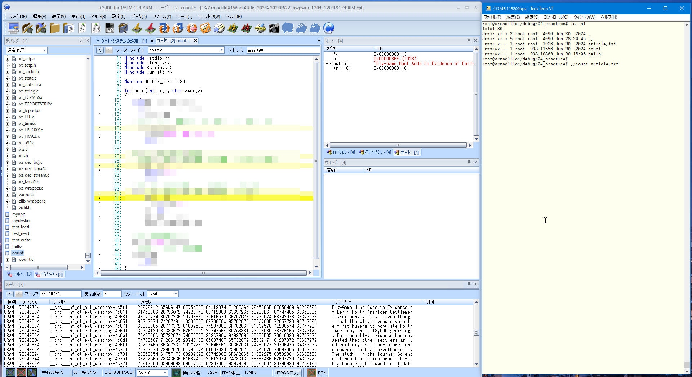
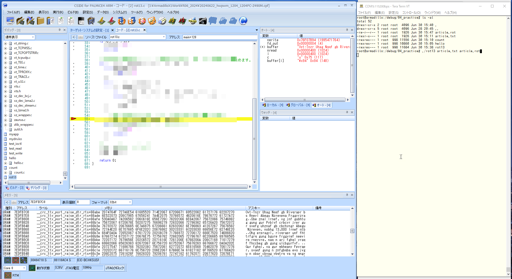

# 01.hello

<!-- styleは、拡張機能 Markdown Preview Github Stylingをインストール-->
<!-- c:/Users/sfujimoto/.vscode/extensions/bierner.markdown-preview-github-styles-0.1.4/base.css -->
<!-- 参考URL: https://rui-log.com/vscode-markdown-preview-custom/ -->

[2024/7/21 Table of Contents]()

<!-- ctrl + ,  toc: level 1..3 へ変更-->

<div class="TOC">

<!-- @import "[TOC]" {cmd="toc" depthFrom=1 depthTo=2 orderedList=true} -->

<!-- code_chunk_output -->

1. [01.hello](#01hello)
    1. [目的](#目的)
    2. [構成データ](#構成データ)
    3. [例題 hello](#例題-hello)
    4. [課題1 ファイル読込み](#課題1-ファイル読込み)
    5. [課題2 ファイル書込み](#課題2-ファイル書込み)
    6. [課題3 シグナル](#課題3-シグナル)

<!-- /code_chunk_output -->

</div>

<div style="page-break-before:always"></div>  <!-- PDFで改ページ-->

## 目的

組込みアプリケーション開発 01.hello

## 構成データ

### /media/sf_ArmadilloX1/hwpwm/work/R06_2024/Apllication_debug/text/practice ディレクトリ

<details open><summary> ･･･/share/ArmadilloX1/hwpwm/<span style="color: red">work</span>/R06_2024/Application<span style="color: red">_debug</span>/<span style="color: red">text</span>/practice/ の構成</summary>

```bash{.line-numbers}
user@1204PC-Z490M:/mnt/v/VirtualBoxWork/share/ArmadilloX1/hwpwm/work/R06_2024/Application_debug/text/practice$ tree -aF -L 3
./
├── 01.hello/
│   ├── article.txt*            <───── 課題1 ファイル読書きの対象ファイル
│   ├── count.c*                <───── 課題1 ファイル読込み
│   ├── hello.c*                <───── 例題
│   ├── Makefile*               <───── /work/linux/nfsroot/debug/04_practice へコピー
│   ├── rot13.c*                <───── 課題2 ファイル書込み
│   └── sigtest.c*              <───── 課題3 シグナル
│

```

</details>

## 例題 hello

Hello,World の表示

### ソースファイル

##### hello.c

<details open><summary> hello.c </summary>

```c{.line-numbers}
#include <stdio.h>

int main(void)
{
	printf("Hello ArmadilloX1 \n");
	return 0;
}
```

</details>

### make から動作確認まで

#### make

<details open><summary> make clean -> make -> sudo make install </summary>

```bash{.line-numbers}
atmark@atde8:/media/sf_ArmadilloX1/hwpwm$ cd /media/sf_ArmadilloX1/hwpwm/work/R06_2024/Application_debug/text/practice-example/01.hello/

atmark@atde8:/media/sf_ArmadilloX1/hwpwm/work/R06_2024/Application_debug/text/practice-example/01.hello$ make clean
rm -f hello

atmark@atde8:/media/sf_ArmadilloX1/hwpwm/work/R06_2024/Application_debug/text/practice-example/01.hello$ make

arm-linux-gnueabihf-gcc -gdwarf-2 -O0    hello.c   -o hello

atmark@atde8:/media/sf_ArmadilloX1/hwpwm/work/R06_2024/Application_debug/text/practice-example/01.hello$ sudo make install
[sudo] atmark のパスワード:
cp -p hello /work/linux/nfsroot/debug/04_practice
cp -p hello /media/sf_ArmadilloX1/hwpwm/dbg/debug_share_hwpwm/R06_2024/04_practice
cp -p hello.c /media/sf_ArmadilloX1/hwpwm/dbg/debug_share_hwpwm/R06_2024/04_practice

atmark@atde8:/media/sf_ArmadilloX1/hwpwm/work/R06_2024/Application_debug/text/practice-example/01.hello$
```

</details>

#### 実行

<details open><summary> root@armadillo:/debug/04_practice# ./hello </summary>

```bash{.line-numbers}
root@armadillo:/debug/04_practice# ./hello
Hello, world!
```

</details>

#### 実行している様子

<details open><summary> CSIDE と TeraTerm </summary>

[https://youtu.be/YVPniqPF-bY](https://youtu.be/YVPniqPF-bY)

<video controls src="./assets/20240702_hello.mp4" title="Title" width=1024></video>

</details>

## 課題1 ファイル読込み

ariticle.txt ファイルを読込んで文字数をカウントし表示する

### ソースファイル

##### count.c

<details open><summary> count.c </summary>

```c{.line-numbers}
#include <stdio.h>
#include <fcntl.h>
#include <string.h>
#include <unistd.h>

#define BUFFER_SIZE	1024

int main(int argc, char **argv)
{
	int fd;
	char buffer[BUFFER_SIZE];
	int n;
	int count = 0;

	// コマンドライン引数が2つ以外の場合、エラー終了します。
	if (argc != 2){
		printf("usage: count file\n");
		return 2;
	}

	// ファイルをオープンします。
	fd = XXXXX(XXXXX, XXXXX);
	// ファイルをオープンできなかった場合、エラー終了します。
	if (fd < 0){
		perror("open");
		return 1;
	}

	// ファイルの中身を読み込み、文字数をカウントします。
	while (n = XXXXX(fd, XXXXX, BUFFER_SIZE - 1)){
		if (n < 0){
			perror("read");
			return 1;
		}
		buffer[n] = '\0';
		count += strlen(buffer);
	}

	// 文字数を表示します。
	printf("%d\n", count);

	// ファイルをクローズします。
	XXXXX(fd);

	return 0;
}

```

</details>

#### article.txt

<details open><summary> root@armadillo:/debug/04_practice# cat article.txt </summary>

```bash{.line-numbers}
root@armadillo:/debug/04_practice# cat article.txt
Big-Game Hunt Adds to Evidence of Early North American Settlement

For many years, it was thought that the Clovis people were the first humans to populate North America, about 13,000 years ago

But recently, evidence has suggested that other settlers arrived earlier, and a new study lends support to that hypothesis.

The study, in the journal Science, finds that a mastodon rib with a bone point lodged in it dates back 13,800 years.

“It’s the first hunting weapon found pre-Clovis,” said the lead author, Michael R. Waters, an archaeologist at Texas A&M University. “These people were hunting mastodons.”

The fossils had been discovered in the late 1970s near Manis, Wash., by Carl Gustafson, an archaeologist at Washington State University. At the time, Dr. Gustafson proposed that the skeleton was about 14,000 years old and that hunters had killed the mastodon with a bone point.

His theory was questioned by other scientists. But carbon dating technology has improved since then, and Dr. Waters and his colleagues — including Dr. Gustafson — were able to use mass spectrometry to date the rib, the bone point and tusks that were found at the site.

They also used CT scanning to closely study the embedded bone point to confirm that it was a hunting tool. They found that the point was more than 10 inches long and that it had been sharpened.

“It couldn’t have been anything else,” Dr. Waters said.

Like the Clovis people, the Manis inhabitants also probably migrated to North America from northeastern and Central Asia, making their way over the Bering land bridge through present-day Alaska.

“What’s nice about all the pre-Clovis sites is that some had stone tools, and now here we see bone tools, all the rudimentary technologies that we later see in Clovis,” Dr. Waters said.

The Clovis used these basic technologies to create a more sophisticated set of tools, he added.
```

</details>

### make から動作確認まで

!!! warning article.txt を /work/linux/nfsroot/debugu/04_practice へコピーすること

#### make

<details open><summary> make clean -> make -> sudo make install </summary>

```bash{.line-numbers}
atmark@atde8:/media/sf_ArmadilloX1/hwpwm$ cd /media/sf_ArmadilloX1/hwpwm/work/R06_2024/Application_debug/text/practice-example/01.hello/

atmark@atde8:/media/sf_ArmadilloX1/hwpwm/work/R06_2024/Application_debug/text/practice-example/01.hello$ make clean
rm -f hello

atmark@atde8:/media/sf_ArmadilloX1/hwpwm/work/R06_2024/Application_debug/text/practice-example/01.hello$ make

arm-linux-gnueabihf-gcc -gdwarf-2 -O0    hello.c   -o hello

atmark@atde8:/media/sf_ArmadilloX1/hwpwm/work/R06_2024/Application_debug/text/practice-example/01.hello$ sudo make install
[sudo] atmark のパスワード:
cp -p hello /work/linux/nfsroot/debug/04_practice
cp -p hello /media/sf_ArmadilloX1/hwpwm/dbg/debug_share_hwpwm/R06_2024/04_practice
cp -p hello.c /media/sf_ArmadilloX1/hwpwm/dbg/debug_share_hwpwm/R06_2024/04_practice

atmark@atde8:/media/sf_ArmadilloX1/hwpwm/work/R06_2024/Application_debug/text/practice-example/01.hello$
```

</details>

#### article.txt を /worl/linux/nfsroot/debug/04_practoce へコピー

<details open><summary> atmark@atde8:/media/sf_ArmadilloX1/hwpwm/work/R06_2024/Application_debug/text/practice-example/01.hello$ sudo cp article.txt /work/linux/nfsroot/debug/04_practice/ </summary>

```bash{.line-numbers}
atmark@atde8:/media/sf_ArmadilloX1/hwpwm/work/R06_2024/Application_debug/text/practice-example/01.hello$ sudo cp article.txt /work/linux/nfsroot/debug/04_practice/
```

</details>

#### 実行

<details open><summary> root@armadillo:/debug/04_practice# ./count article.txt </summary>

```bash{.line-numbers}
root@armadillo:/debug/04_practice# ./count article.txt
1926 <───── article.txt ファイルの文字数
```

</details>

#### 実行している様子

<details open><summary> CSIDE と TeraTerm </summary>



</details>

### ヒント

open, read, close

## 課題2 ファイル書込み

- ROT13暗号化方式によってアルファベットを13文字進める
- AはN,BはO, … ,ZはM,aはn,bはo, … ,zはm
- アルファベット以外の文字は変更しない
- article.txt ファイルを読込んで、結果は article.rot へ書込む
- 実行方法は ./rot13 article.txt article.rot

### ソースファイル

##### rot13.c

<details open><summary> rot13.c </summary>

```c{.line-numbers}
#include <stdio.h>
#include <fcntl.h>
#include <unistd.h>

#define BUFFER_SIZE	1024

int main(int argc, char **argv)
{


	// 第2引数で指定されたファイルをオープンします。


	// 第3引数で指定されたファイルをオープンします。


	// 第2引数で指定されたファイルの中身を読み込んで、読み込んだ文字を13文字進めます。


	// ファイルをクローズします。


	return 0;
}


```

</details>

### make から動作確認まで

#### make

<details open><summary> make clean -> make -> sudo make install </summary>

```bash{.line-numbers}
atmark@atde8:/media/sf_ArmadilloX1/hwpwm/work/R06_2024/Application_debug/text/practice-example/01.hello$ make clean
rm -f count

atmark@atde8:/media/sf_ArmadilloX1/hwpwm/work/R06_2024/Application_debug/text/practice-example/01.hello$ make
arm-linux-gnueabihf-gcc -gdwarf-2 -O0    rot13.c   -o rot13

atmark@atde8:/media/sf_ArmadilloX1/hwpwm/work/R06_2024/Application_debug/text/practice-example/01.hello$ sudo make install
[sudo] atmark のパスワード:
cp -p rot13 /work/linux/nfsroot/debug/04_practice
cp -p rot13 /media/sf_ArmadilloX1/hwpwm/dbg/debug_share_hwpwm/R06_2024/04_practice
cp -p rot13.c /media/sf_ArmadilloX1/hwpwm/dbg/debug_share_hwpwm/R06_2024/04_practice

atmark@atde8:/media/sf_ArmadilloX1/hwpwm/work/R06_2024/Application_debug/text/practice-example/01.hello$
```

</details>

#### 実行

<details open><summary> root@armadillo:/debug/04_practice# ./rot13 article.txt article.rot </summary>

```bash{.line-numbers}
root@armadillo:/debug/04_practice# ./rot13 article.txt article.rot
```

</details>

<details open><summary> root@armadillo:/debug/04_practice# cat article.rot </summary>

```bash{.line-numbers}
root@armadillo:/debug/04_practice# cat article.rot
Ovt-Tnzr Uhag Nqqf gb Rivqrapr bs Rneyl Abegu Nzrevpna Frggyrzrag

Sbe znal lrnef, vg jnf gubhtug gung gur Pybivf crbcyr jrer gur svefg uhznaf gb cbchyngr Abegu Nzrevpn, nobhg 13,000 lrnef ntb

Ohg erpragyl, rivqrapr unf fhttrfgrq gung bgure frggyref neevirq rneyvre, naq n arj fghql yraqf fhccbeg gb gung ulcbgurfvf.

Gur fghql, va gur wbheany Fpvrapr, svaqf gung n znfgbqba evo jvgu n obar cbvag ybqtrq va vg qngrf onpx 13,800 lrnef.

“Vg’f gur svefg uhagvat jrncba sbhaq cer-Pybivf,” fnvq gur yrnq nhgube, Zvpunry E. Jngref, na nepunrbybtvfg ng Grknf N&Z Havirefvgl. “Gurfr crbcyr jrer uhagvat znfgbqbaf.”

Gur sbffvyf unq orra qvfpbirerq va gur yngr 1970f arne Znavf, Jnfu., ol Pney Thfgnsfba, na nepunrbybtvfg ng Jnfuvatgba Fgngr Havirefvgl. Ng gur gvzr, Qe. Thfgnsfba cebcbfrq gung gur fxryrgba jnf nobhg 14,000 lrnef byq naq gung uhagref unq xvyyrq gur znfgbqba jvgu n obar cbvag.

Uvf gurbel jnf dhrfgvbarq ol bgure fpvragvfgf. Ohg pneoba qngvat grpuabybtl unf vzcebirq fvapr gura, naq Qe. Jngref naq uvf pbyyrnthrf — vapyhqvat Qe. Thfgnsfba — jrer noyr gb hfr znff fcrpgebzrgel gb qngr gur evo, gur obar cbvag naq ghfxf gung jrer sbhaq ng gur fvgr.

Gurl nyfb hfrq PG fpnaavat gb pybfryl fghql gur rzorqqrq obar cbvag gb pbasvez gung vg jnf n uhagvat gbby. Gurl sbhaq gung gur cbvag jnf zber guna 10 vapurf ybat naq gung vg unq orra funecrarq.

“Vg pbhyqa’g unir orra nalguvat ryfr,” Qe. Jngref fnvq.

Yvxr gur Pybivf crbcyr, gur Znavf vaunovgnagf nyfb cebonoyl zvtengrq gb Abegu Nzrevpn sebz abegurnfgrea naq Prageny Nfvn, znxvat gurve jnl bire gur Orevat ynaq oevqtr guebhtu cerfrag-qnl Nynfxn.

“Jung’f avpr nobhg nyy gur cer-Pybivf fvgrf vf gung fbzr unq fgbar gbbyf, naq abj urer jr frr obar gbbyf, nyy gur ehqvzragnel grpuabybtvrf gung jr yngre frr va Pybivf,” Qe. Jngref fnvq.

Gur Pybivf hfrq gurfr onfvp grpuabybtvrf gb perngr n zber fbcuvfgvpngrq frg bs gbbyf, ur nqqrq.
root@armadillo:/debug/04_practice#
```

</details>

#### 実行している様子

<details open><summary> CSIDE と TeraTerm </summary>



</details>

### ヒント

write

## 課題3 シグナル

- 実行すると”Hello, world!”と表示して一時停止
- <kbd>Ctrl</kbd>+<kbd>c</kbd>を入力すると”Goodbye, world!”と表示してプログラムを終了

### ソースファイル

##### sigtest.c

<details open><summary>  </summary>

```c{.line-numbers}
#include <stdio.h>
#include <signal.h>
#include <unistd.h>

// シグナルハンドラの処理(ctrl+cが押された時の処理)。
void sig_handler(int sig)
{

}

int main(void)
{


	// シグナルハンドラを登録します。


	// シグナルを待ちます。
	pause();

	return 0;
}
```

</details>

### make から動作確認まで

#### make

<details open><summary> make clean ─> make ─> sudo make install </summary>

```bash{.line-numbers}
atmark@atde8:/media/sf_ArmadilloX1/hwpwm/work/R06_2024/Application_debug/text/practice-example/01.hello$ make clean
rm -f sigtest

atmark@atde8:/media/sf_ArmadilloX1/hwpwm/work/R06_2024/Application_debug/text/practice-example/01.hello$ make
arm-linux-gnueabihf-gcc -gdwarf-2 -O0    sigtest.c   -o sigtest

atmark@atde8:/media/sf_ArmadilloX1/hwpwm/work/R06_2024/Application_debug/text/practice-example/01.hello$ sudo make install
[sudo] atmark のパスワード:
cp -p sigtest /work/linux/nfsroot/debug/04_practice
cp -p sigtest /media/sf_ArmadilloX1/hwpwm/dbg/debug_share_hwpwm/R06_2024/04_practice
cp -p sigtest.c /media/sf_ArmadilloX1/hwpwm/dbg/debug_share_hwpwm/R06_2024/04_practice

atmark@atde8:/media/sf_ArmadilloX1/hwpwm/work/R06_2024/Application_debug/text/practice-example/01.hello$
```

</details>

#### 実行

<details open><summary> root@armadillo:/debug/04_practice# ./sigtest </summary>

```bash{.line-numbers}
root@armadillo:/debug/04_practice# ./sigtest
Hello, world!
^CGoodbye, world! <───── Ctrl + c
root@armadillo:/debug/04_practice#
```

</details>

#### 実行している様子

<details open><summary> CSIDE と TeraTerm </summary>

[https://youtu.be/VTt82rHYxgQ](https://youtu.be/VTt82rHYxgQ)

<video controls src="./assets/20240630_sigtest.mp4" title="Title" width=1024></video>

</details>

### ヒント

sigaction、pause
