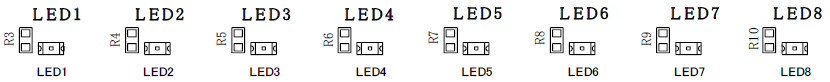

# 02.led

<!-- styleは、拡張機能 Markdown Preview Github Stylingをインストール-->
<!-- c:/Users/sfujimoto/.vscode/extensions/bierner.markdown-preview-github-styles-0.1.4/base.css -->
<!-- 参考URL: https://rui-log.com/vscode-markdown-preview-custom/ -->

[2024/7/18 Table of Contents]()

<!-- ctrl + ,  toc: level 1..3 へ変更-->

<div class="TOC">

<!-- @import "[TOC]" {cmd="toc" depthFrom=1 depthTo=2 orderedList=true} -->

<!-- code_chunk_output -->

1. [02.led](#02led)
    1. [目的](#目的)
    2. [構成データ](#構成データ)
    3. [LED制御](#led制御)
    4. [デバイスドライバ](#デバイスドライバ)
    5. [例題 ledctl](#例題-ledctl)
    6. [課題 負荷表示器 ldmeter](#課題-負荷表示器-ldmeter)

<!-- /code_chunk_output -->

</div>

<div style="page-break-before:always"></div>  <!-- PDFで改ページ-->

## 目的

組込みアプリケーション開発 02.led

## 構成データ

### /media/sf_ArmadilloX1/hwpwm/work/R06_2024/Apllication_debug/text/practice ディレクトリ

<details open><summary> ･･･/share/ArmadilloX1/hwpwm/<span style="color: red">work</span>/R06_2024/Application<span style="color: red">_debug</span>/<span style="color: red">text</span>/practice/ の構成</summary>

```bash{.line-numbers}
user@1204PC-Z490M:/mnt/v/VirtualBoxWork/share/ArmadilloX1/hwpwm/work/R06_2024/Application_debug/text/practice$ tree -aF -L 3
./
├── 02.led/
│   ├── drivers/
│   │   └── leds/
│   │       ├── leds.c*         <───── ドライバソース
│   │       └── Makefile*       <───── ドライバ用Makefile
│   ├── ldmeter.c*              <───── 例題 デバイス制御用ソース
│   ├── ledctl.c*               <───── 課題 デバイス制御用ソース
│   └── Makefile*               <───── デバイス制御用Makefile
│

```

</details>

## LED制御

### デバイス仕様



デバイスファイル: "/sys/class/leds/led_ext/brightness"

|b7  |b6  |b5  |b4  |b3  |b2  |b1  |b0  |
|----|----|----|----|----|----|----|----|
|led8|led7|led6|led5|led4|led3|led2|led1|

デバイスファイルに 1～255 の値を書き込むことで点灯、0は消灯

## デバイスドライバ

### ソース

#### leds.c

<details open><summary> 02.led/drivers/leds.c </summary>

```c{.line-numbers}
#include <linux/module.h>
#include <linux/kernel.h>
#include <linux/init.h>
#include <linux/platform_device.h>
#include <linux/io.h>
#include <linux/leds.h>
#include <linux/err.h>

#include <asm/armadilloX1-ext-cpld.h>

// デバイス書き込み関数(leds_set)
static void leds_set(struct led_classdev *led_cdev,
				 enum led_brightness brightness)
{
	// LEDを光らせます。(cpld_write)
	cpld_write(CPLD_WRITE_LED, brightness);
}

// LEDクラスデバイス構造体
static struct led_classdev leds = {
	.name			= "led_ext",
	.brightness_set	= leds_set,
	.max_brightness	= 255,
};

// probe関数(leds_probe)
static int leds_probe(struct platform_device *pdev)
{
	// LED点灯状態レジスタを初期化します。(cpld_write)
	cpld_write(CPLD_WRITE_LED, 0x00);

	// LEDクラスデバイスを登録します。(led_classdev_register)
	// ->/sys/class/leds/配下にファイルを作成し、/sys/class/leds/led_ext/brightnessに
	//   値を書き込むとデバイス書き込み関数(leds_set)が呼び出されるように
	//   登録します。
	return led_classdev_register(NULL, &leds);
}

// remove関数(leds_remove)
static int leds_remove(struct platform_device *pdev)
{
	// LEDクラスデバイスを解除します。(led_classdev_unregister)
	led_classdev_unregister(&leds);

	return 0;
}

// プラットフォームドライバ
static struct platform_driver leds_driver = {
	.probe	= leds_probe,
	.remove	= leds_remove,
	.driver	= {
		.name	= "armadillo-x1-extension-leds",
		.owner	= THIS_MODULE,
	},
};

static struct platform_device *pdev;

// 初期化関数(leds_init)
static int __init leds_init(void)
{
	int ret;

	// プラットフォームデバイスを登録します。(platform_device_register_simple)
	// ->プラットフォーム依存のデバイス情報を登録します。
	pdev = platform_device_register_simple("armadillo-x1-extension-leds", -1, NULL, 0);
	if (IS_ERR(pdev)) {
		ret = (int)pdev;
		goto err_ret;
	}

	// プラットフォームドライバを登録します。(platform_driver_register)
	// ->登録したプラットフォームデバイスのリソース情報を取得し、
	//   プラットフォームドライバとして、probe関数とremove関数を登録します。
	ret = platform_driver_register(&leds_driver);
	if (ret < 0)
		goto err_platform_device_unregister;

	return 0;

 err_platform_device_unregister:
	platform_device_unregister(pdev);
 err_ret:
	return ret;
}

// 終了関数(leds_exit)
static void __exit leds_exit(void)
{
	// プラットフォームドライバを解除します。(platform_driver_unregister)
	platform_driver_unregister(&leds_driver);
	// プラットフォームデバイスを解除します。(platform_device_unregister)
	platform_device_unregister(pdev);
}

// 初期化の際に、初期化関数が呼ばれるように登録します。
module_init(leds_init);
// 終了する際に、終了関数が呼ばれるように登録します。
module_exit(leds_exit);

// MODULE_LICENSEは"GPL"とします。
MODULE_LICENSE("GPL");
```

</details>

#### Makefile

<details open><summary> /media/sf_ArmadilloX1/hwpwm/work/R06_2024/Application_debug/text/practice-example/02.led/drivers/leds/Makefile </summary>

```bash{.line-numbers}
KERNELDIR = /home/atmark/linux-4.9-x1-at27_dbg
ARCH = arm
PREFIX = arm-linux-gnueabihf-
MOD_PATH = /work/linux/nfsroot

EXTRA_CFLAGS += -gdwarf-2 -O0

obj-m := leds.o

modules:
	$(MAKE) -C $(KERNELDIR) M=`pwd` ARCH=$(ARCH) CROSS_COMPILE=$(PREFIX) modules

modules_install:
	$(MAKE) -C $(KERNELDIR) M=`pwd` ARCH=$(ARCH) INSTALL_MOD_PATH=$(MOD_PATH) modules_install

myinstall:
	cp -p *.ko /media/sf_ArmadilloX1/hwpwm/dbg/debug_share_hwpwm/R06_2024/04_practice
	cp -p *.c  /media/sf_ArmadilloX1/hwpwm/dbg/debug_share_hwpwm/R06_2024/04_practice

clean:
	$(MAKE) -C $(KERNELDIR) M=`pwd` clean
```

</details>

### 動作確認

#### make clean

<details open><summary> atmark@atde8:/media/sf_ArmadilloX1/hwpwm/work/R06_2024/Application_debug/text/practice-example/02.led/drivers/leds$ make clean </summary>

```bash{.line-numbers}
atmark@atde8:/media/sf_ArmadilloX1/hwpwm/work/R06_2024/Application_debug/text/practice-example/02.led/drivers/leds$ make clean
make -C /home/atmark/linux-4.9-x1-at27_dbg M=`pwd` clean
make[1]: ディレクトリ '/home/atmark/linux-4.9-x1-at27_dbg' に入ります
  CLEAN   /media/sf_ArmadilloX1/hwpwm/work/R06_2024/Application_debug/text/practice-example/02.led/drivers/leds/.tmp_versions
  CLEAN   /media/sf_ArmadilloX1/hwpwm/work/R06_2024/Application_debug/text/practice-example/02.led/drivers/leds/Module.symvers
make[1]: ディレクトリ '/home/atmark/linux-4.9-x1-at27_dbg' から出ます
```

</details>

#### make modules

!!! warning 「make[2]: 警告: ファイル '/media/sf_ArmadilloX1/hwpwm/work/R06_2024/Application_debug/text/practice-example/02.led/drivers/leds/leds.o' の修正時刻 20 は未来の時刻です」と表示された場合は chrony を ATDE8 と ArmadilloX1 にインストールすると解決する

<details open><summary> atmark@atde8:/media/sf_ArmadilloX1/hwpwm/work/R06_2024/Application_debug/text/practice-example/02.led/drivers/leds$ make modules </summary>

```bash{.line-numbers}
atmark@atde8:/media/sf_ArmadilloX1/hwpwm/work/R06_2024/Application_debug/text/practice-example/02.led/drivers/leds$ make modules
make -C /home/atmark/linux-4.9-x1-at27_dbg M=`pwd` ARCH=arm CROSS_COMPILE=arm-linux-gnueabihf- modules
make[1]: ディレクトリ '/home/atmark/linux-4.9-x1-at27_dbg' に入ります
  CC [M]  /media/sf_ArmadilloX1/hwpwm/work/R06_2024/Application_debug/text/practice-example/02.led/drivers/leds/leds.o
  Building modules, stage 2.
  MODPOST 1 modules
  LD [M]  /media/sf_ArmadilloX1/hwpwm/work/R06_2024/Application_debug/text/practice-example/02.led/drivers/leds/leds.ko
make[1]: ディレクトリ '/home/atmark/linux-4.9-x1-at27_dbg' から出ます
atmark@atde8:/media/sf_ArmadilloX1/hwpwm/work/R06_2024/Application_debug/text/practice-example/02.led/drivers/leds$
```

</details>

#### sudo make modules_install

<details open><summary> atmark@atde8:/media/sf_ArmadilloX1/hwpwm/work/R06_2024/Application_debug/text/practice-example/02.led/drivers/leds$ sudo make modules_install </summary>

```bash{.line-numbers}
atmark@atde8:/media/sf_ArmadilloX1/hwpwm/work/R06_2024/Application_debug/text/practice-example/02.led/drivers/leds$ sudo make modules_install
[sudo] atmark のパスワード:
make -C /home/atmark/linux-4.9-x1-at27_dbg M=`pwd` ARCH=arm INSTALL_MOD_PATH=/work/linux/nfsroot modules_install
make[1]: ディレクトリ '/home/atmark/linux-4.9-x1-at27_dbg' に入ります
  INSTALL /media/sf_ArmadilloX1/hwpwm/work/R06_2024/Application_debug/text/practice-example/02.led/drivers/leds/leds.ko
  DEPMOD  4.9.133-at27
depmod: WARNING: could not open modules.order at /work/linux/nfsroot/lib/modules/4.9.133-at27: No such file or directory
depmod: WARNING: could not open modules.builtin at /work/linux/nfsroot/lib/modules/4.9.133-at27: No such file or directory
make[1]: ディレクトリ '/home/atmark/linux-4.9-x1-at27_dbg' から出ます
```

</details>

#### sudo make myinstall

<details open><summary> atmark@atde8:/media/sf_ArmadilloX1/hwpwm/work/R06_2024/Application_debug/text/practice-example/02.led/drivers/leds$ sudo make myinstall </summary>

```bash{.line-numbers}
atmark@atde8:/media/sf_ArmadilloX1/hwpwm/work/R06_2024/Application_debug/text/practice-example/02.led/drivers/leds$ sudo make myinstall
cp -p *.ko /media/sf_ArmadilloX1/hwpwm/dbg/debug_share_hwpwm/R06_2024/04_practice
cp -p *.c  /media/sf_ArmadilloX1/hwpwm/dbg/debug_share_hwpwm/R06_2024/04_practice
```

</details>

#### cd

<details open><summary> root@armadillo:/# cd /lib/modules/4.9.133-at27/extra/ </summary>

```bash{.line-numbers}
root@armadillo:/# cd /lib/modules/4.9.133-at27/extra/
```

</details>

#### insmod

<details open><summary> root@armadillo:/lib/modules/4.9.133-at27/extra# insmod leds.ko </summary>

```bash{.line-numbers}
root@armadillo:/lib/modules/4.9.133-at27/extra# lsmod
Module                  Size  Used by

root@armadillo:/lib/modules/4.9.133-at27/extra# insmod leds.ko
leds: loading out-of-tree module taints kernel.

root@armadillo:/lib/modules/4.9.133-at27/extra# lsmod
Module                  Size  Used by
leds                    2103  0
```

</details>

### デバイスファイル

###### /sys/class/leds/led_ext/brightness

<details open><summary> echo 255 > /sys/class/leds/led_ext/brightness </summary>

```bash{.line-numbers}
root@armadillo:/lib/modules/4.9.133-at27/extra# echo 255 > /sys/class/leds/led_ext/brightness
```

</details>

### 実行している様子

<details open><summary> LEDデバイスファイルによるLED制御を実行している動画 </summary>

[https://youtu.be/K0L9yKmVo8k](https://youtu.be/K0L9yKmVo8k)

<video controls src="assets/20240703_02led_devicefile.mp4" title="Title" width=1024></video>

</details>


## 例題 ledctl

- 引数が指定されない時は LED の点灯状態を表示
- 引数を1つ指定すると LED の点灯状態を変更

### ソース

#### ledctl.c

<details open><summary> 02.led/ldedctl.c </summary>

```c{.line-numbers}
#include <stdio.h>
#include <stdlib.h>
#include <fcntl.h>
#include <sys/types.h>
#include <sys/stat.h>
#include <unistd.h>

// LED制御用ファイル
#define	LED_FILE	"/sys/class/leds/led_ext/brightness"
#define	DATALEN		16

int main(int argc, char *argv[])
{
	int fd;
	int val;
	char *p;
	int ret, n;
	int main_ret = 0;
	char data[DATALEN];

	// LED制御用ファイルをオープンします。
	fd = open(LED_FILE, O_RDWR);
	// オープンに失敗したら、main関数をエラー終了します。
	if (fd < 0){
		perror("open");
		return 1;
	}

	switch (argc){
	case 1:
		// LEDの点灯状態をリードします。
		ret = read(fd, data, DATALEN);
		// リードに失敗したら、main関数をエラー終了します。
		if (ret < 0){
			perror("read");
			main_ret = 1;
			goto LED_ERR;
		}
		// LEDの点灯状態を表示します。
		data[ret] = '\0';
		printf("value: %s", data);
		break;
	case 2:
		// 文字列を数値に変換します。
		val = strtol(argv[1], &p, 0);
		// 変換に失敗したら、main関数をエラー終了します。
		if (*p != '\0'){
			fprintf(stderr, "invalid number\n");
			main_ret = 1;
			goto LED_ERR;
		}

		// 数値が2バイトの範囲内でなければ、main関数をエラー終了します。
		if (val < 0 || val > 255){
			fprintf(stderr, "out of range\n");
			main_ret = 1;
			goto LED_ERR;
		}

		// 数値を文字列に変換します。
		n = sprintf(data, "%d", val);
		// LEDを点灯/消灯させます。
		ret = write(fd, data, n);
		// ライトに失敗したら、main関数をエラー終了します。
		if (ret < 0){
			perror("write");
			main_ret = 1;
			goto LED_ERR;
		}
		break;
	default:
		// 引数の数が指定どおりでない場合、main関数をエラー終了します。
		fprintf(stderr, "Usage: %s [value]\n", argv[0]);
		main_ret = 1;
	}

LED_ERR:
	// LED制御用ファイルをクローズします。
	close(fd);
	return main_ret;
}
```

</details>

#### Makefile

<details open><summary> 02.led/Makefile </summary>

```bash{.line-numbers}
CC = arm-linux-gnueabihf-gcc
#TARGET = ledctl ldmeter
TARGET = ledctl  <───── その都度変更
CFLAGS = -gdwarf-2 -O0

all: $(TARGET)

install:
	cp -p $(TARGET)   /work/linux/nfsroot/debug/04_practice
	cp -p $(TARGET)   /media/sf_ArmadilloX1/hwpwm/dbg/debug_share_hwpwm/R06_2024/04_practice
	cp -p $(TARGET).c /media/sf_ArmadilloX1/hwpwm/dbg/debug_share_hwpwm/R06_2024/04_practice

clean:
	rm -f $(TARGET)
```

</details>

### 動作確認

#### make clean

<details open><summary> atmark@atde8:/media/sf_ArmadilloX1/hwpwm/work/R06_2024/Application_debug/text/practice-example/02.led$ make clean </summary>

```bash{.line-numbers}
atmark@atde8:/media/sf_ArmadilloX1/hwpwm/work/R06_2024/Application_debug/text/practice-example/02.led$ make clean
rm -f ledctl
```

</details>

#### make

<details open><summary> atmark@atde8:/media/sf_ArmadilloX1/hwpwm/work/R06_2024/Application_debug/text/practice-example/02.led$ make </summary>

```bash{.line-numbers}
atmark@atde8:/media/sf_ArmadilloX1/hwpwm/work/R06_2024/Application_debug/text/practice-example/02.led$ make
arm-linux-gnueabihf-gcc -gdwarf-2 -O0    ledctl.c   -o ledctl
```

</details>

#### sudo make install

<details open><summary> atmark@atde8:/media/sf_ArmadilloX1/hwpwm/work/R06_2024/Application_debug/text/practice-example/02.led$ sudo make install </summary>

```bash{.line-numbers}
atmark@atde8:/media/sf_ArmadilloX1/hwpwm/work/R06_2024/Application_debug/text/practice-example/02.led$ sudo make install
[sudo] atmark のパスワード:
cp -p ledctl   /work/linux/nfsroot/debug/04_practice
cp -p ledctl   /media/sf_ArmadilloX1/hwpwm/dbg/debug_share_hwpwm/R06_2024/04_practice
cp -p ledctl.c /media/sf_ArmadilloX1/hwpwm/dbg/debug_share_hwpwm/R06_2024/04_practice
```

</details>

#### CSIDEでロード

<details open><summary> メニュー「ファイル」-「ロード」</summary>


</details>

#### insmod（既にinsmod 済みなら割愛）

<details open><summary> root@armadillo:/lib/modules/4.9.133-at27/extra# insmod leds.ko </summary>

```bash{.line-numbers}
root@armadillo:/debug/04_practice# cd /lib/modules/4.9.133-at27/extra/

root@armadillo:/lib/modules/4.9.133-at27/extra# ls
leds.ko

root@armadillo:/lib/modules/4.9.133-at27/extra# lsmod
Module                  Size  Used by

root@armadillo:/lib/modules/4.9.133-at27/extra# insmod leds.ko

root@armadillo:/lib/modules/4.9.133-at27/extra# lsmod
Module                  Size  Used by
leds                    2103  0

root@armadillo:/lib/modules/4.9.133-at27/extra#
```

</details>

#### 実行している様子

<details open><summary> ledctrl による LED 制御を実行している動画 </summary>

  [https://youtu.be/zoULMecAvbw](https://youtu.be/zoULMecAvbw)

  <video controls src="assets/20240703_02led_ledctl.mp4" title="Title" width=1024></video>

</details>

## 課題 負荷表示器 ldmeter

- システムの負荷をLEDに表示
- システムの負荷情報は /proc/loadavg ファイルから取得
- 1分間の平均値を取得してLED上に表示
- LED表示は1秒ごとに更新

#### 負荷情報の取得

<details open><summary> root@armadillo:/debug/04_practice# cat /proc/loadavg </summary>

```bash{.line-numbers}
root@armadillo:/debug/04_practice# cat /proc/loadavg
0.00 0.00 0.03 1/133 3076
```

実行可能なプロセス数の1分間の平均値、5分間、15分間、現在実行中のプロセス数/存在する全プロセス数、最新のプロセスID

</details>

#### 負荷情報に対するLEDの状態

|1min Avg |LED      |
|---------|---------|
|0.00-0.12|ALL OFF  |
|0.12-0.24|1        |
|0.24-0.36|1,2      |
|0.36-0.48|1-3      |
|0.48-0.60|1-4      |
|0.60-0.72|1-5      |
|0.72-0.84|1-6      |
|0.84-0.96|1-7      |
|0.96 over|ALL ON   |

### ソース

#### ldmeter.c

<details open><summary> 02.led/ldmeter.c </summary>

```c{.line-numbers}
#include <stdio.h>
#include <fcntl.h>
#include <sys/types.h>
#include <sys/stat.h>
#include <unistd.h>

// LED制御用ファイル
#define LED_FILE	"/sys/class/leds/led_ext/brightness"
// 負荷情報ファイル
#define	LOADAVG_FILE	"/proc/loadavg"

int main(void)
{


	// 負荷情報ファイルをオープンします。


	// LED制御用ファイルをオープンします。


		// 負荷情報をリードします。


		// 負荷情報を数値に変換します。


		// 負荷情報から、どのLEDを点灯させるのかを決定します。


		// LEDを点灯させます。

		// 1秒間待ちます。
		sleep(1);


LOAD_ERR:
	// 負荷情報ファイルをクローズします。

LED_ERR:
	// LED制御用ファイルをクローズします。

	return main_ret;
}

```

</details>

#### Makefile

<details open><summary> 02.led/Makefile </summary>

```bash{.line-numbers}
CC = arm-linux-gnueabihf-gcc
#TARGET = ledctl ldmeter
TARGET = ldmeter <───── その都度変更
CFLAGS = -gdwarf-2 -O0

all: $(TARGET)

install:
	cp -p $(TARGET)   /work/linux/nfsroot/debug/04_practice
	cp -p $(TARGET)   /media/sf_ArmadilloX1/hwpwm/dbg/debug_share_hwpwm/R06_2024/04_practice
	cp -p $(TARGET).c /media/sf_ArmadilloX1/hwpwm/dbg/debug_share_hwpwm/R06_2024/04_practice

clean:
	rm -f $(TARGET)
```

</details>

### 動作確認

#### make clean

<details open><summary> atmark@atde8:/media/sf_ArmadilloX1/hwpwm/work/R06_2024/Application_debug/text/practice-example/02.led$ make clean </summary>

```bash{.line-numbers}
atmark@atde8:/media/sf_ArmadilloX1/hwpwm/work/R06_2024/Application_debug/text/practice-example/02.led$ make clean
rm -f ldmeter
```

</details>

#### make

<details open><summary> atmark@atde8:/media/sf_ArmadilloX1/hwpwm/work/R06_2024/Application_debug/text/practice-example/02.led$ make </summary>

```bash{.line-numbers}
atmark@atde8:/media/sf_ArmadilloX1/hwpwm/work/R06_2024/Application_debug/text/practice-example/02.led$ make
arm-linux-gnueabihf-gcc -gdwarf-2 -O0    ldmeter.c   -o ldmeter
```

</details>

#### sudo make install

<details open><summary> atmark@atde8:/media/sf_ArmadilloX1/hwpwm/work/R06_2024/Application_debug/text/practice-example/02.led$ sudo make install </summary>

```bash{.line-numbers}
atmark@atde8:/media/sf_ArmadilloX1/hwpwm/work/R06_2024/Application_debug/text/practice-example/02.led$ sudo make install
[sudo] atmark のパスワード:
cp -p ldmeter   /work/linux/nfsroot/debug/04_practice
cp -p ldmeter   /media/sf_ArmadilloX1/hwpwm/dbg/debug_share_hwpwm/R06_2024/04_practice
cp -p ldmeter.c /media/sf_ArmadilloX1/hwpwm/dbg/debug_share_hwpwm/R06_2024/04_practice
```

</details>

#### CSIDEでロード

<details open><summary> メニュー「ファイル」-「ロード」</summary>


</details>

#### insmod（既にinsmod 済みなら割愛）

<details open><summary> root@armadillo:/lib/modules/4.9.133-at27/extra# insmod leds.ko </summary>

```bash{.line-numbers}
root@armadillo:~# cd /lib/modules/4.9.133-at27/extra/

root@armadillo:/lib/modules/4.9.133-at27/extra# ls
leds.ko

root@armadillo:/lib/modules/4.9.133-at27/extra# lsmod
Module                  Size  Used by

root@armadillo:/lib/modules/4.9.133-at27/extra# insmod leds.ko

root@armadillo:/lib/modules/4.9.133-at27/extra# lsmod
Module                  Size  Used by
leds                    2103  0
root@armadillo:/lib/modules/4.9.133-at27/extra#
```

</details>

#### 実行

##### ./ldmeter &

<details open><summary> root@armadillo:/debug/04_practice# ./ldmeter & </summary>

```bash{.line-numbers}
root@armadillo:/debug/04_practice# ./ldmeter &
[1] 3046
```

</details>

##### CPU へ負荷

<details open><summary> root@armadillo:/debug/04_practice# while true; do echo dummy > /dev/null ; done </summary>

```bash{.line-numbers}
root@armadillo:/debug/04_practice# while true; do echo dummy > /dev/null ; done
^Cdummy  <───── ctrl ∔ c
```

</details>

##### kill 3046

<details open><summary> root@armadillo:/debug/04_practice# kill 3046 </summary>

```bash{.line-numbers}
root@armadillo:/debug/04_practice# ps
  PID TTY          TIME CMD
 2980 pts/0    00:03:06 bash
 3046 pts/0    00:00:00 ldmeter
 3055 pts/0    00:00:00 ps

root@armadillo:/debug/04_practice# kill 3046
```

</details>

#### 実行している様子

<details open><summary> ldmeter による LED レベルメータ表示の動画 </summary>

  [https://youtu.be/vxxYnZIT9bM](https://youtu.be/vxxYnZIT9bM)

  <video controls src="assets/20240704_02led_ldmeter.mp4" title="Title"  width=1024></video>

</details>

#### ヒント

sscanf, sleep
