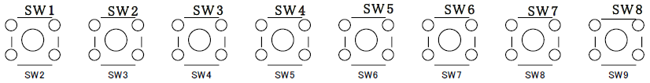
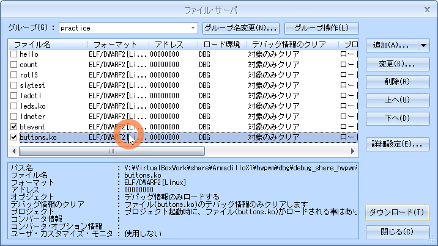
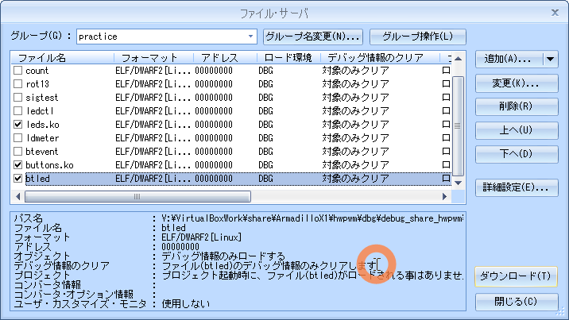
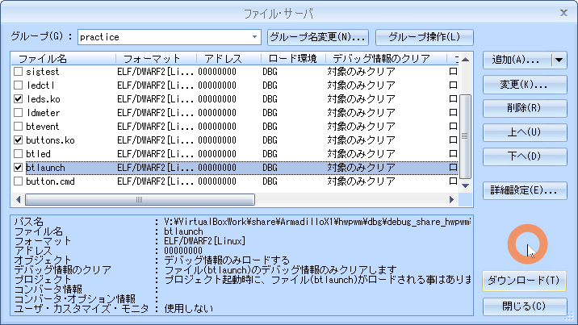

# 03.button

<!-- styleは、拡張機能 Markdown Preview Github Stylingをインストール-->
<!-- c:/Users/sfujimoto/.vscode/extensions/bierner.markdown-preview-github-styles-0.1.4/base.css -->
<!-- 参考URL: https://rui-log.com/vscode-markdown-preview-custom/ -->

[2024/7/18 Table of Contents]()

<!-- ctrl + ,  toc: level 1..3 へ変更-->

<div class="TOC">

<!-- @import "[TOC]" {cmd="toc" depthFrom=1 depthTo=2 orderedList=true} -->

<!-- code_chunk_output -->

1. [03.button](#03button)
    1. [目的](#目的)
    2. [構成データ](#構成データ)
    3. [ボタンスイッチ制御](#ボタンスイッチ制御)
    4. [デバイスドライバ](#デバイスドライバ)
    5. [例題 btevent](#例題-btevent)
    6. [課題1 btled](#課題1-btled)
    7. [課題2 btlaunch](#課題2-btlaunch)

<!-- /code_chunk_output -->

</div>

<div style="page-break-before:always"></div>  <!-- PDFで改ページ-->

## 目的

組込みアプリケーション開発 03.button

## 構成データ

### /media/sf_ArmadilloX1/hwpwm/work/R06_2024/Apllication_debug/text/practice ディレクトリ

<details open><summary> ･･･/share/ArmadilloX1/hwpwm/<span style="color: red">work</span>/R06_2024/Application<span style="color: red">_debug</span>/<span style="color: red">text</span>/practice/ の構成</summary>

```bash{.line-numbers}
user@1204PC-Z490M:/mnt/v/VirtualBoxWork/share/ArmadilloX1/hwpwm/work/R06_2024/Application_debug/text/practice$ tree -aF -L 3
./
├── 03.button/
│   ├── btevent.c*              <───── 例題 デバイス制御用ソース
│   ├── btlaunch.c*             <───── 課題2 デバイス制御用ソース
│   ├── btled.c*                <───── 課題1 デバイス制御用ソース
│   ├── button.cmd*             <───── 課題2 コマンドリスト
│   ├── drivers/
│   │   ├── buttons/
│   │   │   ├── buttons.c*      <───── ドライバソース
│   │   │   └── Makefile*       <───── ドライバ用Makefile
│   │   └── leds/
│   └── Makefile*               <───── デバイス制御用Makefile

```

</details>

## ボタンスイッチ制御

### デバイス仕様



## デバイスドライバ

### ソース

#### button.c

<details open><summary> 03.button/drivers/button.c </summary>

```c{.line-numbers}
#include <linux/module.h>
#include <linux/input.h>
#include <linux/interrupt.h>
#include <linux/platform_device.h>
#include <linux/gpio.h>

#include <asm/armadilloX1-ext-cpld.h>

#define CPLD_GPIO_SW1    138 /* GPIO5_IO10 */
#define CPLD_GPIO_SW2    139 /* GPIO5_IO11 */
#define CPLD_GPIO_SW3    140 /* GPIO5_IO12 */
#define CPLD_GPIO_SW4    141 /* GPIO5_IO13 */
#define CPLD_GPIO_SW5    142 /* GPIO5_IO14 */
#define CPLD_GPIO_SW6    143 /* GPIO5_IO15 */
#define CPLD_GPIO_SW7    144 /* GPIO5_IO16 */
#define CPLD_GPIO_SW8    145 /* GPIO5_IO17 */

#define BUTTON_NR        8

static unsigned short buttons_map[] = {
	BTN_0, BTN_1, BTN_2, BTN_3, BTN_4, BTN_5, BTN_6, BTN_7,
};

static unsigned int buttons_gpio[] = {
	CPLD_GPIO_SW1,
	CPLD_GPIO_SW2,
	CPLD_GPIO_SW3,
	CPLD_GPIO_SW4,
	CPLD_GPIO_SW5,
	CPLD_GPIO_SW6,
	CPLD_GPIO_SW7,
	CPLD_GPIO_SW8,
};

static int irq_sw[BUTTON_NR];

// 割込みでのボタン状態取得関数(buttons_irq)
static irqreturn_t buttons_irq(int irq, void *dev)
{
	unsigned char buf;
	struct input_dev *input = dev;
	int data_sw[BUTTON_NR] = {0};
	int i;

	// ボタンの状態を取得します。(cpld_read)
	buf = cpld_read(CPLD_READ_SW);
	for (i = 0; i < ARRAY_SIZE(buttons_map); i++) {
		// 取得した値を1ビットずつ取り出して各ボタンの状態を取得します。
		data_sw[i] = (buf >> i) & 0x01;
		// ドライバから入力されたボタンの状態を検索・設定します。(input_report_key)
		input_report_key(input, buttons_map[i], data_sw[i]);
	}

	// 設定されたボタン情報を通知します。(input_sync)
	input_sync(input);

	return IRQ_HANDLED;
}

// probe関数(buttons_probe)
static int buttons_probe(struct platform_device *pdev)
{
	struct input_dev *input;
	int error = 0;
	int i;

	// デバイス構造体を初期化します。(input_allocate_device)
	input = input_allocate_device();
	if (!input) {
		error = -ENOMEM;
		goto err_ret;
	}

	// デバイス構造体へ情報設定をします。
	input->name = "armadillo-x1-extension-btns";
	input->phys = "armadillo-x1/input1";
	input->id.bustype = BUS_HOST;
	input->dev.parent = &pdev->dev;

	input->keycode = buttons_map;
	input->keycodemax = ARRAY_SIZE(buttons_map);
	input->keycodesize = sizeof(unsigned short);

	// KEYイベントを登録します。(set_bit)
	// ->この設定によって、デバイスがどのような機能を持つのかを設定します。
	set_bit(EV_KEY, input->evbit);
	for (i = 0; i < ARRAY_SIZE(buttons_map); i++)
		// KEYイベントとボタンとの関連付けをします。(set_bit)
		set_bit(buttons_map[i], input->keybit);

	// デバイス構造体の情報を登録します。(dev_set_drvdata)
	dev_set_drvdata(&pdev->dev, input);

	// GPIOに割り当てられているIRQ番号を取得します。(gpio_to_irq)
	for (i = 0; i < ARRAY_SIZE(buttons_gpio); i++) {
		irq_sw[i] = gpio_to_irq(buttons_gpio[i]);
		if (irq_sw[i] < 0)
			goto err_free_mem;
	}

	// 割込みハンドラを登録します。(request_irq)
	// ->IRQと割り込みハンドラをカーネルに登録します。
	//   ボタン毎に割込み番号が異なるため、ボタン毎に割込みを登録します。
	for (i = 0; i < ARRAY_SIZE(buttons_gpio); i++) {
		error = request_irq(irq_sw[i], buttons_irq, IRQF_TRIGGER_RISING | IRQF_TRIGGER_FALLING, "armadillo-x1-extension-btns", input);
		if (error)
			goto err_free_irq;
	}

	// デバイスを登録します。(input_register_device)
	error = input_register_device(input);
	if (error)
		goto err_free_irq;

	return 0;

 err_free_irq:
	// 割込みハンドラ情報を削除します。(free_irq)
	for (i = 0; i < ARRAY_SIZE(buttons_gpio); i++) {
		free_irq(irq_sw[i], input);
	}
 err_free_mem:
	// デバイス構造体を解放します。(input_free_device)
	input_free_device(input);
 err_ret:
	return error;
}

// remove関数(buttons_remove)
static int buttons_remove(struct platform_device *pdev)
{
	int i;

	// デバイス構造体の情報を取得します。(dev_get_drvdata)
	struct input_dev *input = dev_get_drvdata(&pdev->dev);

	// デバイスを解除します。(input_unregister_device)
	input_unregister_device(input);

	// 割込みハンドラ情報を解放します。(free_irq)
	for (i = 0; i < ARRAY_SIZE(buttons_gpio); i++) {
		free_irq(irq_sw[i], input);
	}

	// デバイス構造体を解放します。(input_free_device)
	input_free_device(input);

	return 0;
}

// プラットフォームドライバ
static struct platform_driver buttons_driver = {
	.probe  = buttons_probe,
	.remove = buttons_remove,
	.driver = {
		.name   = "armadillo-x1-extension-btns",
		.owner  = THIS_MODULE,
	},
};

static struct platform_device *pdev;

// 初期化関数(buttons_init)
static int __init buttons_init(void)
{
	int ret;

	// プラットフォームデバイスを登録します。(platform_device_register_simple)
	// ->プラットフォーム依存のデバイス情報を登録します。
	pdev = platform_device_register_simple("armadillo-x1-extension-btns", -1, NULL, 0);
	if (IS_ERR(pdev)) {
		ret = (int)pdev;
		goto err_ret;
	}

	// プラットフォームドライバを登録します。(platform_driver_register)
	// ->登録したプラットフォームデバイスのリソース情報を取得し、
	//   プラットフォームドライバとして、probe関数とremove関数を登録します。
	ret = platform_driver_register(&buttons_driver);
	if (ret < 0)
			goto err_platform_device_unregister;

	return 0;

 err_platform_device_unregister:
	platform_device_unregister(pdev);
 err_ret:
	return ret;
}

// 終了関数(buttons_exit)
static void __exit buttons_exit(void)
{
	// プラットフォームドライバを解除します。(platform_driver_unregister)
	platform_driver_unregister(&buttons_driver);
	// プラットフォームデバイスを解除します。(platform_device_unregister)
	platform_device_unregister(pdev);
}

// 初期化の際に、初期化関数が呼ばれるように登録します。
module_init(buttons_init);
// 終了する際に、終了関数が呼ばれるように登録します。
module_exit(buttons_exit);

// MODULE_LICENSEは"GPL"とします。
MODULE_LICENSE("GPL");
```

</details>

#### Makefile

<details open><summary> /media/sf_ArmadilloX1/hwpwm/work/R06_2024/Application_debug/text/practice-example/02.led/drivers/leds/Makefile </summary>

```bash{.line-numbers}
KERNELDIR = /home/atmark/linux-4.9-x1-at27_dbg
ARCH = arm
PREFIX = arm-linux-gnueabihf-
MOD_PATH = /work/linux/nfsroot

EXTRA_CFLAGS += -gdwarf-2 -O0

obj-m := buttons.o

modules:
	$(MAKE) -C $(KERNELDIR) M=`pwd` ARCH=$(ARCH) CROSS_COMPILE=$(PREFIX) modules

modules_install:
	$(MAKE) -C $(KERNELDIR) M=`pwd` ARCH=$(ARCH) INSTALL_MOD_PATH=$(MOD_PATH) modules_install

myinstall:
	cp -p *.ko /media/sf_ArmadilloX1/hwpwm/dbg/debug_share_hwpwm/R06_2024/04_practice
	cp -p *.c  /media/sf_ArmadilloX1/hwpwm/dbg/debug_share_hwpwm/R06_2024/04_practice

clean:
	$(MAKE) -C $(KERNELDIR) M=`pwd` clean
```

</details>

### 動作確認

#### make clean

<details open><summary> $ make clean </summary>

```bash{.line-numbers}
atmark@atde8:/media/sf_ArmadilloX1/hwpwm/work/R06_2024/Application_debug/text/practice-example/03.button/drivers/buttons$ make clean
make -C /home/atmark/linux-4.9-x1-at27_dbg M=`pwd` clean
make[1]: ディレクトリ '/home/atmark/linux-4.9-x1-at27_dbg' に入ります
make[1]: ディレクトリ '/home/atmark/linux-4.9-x1-at27_dbg' から出ます
```

</details>

#### make modules

!!! warning 「make[2]: 警告: ファイル '/media/sf_ArmadilloX1/hwpwm/work/R06_2024/Application_debug/text/practice-example/02.led/drivers/leds/leds.o' の修正時刻 20 は未来の時刻です」と表示された場合は chrony を ATDE8 と ArmadilloX1 にインストールすると解決する

<details open><summary> $ make modules </summary>

```bash{.line-numbers}
atmark@atde8:/media/sf_ArmadilloX1/hwpwm/work/R06_2024/Application_debug/text/practice-example/03.button/drivers/buttons$ make modules
make -C /home/atmark/linux-4.9-x1-at27_dbg M=`pwd` ARCH=arm CROSS_COMPILE=arm-linux-gnueabihf- modules
make[1]: ディレクトリ '/home/atmark/linux-4.9-x1-at27_dbg' に入ります
  CC [M]  /media/sf_ArmadilloX1/hwpwm/work/R06_2024/Application_debug/text/practice-example/03.button/drivers/buttons/buttons.o
  Building modules, stage 2.
  MODPOST 1 modules
make[2]: 警告: ファイル '/media/sf_ArmadilloX1/hwpwm/work/R06_2024/Application_debug/text/practice-example/03.button/drivers/buttons/buttons.mod.c' の修正時刻 0.031 は未来の時刻です
  CC      /media/sf_ArmadilloX1/hwpwm/work/R06_2024/Application_debug/text/practice-example/03.button/drivers/buttons/buttons.mod.o
  LD [M]  /media/sf_ArmadilloX1/hwpwm/work/R06_2024/Application_debug/text/practice-example/03.button/drivers/buttons/buttons.ko
make[2]: 警告:  時刻のずれを検出. 不完全なビルド結果になるかもしれません.
make[1]: ディレクトリ '/home/atmark/linux-4.9-x1-at27_dbg' から出ます
atmark@atde8:/media/sf_ArmadilloX1/hwpwm/work/R06_2024/Application_debug/text/practice-example/03.button/drivers/buttons$
```

</details>

#### sudo make modules_install

<details open><summary> $ sudo make modules_install </summary>

```bash{.line-numbers}
atmark@atde8:/media/sf_ArmadilloX1/hwpwm/work/R06_2024/Application_debug/text/practice-example/03.button/drivers/buttons$ sudo make modules_install
[sudo] atmark のパスワード:
make -C /home/atmark/linux-4.9-x1-at27_dbg M=`pwd` ARCH=arm INSTALL_MOD_PATH=/work/linux/nfsroot modules_install
make[1]: ディレクトリ '/home/atmark/linux-4.9-x1-at27_dbg' に入ります
  INSTALL /media/sf_ArmadilloX1/hwpwm/work/R06_2024/Application_debug/text/practice-example/03.button/drivers/buttons/buttons.ko
  DEPMOD  4.9.133-at27
depmod: WARNING: could not open modules.order at /work/linux/nfsroot/lib/modules/4.9.133-at27: No such file or directory
depmod: WARNING: could not open modules.builtin at /work/linux/nfsroot/lib/modules/4.9.133-at27: No such file or directory
make[1]: ディレクトリ '/home/atmark/linux-4.9-x1-at27_dbg' から出ます
atmark@atde8:/media/sf_ArmadilloX1/hwpwm/work/R06_2024/Application_debug/text/practice-example/03.button/drivers/buttons$
```

</details>

#### sudo make myinstall

<details open><summary> $ sudo make myinstall </summary>

```bash{.line-numbers}
atmark@atde8:/media/sf_ArmadilloX1/hwpwm/work/R06_2024/Application_debug/text/practice-example/03.button/drivers/buttons$ sudo make myinstall
cp -p *.c  /media/sf_ArmadilloX1/hwpwm/dbg/debug_share_hwpwm/R06_2024/04_practice
cp -p *.ko /media/sf_ArmadilloX1/hwpwm/dbg/debug_share_hwpwm/R06_2024/04_practice
```

</details>

#### cd

<details open><summary> root@armadillo:/# cd /lib/modules/4.9.133-at27/extra/ </summary>

```bash{.line-numbers}
root@armadillo:/# cd /lib/modules/4.9.133-at27/extra/
```

</details>

#### insmod

<details open><summary> root@armadillo:/lib/modules/4.9.133-at27/extra# insmod leds.ko </summary>

```bash{.line-numbers}
root@armadillo:/lib/modules/4.9.133-at27/extra# lsmod
Module                  Size  Used by
leds                    2103  0

root@armadillo:/lib/modules/4.9.133-at27/extra# insmod buttons.ko

root@armadillo:/lib/modules/4.9.133-at27/extra# lsmod
Module                  Size  Used by
buttons                 3065  0
leds                    2103  0
```

</details>

### デバイスファイル

###### "/dev/input/event*"

*には連番

!!! warning ボタンスイッチ、センサなど複数の入力デバイスがある場合、ソースファイル内ではデバイスファイル/dev/input/event* の * を<span style="color: red">決め打ち</span>しているので注意すること

#### ボタンイベント

読み出したイベントデータは次のinput_event構造体の形で表示

<details open><summary> input_event構造体 </summary>

```c{.line-numbers}
#include <linux/input.h>

struct input_event {
struct timeval time;
  __u16 type;
  __u16 code;
  __s32 value;
};
```

</details>

|  type    | code       | value   |
|----------|------------|---------|
|EV_SYN(0) | 0          | 0       |
|EV_KEY(1) | BTN_0(256) | 1(押下), 0(解放) |
|  ^       | BTN_1(257) | ^       |
|  ^       | BTN_2(258) | ^       |
|  ^       | BTN_3(259) | ^       |
|  ^       | BTN_4(260) | ^       |
|  ^       | BTN_5(261) | ^       |
|  ^       | BTN_6(262) | ^       |
|  ^       | BTN_7(263) | ^       |

- ボタンを「押す」または「離す」イベントが発生するとEV_KEY（キー入力）イベントがtypeフィールドに格納
- ボタンの種類とイベントの内容はcodeとvalueフィールドに格納
- 一連のイベントの終わりにはEV_SYN（同期）イベントが発生
- ボタンイベントの場合はEV_KEYイベントの直後に必ずEV_SYNイベントが発生

## 例題 btevent

ボタンイベントの内容を表示する

- Buttonが押されたとき --> "EV_KEY: button N down" (Nは1-8)
- Buttonが離されたとき --> "EV_KEY: button N up" (Nは1-8)
- 同期イベント発生時   -->  "EV_SYN:----------"

### ソース

#### btevent.c

<details open><summary> 03.button/btevent.c </summary>

```c{.line-numbers}
#include <stdio.h>
#include <sys/types.h>
#include <sys/stat.h>
#include <fcntl.h>
#include <unistd.h>
#include <linux/input.h>

// ボタン制御用ファイル
#define	BTEV_FILE	"/dev/input/event3"

int main(void)
{
	int fd;
	int ret;
	struct input_event ev;

	// ボタン制御用ファイルをオープンします。
	fd = open(BTEV_FILE, O_RDONLY);
	// オープンに失敗したら、main関数をエラー終了します。
	if (fd < 0){
		perror("failed to open device\n");
		return 1;
	}

	for(;;){
		// ボタンの押下状態をリードします。
		ret = read(fd, &ev, sizeof(ev));
		// リードに失敗したら、main関数をエラー終了します。
		if (ret < 0){
			perror("failed to read events");
			return 1;
		}

		switch (ev.type){
		case EV_KEY:
			// ボタンを「押す」または「離す」イベントが発生したことを表示します。
			printf("EV_KEY: button %d %s\n",
				ev.code - BTN_0 + 1, ev.value ? "down" : "up");
			break;
		case EV_SYN:
			// 同期イベントが発生したことを表示します。
			printf("EV_SYN: -------------\n");
			break;
		default:
			// 不明なイベントが発生したら、main関数をエラー終了します。
			fprintf(stderr, "unknown event\n");
			return 2;
		}
	}

	// ボタン制御用ファイルをクローズします。
	close(fd);

	return 0;
}
```

</details>

#### Makefile

<details open><summary> 03.button/Makefile </summary>

```bash{.line-numbers}
CC = arm-linux-gnueabihf-gcc
#TARGET = btevent btled btlaunch
TARGET = btevent
CFLAGS = -gdwarf-2 -O0

all: $(TARGET)

install :
	cp -p $(TARGET) /work/linux/nfsroot/debug/04_practice
	cp -p $(TARGET) /media/sf_ArmadilloX1/hwpwm/dbg/debug_share_hwpwm/R06_2024/04_practice
	cp -p $(TARGET).c /media/sf_ArmadilloX1/hwpwm/dbg/debug_share_hwpwm/R06_2024/04_practice

clean:
	rm -f $(TARGET)

.PHONY: clean
```

</details>

### 動作確認

#### make clean

<details open><summary> $ make clean </summary>

```bash{.line-numbers}
atmark@atde8:/media/sf_ArmadilloX1/hwpwm/work/R06_2024/Application_debug/text/practice-example/03.button$ make clean
rm -f btevent
```

</details>

#### make

<details open><summary> $ make </summary>

```bash{.line-numbers}
atmark@atde8:/media/sf_ArmadilloX1/hwpwm/work/R06_2024/Application_debug/text/practice-example/03.button$ make
arm-linux-gnueabihf-gcc -gdwarf-2 -O0    btevent.c   -o btevent
```

</details>

#### sudo make install

<details open><summary> $ sudo make install </summary>

```bash{.line-numbers}
atmark@atde8:/media/sf_ArmadilloX1/hwpwm/work/R06_2024/Application_debug/text/practice-example/03.button$ sudo make install
cp -p btevent /work/linux/nfsroot/debug/04_practice
cp -p btevent /media/sf_ArmadilloX1/hwpwm/dbg/debug_share_hwpwm/R06_2024/04_practice
cp -p btevent.c /media/sf_ArmadilloX1/hwpwm/dbg/debug_share_hwpwm/R06_2024/04_practice
```

</details>

#### CSIDEでロード

<details open><summary> メニュー「ファイル」-「ロード」</summary>

  

</details>

#### insmod（既にinsmod 済みなら割愛）

!!! warning leds.ko も insmod しておくこと

<details open><summary> # insmod leds.ko と # insmod buttons.ko </summary>

```bash{.line-numbers}
root@armadillo:/debug/04_practice# cd /lib/modules/4.9.133-at27/extra/

root@armadillo:/lib/modules/4.9.133-at27/extra# insmod buttons.ko

root@armadillo:/lib/modules/4.9.133-at27/extra# lsmod
Module                  Size  Used by
buttons                 3065  0
leds                    2103  0
```

</details>

#### 実行結果

<details open><summary> root@armadillo:/debug/04_practice# ./btevent </summary>

```bash{.line-numbers}
root@armadillo:/debug/04_practice# ./btevent
EV_KEY: button 1 down
EV_SYN: -------------
EV_KEY: button 1 up
EV_SYN: -------------
EV_KEY: button 1 down
EV_SYN: -------------
EV_KEY: button 1 up
EV_SYN: -------------
EV_KEY: button 2 down
EV_SYN: -------------
EV_KEY: button 2 up
EV_SYN: -------------
EV_KEY: button 3 down
EV_SYN: -------------
EV_KEY: button 3 up
EV_SYN: -------------
EV_KEY: button 4 down
EV_SYN: -------------
EV_KEY: button 4 up
EV_SYN: -------------
EV_KEY: button 5 down
EV_SYN: -------------
EV_KEY: button 5 up
EV_SYN: -------------
EV_KEY: button 6 down
EV_SYN: -------------
EV_KEY: button 6 up
EV_SYN: -------------
EV_KEY: button 7 down
EV_SYN: -------------
EV_KEY: button 7 up
EV_SYN: -------------
EV_KEY: button 8 down
EV_SYN: -------------
EV_KEY: button 8 up
EV_SYN: -------------
EV_KEY: button 1 down
EV_SYN: -------------
EV_KEY: button 1 up
EV_SYN: -------------
EV_KEY: button 1 down
EV_SYN: -------------
EV_KEY: button 1 up
EV_SYN: -------------
EV_KEY: button 1 down
EV_SYN: -------------
EV_KEY: button 1 up
EV_SYN: -------------
^C
```

</details>

#### 実行している様子

<details open><summary> button デバイスファイルによる ボタンイベントを実行している動画 </summary>

  [https://youtu.be/XWLqbuTBHVQ](https://youtu.be/XWLqbuTBHVQ)

  <video controls src="assets/20240704_03button_btevent.mp4" title="Title" width=1024></video>

</details>

## 課題1 btled

ボタンスイッチによる LED のオルタネート動作


SW2 ～ 8 も同様

### ソース

#### btled.c

<details open><summary> 03.button/btled.c </summary>

```c{.line-numbers}
#include <stdio.h>
#include <string.h>
#include <stdlib.h>
#include <sys/types.h>
#include <sys/stat.h>
#include <fcntl.h>
#include <unistd.h>
#include <linux/input.h>

#define BUFLEN 		1024
#define	BUTTON_NR	8
// コマンドランチャーの設定ファイル
#define	CMD_FILE	"button.cmd"
// ボタン制御用ファイル
#define	BTEV_FILE	"/dev/input/event3"

char cmd[BUTTON_NR][BUFLEN];

int read_config()
{


	// コマンドランチャーの設定ファイルをオープンします。


	// コマンドランチャーの設定ファイルからコマンドを1行読み込みます。


	// コマンドランチャーの設定ファイルをクローズします。

	return 0;
}

int main(void)
{


	// コマンドランチャーの設定ファイルからコマンドを読み込みます。


	// ボタン制御用ファイルをオープンします。


	// ボタン制御用ファイルをクローズします。
	close(fd);

	return 0;
}
```

</details>

#### Makefile

<details open><summary> 03.button/Makefile </summary>

```bash{.line-numbers}
CC = arm-linux-gnueabihf-gcc
#TARGET = btevent btled btlaunch
TARGET = btled
CFLAGS = -gdwarf-2 -O0

all: $(TARGET)

install :
	cp -p $(TARGET) /work/linux/nfsroot/debug/04_practice
	cp -p $(TARGET) /media/sf_ArmadilloX1/hwpwm/dbg/debug_share_hwpwm/R06_2024/04_practice
	cp -p $(TARGET).c /media/sf_ArmadilloX1/hwpwm/dbg/debug_share_hwpwm/R06_2024/04_practice

clean:
	rm -f $(TARGET)

.PHONY: clean
```

</details>

### 動作確認

#### make clean

<details open><summary> $ make clean </summary>

```bash{.line-numbers}
atmark@atde8:/media/sf_ArmadilloX1/hwpwm/work/R06_2024/Application_debug/text/practice-example/03.button$ make clean
rm -f btled
```

</details>

#### make

<details open><summary> $ make </summary>

```bash{.line-numbers}
atmark@atde8:/media/sf_ArmadilloX1/hwpwm/work/R06_2024/Application_debug/text/practice-example/03.button$ make
arm-linux-gnueabihf-gcc -gdwarf-2 -O0    btled.c   -o btled
```

</details>

#### sudo make install

<details open><summary> $ sudo make install </summary>

```bash{.line-numbers}
atmark@atde8:/media/sf_ArmadilloX1/hwpwm/work/R06_2024/Application_debug/text/practice-example/03.button$ sudo make install
[sudo] atmark のパスワード:
cp -p btled /work/linux/nfsroot/debug/04_practice
cp -p btled /media/sf_ArmadilloX1/hwpwm/dbg/debug_share_hwpwm/R06_2024/04_practice
cp -p btled.c /media/sf_ArmadilloX1/hwpwm/dbg/debug_share_hwpwm/R06_2024/04_practice
```

</details>

#### CSIDEでロード

<details open><summary> メニュー「ファイル」-「ロード」</summary>

  

</details>

#### insmod（既にinsmod 済みなら割愛）

<details open><summary>  # insmod leds.ko と # insmod buttons.ko </summary>

```bash{.line-numbers}
root@armadillo:/debug/04_practice# cd /lib/modules/4.9.133-at27/extra/

root@armadillo:/lib/modules/4.9.133-at27/extra# insmod leds.ko

root@armadillo:/lib/modules/4.9.133-at27/extra# insmod buttons.ko

root@armadillo:/lib/modules/4.9.133-at27/extra# lsmod
Module                  Size  Used by
buttons                 3065  0
leds                    2103  0
```

</details>

#### 実行

<details open><summary> root@armadillo:/debug/04_practice# ./btled </summary>

```bash{.line-numbers}
root@armadillo:/debug/04_practice# ./btled
^C <───── Ctrl ∔ c
```

</details>

#### 実行している様子

<details open><summary> btled による SW と LED の連動動画 </summary>

  [https://youtu.be/VSQp8s2DCQM](https://youtu.be/VSQp8s2DCQM)

  <video controls src="assets/20240704_03button_btled.mp4" title="Title" width="1024"></video>

</details>

## 課題2 btlaunch

button.cmd に記載しているコマンドを 各ボタンスイッチで実行する

### ソース

#### button.cmd

<details open><summary> 03.button/button.cmd </summary>

```bash{.line-numbers}
1: echo -n 1 > /sys/class/leds/led_ext/brightness
2: echo -n 2 > /sys/class/leds/led_ext/brightness
3: echo -n 4 > /sys/class/leds/led_ext/brightness
4: echo -n 8 > /sys/class/leds/led_ext/brightness
5: echo -n 16 > /sys/class/leds/led_ext/brightness
6: echo -n 32 > /sys/class/leds/led_ext/brightness
7: echo -n 64 > /sys/class/leds/led_ext/brightness
8: echo -n 128 > /sys/class/leds/led_ext/brightness
```

</details>

#### btlaunch.c

<details open><summary> 03.button/btlaunch.c </summary>

```c{.line-numbers}
#include <stdio.h>
#include <string.h>
#include <stdlib.h>
#include <sys/types.h>
#include <sys/stat.h>
#include <fcntl.h>
#include <unistd.h>
#include <linux/input.h>

#define BUFLEN 		1024
#define	BUTTON_NR	8
// コマンドランチャーの設定ファイル
#define	CMD_FILE	"button.cmd"
// ボタン制御用ファイル
#define	BTEV_FILE	"/dev/input/event3"

char cmd[BUTTON_NR][BUFLEN];

int read_config()
{


	// コマンドランチャーの設定ファイルをオープンします。


	// コマンドランチャーの設定ファイルからコマンドを1行読み込みます。


	// コマンドランチャーの設定ファイルをクローズします。

	return 0;
}

int main(void)
{


	// コマンドランチャーの設定ファイルからコマンドを読み込みます。


	// ボタン制御用ファイルをオープンします。


	// ボタン制御用ファイルをクローズします。
	close(fd);

	return 0;
}
```

</details>

#### Makefile

!!! warning button.cmd をコピーする myinstall コマンドを追加

<details open><summary> 03.button/Makefile </summary>

```bash{.line-numbers}
CC = arm-linux-gnueabihf-gcc
#TARGET = btevent btled btlaunch
TARGET = btlaunch
CFLAGS = -gdwarf-2 -O0

all: $(TARGET)

install :
	cp -p $(TARGET) /work/linux/nfsroot/debug/04_practice
	cp -p $(TARGET) /media/sf_ArmadilloX1/hwpwm/dbg/debug_share_hwpwm/R06_2024/04_practice
	cp -p $(TARGET).c /media/sf_ArmadilloX1/hwpwm/dbg/debug_share_hwpwm/R06_2024/04_practice

myinstall :
	cp -p button.cmd /work/linux/nfsroot/debug/04_practice
	cp -p button.cmd /media/sf_ArmadilloX1/hwpwm/dbg/debug_share_hwpwm/R06_2024/04_practice

clean:
	rm -f $(TARGET)

.PHONY: clean
```

</details>

### 動作確認

#### make clean

<details open><summary> $ make clean </summary>

```bash{.line-numbers}
atmark@atde8:/media/sf_ArmadilloX1/hwpwm/work/R06_2024/Application_debug/text/practice-example/03.button$ make clean
rm -f btlaunch
```

</details>

#### make

<details open><summary> $ make </summary>

```bash{.line-numbers}
atmark@atde8:/media/sf_ArmadilloX1/hwpwm/work/R06_2024/Application_debug/text/practice-example/03.button$ make
arm-linux-gnueabihf-gcc -gdwarf-2 -O0    btlaunch.c   -o btlaunch
```

</details>

#### sudo make install

<details open><summary> $ sudo make install </summary>

```bash{.line-numbers}
atmark@atde8:/media/sf_ArmadilloX1/hwpwm/work/R06_2024/Application_debug/text/practice-example/03.button$ sudo make install
[sudo] atmark のパスワード:
cp -p btlaunch /work/linux/nfsroot/debug/04_practice
cp -p btlaunch /media/sf_ArmadilloX1/hwpwm/dbg/debug_share_hwpwm/R06_2024/04_practice
cp -p btlaunch.c /media/sf_ArmadilloX1/hwpwm/dbg/debug_share_hwpwm/R06_2024/04_practice
```

</details>

#### sudo make myinstall

<details open><summary> $ sudo make myinstall </summary>

```bash{.line-numbers}
atmark@atde8:/media/sf_ArmadilloX1/hwpwm/work/R06_2024/Application_debug/text/practice-example/03.button$ sudo make myinstall
cp -p button.cmd /work/linux/nfsroot/debug/04_practice
cp -p button.cmd /media/sf_ArmadilloX1/hwpwm/dbg/debug_share_hwpwm/R06_2024/04_practice
```

</details>

#### CSIDEでロード

!!! warning CSIDE がロードできるのはバイナリファイルのみなので、button.cmd のロードは不要

<details open><summary> メニュー「ファイル」-「ロード」</summary>

  

</details>

#### insmod（既にinsmod 済みなら割愛）

<details open><summary>  # insmod leds.ko と # insmod buttons.ko </summary>

```bash{.line-numbers}
root@armadillo:/debug/04_practice# cd /lib/modules/4.9.133-at27/extra/

root@armadillo:/lib/modules/4.9.133-at27/extra# insmod leds.ko

root@armadillo:/lib/modules/4.9.133-at27/extra# insmod buttons.ko

root@armadillo:/lib/modules/4.9.133-at27/extra# lsmod
Module                  Size  Used by
buttons                 3065  0
leds                    2103  0
```

</details>

#### 実行

<details open><summary> root@armadillo:/debug/04_practice# ./btlaunch button.cmd </summary>

```bash{.line-numbers}
root@armadillo:/debug/04_practice# ./btlaunch button.cmd
1: echo -n 1 > /sys/class/leds/led_ext/brightness
2: echo -n 2 > /sys/class/leds/led_ext/brightness
3: echo -n 4 > /sys/class/leds/led_ext/brightness
4: echo -n 8 > /sys/class/leds/led_ext/brightness
5: echo -n 16 > /sys/class/leds/led_ext/brightness
6: echo -n 32 > /sys/class/leds/led_ext/brightness
7: echo -n 64 > /sys/class/leds/led_ext/brightness
8: echo -n 128 > /sys/class/leds/led_ext/brightness
^C
```

</details>

#### 実行している様子

<details open><summary> btlaunch による SW と LED の連動動画 </summary>

  [https://youtu.be/NWjMb6h09No](https://youtu.be/NWjMb6h09No)

  <video controls src="assets/20240704_03button_btlaunch.mp4" title="Title" width=1024></video>

</details>

### ヒント

system
