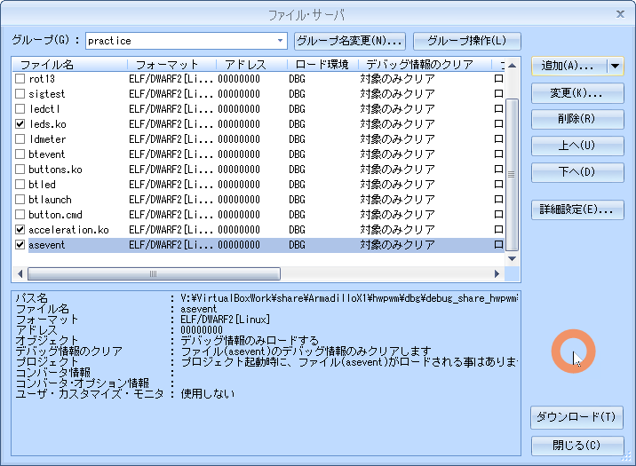

# 04.sensor

<!-- styleは、拡張機能 Markdown Preview Github Stylingをインストール-->
<!-- c:/Users/sfujimoto/.vscode/extensions/bierner.markdown-preview-github-styles-0.1.4/base.css -->
<!-- 参考URL: https://rui-log.com/vscode-markdown-preview-custom/ -->

[2024/7/18 Table of Contents]()

<!-- ctrl + ,  toc: level 1..3 へ変更-->

<div class="TOC">

<!-- @import "[TOC]" {cmd="toc" depthFrom=1 depthTo=2 orderedList=true} -->

<!-- code_chunk_output -->

1. [04.sensor](#04sensor)
    1. [目的](#目的)
    2. [構成データ](#構成データ)
    3. [センサー制御](#センサー制御)
    4. [デバイスドライバ](#デバイスドライバ)
    5. [例題 asevent](#例題-asevent)
    6. [課題1 asled](#課題1-asled)

<!-- /code_chunk_output -->

</div>

<div style="page-break-before:always"></div>  <!-- PDFで改ページ-->

## 目的

組込みアプリケーション開発 04.sensor

## 構成データ

### /media/sf_ArmadilloX1/hwpwm/work/R06_2024/Apllication_debug/text/practice ディレクトリ

<details open><summary> ･･･/share/ArmadilloX1/hwpwm/<span style="color: red">work</span>/R06_2024/Application<span style="color: red">_debug</span>/<span style="color: red">text</span>/practice/ の構成</summary>

```bash{.line-numbers}
user@1204PC-Z490M:/mnt/v/VirtualBoxWork/share/ArmadilloX1/hwpwm/work/R06_2024/Application_debug/text/practice$ tree -aF -L 3
./
├── 04.sensor/
│   ├── asevent.c*              <───── 例題 デバイス制御用ソース
│   ├── asled.c*                <───── 課題1 デバイス制御用ソース
│   ├── drivers/
│   │   ├── acceleration/
│   │   │   ├── acceleration.c* <───── ドライバソース
│   │   │   └── Makefile*       <───── ドライバ用Makefile
│   │   └── leds/
│   └── Makefile*               <───── デバイス制御用Makefile

```

</details>

## センサー制御

### デバイス仕様

  

## デバイスドライバ

### ソース

#### acceleration.c

<details open><summary> 04.sensor/drivers/acceleration.c </summary>

```c{.line-numbers}
#include <linux/init.h>
#include <linux/i2c.h>
#include <linux/platform_device.h>
#include <linux/interrupt.h>
#include <linux/input.h>
#include <linux/jiffies.h>
#include <linux/sysfs.h>
#include <linux/workqueue.h>
#include <linux/module.h>

#define I2C_DEVICE_ADDRESS	0x4c

#define MILLI_G_FACTOR		47

#define VALUE_ALERT_BIT		0x40
#define VALUE_SING_BIT		0x20

#define VALUE_COMPLEMENTARY	(~0x1f)

#define INTSET_GINT		0x10

#define MODE_ACTIVE		0x01

#define IS_ALERT(value)		((value) & VALUE_ALERT_BIT)
#define IS_MINUS_VALUE(value)	((value) & VALUE_SING_BIT)

enum AccelerationRegister {
	REG_X_VALUE,
	REG_Y_VALUE,
	REG_Z_VALUE,
	REG_TILT_STATUS,
	REG_SAMPLE_RATE_STATUS,
	REG_SLEEP_COUNT,
	REG_INTERRUPT_SETTING,
	REG_MODE_SETTING,
	REG_SAMPLE_RATE,
	REG_TAP_DETECTION_THRESHOLD,
	REG_TAP_DEBOUNCE_COUNT,
};

static struct i2c_client *acceleration_i2c_client;

// I2C通信 データ受信関数(acceleration_i2c_recv_data)
static int acceleration_i2c_recv_data(enum AccelerationRegister reg_number, unsigned char *recv_buffer)
{
	// 加速度センサから1バイトデータを受信するための
	// I2Cメッセージ構造体配列を宣言します。
	struct i2c_msg msg[] = {
		{
			.addr	= I2C_DEVICE_ADDRESS,
			.flags	= 0,
			.len	= 1,
			.buf	= (unsigned char *)&reg_number,
		},
		{
			.addr	= I2C_DEVICE_ADDRESS,
			.flags	= I2C_M_RD,
			.len	= 1,
			.buf	= recv_buffer,
		},
	};

	// I2Cメッセージを転送します。(i2c_transfer)
	return i2c_transfer(acceleration_i2c_client->adapter, msg, 2);
}

// I2C通信 データ送信関数(acceleration_i2c_send_data)
static int acceleration_i2c_send_data(enum AccelerationRegister reg_number, unsigned char send_data)
{
	// 加速度センサへ送信するデータを用意します。
	unsigned char send_buffer[] = {
		reg_number,
		send_data,
	};
	// 加速度センサへ1バイトデータを送信するための
	// I2Cメッセージ構造体配列を宣言します。
	struct i2c_msg msg[] = {
		{
			.addr = I2C_DEVICE_ADDRESS,
			.flags = 0,
			.len = sizeof(send_buffer),
			.buf = send_buffer,
		}
	};

	// I2Cメッセージを転送します。(i2c_transfer)
	return i2c_transfer(acceleration_i2c_client->adapter, msg, 1);
}

static bool is_acceleration_enable = false;

// 加速度センサ有効化関数(acceleration_enable_setting)
static int acceleration_enable_setting(void)
{
	int ret;

	// 既に有効になっている場合、何もせず以降の処理を終了します。
	if (true == is_acceleration_enable)
		return 0;

	// ワークキューの処理が完了するまで待機します。(flush_scheduled_work)
	flush_scheduled_work();

	is_acceleration_enable = true;

	// 加速度センサから割込みが発生するように設定します。(acceleration_i2c_send_data)
	ret = acceleration_i2c_send_data(REG_INTERRUPT_SETTING, INTSET_GINT);
	if (ret < 0)
		return ret;

	// 加速度センサをアクティブモードに設定します。(acceleration_i2c_send_data)
	ret = acceleration_i2c_send_data(REG_MODE_SETTING, MODE_ACTIVE);
	if (ret < 0)
		return ret;

	// 加速度センサの割込みを有効にします。(enable_irq)
	// ->割込み番号は、acceleration_i2c_client->irqを指定します。
	enable_irq(acceleration_i2c_client->irq);

	return 0;
}

// 加速度センサ無効化関数(acceleration_disable_setting)
static int acceleration_disable_setting(void)
{
	int ret;

	// 既に無効になっている場合、何もせず以降の処理を終了します。
	if (false == is_acceleration_enable)
		return 0;

	is_acceleration_enable = false;

	// ワークキューの処理が完了するまで待機します。(flush_scheduled_work)
	flush_scheduled_work();

	// 加速度センサをスタンバイモードに設定します。(acceleration_i2c_send_data)
	ret = acceleration_i2c_send_data(REG_MODE_SETTING, 0);
	if (ret < 0)
		return ret;

	// 加速度センサから割込みが発生しないように設定します。(acceleration_i2c_send_data)
	ret = acceleration_i2c_send_data(REG_INTERRUPT_SETTING, 0);
	if (ret < 0)
		return ret;

	return 0;
}

// 加速度センサ有効/無効設定関数(acceleration_store_enable)
static ssize_t acceleration_store_enable(struct device *dev, struct device_attribute *attr, const char *buf, size_t count)
{
	int ret;
	unsigned long enable;

	// 文字列の有効/無効の値を数値に変換します。(kstrtol)
	ret = kstrtol(buf, 0, &enable);
	if (ret < 0)
		return ret;

	// 加速度センサの有効/無効を設定します。
	// ->"0"以外の数字が書き込まれた場合、有効にします。(acceleration_enable_setting)
	//   "0"が書き込まれた場合、無効にします。(acceleration_disable_setting)
	if (enable)
		ret = acceleration_enable_setting();
	else
		ret = acceleration_disable_setting();

	if (ret < 0)
		return ret;

	return count;
}

unsigned long event_interval_ms = 1000;

// 通知間隔設定関数(acceleration_store_delay)
static ssize_t acceleration_store_delay(struct device *dev, struct device_attribute *attr, const char *buf, size_t count)
{
	int ret;
	unsigned long interval_ms;

	// 文字列の通知間隔を数値に変換します。(kstrtol)
	ret = kstrtol(buf, 0, &interval_ms);
	if (ret < 0)
		return ret;

	// 通知間隔をグローバル変数(event_interval_ms)に格納します。
	event_interval_ms = interval_ms;

	return count;
}

// 加速度値読み取り関数(read_acceleration_value)
static int read_acceleration_value(enum AccelerationRegister reg_number)
{
	int buf = 0;

	do {
		// 第1引数で指定されたレジスタからデータを受信します。(acceleration_i2c_recv_data)
		acceleration_i2c_recv_data(reg_number, (unsigned char *)&buf);

		// アラートがある場合は再度データを取得します。(IS_ALERT)
	} while(IS_ALERT(buf));

	// 加速度値が負数の場合は、2の補数として不足しているビットを補完します。
	// ->加速度値が負数かどうかの判定は、IS_MINUS_VALUEマクロを使用します。
	//   不足しているビットは、VALUE_COMPLEMENTARYで補完します。
	if (IS_MINUS_VALUE(buf))
		buf |= VALUE_COMPLEMENTARY;

	// レジスタから取得した値を、ミリGに変換して返却します。
	// ->ミリGへの変換は、MILLI_G_FACTORを乗算します。
	return buf * MILLI_G_FACTOR;
}

struct input_dev *input;

// 割込み遅延処理関数(irq_worker)
static void irq_worker(struct work_struct *work)
{
	int data_x, data_y, data_z;

	// 加速度センサが無効の場合、以降の処理を終了します。
	if (false == is_acceleration_enable)
		return;

	// 加速度センサから、加速度値X,Y,Zをそれぞれ取得します。(read_acceleration_value)
	// ->レジスタはそれぞれ、
	//   REG_X_VALUE, REG_Y_VALUE, REG_Z_VALUE を指定します。
	data_x = read_acceleration_value(REG_X_VALUE);
	data_y = read_acceleration_value(REG_Y_VALUE);
	data_z = read_acceleration_value(REG_Z_VALUE);

	// X,Y,Zの値をそれぞれ通知します。(input_report_abs)
	input_report_abs(input, ABS_X, data_x);
	input_report_abs(input, ABS_Y, data_y);
	input_report_abs(input, ABS_Z, data_z);

	// 同期イベントを通知します。(input_sync)
	input_sync(input);

	// 割込みハンドラで無効にした割込みを有効化します。(enable_irq)
	// ->割込み番号は、acceleration_i2c_client->irqを指定します。
	enable_irq(acceleration_i2c_client->irq);
}

// ワークキュー定義
static DECLARE_DELAYED_WORK(irq_process, irq_worker);

// 割込みハンドラ(irq_handler)
static irqreturn_t irq_handler(int irq, void *dev)
{
	// 割込みを一時的に無効化します。(disable_irq_nosync)
	// ->割込み遅延処理が完了するまで無効にします。
	disable_irq_nosync(irq);

	// 加速度センサから値を取得する処理を、
	// ワークキューで遅延処理させます。(schedule_delayed_work)
	// ->acceleration_store_delay関数で指定されたミリ秒後に実行されるようにします。
	//   schedule_delayed_workに指定する単位はjiffiesのため、
	//   ミリ秒からjiffiesに変換します。(msecs_to_jiffies)
	schedule_delayed_work(&irq_process,
		msecs_to_jiffies(event_interval_ms));

	return IRQ_HANDLED;
}

static struct platform_device *pdev;

static DEVICE_ATTR(enable, S_IWUSR, NULL, acceleration_store_enable);
static DEVICE_ATTR(delay, S_IWUSR, NULL, acceleration_store_delay);

// 属性配列
static struct attribute *acceleration_attrs[] = {
	&dev_attr_enable.attr,
	&dev_attr_delay.attr,
	NULL,
};

// 属性グループ構造体
static struct attribute_group acceleration_attr_group = {
	.attrs = acceleration_attrs,
};

// i2c_probe関数(acceleration_i2c_probe)
static int acceleration_i2c_probe(struct i2c_client *client, const struct i2c_device_id *id)
{
	int ret;

	// I2Cクライアントをグローバル変数(acceleration_i2c_client)に保持します。
	acceleration_i2c_client = client;

	// 入力デバイス構造体を割り当てます。(input_allocate_device)
	input = input_allocate_device();
	if (!input) {
		ret = -ENOMEM;
		goto err_ret;
	}

	// X軸、Y軸、Z軸の最大値、最小値を設定します。(input_set_abs_params)
	input_set_abs_params(input, ABS_X, -32, 31, 0, 0);
	input_set_abs_params(input, ABS_Y, -32, 31, 0, 0);
	input_set_abs_params(input, ABS_Z, -32, 31, 0, 0);

	// 入力デバイス構造体を設定します。
	input->name = "armadillo-x1-extension-acceleration";
	input->phys = "armadillo-x1/input2";
	input->id.bustype = BUS_I2C;
	input->dev.parent = &pdev->dev;

	// ABSイベントを登録します。(set_bit)
	// ->この設定によって、デバイスがどのような機能を持つのかを設定します。
	set_bit(EV_ABS, input->evbit);
	set_bit(ABS_X, input->absbit);
	set_bit(ABS_Y, input->absbit);
	set_bit(ABS_Z, input->absbit);

	// 加速度センサから割込みが発生するように要求します。(request_irq)
	// ->割込み番号は、client->irqを指定します。
	//   割込みハンドラは、irq_handlerを指定します。
	ret = request_irq(client->irq, irq_handler, 0, "armadillo-x1-extension-acceleration", input);
	if (ret < 0)
		goto err_free_mem;

	// 割込みを一時的に無効化します。(disable_irq)
	// ->割込み番号は、client->irqを指定します。
	disable_irq(client->irq);

	// 入力デバイスを登録します。(input_register_device)
	ret = input_register_device(input);
	if (ret < 0)
		goto err_free_irq;

	// 属性グループを作成します。(sysfs_create_group)
	ret = sysfs_create_group(&client->dev.kobj, &acceleration_attr_group);
	if (ret < 0)
		goto err_input_unregister_device;

	return 0;

 err_input_unregister_device:
	input_unregister_device(input);
 err_free_irq:
	free_irq(client->irq, input);
 err_free_mem:
	input_free_device(input);
 err_ret:
	return ret;
}

// i2c_remove関数(acceleration_i2c_remove)
static int acceleration_i2c_remove(struct i2c_client *client)
{
	// 割込み要求を解除します。(free_irq)
	free_irq(client->irq, input);

	// 加速度センサを無効にします。(acceleration_disable_setting)
	acceleration_disable_setting();

	// ワークキューの処理が完了するまで待機します。(flush_scheduled_work)
	flush_scheduled_work();

	// ワークキューの遅延処理をキャンセルします。(cancel_delayed_work_sync)
	cancel_delayed_work_sync(&irq_process);

	// 属性グループを削除します。(sysfs_remove_group)
	sysfs_remove_group(&client->dev.kobj, &acceleration_attr_group);

	// 入力デバイスの登録を解除します。(input_unregister_device)
	input_unregister_device(input);

	// 入力デバイス構造体のメモリ領域を開放します。(input_free_device)
	input_free_device(input);

	// グローバル変数(acceleration_i2c_client)を初期化します。
	acceleration_i2c_client = NULL;

	return 0;
}

// デバイスマッチング構造体配列
static const struct of_device_id acceleration_i2c_of_match[] = {
	{ .compatible = "fsl,mma7660" },
	{},
};

// デバイスID構造体配列
static const struct i2c_device_id acceleration_i2c_id_table[] = {
	{ "mma7660", 0},
	{ },
};

// I2Cドライバ構造体
static struct i2c_driver acceleration_i2c_driver = {
	.id_table	= acceleration_i2c_id_table,
	.probe		= acceleration_i2c_probe,
	.remove		= acceleration_i2c_remove,
	.driver		= {
		.name	= "acceleration",
		.owner	= THIS_MODULE,
		.of_match_table = of_match_ptr(acceleration_i2c_of_match),
	},
};

// probe関数(acceleration_probe)
static int acceleration_probe(struct platform_device *platform_device)
{
	pdev = platform_device;

	// I2Cドライバを登録します。(i2c_add_driver)
	return i2c_add_driver(&acceleration_i2c_driver);
}

// remove関数(acceleration_remove)
static int acceleration_remove(struct platform_device *pdev)
{
	// I2Cドライバの登録を解除します。(i2c_del_driver)
	i2c_del_driver(&acceleration_i2c_driver);
	return 0;
}

// プラットフォームドライバ
static struct platform_driver acceleration_platform_driver = {
	.probe		= acceleration_probe,
	.remove		= acceleration_remove,
	.driver		= {
		.name	= "armadillo-x1-extension-acceleration",
		.owner	= THIS_MODULE,
	},
};

// 初期化関数(acceleration_init)
static int __init acceleration_init(void)
{
	int ret;

	// プラットフォームデバイスを登録します。(platform_device_register_simple)
	// ->プラットフォーム依存のデバイス情報を登録します。
	pdev = platform_device_register_simple("armadillo-x1-extension-acceleration", -1, NULL, 0);
	if (IS_ERR(pdev)) {
		ret = (int)pdev;
		goto err_ret;
	}

	// プラットフォームドライバを登録します。(platform_driver_register)
	// ->登録したプラットフォームデバイスのリソース情報を取得し、
	//   プラットフォームドライバとして、probe関数とremove関数を登録します。
	ret = platform_driver_register(&acceleration_platform_driver);
	if (ret < 0)
		goto err_platform_device_unregister;

	return 0;

 err_platform_device_unregister:
	platform_device_unregister(pdev);
 err_ret:
	return ret;
}

// 終了関数(acceleration_exit)
static void __exit acceleration_exit(void)
{
	// プラットフォームドライバの登録を解除します。(platform_driver_unregister)
	platform_driver_unregister(&acceleration_platform_driver);
	// プラットフォームデバイスの登録を解除します。(platform_device_unregister)
	platform_device_unregister(pdev);
}

// 初期化の際に、初期化関数が呼ばれるように登録します。
module_init(acceleration_init);
// 終了する際に、終了関数が呼ばれるように登録します。
module_exit(acceleration_exit);

// MODULE_LICENSEは"GPL"とします。
MODULE_LICENSE("GPL");
```

</details>

#### Makefile

<details open><summary> 04.sensor/drivers/acceleration/Makefile </summary>

```bash{.line-numbers}
KERNELDIR = /home/atmark/linux-4.9-x1-at27_dbg
ARCH = arm
PREFIX = arm-linux-gnueabihf-
MOD_PATH = /work/linux/nfsroot

EXTRA_CFLAGS += -gdwarf-2 -O0

obj-m := acceleration.o

modules:
	$(MAKE) -C $(KERNELDIR) M=`pwd` ARCH=$(ARCH) CROSS_COMPILE=$(PREFIX) modules

modules_install:
	$(MAKE) -C $(KERNELDIR) M=`pwd` ARCH=$(ARCH) INSTALL_MOD_PATH=$(MOD_PATH) modules_install

myinstall:
	cp -p *.ko /media/sf_ArmadilloX1/hwpwm/dbg/debug_share_hwpwm/R06_2024/04_practice
	cp -p *.c  /media/sf_ArmadilloX1/hwpwm/dbg/debug_share_hwpwm/R06_2024/04_practice

clean:
	$(MAKE) -C $(KERNELDIR) M=`pwd` clean
```

</details>

### 動作確認

#### make clean

<details open><summary> $ make clean </summary>

```bash{.line-numbers}
atmark@atde8:/media/sf_ArmadilloX1/hwpwm/work/R06_2024/Application_debug/text/practice-example/04.sensor/drivers/acceleration$ make clean
make -C /home/atmark/linux-4.9-x1-at27_dbg M=`pwd` clean
make[1]: ディレクトリ '/home/atmark/linux-4.9-x1-at27_dbg' に入ります
make[1]: ディレクトリ '/home/atmark/linux-4.9-x1-at27_dbg' から出ます
```

</details>

#### make modules

!!! warning 「make[2]: 警告: ファイル '/media/sf_ArmadilloX1/hwpwm/work/R06_2024/Application_debug/text/practice-example/02.led/drivers/leds/leds.o' の修正時刻 20 は未来の時刻です」と表示された場合は chrony を ATDE8 と ArmadilloX1 にインストールすると解決する

<details open><summary> $ make modules </summary>

```bash{.line-numbers}
atmark@atde8:/media/sf_ArmadilloX1/hwpwm/work/R06_2024/Application_debug/text/practice-example/04.sensor/drivers/acceleration$ make modules
make -C /home/atmark/linux-4.9-x1-at27_dbg M=`pwd` ARCH=arm CROSS_COMPILE=arm-linux-gnueabihf- modules
make[1]: ディレクトリ '/home/atmark/linux-4.9-x1-at27_dbg' に入ります
  CC [M]  /media/sf_ArmadilloX1/hwpwm/work/R06_2024/Application_debug/text/practice-example/04.sensor/drivers/acceleration/acceleration.o
  Building modules, stage 2.
  MODPOST 1 modules
make[2]: 警告: ファイル '/media/sf_ArmadilloX1/hwpwm/work/R06_2024/Application_debug/text/practice-example/04.sensor/drivers/acceleration/acceleration.mod.c' の修正時刻 0.01 は未来の時刻です
  CC      /media/sf_ArmadilloX1/hwpwm/work/R06_2024/Application_debug/text/practice-example/04.sensor/drivers/acceleration/acceleration.mod.o
  LD [M]  /media/sf_ArmadilloX1/hwpwm/work/R06_2024/Application_debug/text/practice-example/04.sensor/drivers/acceleration/acceleration.ko
make[2]: 警告:  時刻のずれを検出. 不完全なビルド結果になるかもしれません.
make[1]: ディレクトリ '/home/atmark/linux-4.9-x1-at27_dbg' から出ます
```

</details>

#### sudo make modules_install

<details open><summary> $ sudo make modules_install </summary>

```bash{.line-numbers}
atmark@atde8:/media/sf_ArmadilloX1/hwpwm/work/R06_2024/Application_debug/text/practice-example/04.sensor/drivers/acceleration$ sudo make modules_install
[sudo] atmark のパスワード:
make -C /home/atmark/linux-4.9-x1-at27_dbg M=`pwd` ARCH=arm INSTALL_MOD_PATH=/work/linux/nfsroot modules_install
make[1]: ディレクトリ '/home/atmark/linux-4.9-x1-at27_dbg' に入ります
  INSTALL /media/sf_ArmadilloX1/hwpwm/work/R06_2024/Application_debug/text/practice-example/04.sensor/drivers/acceleration/acceleration.ko
  DEPMOD  4.9.133-at27
depmod: WARNING: could not open modules.order at /work/linux/nfsroot/lib/modules/4.9.133-at27: No such file or directory
depmod: WARNING: could not open modules.builtin at /work/linux/nfsroot/lib/modules/4.9.133-at27: No such file or directory
make[1]: ディレクトリ '/home/atmark/linux-4.9-x1-at27_dbg' から出ます
```

</details>

#### sudo make myinstall

<details open><summary> $ sudo make myinstall </summary>

```bash{.line-numbers}
atmark@atde8:/media/sf_ArmadilloX1/hwpwm/work/R06_2024/Application_debug/text/practice-example/04.sensor/drivers/acceleration$ sudo make myinstall
cp -p *.ko /media/sf_ArmadilloX1/hwpwm/dbg/debug_share_hwpwm/R06_2024/04_practice
cp -p *.c  /media/sf_ArmadilloX1/hwpwm/dbg/debug_share_hwpwm/R06_2024/04_practice
```

</details>

#### cd

<details open><summary> root@armadillo:/# cd /lib/modules/4.9.133-at27/extra/ </summary>

```bash{.line-numbers}
root@armadillo:~# cd /lib/modules/4.9.133-at27/extra/
```

</details>

#### insmod

<details open><summary> #insmod leds.ko, #insmod acceleration ko と #insmod buttons.ko </summary>

```bash{.line-numbers}
root@armadillo:/lib/modules/4.9.133-at27/extra# insmod leds.ko
root@armadillo:/lib/modules/4.9.133-at27/extra# insmod acceleration.ko
root@armadillo:/lib/modules/4.9.133-at27/extra# insmod buttons.ko
root@armadillo:/lib/modules/4.9.133-at27/extra# lsmod
Module                  Size  Used by
buttons                 3065  0
acceleration            5941  0
leds                    2103  0
```

</details>

#### <span style="color: red"># tail -f /var/log/kern.log で /dev/input/event* を確認</span>

!!! Tips acceleration.ko -> buttons.ko の順番で insmod すると、acceleration はevent<span style="color: red">3</span>、buttons は event <span style="color: red">4</span>となる


<details open><summary> root@armadillo:~# tail -f /var/log/kern.log </summary>

```bash{.line-numbers}
root@armadillo:~# tail -f /var/log/kern.log
Feb 14 19:12:08 armadillo kernel: random: systemd: uninitialized urandom read (16 bytes read)
Feb 14 19:12:08 armadillo kernel: random: systemd: uninitialized urandom read (16 bytes read)
Feb 14 19:12:08 armadillo kernel: nf_conntrack: default automatic helper assignment has been turned off for security reasons and CT-based  firewall rule not found. Use the iptables CT target to attach helpers instead.
Feb 14 19:12:08 armadillo kernel: random: crng init done
Feb 14 19:12:08 armadillo kernel: random: 6 urandom warning(s) missed due to ratelimiting
Jul  5 07:48:44 armadillo kernel: IPVS: Creating netns size=912 id=1
Jul  5 07:48:45 armadillo kernel: IPv6: ADDRCONF(NETDEV_UP): wlan0: link is not ready
Jul  5 07:48:46 armadillo kernel: IPv6: ADDRCONF(NETDEV_UP): wlan0: link is not ready
Jul  5 09:07:29 armadillo kernel: leds: loading out-of-tree module taints kernel.
Jul  5 09:07:35 armadillo kernel: input: armadillo-x1-extension-acceleration as /devices/platform/armadillo-x1-extension-acceleration/input/input3  <───── 3
Jul  5 09:28:28 armadillo kernel: input: armadillo-x1-extension-btns as /devices/platform/armadillo-x1-extension-btns/input/input4 <────────────────────── 4
```

</details>

### デバイスファイル

###### "/dev/input/event*"

*には連番

!!! warning ボタンスイッチ、センサなど複数の入力デバイスがある場合、ソースファイル内ではデバイスファイル/dev/input/event* の * を<span style="color: red">決め打ち</span>しているので注意すること

#### イベント

読み出したイベントデータは次のinput_event構造体の形で表示

<details open><summary> input_event構造体 </summary>

```c{.line-numbers}
#include <linux/input.h>

struct input_event {
struct timeval time;
  __u16 type;
  __u16 code;
  __s32 value;
};
```

</details>

|  type    | code       | value        |
|----------|------------|--------------|
|3(EV_ABS) | 0(ABS_X)   | X軸加速度(mG) |
|3(EV_ABS) | 1(ABS_Y)   | Y軸加速度(mG) |
|3(EV_ABS) | 2(ABS_Z)   | Z軸加速度(mG) |

G は重力加速度の単位($ 1.0G = 9.8 m/s^2 $)
mG は G の 1000 分の 1

##### EV_ABSイベント発生間隔設定ファイル

"/sys/devices/soc0/soc/30800000.aips-bus/30a30000.i2c/i2c-1/1-004c/delay"

イベント発生間隔（初期値）: 1000ms

##### センサの有効化ファイル

"/sys/devices/soc0/soc/30800000.aips-bus/30a30000.i2c/i2c-1/1-004c/enable"

有効化: 0 以外の値を書き込む
無効化: 0

##### その他

- 一連のイベントの終わりに EV_SYN（同期）
- ボタンイベントと同様に EV_ABS イベントの直後に EV_SYN イベントが発生

## 例題 asevent

センサイベントの内容を表示する

- X軸加速度が変化したとき --> "X:[X軸valueの値]"
- Y軸加速度が変化したとき --> "Y:[Y軸valueの値]"
- Z軸加速度が変化したとき --> "Z:[Z軸valueの値]"
- 同期イベント発生時      -->  "EV_SYN:----------"

センサを有効化、発生間隔は2000ms

### ソース

#### asevent.c

<details open><summary> 04.sensor/asevent.c </summary>

```c{.line-numbers}
#include <stdio.h>
#include <fcntl.h>
#include <unistd.h>
#include <linux/input.h>

// イベントデバイスファイル
#define	AS_EV_FILE	"/dev/input/event3"
// 加速度センサ制御用ファイル
#define	AS_DELAY_FILE	"/sys/devices/soc0/soc/30800000.aips-bus/30a30000.i2c/i2c-1/1-004c/delay"
#define	AS_ENABLE_FILE	"/sys/devices/soc0/soc/30800000.aips-bus/30a30000.i2c/i2c-1/1-004c/enable"
// 通知時間(ms)
#define	DELAY_TIME		2000
// センサの有効設定
#define	ENABLE_MODE		1

int main(int argc, char *argv[])
{
	int fd_as, fd_as_delay, fd_as_enable;
	int ret;
	int value;
	char data[32];
	int n;
	struct input_event ev;

	// 加速度センサの通知間隔設定属性ファイルをオープンします。
	fd_as_delay = open(AS_DELAY_FILE, O_WRONLY);
	// オープンに失敗した場合、エラー終了します。
	if (fd_as_delay < 0){
		perror("failed to open device");
		return 1;
	}

	// 加速度センサ有効化属性ファイルをオープンします。
	fd_as_enable = open(AS_ENABLE_FILE, O_WRONLY);
	// オープンに失敗した場合、エラー終了します。
	if (fd_as_enable < 0){
		perror("failed to open device");
		return 1;
	}

	// イベントデバイスファイルをオープンします。
	fd_as = open(AS_EV_FILE, O_RDONLY);
	// オープンに失敗した場合、エラー終了します。
	if (fd_as < 0){
		perror("failed to open device");
		return 1;
	}

	// 通知間隔を設定します。
	n = sprintf(data,"%d",DELAY_TIME);
	ret = write(fd_as_delay, data, n);
	// 書き込みが失敗した場合、エラー終了します。
	if (ret < 0){
		perror("failed to write");
		return 1;
	}

	// 加速度センサを有効にします。
	n = sprintf(data,"%d",ENABLE_MODE);
	ret = write(fd_as_enable, data, n);
	// 書き込みが失敗した場合、エラー終了します。
	if (ret < 0){
		perror("failed to write");
		return 1;
	}

	// イベント内容を表示する処理。
	for(;;){
		// 入力イベント構造体を読み込みます。
		ret = read(fd_as, &ev, sizeof(ev));
		// 読み込みに失敗した場合、エラー終了します。
		if (ret < 0){
			perror("failed to read events");
			return 1;
		}
		// イベントのタイプで表示内容を変化します。
		switch (ev.type){
		// タイプがEV_ABSの時の処理。
		case EV_ABS:
			// コードがABS_XならXの値を表示します。
			if (ev.code == ABS_X){
				printf("X : %d\n",ev.value);
			// コードがABS_YならYの値を表示します。
			} else if (ev.code == ABS_Y){
				printf("Y : %d\n",ev.value);
			// コードがABS_ZならZの値を表示します。
			} else if (ev.code == ABS_Z){
				printf("Z : %d\n",ev.value);
			// コードが上記以外なら、エラー終了します。
			} else {
				fprintf(stderr, "invalid event code\n");
				return 1;
			}
			break;

		// タイプがEV_SYNの時の処理。
		case EV_SYN:
			printf("EV_SYN: -------------\n");
			break;
		// タイプが上記以外なら、エラー終了します。
		default:
			fprintf(stderr, "unknown event\n");
			return 2;
		}
	}

	// 加速度センサ制御用ファイルをクローズします。
	close(fd_as_delay);
	close(fd_as_enable);
	// イベントデバイスファイルをクローズします。
	close(fd_as);

	return 0;
}
```

</details>

#### Makefile

<details open><summary> 04.sensor/Makefile </summary>

```bash{.line-numbers}
CC = arm-linux-gnueabihf-gcc
#TARGET = asevent asled
TARGET = asevent
CFLAGS = -gdwarf-2 -O0

all: $(TARGET)

install :
	cp -p $(TARGET) /work/linux/nfsroot/debug/04_practice
	cp -p $(TARGET) /media/sf_ArmadilloX1/hwpwm/dbg/debug_share_hwpwm/R06_2024/04_practice
	cp -p $(TARGET).c /media/sf_ArmadilloX1/hwpwm/dbg/debug_share_hwpwm/R06_2024/04_practice

clean:
	rm -f $(TARGET)

.PHONY: clean
```

</details>

### 動作確認

#### make clean

<details open><summary> $ make clean </summary>

```bash{.line-numbers}
atmark@atde8:/media/sf_ArmadilloX1/hwpwm/work/R06_2024/Application_debug/text/practice-example/04.sensor$ make clean
rm -f asevent
```

</details>

#### make

<details open><summary> $ make </summary>

```bash{.line-numbers}
atmark@atde8:/media/sf_ArmadilloX1/hwpwm/work/R06_2024/Application_debug/text/practice-example/04.sensor$ make
arm-linux-gnueabihf-gcc -gdwarf-2 -O0    asevent.c   -o asevent
```

</details>

#### sudo make install

<details open><summary> $ sudo make install </summary>

```bash{.line-numbers}
atmark@atde8:/media/sf_ArmadilloX1/hwpwm/work/R06_2024/Application_debug/text/practice-example/04.sensor$ sudo make install
cp -p asevent /work/linux/nfsroot/debug/04_practice
cp -p asevent /media/sf_ArmadilloX1/hwpwm/dbg/debug_share_hwpwm/R06_2024/04_practice
cp -p asevent.c /media/sf_ArmadilloX1/hwpwm/dbg/debug_share_hwpwm/R06_2024/04_practice
```

</details>

#### CSIDEでロード

<details open><summary> メニュー「ファイル」-「ロード」</summary>

  

</details>

#### insmod（既にinsmod 済みなら割愛）

!!! warning leds.ko も insmod しておくこと

<details open><summary> # insmod leds.ko と # insmod acceleration.ko </summary>

```bash{.line-numbers}
root@armadillo:/lib/modules/4.9.133-at27/extra# insmod leds.ko
root@armadillo:/lib/modules/4.9.133-at27/extra# insmod acceleration.ko
root@armadillo:/lib/modules/4.9.133-at27/extra# lsmod
Module                  Size  Used by
acceleration            5941  0
leds                    2103  0
root@armadillo:/lib/modules/4.9.133-at27/extra#
```

</details>

#### 実行結果

<details open><summary> root@armadillo:/debug/04_practice# ./asevent </summary>

```bash{.line-numbers}
root@armadillo:/debug/04_practice# ./asevent
X : -940
EV_SYN: -------------
X : -893
Z : 376
EV_SYN: -------------
X : -799
Y : -470
Z : 329
EV_SYN: -------------
X : -611
Y : -846
Z : 235
EV_SYN: -------------
X : -987
Y : 94
Z : 0
EV_SYN: -------------
X : -705
Y : 705
Z : 188
EV_SYN: -------------
X : -141
Y : 423
Z : 893
EV_SYN: -------------
X : 94
Y : 705
Z : 658
EV_SYN: -------------
X : -940
Y : -188
Z : 235
EV_SYN: -------------
^C
```

</details>

#### 実行している様子

<details open><summary> asevent を実行している動画 </summary>

  [https://youtu.be/1O3wMkOxOCI](https://youtu.be/1O3wMkOxOCI)

  <video controls src="assets/20240705_04sensor_asevent.mp4" title="Title" width="1024"></video>

</details>

## 課題1 asled

### ソース

#### asled.c

<details open><summary> 04.sensor/asled.c </summary>

```c{.line-numbers}
#include <stdio.h>
#include <fcntl.h>
#include <unistd.h>
#include <linux/input.h>

// イベントデバイスファイル
#define	AS_EV_FILE	"/dev/input/event3"
// 加速度センサ制御用ファイル
#define	AS_DELAY_FILE	"/sys/devices/soc0/soc/30800000.aips-bus/30a30000.i2c/i2c-1/1-004c/delay"
#define	AS_ENABLE_FILE	"/sys/devices/soc0/soc/30800000.aips-bus/30a30000.i2c/i2c-1/1-004c/enable"
// LED制御用ファイル
#define	LED_FILE	"/sys/class/leds/led_ext/brightness"
// 通知時間(ms)
#define	DELAY_TIME		100
// センサの有効設定
#define	ENABLE_MODE		1
// LED書き込み用定義
#define LED1		0x01
#define LED2		0x02
#define LED3		0x04
#define LED_CENTER	0x18
#define LED6		0x20
#define LED7		0x40
#define LED8		0x80
// Y軸の閾値
#define THRESHOLD1	200
#define THRESHOLD2	400
#define THRESHOLD3	600

int main(void)
{


	// 加速度センサの通知間隔設定属性ファイルをオープンします。


	// 加速度センサ有効化属性ファイルをオープンします。


	// イベントデバイスファイルをオープンします。


	// LEDデバイスファイルをオープンします。


	// 加速度センサを有効にします。


	// LEDを点灯させる処理。


	// 加速度センサ制御用ファイルをクローズします。


	// LED制御用ファイルをクローズします。

	// イベントデバイスファイルをクローズします。


	return 0;
}
```

</details>

#### Makefile

<details open><summary> 04.sensor/Makefile </summary>

```bash{.line-numbers}
CC = arm-linux-gnueabihf-gcc
#TARGET = asevent asled
TARGET = asled
CFLAGS = -gdwarf-2 -O0

all: $(TARGET)

install :
	cp -p $(TARGET) /work/linux/nfsroot/debug/04_practice
	cp -p $(TARGET) /media/sf_ArmadilloX1/hwpwm/dbg/debug_share_hwpwm/R06_2024/04_practice
	cp -p $(TARGET).c /media/sf_ArmadilloX1/hwpwm/dbg/debug_share_hwpwm/R06_2024/04_practice

clean:
	rm -f $(TARGET)

.PHONY: clean
```

</details>

### 動作確認

#### make clean

<details open><summary> $ make clean </summary>

```bash{.line-numbers}
atmark@atde8:/media/sf_ArmadilloX1/hwpwm/work/R06_2024/Application_debug/text/practice-example/04.sensor$ make clean
rm -f asled
```

</details>

#### make

<details open><summary> $ make </summary>

```bash{.line-numbers}
atmark@atde8:/media/sf_ArmadilloX1/hwpwm/work/R06_2024/Application_debug/text/practice-example/04.sensor$ make
arm-linux-gnueabihf-gcc -gdwarf-2 -O0    asled.c   -o asled
```

</details>

#### sudo make install

<details open><summary> $ sudo make install </summary>

```bash{.line-numbers}
atmark@atde8:/media/sf_ArmadilloX1/hwpwm/work/R06_2024/Application_debug/text/practice-example/04.sensor$ sudo make install
[sudo] atmark のパスワード:
cp -p asled /work/linux/nfsroot/debug/04_practice
cp -p asled /media/sf_ArmadilloX1/hwpwm/dbg/debug_share_hwpwm/R06_2024/04_practice
cp -p asled.c /media/sf_ArmadilloX1/hwpwm/dbg/debug_share_hwpwm/R06_2024/04_practice
```

</details>

#### CSIDEでロード

<details open><summary> メニュー「ファイル」-「ロード」</summary>

  

</details>

#### insmod（既にinsmod 済みなら割愛）

<details open><summary>  # insmod leds.ko と # insmod acceleration.ko </summary>

```bash{.line-numbers}
root@armadillo:/lib/modules/4.9.133-at27/extra# insmod leds.ko
root@armadillo:/lib/modules/4.9.133-at27/extra# insmod acceleration.ko
root@armadillo:/lib/modules/4.9.133-at27/extra# lsmod
Module                  Size  Used by
acceleration            5941  0
leds                    2103  0
```

</details>

#### 実行

<details open><summary> root@armadillo:/debug/04_practice# ./asled </summary>

```bash{.line-numbers}
root@armadillo:/debug/04_practice# ./asled
```

</details>

#### 実行している様子

<details open><summary> asled による 加速度センサ と LED の連動動画 </summary>

  [https://youtu.be/91Cou1sUmjA](https://youtu.be/91Cou1sUmjA)

  <video controls src="assets/20240705_04sensor_asled.mp4" title="Title" width="1024"></video>

</details>
