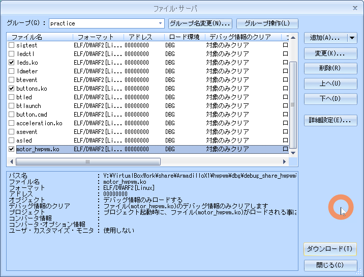
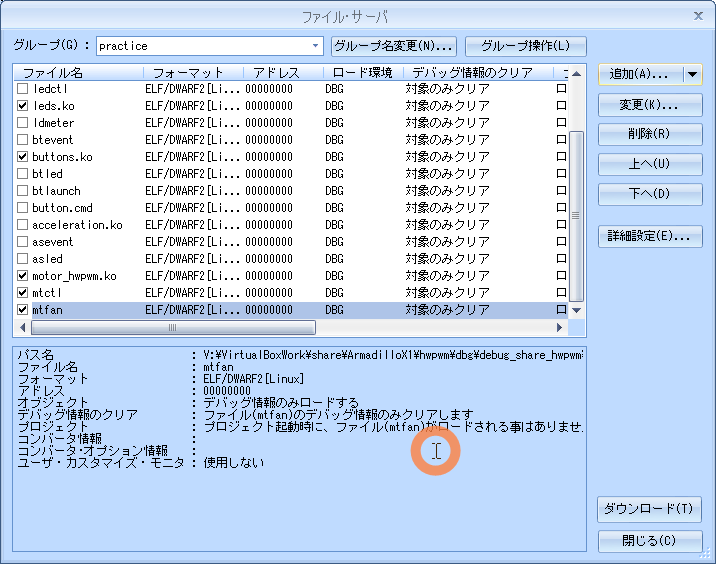
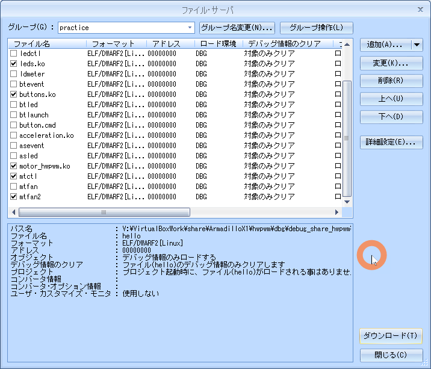

# 05.motor

<!-- styleは、拡張機能 Markdown Preview Github Stylingをインストール-->
<!-- c:/Users/sfujimoto/.vscode/extensions/bierner.markdown-preview-github-styles-0.1.4/base.css -->
<!-- 参考URL: https://rui-log.com/vscode-markdown-preview-custom/ -->

[2024/7/18 Table of Contents]()

<!-- ctrl + ,  toc: level 1..3 へ変更-->

<div class="TOC">

<!-- @import "[TOC]" {cmd="toc" depthFrom=1 depthTo=2 orderedList=true} -->

<!-- code_chunk_output -->

1. [05.motor](#05motor)
    1. [目的](#目的)
    2. [構成データ](#構成データ)
    3. [モータo制御](#モータo制御)
    4. [デバイスドライバ](#デバイスドライバ)
    5. [例題 asevent](#例題-asevent)
    6. [課題1 asled](#課題1-asled)

<!-- /code_chunk_output -->

</div>

<div style="page-break-before:always"></div>  <!-- PDFで改ページ-->

## 目的

組込みアプリケーション開発 05.motor

## 構成データ

### /media/sf_ArmadilloX1/hwpwm/work/R06_2024/Apllication_debug/text/practice ディレクトリ

<details open><summary> ･･･/share/ArmadilloX1/hwpwm/<span style="color: red">work</span>/R06_2024/Application<span style="color: red">_debug</span>/<span style="color: red">text</span>/practice/ の構成</summary>

```bash{.line-numbers}
user@1204PC-Z490M:/mnt/v/VirtualBoxWork/share/ArmadilloX1/hwpwm/work/R06_2024/Application_debug/text/practice$ tree -aF -L 3
./
├── 05.motor/
│   ├── drivers/
│   │   ├── buttons/
│   │   ├── leds/
│   │   └── motor/
│   │       ├── Makefile*       <───── ドライバ用Makefile
│   │       └── motor_hwpwm.c*  <───── ドライバソース
│   ├── Makefile*               <───── デバイス制御用Makefile
│   ├── mtctl.c*                <───── 例題 デバイス制御用ソース
│   ├── mtfan2.c*               <───── 課題2 デバイス制御用ソース
│   └── mtfan.c*                <───── 課題1 デバイス制御用ソース
```

</details>

## モーター制御

### デバイス仕様

!!! warning DCモーターは、ハードウェアPMWによる制御（ソフトウェアPWMよりも滑らか）

モーター: RE 140RA 2270（マブチモーター）

- モーターの駆動電圧:約 2.5V（max 1.5A）
- モーターをフル回転（ MOT_PWM duty100%duty100%）の状態で 起動すると電源、及び周辺回路に悪影響を与える可能性あり
- 起動時は多大な突入電流 2.5A 程度流れる
- モータを起動する時は、 PWM 制御によってモータの回転速度を 徐々に上げていく
- 起動時の突入電流を 1A 以下（ 700mA 程度 ）に抑えるには、500mS 程度の時間をかけ、徐々に duty が 100% になるように制御する

- 通常動作時 に PWM 制御 によって duty を 100% 以下にすると、モータの消費電流が増加
- duty が 70% 程度になると、消費電流は duty100% の時の倍近くにまで増加
- 長時間モータを連続駆動すると 、モータ用電源IC U7 BA00DD0WHFP と ドライバー IC U6 :TB65 52 FNG が発熱して高温状態になる
- 連続駆動する時は、 duty100% で使用することを推奨します 。

## デバイスドライバ

### ソース

#### motor_hwpwm.c

<details open><summary> 05.motor/drivers/motor_hwpwm.c </summary>

```c{.line-numbers}
#include <linux/init.h>
#include <linux/module.h>
#include <linux/platform_device.h>
#include <linux/fs.h>
#include <linux/pwm.h>

#include <asm/armadilloX1-ext-cpld.h>

// モータ動作モードのマクロ
#define MOT_PWM         0x01
#define MOT_CW          0x02
#define MOT_CCW         0x04
#define MOT_STBY        0x08
#define MODE_BREAK      (MOT_CW|MOT_CCW|MOT_STBY)
#define MODE_CCW        (MOT_CCW|MOT_PWM|MOT_STBY)
#define MODE_CCW_BR     (MOT_CCW|MOT_STBY)
#define MODE_CW         (MOT_CW|MOT_PWM|MOT_STBY)
#define MODE_CW_BR      (MOT_CW|MOT_STBY)
#define MODE_STOP       (MOT_STBY)
#define MODE_STBY       (0)

#define MAX_ROTATION    100
#define MIN_ROTATION    -100

#define PWM_PERIOD      500000 // PWMの1周期の時間(単位：ns)

// 設定された値を保持する変数
static int set_duty = 0;

// PWMデバイス
static struct pwm_device *pwm;

// 属性ファイルから現在設定されている値を読み出す関数(motor_rotation_show)
static ssize_t motor_rotation_show(struct device *dev, struct device_attribute *attr, char *buf)
{
	return sprintf(buf, "%d\n", set_duty);
}

// 属性ファイルへの書き込み関数
static ssize_t motor_rotation_store(struct device *dev, struct device_attribute *attr, const char *buf, size_t count)
{
	int ret;
	long val;
	unsigned int cycle;
	struct pwm_state state;

	// バッファからデータを取り出し、数値に変換する。
	ret = kstrtol(buf, 10, &val);
	if (ret)
		return ret;

	// 0以外が指定された場合の処理
	if (val != 0) {
		// 現在のPWMデバイスの設定を取得する。
		pwm_get_state(pwm, &state);

		// PWMを設定変更前に停止状態にする。
		state.enabled = 0;

		// PWMデバイスに設定を適用する。
		ret = pwm_apply_state(pwm, &state);
		if (ret)
			return ret;

		// 正転の場合の処理(正の値を設定したとき)
		if (val > 0) {
			if (val > MAX_ROTATION) {
				val = MAX_ROTATION;
			}

			// 指定されたデューティ比にするためのパルス信号のHigh時間を計算する。
			val = ((val / 10) * 10);
			cycle = (PWM_PERIOD * val) / 100;

			// 現在のPWMデバイスの設定を取得する。
			pwm_get_state(pwm, &state);

			// PWMの1周期あたりのHigh時間を設定する。
			state.duty_cycle = cycle;

			// PWMを動作状態にする。
			state.enabled = 1;

			// PWMデバイスに設定を適用する。
			ret = pwm_apply_state(pwm, &state);
			if (ret)
				return ret;

			// モータ動作モードをCWにセットする。
			cpld_write(CPLD_WRITE_MOT, MODE_CW);

		// 反転の場合の処理(負の値を設定したとき)
		} else {
			if (val < MIN_ROTATION) {
				val = MIN_ROTATION;
			}

			// 指定されたデューティ比にするためのパルス信号のHigh時間を計算する。
			val = ((val / 10) * 10);
			cycle = (PWM_PERIOD * -val) / 100;

			// 現在のPWMデバイスの設定を取得する。
			pwm_get_state(pwm, &state);

			// PWMの1周期あたりのHigh時間を設定する。
			state.duty_cycle = cycle;

			// PWMを動作状態にする。
			state.enabled = 1;

			// PWMデバイスに設定を適用する。
			ret = pwm_apply_state(pwm, &state);
			if (ret)
				return ret;

			// モータ動作モードをCCWにセットする。
			cpld_write(CPLD_WRITE_MOT, MODE_CCW);
		}
	// 0が指定された場合の処理
	} else {
		// モータ動作モードをストップにセットする。
		cpld_write(CPLD_WRITE_MOT, MODE_STOP);

		// 現在のPWMデバイスの設定を取得する。
		pwm_get_state(pwm, &state);

		// PWMを停止状態にする。
		state.enabled = 0;

		// PWMデバイスに設定を適用する。
		ret = pwm_apply_state(pwm, &state);
		if (ret)
			return ret;
	}

	// 設定された値を保持する。
	set_duty = val;

	return count;
}

// motor_rotationの最大値を返す関数(motor_max_rotation_show)
static ssize_t motor_max_rotation_show(struct device *dev, struct device_attribute *attr, char *buf)
{
	return sprintf(buf, "%d\n", MAX_ROTATION);
}

// motor_rotationの最小値を返す関数(motor_min_rotation_show)
static ssize_t motor_min_rotation_show(struct device *dev, struct device_attribute *attr, char *buf)
{
	return sprintf(buf, "%d\n", MIN_ROTATION);
}

// デバイス属性構造体
static DEVICE_ATTR_RW(motor_rotation);
static DEVICE_ATTR_RO(motor_max_rotation);
static DEVICE_ATTR_RO(motor_min_rotation);

// モータ デバイス属性グループ構造体
static struct attribute *motor_class_attrs[] = {
	&dev_attr_motor_rotation.attr,
	&dev_attr_motor_max_rotation.attr,
	&dev_attr_motor_min_rotation.attr,
	NULL,
};
ATTRIBUTE_GROUPS(motor_class);

// モータクラスデバイス構造体
static struct class motor_class = {
	.owner          = THIS_MODULE,
	.name           = "motor",
	.dev_groups     = motor_class_groups,
};

// probe関数(motor_probe)
static int motor_probe(struct platform_device *pdev)
{
	struct device *dev;
	struct pwm_state state;
	int ret;

	// 属性ファイルを作成
	// /sys/class/motor/配下にファイルを作成し、/sys/class/motor/motor0/motor_rotationに
	// 値を書き込むとデバイス書き込み関数(motor_rotation_store)が呼び出されるように
	// 作成します。
	dev = device_create(&motor_class, NULL, 0, NULL, "motor0");
	if (IS_ERR(dev)){
		dev_err(&pdev->dev, KERN_ERR "failed to create device.\n");
		return PTR_ERR(dev);
	}

	// 使用するPWMデバイスの情報を取得する。
	pwm = pwm_request(1, "Hardware-PWM Motor");
	if (IS_ERR(pwm)) {
		dev_err(&pdev->dev, KERN_ERR "failed to request PWM device.\n");
		device_destroy(&motor_class, 0);
		return PTR_ERR(pwm);
	}

	// モータ動作モードをストップにセットする。
	cpld_write(CPLD_WRITE_MOT, MODE_STOP);

	// 現在のPWMデバイスの設定を取得する。
	pwm_get_state(pwm, &state);

	// PWMの1周期の時間を設定する。
	state.period = PWM_PERIOD;

	// PWMを停止状態にする。
	state.enabled = 0;

	// PWMデバイスに設定を適用する。
	ret = pwm_apply_state(pwm, &state);
	if (ret) {
		dev_err(&pdev->dev, KERN_ERR "failed to apply state PWM.\n");
		pwm_free(pwm);
		device_destroy(&motor_class, 0);
		return ret;
	}

	return 0;
}

// remove関数(motor_remove)
static int motor_remove(struct platform_device *pdev)
{
	struct pwm_state state;

	// モータ動作モードをスタンバイにセットする。
	cpld_write(CPLD_WRITE_MOT, MODE_STBY);

	// 現在のPWMデバイスの設定を取得する。
	pwm_get_state(pwm, &state);

	// PWMを停止状態にする。
	state.enabled = 0;

	// PWMデバイスに設定を適用する。
	pwm_apply_state(pwm, &state);

	// PWMデバイスを解放する。
	pwm_free(pwm);

	// モータクラスデバイス構造体を解除します。(device_destroy)
	device_destroy(&motor_class, 0);
	return 0;
}

// プラットフォームドライバ構造体の宣言
// ドライバにprobe関数とremove関数、デバイスドライバ構造体を設定します。
static struct platform_driver motor_driver = {
	.probe          = motor_probe,
	.remove         = motor_remove,
	.driver         = {
		.name   = "armadillo-x1-extension-motor",
		.owner  = THIS_MODULE,
	},
};

static struct platform_device *pdev;

// 初期化関数(motor_init)
static int __init motor_init(void)
{
	int ret = 0;

	// モータクラスデバイスを登録します。(class_register)
	// /sys/class/motor/配下にファイルを作成し、/sys/class/motor/motor0/motor_rotationに
	// 値を書き込むとデバイス書き込み関数(motor_rotation_store)が呼び出されるように
	// 登録します。
	ret = class_register(&motor_class);
	if (ret)
		goto err1;

	// プラットフォームドライバを登録します。(platform_driver_register)
	// 登録したプラットフォームデバイスのリソース情報を取得し、
	// プラットフォームドライバとして、probe関数とremove関数を登録します。
	ret = platform_driver_register(&motor_driver);
	if (ret)
		goto err2;

	// プラットフォームデバイスを登録します(platform_device_register_simple)
	// プラットフォーム依存のデバイス情報を登録します。
	pdev = platform_device_register_simple("armadillo-x1-extension-motor", -1, NULL, 0);
	if (!pdev)
		goto err3;

	return 0;

err3:   platform_driver_unregister(&motor_driver);
err2:   class_unregister(&motor_class);
err1:
	return ret;
}

// 終了関数(motor_exit)
static void __exit motor_exit(void)
{
	// プラットフォームデバイスを解除します。(platform_device_unregister)
	platform_device_unregister(pdev);

	// プラットフォームドライバを解除します。(platform_driver_unregister)
	platform_driver_unregister(&motor_driver);

	// モータクラスデバイスを解除します。(class_unregister)
	class_unregister(&motor_class);
}

// 初期化の際に、初期化関数が呼ばれるように登録します。
module_init(motor_init);

// 終了する際に、終了関数が呼ばれるように登録します。
module_exit(motor_exit);

// モジュールについての説明
MODULE_DESCRIPTION("motor driver");

// MODULE_LICENSEは"GPL"とします。
MODULE_LICENSE("GPL");
```

</details>

#### Makefile

<details open><summary> 05.motor/drivers/motor/Makefile </summary>

```bash{.line-numbers}
KERNELDIR = /home/atmark/linux-4.9-x1-at27_dbg
ARCH = arm
PREFIX = arm-linux-gnueabihf-
MOD_PATH = /work/linux/nfsroot

EXTRA_CFLAGS += -gdwarf-2 -O0

obj-m := motor_hwpwm.o

modules:
	$(MAKE) -C $(KERNELDIR) M=`pwd` ARCH=$(ARCH) CROSS_COMPILE=$(PREFIX) modules

modules_install:
	$(MAKE) -C $(KERNELDIR) M=`pwd` ARCH=$(ARCH) INSTALL_MOD_PATH=$(MOD_PATH) modules_install

myinstall:
	cp -p *.ko /media/sf_ArmadilloX1/hwpwm/dbg/debug_share_hwpwm/R06_2024/04_practice
	cp -p *.c  /media/sf_ArmadilloX1/hwpwm/dbg/debug_share_hwpwm/R06_2024/04_practice

clean:
	$(MAKE) -C $(KERNELDIR) M=`pwd` clean
```

</details>

### 動作確認

#### make clean

<details open><summary> $ make clean </summary>

```bash{.line-numbers}
atmark@atde8:/media/sf_ArmadilloX1/hwpwm/work/R06_2024/Application_debug/text/practice-example/05.motor/drivers/motor$ make clean
make -C /home/atmark/linux-4.9-x1-at27_dbg M=`pwd` clean
make[1]: ディレクトリ '/home/atmark/linux-4.9-x1-at27_dbg' に入ります
  CLEAN   /media/sf_ArmadilloX1/hwpwm/work/R06_2024/Application_debug/text/practice-example/05.motor/drivers/motor/.tmp_versions
  CLEAN   /media/sf_ArmadilloX1/hwpwm/work/R06_2024/Application_debug/text/practice-example/05.motor/drivers/motor/Module.symvers
make[1]: ディレクトリ '/home/atmark/linux-4.9-x1-at27_dbg' から出ます
```

</details>

#### make modules

!!! warning 「make[2]: 警告: ファイル '/media/sf_ArmadilloX1/hwpwm/work/R06_2024/Application_debug/text/practice-example/02.led/drivers/leds/leds.o' の修正時刻 20 は未来の時刻です」と表示された場合は chrony を ATDE8 と ArmadilloX1 にインストールすると解決する

<details open><summary> $ make modules </summary>

```bash{.line-numbers}
atmark@atde8:/media/sf_ArmadilloX1/hwpwm/work/R06_2024/Application_debug/text/practice-example/05.motor/drivers/motor$ make modules
make -C /home/atmark/linux-4.9-x1-at27_dbg M=`pwd` ARCH=arm CROSS_COMPILE=arm-linux-gnueabihf- modules
make[1]: ディレクトリ '/home/atmark/linux-4.9-x1-at27_dbg' に入ります
  CC [M]  /media/sf_ArmadilloX1/hwpwm/work/R06_2024/Application_debug/text/practice-example/05.motor/drivers/motor/motor_hwpwm.o
  Building modules, stage 2.
  MODPOST 1 modules
  CC      /media/sf_ArmadilloX1/hwpwm/work/R06_2024/Application_debug/text/practice-example/05.motor/drivers/motor/motor_hwpwm.mod.o
  LD [M]  /media/sf_ArmadilloX1/hwpwm/work/R06_2024/Application_debug/text/practice-example/05.motor/drivers/motor/motor_hwpwm.ko
make[1]: ディレクトリ '/home/atmark/linux-4.9-x1-at27_dbg' から出ます
```

</details>

#### sudo make modules_install

<details open><summary> $ sudo make modules_install </summary>

```bash{.line-numbers}
atmark@atde8:/media/sf_ArmadilloX1/hwpwm/work/R06_2024/Application_debug/text/practice-example/05.motor/drivers/motor$ sudo make modules_install
[sudo] atmark のパスワード:
make -C /home/atmark/linux-4.9-x1-at27_dbg M=`pwd` ARCH=arm INSTALL_MOD_PATH=/work/linux/nfsroot modules_install
make[1]: ディレクトリ '/home/atmark/linux-4.9-x1-at27_dbg' に入ります
  INSTALL /media/sf_ArmadilloX1/hwpwm/work/R06_2024/Application_debug/text/practice-example/05.motor/drivers/motor/motor_hwpwm.ko
  DEPMOD  4.9.133-at27
depmod: WARNING: could not open modules.order at /work/linux/nfsroot/lib/modules/4.9.133-at27: No such file or directory
depmod: WARNING: could not open modules.builtin at /work/linux/nfsroot/lib/modules/4.9.133-at27: No such file or directory
make[1]: ディレクトリ '/home/atmark/linux-4.9-x1-at27_dbg' から出ます
```

</details>

#### sudo make myinstall

<details open><summary> $ sudo make myinstall </summary>

```bash{.line-numbers}
atmark@atde8:/media/sf_ArmadilloX1/hwpwm/work/R06_2024/Application_debug/text/practice-example/05.motor/drivers/motor$ sudo make myinstall
cp -p *.ko /media/sf_ArmadilloX1/hwpwm/dbg/debug_share_hwpwm/R06_2024/04_practice
cp -p *.c  /media/sf_ArmadilloX1/hwpwm/dbg/debug_share_hwpwm/R06_2024/04_practice
```

</details>

#### cd

<details open><summary> root@armadillo:/# cd /lib/modules/4.9.133-at27/extra/ </summary>

```bash{.line-numbers}
root@armadillo:~# cd /lib/modules/4.9.133-at27/extra/
```

</details>

#### insmod

<details open><summary> #insmod leds.ko, #insmod motor ko, #insmod buttons.ko </summary>

```bash{.line-numbers}
root@armadillo:/lib/modules/4.9.133-at27/extra# insmod motor_hwpwm.ko
root@armadillo:/lib/modules/4.9.133-at27/extra# insmod leds.ko
root@armadillo:/lib/modules/4.9.133-at27/extra# insmod buttons.ko
root@armadillo:/lib/modules/4.9.133-at27/extra# lsmod
Module                  Size  Used by
buttons                 3065  0
leds                    2103  0
motor_hwpwm             4415  0
```

</details>

### デバイスファイル

###### "/sys/class/motor/motor0/motor_rotation"

デバイスファイルに以下の値を書込むと回転

|mode | speed     |
|-----|-----------|
|CW   |  1 ～ 100 |
|CCW  | -1 ～-100 |
|STOP | 0         |

<details open><summary> デバイスファイルによる回転制御 </summary>

```bash{.line-numbers}
root@armadillo:/lib/modules/4.9.133-at27/extra# echo 100 > /sys/class/motor/motor0/motor_rotation
root@armadillo:/lib/modules/4.9.133-at27/extra# echo 0 > /sys/class/motor/motor0/motor_rotation
root@armadillo:/lib/modules/4.9.133-at27/extra#
```

</details>

!!! warning DCモーターが回転しない場合、motor_hwpwm.c のソースを確認すること

### 実行している様子

<details open><summary> motorデバイスファイルによるモータ制御を実行している動画 </summary>

  [https://youtu.be/nsv_obnWsRA](https://youtu.be/nsv_obnWsRA)

  <video controls src="assets/20240709_motor_hwpwm.mp4" title="Title" width="1024"></video>

</details>

## 例題 mtctl

モーター制御コマンド

- 引数が指定されない時は モーター の回転状態を表示
- 引数を1つ指定すると モーター の回転状態を変更

### ソース

#### mtctl.c

<details open><summary> 05.motor/mtctl.c </summary>

```c{.line-numbers}
#include <stdio.h>
#include <fcntl.h>
#include <unistd.h>
#include <stdlib.h>

// モータ制御用ファイル
#define MOTOR_FILE	"/sys/class/motor/motor0/motor_rotation"
#define DATALEN		16

int main(int argc, char *argv[])
{
	int fd;
	int rot;
	char *p;
	int ret, n;
	char data[DATALEN];

	// モータ制御用ファイルをオープンします。
	fd = open(MOTOR_FILE, O_RDWR);
	// オープンに失敗したら、main関数をエラー終了します。
	if (fd < 0){
		perror("open");
		return 1;
	}

	switch(argc){
	case 1:
		// モータの回転状態を読み出します。
		ret = read(fd, data, DATALEN);
		// 読み出しに失敗したら、main関数をエラー終了します。
		if (ret < 0){
			perror("read");
			return 1;
		}
		// モータの回転状態を表示します。
		data[ret] = '\0';
		printf("rotation: %s", data);
		break;
	case 2:
		// 文字列を数値に変換します。
		rot = strtol(argv[1], &p, 0);
		// 変換に失敗したら、main関数をエラー終了します。
		if (*p != '\0'){
			fprintf(stderr, "invalid number\n");
			return 2;
		}

		// 数値が範囲内でなければ、main関数をエラー終了します。
		if (rot < -100 || rot > 100){
			fprintf(stderr, "out of range\n");
			return 2;
		}

		// 数値を文字列に変換します。
		n = sprintf(data, "%d", rot);
		// モータの状態変化を書き込みます。
		ret = write(fd, data, n);
		// 書き込みに失敗したら、main関数をエラー終了します。
		if (ret < 0){
			perror("write");
			return 1;
		}
		break;
	default:
		// 引数の数が指定どおりでない場合、main関数をエラー終了します。
		fprintf(stderr, "Usage: %s [rotation]\n", argv[0]);
		return 2;
	}

	// モータ制御用ファイルをクローズします。
	close(fd);
	return 0;
}
```

</details>

#### Makefile

<details open><summary> 05.motor/Makefile </summary>

```bash{.line-numbers}
CC = arm-linux-gnueabihf-gcc
#TARGET = mtctl mtfan mtfan2
TARGET = mtctl
CFLAGS = -gdwarf-2 -O0

all: $(TARGET)

install :
	cp -p $(TARGET) /work/linux/nfsroot/debug/04_practice
	cp -p $(TARGET) /media/sf_ArmadilloX1/hwpwm/dbg/debug_share_hwpwm/R06_2024/04_practice
	cp -p $(TARGET).c /media/sf_ArmadilloX1/hwpwm/dbg/debug_share_hwpwm/R06_2024/04_practice

clean:
	rm -f $(TARGET)

.PHONY: clean
```

</details>

### 動作確認

#### make clean

<details open><summary> $ make clean </summary>

```bash{.line-numbers}
atmark@atde8:/media/sf_ArmadilloX1/hwpwm/work/R06_2024/Application_debug/text/practice-example/05.motor$ make clean
rm -f mtctl
```

</details>

#### make

<details open><summary> $ make </summary>

```bash{.line-numbers}
atmark@atde8:/media/sf_ArmadilloX1/hwpwm/work/R06_2024/Application_debug/text/practice-example/05.motor$ make
arm-linux-gnueabihf-gcc -gdwarf-2 -O0    mtctl.c   -o mtctl
```

</details>

#### sudo make install

<details open><summary> $ sudo make install </summary>

```bash{.line-numbers}
atmark@atde8:/media/sf_ArmadilloX1/hwpwm/work/R06_2024/Application_debug/text/practice-example/05.motor$ sudo make install
[sudo] atmark のパスワード:
cp -p mtctl /work/linux/nfsroot/debug/04_practice
cp -p mtctl /media/sf_ArmadilloX1/hwpwm/dbg/debug_share_hwpwm/R06_2024/04_practice
cp -p mtctl.c /media/sf_ArmadilloX1/hwpwm/dbg/debug_share_hwpwm/R06_2024/04_practice
```

</details>

#### CSIDEでロード

<details open><summary> メニュー「ファイル」-「ロード」</summary>

  

</details>

#### insmod（既にinsmod 済みなら割愛）

!!! warning leds.ko も insmod しておくこと

<details open><summary> #insmod leds.ko, #insmod motor ko, #insmod buttons.ko </summary>

```bash{.line-numbers}
root@armadillo:/lib/modules/4.9.133-at27/extra# insmod motor_hwpwm.ko
root@armadillo:/lib/modules/4.9.133-at27/extra# insmod leds.ko
root@armadillo:/lib/modules/4.9.133-at27/extra# insmod buttons.ko
root@armadillo:/lib/modules/4.9.133-at27/extra# lsmod
Module                  Size  Used by
buttons                 3065  0
leds                    2103  0
motor_hwpwm             4415  0
```

</details>

#### 実行結果

<details open><summary> root@armadillo:/debug/04_practice# ./mtctl </summary>

```bash{.line-numbers}
root@armadillo:/debug/04_practice# ./mtctl
rotation: 0
root@armadillo:/debug/04_practice# ./mtctl -100
root@armadillo:/debug/04_practice# ./mtctl -90
root@armadillo:/debug/04_practice# ./mtctl -80
root@armadillo:/debug/04_practice# ./mtctl -70
root@armadillo:/debug/04_practice# ./mtctl -60
root@armadillo:/debug/04_practice# ./mtctl -50
root@armadillo:/debug/04_practice# ./mtctl -40
root@armadillo:/debug/04_practice# ./mtctl -30
root@armadillo:/debug/04_practice# ./mtctl -20
root@armadillo:/debug/04_practice# ./mtctl -10
root@armadillo:/debug/04_practice# ./mtctl 0
root@armadillo:/debug/04_practice# ./mtctl 10
root@armadillo:/debug/04_practice# ./mtctl 20
root@armadillo:/debug/04_practice# ./mtctl 30
root@armadillo:/debug/04_practice# ./mtctl 40
root@armadillo:/debug/04_practice# ./mtctl 50
root@armadillo:/debug/04_practice# ./mtctl 60
root@armadillo:/debug/04_practice# ./mtctl 70
root@armadillo:/debug/04_practice# ./mtctl 80
root@armadillo:/debug/04_practice# ./mtctl 90
root@armadillo:/debug/04_practice# ./mtctl 100
root@armadillo:/debug/04_practice# ./mtctl
rotation: 100
root@armadillo:/debug/04_practice# ./mtctl 0
```

</details>

#### 実行している様子

<details open><summary> mtctl を実行している動画 </summary>

  [https://youtu.be/Z1M_sQEWNLY](https://youtu.be/Z1M_sQEWNLY)

  <video controls src="assets/20240709_mtctl.mp4" title="Title" width="1024"></video>

</details>

## 課題1 mtfan

- SW3 モーターの強さを100にして回転
- SW2 モーターの強さを50にして回転
- SW1 モーター停止

|bs   | mode | speed |
|-----|------|-------|
|SW1  | stop |   0   |
|SW2  | 弱   |   50  |
|SW3  | 強   |  100  |


### ソース

#### mtfan.c

<details open><summary> 05.motor/mtfan.c </summary>

```c{.line-numbers}
#include <stdio.h>
#include <stdlib.h>
#include <fcntl.h>
#include <unistd.h>
#include <linux/input.h>

// ボタン制御用ファイル
#define BUTTON_FILE	"/dev/input/event3"
// モータ制御用ファイル
#define MOTOR_FILE	"/sys/class/motor/motor0/motor_rotation"
#define DATALEN		16

int fd_mt;

void change_motor(int rotation)
{


}

int main(void)
{


	// モータ制御用ファイルをオープンします。


	// ボタン制御用ファイルをオープンします。


					// モータの回転数を指定し、モータ状態変更関数を呼び出します。


	// モータ制御用ファイルをクローズします。

	// ボタン制御用ファイルをクローズします。

	return 0;
}
```

</details>

#### Makefile

<details open><summary> 05.motor/Makefile </summary>

```bash{.line-numbers}
CC = arm-linux-gnueabihf-gcc
#TARGET = mtctl mtfan mtfan2
TARGET = mtfan
CFLAGS = -gdwarf-2 -O0

all: $(TARGET)

install :
	cp -p $(TARGET) /work/linux/nfsroot/debug/04_practice
	cp -p $(TARGET) /media/sf_ArmadilloX1/hwpwm/dbg/debug_share_hwpwm/R06_2024/04_practice
	cp -p $(TARGET).c /media/sf_ArmadilloX1/hwpwm/dbg/debug_share_hwpwm/R06_2024/04_practice

clean:
	rm -f $(TARGET)

.PHONY: clean
```

</details>

### 動作確認

#### make clean

<details open><summary> $ make clean </summary>

```bash{.line-numbers}
atmark@atde8:/media/sf_ArmadilloX1/hwpwm/work/R06_2024/Application_debug/text/practice-example/05.motor$ make clean
rm -f mtfan
```

</details>

#### make

<details open><summary> $ make </summary>

```bash{.line-numbers}
atmark@atde8:/media/sf_ArmadilloX1/hwpwm/work/R06_2024/Application_debug/text/practice-example/05.motor$ make
arm-linux-gnueabihf-gcc -gdwarf-2 -O0    mtfan.c   -o mtfan
```

</details>

#### sudo make install

<details open><summary> $ sudo make install </summary>

```bash{.line-numbers}
atmark@atde8:/media/sf_ArmadilloX1/hwpwm/work/R06_2024/Application_debug/text/practice-example/05.motor$ sudo make install
[sudo] atmark のパスワード:
cp -p mtfan /work/linux/nfsroot/debug/04_practice
cp -p mtfan /media/sf_ArmadilloX1/hwpwm/dbg/debug_share_hwpwm/R06_2024/04_practice
cp -p mtfan.c /media/sf_ArmadilloX1/hwpwm/dbg/debug_share_hwpwm/R06_2024/04_practice
```

</details>

#### CSIDEでロード

<details open><summary> メニュー「ファイル」-「ロード」</summary>

  

</details>

#### insmod（既にinsmod 済みなら割愛）

<details open><summary>  # insmod leds.ko と # insmod motor_hwpwm.ko </summary>

```bash{.line-numbers}
root@armadillo:/lib/modules/4.9.133-at27/extra# insmod motor_hwpwm.ko
root@armadillo:/lib/modules/4.9.133-at27/extra# insmod leds.ko
root@armadillo:/lib/modules/4.9.133-at27/extra# insmod buttons.ko
root@armadillo:/lib/modules/4.9.133-at27/extra# lsmod
Module                  Size  Used by
buttons                 3065  0
leds                    2103  0
motor_hwpwm             4415  0
```

</details>

#### 実行

<details open><summary> root@armadillo:/debug/04_practice# ./mtfan </summary>

```bash{.line-numbers}
root@armadillo:/debug/04_practice# ./mtfan
```

</details>

#### 実行している様子

<details open><summary>  </summary>

  [https://youtu.be/yuZ88HaSEAw](https://youtu.be/yuZ88HaSEAw)

  <video controls src="assets/20240709_mtfan.mp4" title="Title"></video>

</details>

## 課題2 mtfan2

LEDのインジケータ―を追加

|bs   | mode | speed |  LED        |
|-----|------|-------|-------------|
|SW1  | stop |   0   |  ALL OFF    |
|SW2  | 弱   |   50  |  LED1～4 ON |
|SW3  | 強   |  100  |  ALL ON     |

### ソース

#### mtfan2.c

<details open><summary> 05.motor/mtfan2.c </summary>

```c{.line-numbers}
#include <stdio.h>
#include <stdlib.h>
#include <fcntl.h>
#include <unistd.h>
#include <linux/input.h>

// ボタン制御用ファイル
#define BUTTON_FILE	"/dev/input/event3"
// LED制御用ファイル
#define LED_FILE	"/sys/class/leds/led_ext/brightness"
// モータ制御用ファイル
#define MOTOR_FILE	"/sys/class/motor/motor0/motor_rotation"
#define DATALEN		16

int fd_mt, fd_led;

void change_motor(int rotation)
{


}

void change_led(int num)
{


}

int main(void)
{


	// モータ制御用ファイルをオープンします。


	// LED制御用ファイルをオープンします。


	// ボタン制御用ファイルをオープンします。


					// モータの回転数を指定し、モータ状態変更関数を呼び出します。

					// LEDの点灯数を指定し、LED状態変更関数を呼び出します。


	// モータ制御用ファイルをクローズします。

	// LED制御用ファイルをクローズします。

	// ボタン制御用ファイルをクローズします。

	return 0;
}
```

</details>

#### Makefile

<details open><summary> 05.motor/Makefile </summary>

```bash{.line-numbers}
CC = arm-linux-gnueabihf-gcc
#TARGET = mtctl mtfan mtfan2
TARGET = mtfan2
CFLAGS = -gdwarf-2 -O0

all: $(TARGET)

install :
	cp -p $(TARGET) /work/linux/nfsroot/debug/04_practice
	cp -p $(TARGET) /media/sf_ArmadilloX1/hwpwm/dbg/debug_share_hwpwm/R06_2024/04_practice
	cp -p $(TARGET).c /media/sf_ArmadilloX1/hwpwm/dbg/debug_share_hwpwm/R06_2024/04_practice

clean:
	rm -f $(TARGET)

.PHONY: clean
```

</details>

### 動作確認

#### make clean

<details open><summary> $ make clean </summary>

```bash{.line-numbers}
atmark@atde8:/media/sf_ArmadilloX1/hwpwm/work/R06_2024/Application_debug/text/practice-example/05.motor$ make clean
rm -f mtfan2
```

</details>

#### make

<details open><summary> $ make </summary>

```bash{.line-numbers}
atmark@atde8:/media/sf_ArmadilloX1/hwpwm/work/R06_2024/Application_debug/text/practice-example/05.motor$ make
arm-linux-gnueabihf-gcc -gdwarf-2 -O0    mtfan2.c   -o mtfan2
```

</details>

#### sudo make install

<details open><summary> $ sudo make install </summary>

```bash{.line-numbers}
atmark@atde8:/media/sf_ArmadilloX1/hwpwm/work/R06_2024/Application_debug/text/practice-example/05.motor$ sudo make install
[sudo] atmark のパスワード:
cp -p mtfan2 /work/linux/nfsroot/debug/04_practice
cp -p mtfan2 /media/sf_ArmadilloX1/hwpwm/dbg/debug_share_hwpwm/R06_2024/04_practice
cp -p mtfan2.c /media/sf_ArmadilloX1/hwpwm/dbg/debug_share_hwpwm/R06_2024/04_practice
```

</details>

#### CSIDEでロード

<details open><summary> メニュー「ファイル」-「ロード」</summary>

  

</details>

#### insmod（既にinsmod 済みなら割愛）

<details open><summary>  # insmod leds.ko と # insmod motor_hwpwm.ko </summary>

```bash{.line-numbers}
root@armadillo:/lib/modules/4.9.133-at27/extra# insmod motor_hwpwm.ko
root@armadillo:/lib/modules/4.9.133-at27/extra# insmod leds.ko
root@armadillo:/lib/modules/4.9.133-at27/extra# insmod buttons.ko
root@armadillo:/lib/modules/4.9.133-at27/extra# lsmod
Module                  Size  Used by
buttons                 3065  0
leds                    2103  0
motor_hwpwm             4415  0
```

</details>

#### 実行

<details open><summary> root@armadillo:/debug/04_practice# ./mtfan </summary>

```bash{.line-numbers}
root@armadillo:/debug/04_practice# ./mtfan
```

</details>

#### 実行している様子

<details open><summary>  </summary>

  [https://youtu.be/8gDiPCHvqsw](https://youtu.be/8gDiPCHvqsw)

  <video controls src="assets/20240709_mtfan2.mp4" title="Title" width="1024"></video>

</details>
