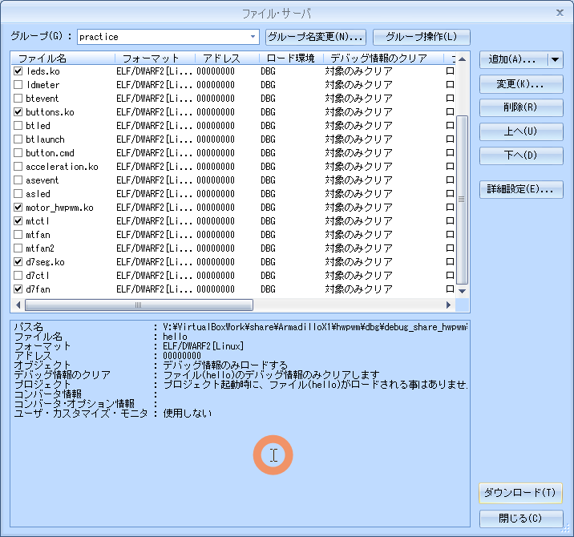

# 06.d7seg

<!-- styleは、拡張機能 Markdown Preview Github Stylingをインストール-->
<!-- c:/Users/sfujimoto/.vscode/extensions/bierner.markdown-preview-github-styles-0.1.4/base.css -->
<!-- 参考URL: https://rui-log.com/vscode-markdown-preview-custom/ -->

[2024/7/18 Table of Contents]()

<!-- ctrl + ,  toc: level 1..3 へ変更-->

<div class="TOC">

<!-- @import "[TOC]" {cmd="toc" depthFrom=1 depthTo=2 orderedList=true} -->

<!-- code_chunk_output -->

1. [06.d7seg](#06d7seg)
    1. [目的](#目的)
    2. [構成データ](#構成データ)
    3. [d7seg制御](#d7seg制御)
    4. [デバイスドライバ](#デバイスドライバ)
    5. [例題 d7ctl](#例題-d7ctl)
    6. [課題1 d7fan](#課題1-d7fan)

<!-- /code_chunk_output -->

</div>

<div style="page-break-before:always"></div>  <!-- PDFで改ページ-->

## 目的

組込みアプリケーション開発 06.d7seg

## 構成データ

### /media/sf_ArmadilloX1/hwpwm/work/R06_2024/Apllication_debug/text/practice ディレクトリ

<details open><summary> ･･･/share/ArmadilloX1/hwpwm/<span style="color: red">work</span>/R06_2024/Application<span style="color: red">_debug</span>/<span style="color: red">text</span>/practice/ の構成</summary>

```bash{.line-numbers}
user@1204PC-Z490M:/mnt/v/VirtualBoxWork/share/ArmadilloX1/hwpwm/work/R06_2024/Application_debug/text/practice$ tree -aF -L 3
./
├── 06.d7seg/
│   ├── d7ctl.c*                <───── 例題 デバイス制御用ソース
│   ├── d7fan.c*                <───── 課題1 デバイス制御用ソース
│   ├── drivers/
│   │   ├── buttons/
│   │   ├── d7seg/
│   │   │   ├── d7seg.c*        <───── ドライバソース
│   │   │   └── Makefile*       <───── ドライバ用Makefile
│   │   ├── leds/
│   │   └── motor/
│   └── Makefile*               <───── デバイス制御用Makefile
```

</details>

## d7seg制御

### デバイス仕様

d7segのハードウェア仕様


デバイスファイル /dev/d7seg に値を書き込むことで表示

## デバイスドライバ

### ソース

#### d7seg.c

<details open><summary> 06.d7seg/drivers/d7seg.c </summary>

```c{.line-numbers}
#include <linux/module.h>
#include <linux/platform_device.h>
#include <linux/fs.h>
#include <linux/io.h>
#include <linux/uaccess.h>
#include <linux/cdev.h>

#include <asm/armadilloX1-ext-cpld.h>

#define	D7SEG_MAJOR					121
#define	D7SEG_MINOR					0
#define D7SEG_NUM					1

#define D7SEG_ENABLE				0x0C
#define D7SEG_DISABLE				0x00

static struct platform_device *pdev;

static dev_t dev;

static struct cdev *chrdev;

/* write用の関数ハンドラ */
static ssize_t d7seg_write(struct file *file, const char __user *buf, size_t count, loff_t *ppos)
{
	int ret;
	unsigned char dat = 0;

	if (count > 1)
		count = 1;

	// ユーザバッファからデータを取り出す
	ret = copy_from_user(&dat, buf, count);
	if (ret)
		return -EFAULT;

	// LED点灯状態レジスタにデータを書き込む
	cpld_write(CPLD_WRITE_7SEG_DATA,dat);

	return count;
}

/* システムコールと関数の登録 */
static const struct file_operations d7seg_fops = {
	.owner	= THIS_MODULE,
	.write	= d7seg_write,
};

/* クラス構造体登録 */
static struct class d7seg_class = {
	.owner	= THIS_MODULE,
	.name	= "d7seg",
};

/* デバイスファイルの作成関数 */
static int d7seg_probe(struct platform_device *pdev)
{
	struct device *device;

	// デバイスファイルを作成する
	device = device_create(&d7seg_class, NULL, MKDEV(D7SEG_MAJOR, D7SEG_MINOR), NULL, "d7seg");
	if (IS_ERR(device)){
		dev_err(&pdev->dev, KERN_ERR "failed to create device.\n");
		return PTR_ERR(device);
	}

	// ７セグメントLEDを有効化する
	cpld_write(CPLD_WRITE_7SEG_CTRL,D7SEG_ENABLE);

	// LED点灯状態レジスタにデータを書き込む
	cpld_write(CPLD_WRITE_7SEG_DATA,0x00);

	return 0;
}

/* デバイスファイルの削除関数 */
static int d7seg_remove(struct platform_device *pdev)
{
	// ７セグメントLEDを無効化する
	cpld_write(CPLD_WRITE_7SEG_CTRL,D7SEG_DISABLE);

	// デバイスファイルを消去する
	device_destroy(&d7seg_class, MKDEV(D7SEG_MAJOR, D7SEG_MINOR));

	return 0;
}

/* プラットフォーム構造体 */
static struct platform_driver d7seg_driver = {
	.probe		= d7seg_probe,
	.remove		= d7seg_remove,
	.driver		= {
		.name   = "armadillo-x1-extension-d7seg",
		.owner	= THIS_MODULE,
	},
};

/* 初期化関数 */
static int __init d7seg_init(void)
{
	int ret = 0;

	// Class登録
	ret = class_register(&d7seg_class);
	if (ret)
		goto err1;

	// プラットフォームドライバ登録
	ret =  platform_driver_register(&d7seg_driver);
	if (ret)
		goto err2;

	// デバイス番号の登録
	dev = MKDEV(D7SEG_MAJOR, D7SEG_MINOR);
	ret = register_chrdev_region(dev, D7SEG_NUM, "d7seg");
	if (ret < 0)
		goto err3;

	chrdev = cdev_alloc();
	if (!chrdev)
		goto err4;
	chrdev->owner = THIS_MODULE;

	/* ファイル操作関数を登録 */
	chrdev->ops = &d7seg_fops;
	ret = cdev_add(chrdev, dev, (unsigned int)D7SEG_NUM);
	if (ret < 0)
		goto err5;

	// デバイスを登録
	pdev = platform_device_register_simple("armadillo-x1-extension-d7seg", -1, NULL, 0);
	if (IS_ERR(pdev)) {
		ret = (int)pdev;
		goto err5;
	}

	return 0;

err5:	cdev_del(chrdev);
err4:	unregister_chrdev_region(dev, (unsigned int)D7SEG_NUM);
err3:	platform_driver_unregister(&d7seg_driver);
err2:	class_unregister(&d7seg_class);
err1:
	return ret;
}

/* 終了関数 */
static void __exit d7seg_exit(void)
{
	platform_device_unregister(pdev);
	cdev_del(chrdev);
	unregister_chrdev_region(dev, D7SEG_NUM);
	platform_driver_unregister(&d7seg_driver);
	class_unregister(&d7seg_class);
}

module_init(d7seg_init);
module_exit(d7seg_exit);

MODULE_DESCRIPTION("Seven-segment display driver");
MODULE_LICENSE("GPL");
```

</details>

#### Makefile

<details open><summary> 06.d7seg/drivers/d7seg/Makefile </summary>

```bash{.line-numbers}
KERNELDIR = /home/atmark/linux-4.9-x1-at27_dbg
ARCH = arm
PREFIX = arm-linux-gnueabihf-
MOD_PATH = /work/linux/nfsroot

EXTRA_CFLAGS += -gdwarf-2 -O0

obj-m := d7seg.o

modules:
	$(MAKE) -C $(KERNELDIR) M=`pwd` ARCH=$(ARCH) CROSS_COMPILE=$(PREFIX) modules

modules_install:
	$(MAKE) -C $(KERNELDIR) M=`pwd` ARCH=$(ARCH) INSTALL_MOD_PATH=$(MOD_PATH) modules_install

myinstall:
	cp -p *.ko /media/sf_ArmadilloX1/hwpwm/dbg/debug_share_hwpwm/R06_2024/04_practice
	cp -p *.c  /media/sf_ArmadilloX1/hwpwm/dbg/debug_share_hwpwm/R06_2024/04_practice

clean:
	$(MAKE) -C $(KERNELDIR) M=`pwd` clean
```

</details>

### 動作確認

#### make clean

<details open><summary> $ make clean </summary>

```bash{.line-numbers}
atmark@atde8:/media/sf_ArmadilloX1/hwpwm/work/R06_2024/Application_debug/text/practice-example/06.d7seg/drivers/d7seg$ make clear
make: *** ターゲット 'clear' を make するルールがありません.  中止.
```

</details>

#### make modules

!!! warning 「make[2]: 警告: ファイル '/media/sf_ArmadilloX1/hwpwm/work/R06_2024/Application_debug/text/practice-example/02.led/drivers/leds/leds.o' の修正時刻 20 は未来の時刻です」と表示された場合は chrony を ATDE8 と ArmadilloX1 にインストールすると解決する

<details open><summary> $ make modules </summary>

```bash{.line-numbers}
atmark@atde8:/media/sf_ArmadilloX1/hwpwm/work/R06_2024/Application_debug/text/practice-example/06.d7seg/drivers/d7seg$ make modules
make -C /home/atmark/linux-4.9-x1-at27_dbg M=`pwd` ARCH=arm CROSS_COMPILE=arm-linux-gnueabihf- modules
make[1]: ディレクトリ '/home/atmark/linux-4.9-x1-at27_dbg' に入ります
  CC [M]  /media/sf_ArmadilloX1/hwpwm/work/R06_2024/Application_debug/text/practice-example/06.d7seg/drivers/d7seg/d7seg.o
  Building modules, stage 2.
  MODPOST 1 modules
make[2]: 警告: ファイル '/media/sf_ArmadilloX1/hwpwm/work/R06_2024/Application_debug/text/practice-example/06.d7seg/drivers/d7seg/d7seg.mod.c' の修正時刻 0.0078 は未来の時刻です
  CC      /media/sf_ArmadilloX1/hwpwm/work/R06_2024/Application_debug/text/practice-example/06.d7seg/drivers/d7seg/d7seg.mod.o
  LD [M]  /media/sf_ArmadilloX1/hwpwm/work/R06_2024/Application_debug/text/practice-example/06.d7seg/drivers/d7seg/d7seg.ko
make[2]: 警告:  時刻のずれを検出. 不完全なビルド結果になるかもしれません.
make[1]: ディレクトリ '/home/atmark/linux-4.9-x1-at27_dbg' から出ます
```

</details>

#### sudo make modules_install

<details open><summary> $ sudo make modules_install </summary>

```bash{.line-numbers}
atmark@atde8:/media/sf_ArmadilloX1/hwpwm/work/R06_2024/Application_debug/text/practice-example/06.d7seg/drivers/d7seg$ sudo make modules_install
[sudo] atmark のパスワード:
make -C /home/atmark/linux-4.9-x1-at27_dbg M=`pwd` ARCH=arm INSTALL_MOD_PATH=/work/linux/nfsroot modules_install
make[1]: ディレクトリ '/home/atmark/linux-4.9-x1-at27_dbg' に入ります
  INSTALL /media/sf_ArmadilloX1/hwpwm/work/R06_2024/Application_debug/text/practice-example/06.d7seg/drivers/d7seg/d7seg.ko
  DEPMOD  4.9.133-at27
depmod: WARNING: could not open modules.order at /work/linux/nfsroot/lib/modules/4.9.133-at27: No such file or directory
depmod: WARNING: could not open modules.builtin at /work/linux/nfsroot/lib/modules/4.9.133-at27: No such file or directory
make[1]: ディレクトリ '/home/atmark/linux-4.9-x1-at27_dbg' から出ます
```

</details>

#### sudo make myinstall

<details open><summary> $ sudo make myinstall </summary>

```bash{.line-numbers}
atmark@atde8:/media/sf_ArmadilloX1/hwpwm/work/R06_2024/Application_debug/text/practice-example/06.d7seg/drivers/d7seg$ sudo make myinstall
cp -p *.ko /media/sf_ArmadilloX1/hwpwm/dbg/debug_share_hwpwm/R06_2024/04_practice
cp -p *.c  /media/sf_ArmadilloX1/hwpwm/dbg/debug_share_hwpwm/R06_2024/04_practice
```

</details>

#### cd

<details open><summary> root@armadillo:/# cd /lib/modules/4.9.133-at27/extra/ </summary>

```bash{.line-numbers}
root@armadillo:/debug/04_practice# cd /lib/modules/4.9.133-at27/extra/
```

</details>

#### insmod

<details open><summary> #insmod d7seg.ko </summary>

```bash{.line-numbers}
root@armadillo:/lib/modules/4.9.133-at27/extra# insmod d7seg.ko
root@armadillo:/lib/modules/4.9.133-at27/extra# lsmod
Module                  Size  Used by
d7seg                   3226  0
motor_hwpwm             4415  0
buttons                 3065  0
leds                    2103  0
```

</details>

### デバイスファイル

###### "/dev/d7seg/"

!!! warning echo -e "\x00" > /dev/d7seg してもバイナリデータじゃないので反応しない

## 例題 d7ctl

- d7ctl の引数には 1桁目の数字（0～9）または2桁分の数字（00～99）
- 引数が1桁（0～9）の場合、LED9は0、LED10は数字を表示
- 引数が2桁（00～99）の場合、LED9は2桁目、LED10は1桁目の数字を表示

### ソース

#### d7ctl.c

<details open><summary> 06.d7seg/d7ctl.c </summary>

```c{.line-numbers}
#include <stdio.h>
#include <stdlib.h>
#include <fcntl.h>
#include <string.h>
#include <sys/types.h>
#include <sys/stat.h>
#include <unistd.h>

// 7セグメントLED制御用ファイル
#define	D7SEG_FILE	"/dev/d7seg"

// 本アプリの説明を、コンソール上に表示し、アプリを終了します。
void usage()
{
	printf("usage: d7ctl d|dd (d:0-9)\n");
	exit(EXIT_FAILURE);
}

int main(int argc, char *argv[])
{
	int i;
	unsigned char buf = 0;
	unsigned char c;
	int fd;
	int main_ret = 0;

	// 引数が1つ指定されていない場合、または、引数に指定した値が2桁より大きい
	// (7セグメントLEDに収まらない)場合は、コンソール上に本アプリの説明を表示
	// し、アプリを終了します。
	if ((argc != 2) || (strlen(argv[1]) > 2)){
		usage();
	}

	// 7セグメントLEDに表示する数字を、バッファに格納します。
	for (i = 0; i < 2; i++){
		// 引数がNULLの場合は、バッファに何も格納しません。
		c = argv[1][i];
		if (!c){
			break;
		}
		// バッファに入っている1桁目の値を2桁目に左シフトします。
		buf <<= 4;
		// 引数に0～9を指定している場合、1桁目のバッファに値を格納します。
		if (c >= '0' && c <= '9'){
			buf |= (c - '0');
		}
		// 引数に0～9以外を指定している場合、コンソール上に本アプリの説明を
		// 表示し、アプリを終了します。
		else {
			usage();
		}
	}

	// 7セグメントLED制御用ファイルをオープンします。
	fd = open(D7SEG_FILE, O_WRONLY);
	// オープンに失敗したら、main関数をエラー終了します。
	if (fd < 0){
		perror("failed to open d7seg");
		main_ret = 1;
		goto D7SEG_ERR;
	}

	// 7セグメントLEDを表示します。
	if (write(fd, &buf, 1) < 0){
	// 書き込みに失敗したら、main関数をエラー終了します。
		perror("failed to write d7seg");
		main_ret = 1;
		goto D7SEG_ERR;
	}

D7SEG_ERR:
	// 7セグメントLED制御用ファイルをクローズします。
	close(fd);

	return main_ret;
}
```

</details>

#### Makefile

<details open><summary> 06.d7seg/Makefile </summary>

```bash{.line-numbers}
CC = arm-linux-gnueabihf-gcc
#TARGET = d7ctl d7fan
TARGET = d7ctl
CFLAGS = -gdwarf-2 -O0

all: $(TARGET)

install :
	cp -p $(TARGET) /work/linux/nfsroot/debug/04_practice
	cp -p $(TARGET) /media/sf_ArmadilloX1/hwpwm/dbg/debug_share_hwpwm/R06_2024/04_practice
	cp -p $(TARGET).c /media/sf_ArmadilloX1/hwpwm/dbg/debug_share_hwpwm/R06_2024/04_practice

clean:
	rm -f $(TARGET)

.PHONY: clean
```

</details>

### 動作確認

#### make clean

<details open><summary> $ make clean </summary>

```bash{.line-numbers}
atmark@atde8:/media/sf_ArmadilloX1/hwpwm/work/R06_2024/Application_debug/text/practice-example/06.d7seg$ make clean
rm -f d7ctl
```

</details>

#### make

<details open><summary> $ make </summary>

```bash{.line-numbers}
atmark@atde8:/media/sf_ArmadilloX1/hwpwm/work/R06_2024/Application_debug/text/practice-example/06.d7seg$ make
arm-linux-gnueabihf-gcc -gdwarf-2 -O0    d7ctl.c   -o d7ctl
```

</details>

#### sudo make install

<details open><summary> $ sudo make install </summary>

```bash{.line-numbers}
atmark@atde8:/media/sf_ArmadilloX1/hwpwm/work/R06_2024/Application_debug/text/practice-example/06.d7seg$ sudo make install
cp -p d7ctl /work/linux/nfsroot/debug/04_practice
cp -p d7ctl /media/sf_ArmadilloX1/hwpwm/dbg/debug_share_hwpwm/R06_2024/04_practice
cp -p d7ctl.c /media/sf_ArmadilloX1/hwpwm/dbg/debug_share_hwpwm/R06_2024/04_practice
```

</details>

#### CSIDEでロード

<details open><summary> メニュー「ファイル」-「ロード」</summary>

  

</details>

#### insmod（既にinsmod 済みなら割愛）

<details open><summary> # insmod d7seg.ko </summary>

```bash{.line-numbers}
root@armadillo:~# cd /lib/modules/4.9.133-at27/extra/
root@armadillo:/lib/modules/4.9.133-at27/extra# insmod d7seg.ko
root@armadillo:/lib/modules/4.9.133-at27/extra# lsmod
Module                  Size  Used by
d7seg                   3226  0
root@armadillo:/lib/modules/4.9.133-at27/extra#
```

</details>

#### 実行結果

<details open><summary> root@armadillo:/debug/04_practice# ./d7ctl </summary>

```bash{.line-numbers}
root@armadillo:/debug/04_practice# ./d7ctl 99
```

</details>

#### 実行している様子

<details open><summary> d7ctl を実行している動画 </summary>

  [https://youtu.be/aR0KXLVeaVU](https://youtu.be/aR0KXLVeaVU)

  <video controls src="assets/20240709_d7ctl.mp4" title="Title" width="1024"></video>

</details>

## 課題1 d7fan

mtfan2 に スイッチオフタイマーを追加

タイマー仕様
- SW4を押下 → タイムアウト時間を10秒にセットしてタイマ起動
- SW5を押下 → タイムアウト時間を20秒にセットしてタイマ起動
- SW6を押下 → タイムアウト時間を30秒にセットしてタイマ起動
- SW7を押下 → タイマ取消

タイマの動作

- タイムアウトしたら扇風機を停止
- モータ停止中はSW4～SW7の操作を無効

7セグメントLEDにタイマの状態を表示

- タイマ非動作時は、7セグメントLEDに0を表示
- タイマ動作中は、7セグメントLEDに残り時間（秒）を表示

### ソース

#### d7fan.c

<details open><summary> 06.d7seg/d7fan.c </summary>

```c{.line-numbers}
#include <stdio.h>
#include <stdlib.h>
#include <fcntl.h>
#include <linux/input.h>
#include <signal.h>
#include <string.h>
#include <errno.h>
#include <sys/types.h>
#include <sys/stat.h>
#include <unistd.h>
#include <sys/time.h>

// ボタン制御用ファイル
#define BUTTON_FILE	"/dev/input/event3"
// LED制御用ファイル
#define LED_FILE	"/sys/class/leds/led_ext/brightness"
// モータ制御用ファイル
#define MOTOR_FILE	"/sys/class/motor/motor0/motor_rotation"
// 7セグメントLED制御用ファイル
#define D7SEG_FILE	"/dev/d7seg"
#define DATALEN		16
#define	MOTOR_ON	1
#define	MOTOR_OFF	0
#define	TIMER_INTERVAL	1
#define	TIMER_ON	1
#define	TIMER_OFF	0

int fd_mt, fd_led, fd_d7seg;
int motor_state;
int timer_state;
struct timeval timer_expire;

void change_motor(int rotation)
{


	// モータの状態変化を書き込みます。


}

void change_led(int num)
{


	// LEDの状態変化を書き込みます。


}

void change_d7seg(int num)
{


	// 7セグメントLEDの状態変化を書き込みます。


}

void check_timer(int signum)
{


		// 1秒後にシグナルが送信されるように設定します。


		// モータの回転を停止させます。

		// LEDを消灯させます。


		// 7セグメントLEDの表示を0とします。


}

void start_timer(int tout)
{


	// 7セグメントLEDの表示を更新します。

	// 1秒後にシグナルが送信されるように設定します。

}

void stop_timer(void)
{


	// 7セグメントLEDの表示を0とします。

	// アラームを終了します。

}

int main(void)
{


	// モータ制御用ファイルをオープンします。


	// LED制御用ファイルをオープンします。


	// ボタン制御用ファイルをオープンします。


	// 7セグメントLED制御用ファイルをオープンします。


	// SIGALRM受信時のシグナルハンドラを登録します。


	// モータ制御用ファイルをクローズします。

	// LED制御用ファイルをクローズします。

	// ボタン制御用ファイルをクローズします。

	// 7セグメントLED制御用ファイルをクローズします。

	return 0;
}
```

</details>

#### Makefile

<details open><summary> 06.d7seg/Makefile </summary>

```bash{.line-numbers}
CC = arm-linux-gnueabihf-gcc
#TARGET = d7ctl d7fan
TARGET = d7fan
CFLAGS = -gdwarf-2 -O0

all: $(TARGET)

install :
	cp -p $(TARGET) /work/linux/nfsroot/debug/04_practice
	cp -p $(TARGET) /media/sf_ArmadilloX1/hwpwm/dbg/debug_share_hwpwm/R06_2024/04_practice
	cp -p $(TARGET).c /media/sf_ArmadilloX1/hwpwm/dbg/debug_share_hwpwm/R06_2024/04_practice

clean:
	rm -f $(TARGET)

.PHONY: clean
```

</details>

### 動作確認

#### make clean

<details open><summary> $ make clean </summary>

```bash{.line-numbers}
atmark@atde8:/media/sf_ArmadilloX1/hwpwm/work/R06_2024/Application_debug/text/practice-example/06.d7seg$ make clean
rm -f d7fan
```

</details>

#### make

<details open><summary> $ make </summary>

```bash{.line-numbers}
atmark@atde8:/media/sf_ArmadilloX1/hwpwm/work/R06_2024/Application_debug/text/practice-example/06.d7seg$ make
arm-linux-gnueabihf-gcc -gdwarf-2 -O0    d7fan.c   -o d7fan
```

</details>

#### sudo make install

<details open><summary> $ sudo make install </summary>

```bash{.line-numbers}
atmark@atde8:/media/sf_ArmadilloX1/hwpwm/work/R06_2024/Application_debug/text/practice-example/06.d7seg$ sudo make install
[sudo] atmark のパスワード:
cp -p d7fan /work/linux/nfsroot/debug/04_practice
cp -p d7fan /media/sf_ArmadilloX1/hwpwm/dbg/debug_share_hwpwm/R06_2024/04_practice
cp -p d7fan.c /media/sf_ArmadilloX1/hwpwm/dbg/debug_share_hwpwm/R06_2024/04_practice
```

</details>

#### CSIDEでロード

<details open><summary> メニュー「ファイル」-「ロード」</summary>

  

</details>

#### insmod（既にinsmod 済みなら割愛）

<details open><summary>  # insmod leds.ko, # insmod buttons.ko, # insmod motor_hwpwm.ko, # insmod d7seg.ko </summary>

```bash{.line-numbers}
root@armadillo:/lib/modules/4.9.133-at27/extra# insmod d7seg.ko
root@armadillo:/lib/modules/4.9.133-at27/extra# insmod leds.ko
root@armadillo:/lib/modules/4.9.133-at27/extra# insmod buttons.ko
root@armadillo:/lib/modules/4.9.133-at27/extra# insmod motor_hwpwm.ko
root@armadillo:/lib/modules/4.9.133-at27/extra# lsmod
Module                  Size  Used by
motor_hwpwm             4415  0
buttons                 3065  0
leds                    2103  0
d7seg                   3226  0
```

</details>

#### 実行

<details open><summary> root@armadillo:/debug/04_practice# ./d7fan </summary>

```bash{.line-numbers}
root@armadillo:/debug/04_practice# ./d7fan
```

</details>

#### 実行している様子

<details open><summary>  </summary>

  [https://youtu.be/7wtLI7YoFok](https://youtu.be/7wtLI7YoFok)

  <video controls src="assets/20240709_d7fan.mp4" title="Title" width="1024"></video>

</details>
