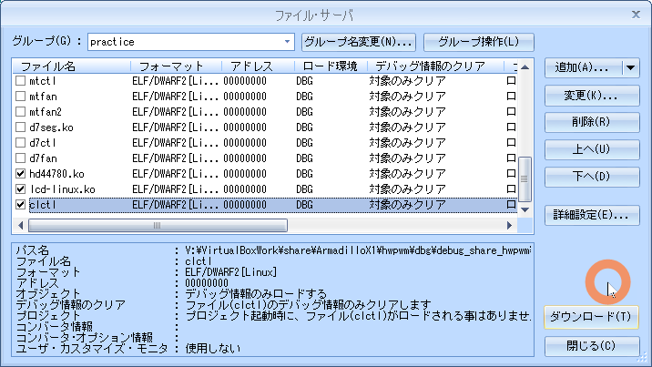
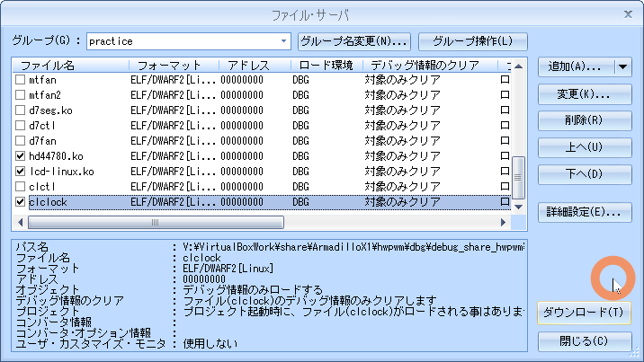

# 07.charlcd

<!-- styleは、拡張機能 Markdown Preview Github Stylingをインストール-->
<!-- c:/Users/sfujimoto/.vscode/extensions/bierner.markdown-preview-github-styles-0.1.4/base.css -->
<!-- 参考URL: https://rui-log.com/vscode-markdown-preview-custom/ -->

[2024/7/18 Table of Contents]()

<!-- ctrl + ,  toc: level 1..3 へ変更-->

<div class="TOC">

<!-- @import "[TOC]" {cmd="toc" depthFrom=1 depthTo=2 orderedList=true} -->

<!-- code_chunk_output -->

1. [07.charlcd](#07charlcd)
    1. [目的](#目的)
    2. [構成データ](#構成データ)
    3. [キャラクタLCD制御](#キャラクタlcd制御)
    4. [デバイスドライバ](#デバイスドライバ)
    5. [例題 clctl](#例題-clctl)
    6. [課題1 clclock](#課題1-clclock)

<!-- /code_chunk_output -->

</div>

<div style="page-break-before:always"></div>  <!-- PDFで改ページ-->

## 目的

組込みアプリケーション開発 07.charlcd

## 構成データ

### /media/sf_ArmadilloX1/hwpwm/work/R06_2024/Apllication_debug/text/practice ディレクトリ

<details open><summary> ･･･/share/ArmadilloX1/hwpwm/<span style="color: red">work</span>/R06_2024/Application<span style="color: red">_debug</span>/<span style="color: red">text</span>/practice/ の構成</summary>

```bash{.line-numbers}
user@1204PC-Z490M:/mnt/v/VirtualBoxWork/share/ArmadilloX1/hwpwm/work/R06_2024/Application_debug/text/practice$ tree -aF -L 3
./
├── 07.charlcd/
│   ├── clclock.c*              <───── 課題1 デバイス制御用ソース
│   ├── clctl.c*                <───── 例題 デバイス制御用ソース
│   ├── drivers/
│   │   └── clcd/
│   │       ├── cgram/
│   │       │   ├── default.h*  <─────
│   │       │   └── swedish.h*  <─────
│   │       ├── charmap.h*      <─────
│   │       ├── commands.h*     <─────
│   │       ├── compat.h*       <─────
│   │       ├── config.h*       <─────
│   │       ├── hardware.h*     <─────
│   │       ├── hd44780.c*      <───── モジュールソース
│   │       ├── hd44780.h*      <───── モジュールヘッダ
│   │       ├── Kconfig*        <─────
│   │       ├── lcd-linux.c*    <───── ドライバソース
│   │       ├── lcd-linux.h*    <───── ドライバヘッダ
│   │       ├── Makefile*       <───── ドライバ用Makefile
│   │       └── Makefile-2.6*
│   └── Makefile*               <───── デバイス制御用Makefile
```

</details>

## キャラクタLCD制御

### デバイス仕様

キャラクタLCDのハードウェア仕様

- デバイスファイルに書き込んだ文字列がキャラクタLCDパネルに表示
- 画面制御は制御文字とエスケープシーケンスで行う


制御コードの一部を示します。

|制御コード| 意味    |
|---------|---------|
|\f       | 画面消去 |
|\r       | 復帰    |
|\n       | 改行    |
|ESC aN   | カーソル制御（0:非表示 1:表示）|
|ESC bN   | ブリンクカーソル制御（0:非表示 1:表示）|

## デバイスドライバ

!!! warning insmod は lcd-linux.ko -> hd44780.ko の順番で

### ソース

#### lcd-linux.c

<details open><summary> 07.charlcd/drivers/clcd/lcd-linux.c </summary>

[lcd-linux.c](./assets/lcd-linux.c)

</details>

#### hd44780.c

<details open><summary> 07.charlcd/drivers/clcd/hd44780.c </summary>

[hd47780.c](./assets/hd44780.c)

</details>

#### Makefile

<details open><summary> 07.charlcd/drivers/clcd/Makefile </summary>

```bash{.line-numbers}
KERNELDIR = /home/atmark/linux-4.9-x1-at27_dbg
ARCH = arm
PREFIX = arm-linux-gnueabihf-
MOD_PATH = /work/linux/nfsroot

EXTRA_CFLAGS += -gdwarf-2 -O0

obj-m := lcd-linux.o hd44780.o

modules:
	$(MAKE) -C $(KERNELDIR) M=`pwd` ARCH=$(ARCH) CROSS_COMPILE=$(PREFIX) modules

modules_install:
	$(MAKE) -C $(KERNELDIR) M=`pwd` ARCH=$(ARCH) INSTALL_MOD_PATH=$(MOD_PATH) modules_install

myinstall:
	cp -p *.ko /media/sf_ArmadilloX1/hwpwm/dbg/debug_share_hwpwm/R06_2024/04_practice
	cp -p *.c  /media/sf_ArmadilloX1/hwpwm/dbg/debug_share_hwpwm/R06_2024/04_practice

clean:
	$(MAKE) -C $(KERNELDIR) M=`pwd` clean
```

</details>

### 動作確認

#### make clean

<details open><summary> $ make clean </summary>

```bash{.line-numbers}
atmark@atde8:/media/sf_ArmadilloX1/hwpwm/work/R06_2024/Application_debug/text/practice-example/07.charlcd/drivers/clcd$ make clean
make -C /home/atmark/linux-4.9-x1-at27_dbg M=`pwd` clean
make[1]: ディレクトリ '/home/atmark/linux-4.9-x1-at27_dbg' に入ります
make[1]: ディレクトリ '/home/atmark/linux-4.9-x1-at27_dbg' から出ます
```

</details>

#### make modules

!!! warning 「make[2]: 警告: ファイル '/media/sf_ArmadilloX1/hwpwm/work/R06_2024/Application_debug/text/practice-example/02.led/drivers/leds/leds.o' の修正時刻 20 は未来の時刻です」と表示された場合は chrony を ATDE8 と ArmadilloX1 にインストールすると解決する

<details open><summary> $ make modules </summary>

```bash{.line-numbers}
atmark@atde8:/media/sf_ArmadilloX1/hwpwm/work/R06_2024/Application_debug/text/practice-example/07.charlcd/drivers/clcd$ make modules
make -C /home/atmark/linux-4.9-x1-at27_dbg M=`pwd` ARCH=arm CROSS_COMPILE=arm-linux-gnueabihf- modules
make[1]: ディレクトリ '/home/atmark/linux-4.9-x1-at27_dbg' に入ります
  CC [M]  /media/sf_ArmadilloX1/hwpwm/work/R06_2024/Application_debug/text/practice-example/07.charlcd/drivers/clcd/lcd-linux.o
  CC [M]  /media/sf_ArmadilloX1/hwpwm/work/R06_2024/Application_debug/text/practice-example/07.charlcd/drivers/clcd/hd44780.o
/media/sf_ArmadilloX1/hwpwm/work/R06_2024/Application_debug/text/practice-example/07.charlcd/drivers/clcd/hd44780.c:1050:12: warning: ‘hd44780_handle_custom_ioctl’ defined but not used [-Wunused-function]
 static int hd44780_handle_custom_ioctl(unsigned int num, unsigned long arg, unsigned int user_space)
            ^~~~~~~~~~~~~~~~~~~~~~~~~~~
/media/sf_ArmadilloX1/hwpwm/work/R06_2024/Application_debug/text/practice-example/07.charlcd/drivers/clcd/hd44780.c:697:13: warning: ‘hd44780_read_cgram_char’ defined but not used [-Wunused-function]
 static void hd44780_read_cgram_char(unsigned char index, unsigned char *pixels)
             ^~~~~~~~~~~~~~~~~~~~~~~
/media/sf_ArmadilloX1/hwpwm/work/R06_2024/Application_debug/text/practice-example/07.charlcd/drivers/clcd/hd44780.c:686:13: warning: ‘hd44780_read_char’ defined but not used [-Wunused-function]
 static void hd44780_read_char(unsigned int offset, unsigned short *data)
             ^~~~~~~~~~~~~~~~~
  Building modules, stage 2.
  MODPOST 2 modules
make[2]: 警告: ファイル '/media/sf_ArmadilloX1/hwpwm/work/R06_2024/Application_debug/text/practice-example/07.charlcd/drivers/clcd/hd44780.mod.c' の修正時刻 0.01 は未来の時刻です
  CC      /media/sf_ArmadilloX1/hwpwm/work/R06_2024/Application_debug/text/practice-example/07.charlcd/drivers/clcd/hd44780.mod.o
  LD [M]  /media/sf_ArmadilloX1/hwpwm/work/R06_2024/Application_debug/text/practice-example/07.charlcd/drivers/clcd/hd44780.ko
  CC      /media/sf_ArmadilloX1/hwpwm/work/R06_2024/Application_debug/text/practice-example/07.charlcd/drivers/clcd/lcd-linux.mod.o
  LD [M]  /media/sf_ArmadilloX1/hwpwm/work/R06_2024/Application_debug/text/practice-example/07.charlcd/drivers/clcd/lcd-linux.ko
make[2]: 警告:  時刻のずれを検出. 不完全なビルド結果になるかもしれません.
make[1]: ディレクトリ '/home/atmark/linux-4.9-x1-at27_dbg' から出ます
```

</details>

#### sudo make modules_install

<details open><summary> $ sudo make modules_install </summary>

```bash{.line-numbers}
atmark@atde8:/media/sf_ArmadilloX1/hwpwm/work/R06_2024/Application_debug/text/practice-example/07.charlcd/drivers/clcd$ sudo make modules_install
[sudo] atmark のパスワード:
make -C /home/atmark/linux-4.9-x1-at27_dbg M=`pwd` ARCH=arm INSTALL_MOD_PATH=/work/linux/nfsroot modules_install
make[1]: ディレクトリ '/home/atmark/linux-4.9-x1-at27_dbg' に入ります
  INSTALL /media/sf_ArmadilloX1/hwpwm/work/R06_2024/Application_debug/text/practice-example/07.charlcd/drivers/clcd/hd44780.ko
  INSTALL /media/sf_ArmadilloX1/hwpwm/work/R06_2024/Application_debug/text/practice-example/07.charlcd/drivers/clcd/lcd-linux.ko
  DEPMOD  4.9.133-at27
depmod: WARNING: could not open modules.order at /work/linux/nfsroot/lib/modules/4.9.133-at27: No such file or directory
depmod: WARNING: could not open modules.builtin at /work/linux/nfsroot/lib/modules/4.9.133-at27: No such file or directory
make[1]: ディレクトリ '/home/atmark/linux-4.9-x1-at27_dbg' から出ます
```

</details>

#### sudo make myinstall

<details open><summary> $ sudo make myinstall </summary>

```bash{.line-numbers}
atmark@atde8:/media/sf_ArmadilloX1/hwpwm/work/R06_2024/Application_debug/text/practice-example/07.charlcd/drivers/clcd$ sudo make myinstall
cp -p *.ko /media/sf_ArmadilloX1/hwpwm/dbg/debug_share_hwpwm/R06_2024/04_practice
cp -p *.c  /media/sf_ArmadilloX1/hwpwm/dbg/debug_share_hwpwm/R06_2024/04_practice
```

</details>

#### cd

<details open><summary> root@armadillo:/# cd /lib/modules/4.9.133-at27/extra/ </summary>

```bash{.line-numbers}
root@armadillo:~# cd /lib/modules/4.9.133-at27/extra/
```

</details>

#### insmod

!!! warning insmod は lcd-linux.ko -> hd44780.ko の順番

<details open><summary> #insmod lcd-linux.ko -> #insmod hd44780.ko </summary>

```bash{.line-numbers}
root@armadillo:/lib/modules/4.9.133-at27/extra# insmod lcd-linux.ko
root@armadillo:/lib/modules/4.9.133-at27/extra# insmod hd44780.ko
root@armadillo:/lib/modules/4.9.133-at27/extra# lsmod
Module                  Size  Used by
hd44780                16250  0
lcd_linux              51414  2 hd44780
d7seg                   3226  0
motor_hwpwm             4415  0
buttons                 3065  0
leds                    2103  0
```

</details>

### デバイスファイル

###### "/dev/hd44780"

<details open><summary> hd44780 デバイスファイルによるキャラクタLCD表示 </summary>

```bash{.line-numbers}
root@armadillo:/lib/modules/4.9.133-at27/extra# echo -ne 'Hello\r\nWorld!' > /dev/hd44780
root@armadillo:/lib/modules/4.9.133-at27/extra# echo -ne '\f' > /dev/hd44780
root@armadillo:/lib/modules/4.9.133-at27/extra# echo -ne '\x1bb1' > /dev/hd44780
root@armadillo:/lib/modules/4.9.133-at27/extra# echo -ne '\x1bb0' > /dev/hd44780
root@armadillo:/lib/modules/4.9.133-at27/extra# echo -ne '\x1ba1' > /dev/hd44780
root@armadillo:/lib/modules/4.9.133-at27/extra# echo -ne '\x1bb1' > /dev/hd44780
root@armadillo:/lib/modules/4.9.133-at27/extra# echo -ne '\x1ba0' > /dev/hd44780
root@armadillo:/lib/modules/4.9.133-at27/extra# echo -ne '\x1bb0' > /dev/hd44780
root@armadillo:/lib/modules/4.9.133-at27/extra#

```

</details>

### 実行している様子

<details open><summary> hd44780 デバイスファイルによるキャラクタLCD表示している動画 </summary>

  [https://youtu.be/iw0JfRs6LUE](https://youtu.be/iw0JfRs6LUE)

  <video controls src="assets/20240709_clcd_devicefile.mp4" title="Title" width="1024"></video>

</details>

## 例題 clctl

- 引数がない場合、キャラクタLCDの内容を消去
- 引数を1つ以上指定すると、キャラクタLCDの内容を消去した後、指定された文字列を表示
- 制御コードは、\r と\n のみをサポート

### ソース

#### clctl.c

<details open><summary> 07.charlcd/clctl.c </summary>

```c{.line-numbers}
#include <stdio.h>
#include <fcntl.h>
#include <sys/types.h>
#include <sys/stat.h>
#include <unistd.h>

// キャラクタLCD制御用ファイル
#define CLCD_FILE	"/dev/hd44780"
#define DATALEN		80

int main(int argc, char *argv[])
{
	int fd;
	int ret, n;
	int i, j;
	char data[DATALEN];
	int main_ret = 0;

	// キャラクタLCD制御用ファイルをオープンします。
	fd = open(CLCD_FILE, O_RDWR);
	// オープンに失敗したら、main関数をエラー終了します。
	if (fd < 0){
		perror("open");
		return 1;
	}

	// 画面消去コードを文字列に連結します。
	n = sprintf(data, "\f");
	// 引数が1つ以上指定されていたら、キャラクタLCDに表示するための文字列を
	// 連結します。
	if (argc > 1){
		for (i = 1; i < argc; i++){
			for (j = 0; argv[i][j]; j++){
				// '\'の入力があった場合は、制御コードかどうか判断します。
				if (argv[i][j] == '\\'){
					switch (argv[i][j + 1]){
					// '\'の次の文字が'r'の場合は、復帰コードを連結します。
					case 'r':
						data[n++] = '\r';
						j++;
						break;
					// '\'の次の文字が'n'の場合は、改行コードを連結します。
					case 'n':
						data[n++] = '\n';
						j++;
						break;
					// '\'の次の文字が'r'でも'n'でもない場合は、'\'を表示
					// するように連結します。
					default:
						data[n++] = '\\';
					}
				} else {
					// 1文字連結します。
					data[n++] = argv[i][j];
				}
			}
			data[n++] = ' ';
		}
		n -= 1;
	}

	// 連結した文字列をキャラクタLCDに表示します。
	ret = write(fd, data, n);
	// ライトに失敗したら、main関数をエラー終了します。
	if (ret < 0){
		perror("write");
		main_ret = 1;
	}

	// キャラクタLCD制御用ファイルをクローズします。
	close(fd);
	return main_ret;
}
```

</details>

#### Makefile

<details open><summary> 07.charlcd/Makefile </summary>

```bash{.line-numbers}
CC = arm-linux-gnueabihf-gcc
#TARGET = clctl clclock
TARGET = clctl
CFLAGS = -gdwarf-2 -O0

all: $(TARGET)

install :
	cp -p $(TARGET) /work/linux/nfsroot/debug/04_practice
	cp -p $(TARGET) /media/sf_ArmadilloX1/hwpwm/dbg/debug_share_hwpwm/R06_2024/04_practice
	cp -p $(TARGET).c /media/sf_ArmadilloX1/hwpwm/dbg/debug_share_hwpwm/R06_2024/04_practice

clean:
	rm -f $(TARGET)

.PHONY: clean
```

</details>

### 動作確認

#### make clean

<details open><summary> $ make clean </summary>

```bash{.line-numbers}
atmark@atde8:/media/sf_ArmadilloX1/hwpwm/work/R06_2024/Application_debug/text/practice-example/07.charlcd$ make clean
rm -f clctl
```

</details>

#### make

<details open><summary> $ make </summary>

```bash{.line-numbers}
atmark@atde8:/media/sf_ArmadilloX1/hwpwm/work/R06_2024/Application_debug/text/practice-example/07.charlcd$ make
arm-linux-gnueabihf-gcc -gdwarf-2 -O0    clctl.c   -o clctl
```

</details>

#### sudo make install

<details open><summary> $ sudo make install </summary>

```bash{.line-numbers}
atmark@atde8:/media/sf_ArmadilloX1/hwpwm/work/R06_2024/Application_debug/text/practice-example/07.charlcd$ sudo make install
[sudo] atmark のパスワード:
cp -p clctl /work/linux/nfsroot/debug/04_practice
cp -p clctl /media/sf_ArmadilloX1/hwpwm/dbg/debug_share_hwpwm/R06_2024/04_practice
cp -p clctl.c /media/sf_ArmadilloX1/hwpwm/dbg/debug_share_hwpwm/R06_2024/04_practice
```

</details>

#### CSIDEでロード

<details open><summary> メニュー「ファイル」-「ロード」</summary>

  

</details>

#### insmod（既にinsmod 済みなら割愛）

<details open><summary> #insmod lcd-linux.ko -> #insmod hd44780.ko </summary>

```bash{.line-numbers}
root@armadillo:/lib/modules/4.9.133-at27/extra# insmod lcd-linux.ko
root@armadillo:/lib/modules/4.9.133-at27/extra# insmod hd44780.ko
root@armadillo:/lib/modules/4.9.133-at27/extra# lsmod
Module                  Size  Used by
hd44780                16250  0
lcd_linux              51414  2 hd44780
d7seg                   3226  0
motor_hwpwm             4415  0
buttons                 3065  0
leds                    2103  0
```

</details>

#### 実行結果

<details open><summary> root@armadillo:/debug/04_practice# ./clctl </summary>

```bash{.line-numbers}
root@armadillo:/debug/04_practice# ./clctl 12345678\\r\\nabcdefg
```

</details>

#### 実行している様子

<details open><summary> clctl を実行している動画 </summary>

  [https://youtu.be/zg64i9R1as8](https://youtu.be/zg64i9R1as8)

  <video controls src="assets/20240709_clctl.mp4" title="Title" width="1024"></video>

</details>

## 課題1 clclock


### ソース

#### clclock.c

<details open><summary> 07.charlcd/clclock.c </summary>

```c{.line-numbers}
#include <stdio.h>
#include <fcntl.h>
#include <time.h>
#include <sys/time.h>
#include <sys/types.h>
#include <sys/stat.h>
#include <unistd.h>

// キャラクタLCD制御用ファイル
#define	CLCD_FILE	"/dev/hd44780"

int main(void)
{


	// キャラクタLCD制御用ファイルをオープンします。


		// 1秒間待ちます。
		sleep(1);


CLCD_ERR:
	// キャラクタLCD制御用ファイルをクローズします。

	return main_ret;
}
```

</details>

#### Makefile

<details open><summary> 07.charlcd/Makefile </summary>

```bash{.line-numbers}
CC = arm-linux-gnueabihf-gcc
#TARGET = clctl clclock
TARGET = clclock
CFLAGS = -gdwarf-2 -O0

all: $(TARGET)

install :
	cp -p $(TARGET) /work/linux/nfsroot/debug/04_practice
	cp -p $(TARGET) /media/sf_ArmadilloX1/hwpwm/dbg/debug_share_hwpwm/R06_2024/04_practice
	cp -p $(TARGET).c /media/sf_ArmadilloX1/hwpwm/dbg/debug_share_hwpwm/R06_2024/04_practice

clean:
	rm -f $(TARGET)

.PHONY: clean
```

</details>

### 動作確認

#### make clean

<details open><summary> $ make clean </summary>

```bash{.line-numbers}
atmark@atde8:/media/sf_ArmadilloX1/hwpwm/work/R06_2024/Application_debug/text/practice-example/07.charlcd$ make clean
rm -f clclock
```

</details>

#### make

<details open><summary> $ make </summary>

```bash{.line-numbers}
atmark@atde8:/media/sf_ArmadilloX1/hwpwm/work/R06_2024/Application_debug/text/practice-example/07.charlcd$ make
arm-linux-gnueabihf-gcc -gdwarf-2 -O0    clclock.c   -o clclock
```

</details>

#### sudo make install

<details open><summary> $ sudo make install </summary>

```bash{.line-numbers}
atmark@atde8:/media/sf_ArmadilloX1/hwpwm/work/R06_2024/Application_debug/text/practice-example/07.charlcd$ sudo make install
cp -p clclock /work/linux/nfsroot/debug/04_practice
cp -p clclock /media/sf_ArmadilloX1/hwpwm/dbg/debug_share_hwpwm/R06_2024/04_practice
cp -p clclock.c /media/sf_ArmadilloX1/hwpwm/dbg/debug_share_hwpwm/R06_2024/04_practice
```

</details>

#### CSIDEでロード

<details open><summary> メニュー「ファイル」-「ロード」</summary>

  

</details>

#### insmod（既にinsmod 済みなら割愛）

<details open><summary>  # insmod lcd-linux.ko </summary>

```bash{.line-numbers}
root@armadillo:/lib/modules/4.9.133-at27/extra# insmod lcd-linux.ko
root@armadillo:/lib/modules/4.9.133-at27/extra# insmod hd44780.ko
```

</details>

#### 実行

<details open><summary> root@armadillo:/debug/04_practice# ./clclock </summary>

```bash{.line-numbers}
root@armadillo:/debug/04_practice# ./clclock
```

</details>

#### 実行している様子

<details open><summary> clclock を実行 </summary>

  [https://youtu.be/ztpdkQt-bHo](https://youtu.be/ztpdkQt-bHo)

  <video controls src="assets/20240709_clclock.mp4" title="Title" width="1024"></video>

</details>

### ヒント

gettimeofday, localtime
