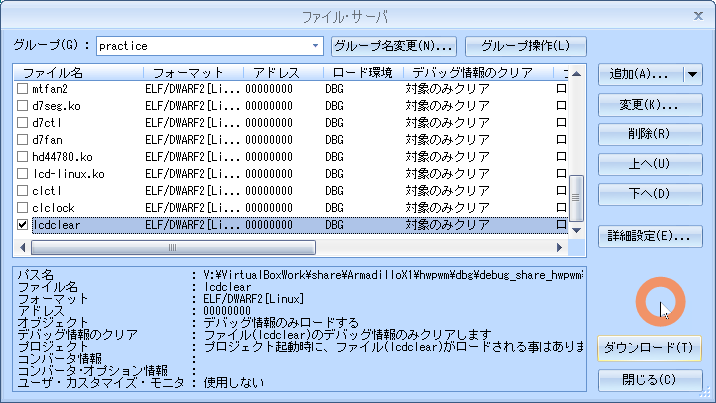
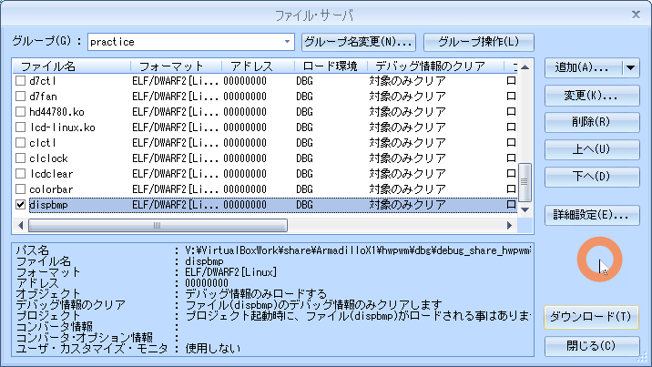

# 08a.lcd

<!-- styleは、拡張機能 Markdown Preview Github Stylingをインストール-->
<!-- c:/Users/sfujimoto/.vscode/extensions/bierner.markdown-preview-github-styles-0.1.4/base.css -->
<!-- 参考URL: https://rui-log.com/vscode-markdown-preview-custom/ -->

[2024/7/18 Table of Contents]()

<!-- ctrl + ,  toc: level 1..3 へ変更-->

<div class="TOC">

<!-- @import "[TOC]" {cmd="toc" depthFrom=1 depthTo=2 orderedList=true} -->

<!-- code_chunk_output -->

1. [08a.lcd](#08alcd)
    1. [目的](#目的)
    2. [構成データ](#構成データ)
    3. [LCD制御](#lcd制御)
    4. [例題 lcdclear](#例題-lcdclear)
    5. [課題1 colorbar](#課題1-colorbar)
    6. [課題2 dispbmp](#課題2-dispbmp)

<!-- /code_chunk_output -->

</div>

<div style="page-break-before:always"></div>  <!-- PDFで改ページ-->

## 目的

組込みアプリケーション開発 08a.lcd

## 構成データ

### /media/sf_ArmadilloX1/hwpwm/work/R06_2024/Apllication_debug/text/practice ディレクトリ

<details open><summary> ･･･/share/ArmadilloX1/hwpwm/<span style="color: red">work</span>/R06_2024/Application<span style="color: red">_debug</span>/<span style="color: red">text</span>/practice/ の構成</summary>

```bash{.line-numbers}
user@1204PC-Z490M:/mnt/v/VirtualBoxWork/share/ArmadilloX1/hwpwm/work/R06_2024/Application_debug/text/practice$ tree -aF -L 3
./
├── 08.lcd/
│   ├── bitmap/
│   │   ├── 1-sea.bmp*          <───── 課題2用ビットマップファイル
│   │   ├── 2-park.bmp*         <───── 課題2用ビットマップファイル
│   │   ├── 3-church.bmp*       <───── 課題2用ビットマップファイル
│   │   └── 4-factory.bmp*      <───── 課題2用ビットマップファイル
│   ├── colorbar.c*             <───── 課題1 デバイス制御用ソース
│   ├── dispbmp.c*              <───── 課題2 デバイス制御用ソース
│   ├── lcdclear.c*             <───── 例題 デバイス制御用ソース
│   ├── Makefile*               <───── デバイス制御用Makefile
│   └── primcol.rgb*            <───── 24ビット非圧縮ビットマップ画像ファイル
```

</details>

## LCD制御

### デバイス仕様

LCDのハードウェア仕様

- 横800 X 縦480 pixel
- 1pixel 24bit RGB88形式


- フレームバッファデバイスはファイルではなくメモリ
- システムには画像データを格納するためのフレームバッファと呼ばれるメモリ領域がある
- LCD上の各pixelはフレームバッファの中にカラーデータが格納
- カラーデータをRGB88形式でリトルエンディアンの形でフレームバッファに書き込むと LCD 上の対応するpixel を点灯
- プログラムの中でフレームバッファのアドレスを取得するには mmap システムコール

### デバイスファイル

###### "/dev/fb0/"

primcol.rgb を ArmadilloX1へコピー

<details open><summary> sudo cp primcol.rgb /work/linux/nfsroot/debug/04_practice/ </summary>

```bash{.line-numbers}
atmark@atde8:/media/sf_ArmadilloX1/hwpwm/work/R06_2024/Application_debug/text/practice-example/08a.lcd$ sudo cp primcol.rgb /work/linux/nfsroot/debug/04_practice/
```

</details>

<details open><summary> フレームバッファによる LCD 描画 </summary>

```bash{.line-numbers}
root@armadillo:/debug/04_practice# cat primcol.rgb > /dev/fb0
```

</details>

### 実行している様子

<details open><summary> フレームバッファによるLCDへの描画している動画 </summary>

  [https://youtu.be/cgvoJdAWhgY](https://youtu.be/cgvoJdAWhgY)

  <video controls src="assets/20240709_framebuffer_primcol.rgb.mp4" title="Title" width="1024"></video>

</details>

## 例題 lcdclear

### ソース

#### lcdclear.c

<details open><summary> 08a.lcd/lcdclear.c </summary>

```c{.line-numbers}
#include <stdio.h>
#include <fcntl.h>
#include <sys/mman.h>
#include <string.h>
#include <unistd.h>

#define	SCREENWIDTH			800
#define	SCREENHEIGHT		480
#define	BYTES_PER_PIXCEL	4
#define	SCREENSIZE			(SCREENWIDTH * SCREENHEIGHT * BYTES_PER_PIXCEL)

int main(void)
{
	int fd;
	unsigned int *pfb;

	// フレームバッファをオープンします。
	// オープンに失敗した場合はエラーで終了します。
	if ((fd = open("/dev/fb0", O_RDWR)) < 0) {
		perror("open(fb)");
		return 1;
	}

	/* mmapによりバッファの先頭アドレスを取得します。 */
	pfb = mmap(0, SCREENSIZE, PROT_READ|PROT_WRITE, MAP_SHARED, fd, 0);
	// 取得に失敗した場合はエラーで終了します。
	if (pfb == MAP_FAILED){
		perror("mmap");
		return 1;
	}

	// LCDの画面表示を全て消去するために、
	// 取得したアドレスから確保領域を全て0で初期化します。
	memset(pfb, 0, SCREENSIZE);

	// フレームバッファのために確保した領域を開放します。
	munmap(pfb, SCREENSIZE);
	// フレームバッファをクローズします。
	close(fd);

	return 0;
}
```

</details>

#### Makefile

!!! warning $(CFLAGS) と cp -p ./*.bmp を追加している

<details open><summary> 08a.lcd/Makefile </summary>

```bash{.line-numbers}
CC = arm-linux-gnueabihf-gcc
#TARGET = lcdclear colorbar dispbmp
TARGET = lcdclear
CFLAGS = -gdwarf-2 -O0

all: $(TARGET)

lcdclear: lcdclear.c
	$(CC) $(CFLAGS) -o $@ $<

colorbar: colorbar.c
	$(CC) $(CFLAGS) -o $@ $<

dispbmp: dispbmp.c
	$(CC) $(CFLAGS) -o $@ $<

install :
	cp -p $(TARGET)    /work/linux/nfsroot/debug/04_practice
	cp -p $(TARGET)    /media/sf_ArmadilloX1/hwpwm/dbg/debug_share_hwpwm/R06_2024/04_practice
	cp -p $(TARGET).c  /media/sf_ArmadilloX1/hwpwm/dbg/debug_share_hwpwm/R06_2024/04_practice
	cp -p bitmap/*.bmp /work/linux/nfsroot/debug/04_practice
	cp -p bitmap/*.bmp /media/sf_ArmadilloX1/hwpwm/dbg/debug_share_hwpwm/R06_2024/04_practice

clean:
	rm -f $(TARGET)

.PHONY: clean
```

</details>

### 動作確認

#### make clean

<details open><summary> $ make clean </summary>

```bash{.line-numbers}
atmark@atde8:/media/sf_ArmadilloX1/hwpwm/work/R06_2024/Application_debug/text/practice-example/08a.lcd$ make clean
rm -f lcdclear
```

</details>

#### make

<details open><summary> $ make </summary>

```bash{.line-numbers}
atmark@atde8:/media/sf_ArmadilloX1/hwpwm/work/R06_2024/Application_debug/text/practice-example/08a.lcd$ make lcdclear
arm-linux-gnueabihf-gcc -gdwarf-2 -O0 -o lcdclear lcdclear.c
```

</details>

#### sudo make install

<details open><summary> $ sudo make install </summary>

```bash{.line-numbers}
atmark@atde8:/media/sf_ArmadilloX1/hwpwm/work/R06_2024/Application_debug/text/practice-example/08a.lcd$ sudo make install
[sudo] atmark のパスワード:
cp -p lcdclear    /work/linux/nfsroot/debug/04_practice
cp -p lcdclear    /media/sf_ArmadilloX1/hwpwm/dbg/debug_share_hwpwm/R06_2024/04_practice
cp -p lcdclear.c  /media/sf_ArmadilloX1/hwpwm/dbg/debug_share_hwpwm/R06_2024/04_practice
cp -p bitmap/*.bmp /work/linux/nfsroot/debug/04_practice
cp -p bitmap/*.bmp /media/sf_ArmadilloX1/hwpwm/dbg/debug_share_hwpwm/R06_2024/04_practice
```

</details>

#### CSIDEでロード

<details open><summary> メニュー「ファイル」-「ロード」</summary>

  

</details>

#### 実行結果

<details open><summary> root@armadillo:/debug/04_practice# ./lcdclear </summary>

```bash{.line-numbers}
root@armadillo:/debug/04_practice# ./lcdclear
```

</details>

#### 実行している様子

<details open><summary> lcdclear を実行している動画 </summary>

  [https://youtu.be/uC1v1coHhP8](https://youtu.be/uC1v1coHhP8)

  <video controls src="assets/20240709_lcdclear.mp4" title="Title" width="1024"></video>

</details>

## 課題1 colorbar


### ソース

#### colorbar.c

<details open><summary> 08a.lcd/colorbar.c </summary>

```c{.line-numbers}
#include <stdio.h>
#include <fcntl.h>
#include <sys/mman.h>
#include <unistd.h>

#define	SCREENWIDTH			800
#define	SCREENHEIGHT		480
#define	BYTES_PER_PIXCEL	4
#define	SCREENSIZE			(SCREENWIDTH * SCREENHEIGHT * BYTES_PER_PIXCEL)
#define	RGB888(r, g, b)		(((r) & 0xff) << 16 | \
							 ((g) & 0xff) <<  8 | \
							 ((b) & 0xff))

#define	WHITE		RGB888(0xff, 0xff, 0xff)
#define	YELLOW		RGB888(0xff, 0xff, 0x00)
#define	CYAN		RGB888(0x00, 0xff, 0xff)
#define	GREEN		RGB888(0x00, 0xff, 0x00)
#define	MAGENTA		RGB888(0xff, 0x00, 0xff)
#define	RED			RGB888(0xff, 0x00, 0x00)
#define	BLUE		RGB888(0x00, 0x00, 0xff)

// LCDに画像を描画する関数。
void fill_rect(unsigned int *pfb, int x0, int y0, int w, int h, unsigned int color)
{


}

int main(void)
{


	// フレームバッファをオープンします。


	// フレームバッファのために確保した領域を開放します。

	// フレームバッファをクローズします。


	return 0;
}
```

</details>

#### Makefile

<details open><summary> 08a.lcd/Makefile </summary>

```bash{.line-numbers}
CC = arm-linux-gnueabihf-gcc
#TARGET = lcdclear colorbar dispbmp
TARGET = colorbar
CFLAGS = -gdwarf-2 -O0

all: $(TARGET)

lcdclear: lcdclear.c
	$(CC) $(CFLAGS) -o $@ $<

colorbar: colorbar.c
	$(CC) $(CFLAGS) -o $@ $<

dispbmp: dispbmp.c
	$(CC) $(CFLAGS) -o $@ $<

install :
	cp -p $(TARGET)    /work/linux/nfsroot/debug/04_practice
	cp -p $(TARGET)    /media/sf_ArmadilloX1/hwpwm/dbg/debug_share_hwpwm/R06_2024/04_practice
	cp -p $(TARGET).c  /media/sf_ArmadilloX1/hwpwm/dbg/debug_share_hwpwm/R06_2024/04_practice
	cp -p bitmap/*.bmp /work/linux/nfsroot/debug/04_practice
	cp -p bitmap/*.bmp /media/sf_ArmadilloX1/hwpwm/dbg/debug_share_hwpwm/R06_2024/04_practice

clean:
	rm -f $(TARGET)

.PHONY: clean
```

</details>

### 動作確認

#### make clean

<details open><summary> $ make clean </summary>

```bash{.line-numbers}
atmark@atde8:/media/sf_ArmadilloX1/hwpwm/work/R06_2024/Application_debug/text/practice-example/08a.lcd$ make clean
rm -f colorbar
```

</details>

#### make

<details open><summary> $ make </summary>

```bash{.line-numbers}
atmark@atde8:/media/sf_ArmadilloX1/hwpwm/work/R06_2024/Application_debug/text/practice-example/08a.lcd$ make colorbar
arm-linux-gnueabihf-gcc -gdwarf-2 -O0 -o colorbar colorbar.c
```

</details>

#### sudo make install

<details open><summary> $ sudo make install </summary>

```bash{.line-numbers}
atmark@atde8:/media/sf_ArmadilloX1/hwpwm/work/R06_2024/Application_debug/text/practice-example/08a.lcd$ sudo make install
cp -p colorbar    /work/linux/nfsroot/debug/04_practice
cp -p colorbar    /media/sf_ArmadilloX1/hwpwm/dbg/debug_share_hwpwm/R06_2024/04_practice
cp -p colorbar.c  /media/sf_ArmadilloX1/hwpwm/dbg/debug_share_hwpwm/R06_2024/04_practice
cp -p bitmap/*.bmp /work/linux/nfsroot/debug/04_practice
cp -p bitmap/*.bmp /media/sf_ArmadilloX1/hwpwm/dbg/debug_share_hwpwm/R06_2024/04_practice
```

</details>

#### CSIDEでロード

<details open><summary> メニュー「ファイル」-「ロード」</summary>

  

</details>

#### 実行

<details open><summary> root@armadillo:/debug/04_practice# ./colorbar </summary>

```bash{.line-numbers}
root@armadillo:/debug/04_practice# ./colorbar
```

</details>

#### 実行している様子

<details open><summary>  </summary>

  [https://youtu.be/bwBskFgUOkg](https://youtu.be/bwBskFgUOkg)

  <video controls src="assets/20240709_colorbar.mp4" title="Title" width="1024"></video>

</details>

## 課題2 dispbmp

- *.bmp を LCD へ表示
- 読み込んだ画像が LCD よりも小さい時は LCD 中央に表示
- 反対に LCD よりも大きな画像の場合はエラーメッセージを出力してプログラムを終了

#### 24ビット非圧縮ビットマップ画像ファイルフォーマット


#### ビットマップヘッダー（BIMAPFILEHEADER & BITMAPINFOHEADER）

<details open><summary> </summary>

```c{.line-numbers}
typedef struct tagBITMAPFILEHEADER{			// ビットマップファイルヘッダ
	unsigned short	bfType;			      		// 識別子0x4d42(‘B’,‘M’)
	unsigned long	bfSize;				        	// ファイルサイズ
	unsigned short	bfReserved1;	    		// 使わない
	unsigned short	bfReserved2;	    		// 使わない
	unsigned long	bfOffBits;			      	// ファイル内の画像データ開始位置
} __attribute__((packed)) BITMAPFILEHEADER;

typedef struct tagBITMAPINFOHEADER{			// ビットマップ情報ヘッダ
	unsigned long	biSize;			        		// 情報ヘッダサイズ
	long			biWidth;			            	// 画像の幅
	long			biHeight;		            		// 画像の高さ
	unsigned short	biPlanes;			      	// プレーン数（1に固定）
	unsigned short	biBitCount;		    		// 1ピクセルあたりのビット数
	unsigned long	biCompression;	    		// 圧縮タイプ
	unsigned long	biSizeImage;	  	    	// 画像データサイズ
	long			biXPixPerMeter;		        	// 横1mあたりのピクセル数
	long			biYPixPerMeter;		        	// 縦1mあたりのピクセル数
	unsigned long	biClrUsed;		      		// パレット数
	unsigned long	biClrImporant;    			// 重要パレット数
} __attribute__((packed)) BITMAPINFOHEADER;

```

</details>

### ソース

#### dispbmp.c

<details open><summary> 08a.lcd/dispbmp.c </summary>

```c{.line-numbers}
#include <stdio.h>
#include <stdlib.h>
#include <fcntl.h>
#include <sys/mman.h>
#include <string.h>
#include <unistd.h>

#define	SCREENWIDTH			800
#define	SCREENHEIGHT		480
#define	BYTES_PER_PIXCEL	4
#define	SCREENSIZE			(SCREENWIDTH * SCREENHEIGHT * BYTES_PER_PIXCEL)
#define	RGB888(r, g, b) 	(((r) & 0xff) << 16 | \
							 ((g) & 0xff) <<  8 | \
							 ((b) & 0xff))

typedef struct tagBITMAPFILEHEADER{			// ビットマップファイルヘッダ
	unsigned short	bfType;					// 識別子0x4d42(‘B’,‘M’)
	unsigned long	bfSize;					// ファイルサイズ
	unsigned short	bfReserved1;			// 使わない
	unsigned short	bfReserved2;			// 使わない
	unsigned long	bfOffBits;				// ファイル内の画像データ開始位置
} __attribute__((packed)) BITMAPFILEHEADER;

typedef struct tagBITMAPINFOHEADER{			// ビットマップ情報ヘッダ
	unsigned long	biSize;					// 情報ヘッダサイズ
	long			biWidth;				// 画像の幅
	long			biHeight;				// 画像の高さ
	unsigned short	biPlanes;				// プレーン数（1に固定）
	unsigned short	biBitCount;				// 1ピクセルあたりのビット数
	unsigned long	biCompression;			// 圧縮タイプ
	unsigned long	biSizeImage;			// 画像データサイズ
	long			biXPixPerMeter;			// 横1mあたりのピクセル数
	long			biYPixPerMeter;			// 縦1mあたりのピクセル数
	unsigned long	biClrUsed;				// パレット数
	unsigned long	biClrImporant;			// 重要パレット数
} __attribute__((packed)) BITMAPINFOHEADER;

/*
 * draw_bmp - draw bitmap image on LCD screen
 * 	pfb: pointer to the framebuffer
 * 	x0: x coordinates of image
 * 	y0: y coordinates of image
 * 	w: image width
 * 	h: image height
 * 	bmpdata: pointer to the image data
 */
void draw_bmp(unsigned int *pfb, int x0, int y0, int w, int h, unsigned char *bmpdata)
{
	XXXXX...
}

int main(int argc, char **argv) {
	int fd_in, fd_fb;
	unsigned int *pfb;
	unsigned char *bmpdata;
	int datasize;
	int x, y;

	struct bmpheader_t{
		BITMAPFILEHEADER fh;
		BITMAPINFOHEADER ih;
	} bmp;

	// 引数が設定されていなかった場合はエラーで終了します。
	if (argc != 2){
		fprintf(stderr, "Usage: %s bmpfile\n", argv[0]);
		return 1;
	}

	// 引数に設定されたファイルをオープンします。
	// オープンに失敗した場合はエラーで終了します。
	if ((fd_in = open(argv[1], O_RDONLY)) < 0) {
		perror("open(file)");
		return 1;
	}

	// ビットマップヘッダに、画像データを読み込みます。
	// 読み込みに失敗した場合はエラーで終了します。
	if (read(fd_in, &bmp, sizeof(bmp)) != sizeof(bmp)){
		perror("read(file)");
		return 1;
	}

	// 取得した画像データより、
	// 識別子、1ピクセルあたりのビット数、圧縮タイプ、画像の高さをチェックします。
	if (bmp.fh.bfType != 0x4d42 || bmp.ih.biBitCount != 24
		|| bmp.ih.biCompression != 0 || bmp.ih.biHeight < 0){
		fprintf(stderr, "unsupported bitmap format\n");
		return 1;
	}

	// 取得した画像データより、
	// 画像データの幅と高さが画面サイズよりも大きい場合はエラーで終了します。
	if (XXXXX){
		fprintf(stderr, "image size too big\n");
		return 1;
	}

	// 画像データから、ビットマップファイルのヘッダ情報のデータサイズを引いた値を
	// データサイズとして、メモリ領域を確保します。
	datasize = bmp.fh.bfSize - sizeof(bmp);
	// 必要なメモリ領域を確保できない場合はエラーで終了します。
	if (!(bmpdata = malloc(datasize))){
		perror("malloc");
		return 1;
	}

	// 確保したメモリ領域に画像データを読み込みます。
	// 読み込みに失敗した場合はエラーで終了します。
	if (read(fd_in, bmpdata, datasize) != datasize){
		perror("read(file)");
		free(bmpdata);
		return 1;
	}

	//画像ファイルをクローズします。
	close(fd_in);

	// フレームバッファをオープンします。
	// オープンに失敗した場合はエラーで終了します。
	if ((fd_fb = open("/dev/fb0", O_RDWR)) < 0) {
		perror("open(fb)");
		free(bmpdata);
		return 1;
	}

	// mmapによりバッファの先頭アドレスを取得します。
	pfb = mmap(0, SCREENSIZE, PROT_READ|PROT_WRITE, MAP_SHARED, fd_fb, 0);
	// 取得に失敗した場合はエラーで終了します。
	if (pfb == MAP_FAILED){
		perror("mmap");
		free(bmpdata);
		return 1;
	}

	// LCDの画面表示を全て消去するために、
	// 取得したアドレスから確保領域を0で初期化します。
	memset(pfb, 0, SCREENSIZE);

	// 画像がLCDの中央に表示されるようにx, yを設定します。
	x = XXXXX;
	y = XXXXX;
	// LCDに画像を表示します。
	draw_bmp(pfb, x, y, XXXXX, XXXXX, bmpdata);

	// フレームバッファのために確保した領域を開放します。
	munmap(pfb, SCREENSIZE);
	// フレームバッファをクローズします。
	close(fd_fb);
	// 画像表示に必要なメモリ領域を開放します。
	free(bmpdata);

	return 0;
}


```

</details>

#### Makefile

<details open><summary> 08a.lcd/Makefile </summary>

```bash{.line-numbers}
CC = arm-linux-gnueabihf-gcc
#TARGET = lcdclear colorbar dispbmp
TARGET = dispbmp
CFLAGS = -gdwarf-2 -O0

all: $(TARGET)

lcdclear: lcdclear.c
	$(CC) $(CFLAGS) -o $@ $<

colorbar: colorbar.c
	$(CC) $(CFLAGS) -o $@ $<

dispbmp: dispbmp.c
	$(CC) $(CFLAGS) -o $@ $<

install :
	cp -p $(TARGET)    /work/linux/nfsroot/debug/04_practice
	cp -p $(TARGET)    /media/sf_ArmadilloX1/hwpwm/dbg/debug_share_hwpwm/R06_2024/04_practice
	cp -p $(TARGET).c  /media/sf_ArmadilloX1/hwpwm/dbg/debug_share_hwpwm/R06_2024/04_practice
	cp -p bitmap/*.bmp /work/linux/nfsroot/debug/04_practice
	cp -p bitmap/*.bmp /media/sf_ArmadilloX1/hwpwm/dbg/debug_share_hwpwm/R06_2024/04_practice

clean:
	rm -f $(TARGET)

.PHONY: clean
```

</details>

### 動作確認

#### make clean

<details open><summary> $ make clean </summary>

```bash{.line-numbers}
atmark@atde8:/media/sf_ArmadilloX1/hwpwm/work/R06_2024/Application_debug/text/practice-example/08a.lcd$ make clean
rm -f dispbmp
```

</details>

#### make

<details open><summary> $ make </summary>

```bash{.line-numbers}
atmark@atde8:/media/sf_ArmadilloX1/hwpwm/work/R06_2024/Application_debug/text/practice-example/08a.lcd$ make dispbmp
arm-linux-gnueabihf-gcc -gdwarf-2 -O0 -o dispbmp dispbmp.c
```

</details>

#### sudo make install

<details open><summary> $ sudo make install </summary>

```bash{.line-numbers}
atmark@atde8:/media/sf_ArmadilloX1/hwpwm/work/R06_2024/Application_debug/text/practice-example/08a.lcd$ sudo make install
cp -p dispbmp    /work/linux/nfsroot/debug/04_practice
cp -p dispbmp    /media/sf_ArmadilloX1/hwpwm/dbg/debug_share_hwpwm/R06_2024/04_practice
cp -p dispbmp.c  /media/sf_ArmadilloX1/hwpwm/dbg/debug_share_hwpwm/R06_2024/04_practice
cp -p bitmap/*.bmp /work/linux/nfsroot/debug/04_practice
cp -p bitmap/*.bmp /media/sf_ArmadilloX1/hwpwm/dbg/debug_share_hwpwm/R06_2024/04_practice
```

</details>

#### CSIDEでロード

<details open><summary> メニュー「ファイル」-「ロード」</summary>

  

</details>

#### 実行

<details open><summary> root@armadillo:/debug/04_practice# ./dispbmp </summary>

```bash{.line-numbers}
root@armadillo:/debug/04_practice# ./dispbmp 1-sea.bmp
root@armadillo:/debug/04_practice# ./dispbmp 2-park.bmp
root@armadillo:/debug/04_practice# ./dispbmp 3-church.bmp
root@armadillo:/debug/04_practice# ./dispbmp 4-factory.bmp
root@armadillo:/debug/04_practice# ./lcdclear
```

</details>

#### 実行している様子

<details open><summary> dispbmp で BMP画像ファイルを描画 </summary>

  [https://youtu.be/EPYFJ4yTZWY](https://youtu.be/EPYFJ4yTZWY)

  <video controls src="assets/20240709_dispbmp.mp4" title="Title" width="1024"></video>

</details>
