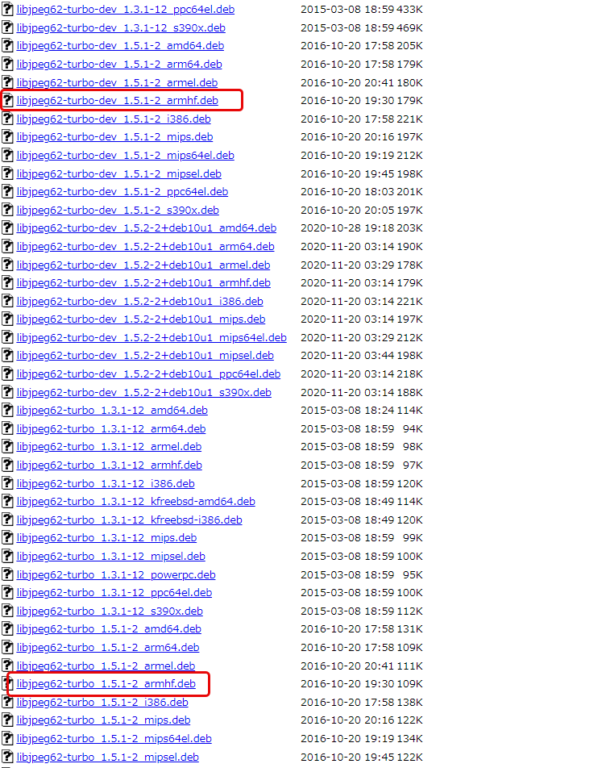

# 08b.lcd_jpeg

<!-- styleは、拡張機能 Markdown Preview Github Stylingをインストール-->
<!-- c:/Users/sfujimoto/.vscode/extensions/bierner.markdown-preview-github-styles-0.1.4/base.css -->
<!-- 参考URL: https://rui-log.com/vscode-markdown-preview-custom/ -->

[2024/9/6 Table of Contents]()

<!-- ctrl + ,  toc: level 1..3 へ変更-->

<div class="TOC">

<!-- @import "[TOC]" {cmd="toc" depthFrom=1 depthTo=2 orderedList=true} -->

<!-- code_chunk_output -->

1. [08b.lcd_jpeg](#08blcd_jpeg)
    1. [目的](#目的)
    2. [構成データ](#構成データ)
    3. [-ljpeg による LCD への jpeg 画像表示](#-ljpeg-による-lcd-への-jpeg-画像表示)

<!-- /code_chunk_output -->

</div>

<div style="page-break-before:always"></div>  <!-- PDFで改ページ-->

## 目的

組込みアプリケーション開発 08b.lcd_jpeg

## 構成データ

### /media/sf_ArmadilloX1/hwpwm/work/R06_2024/Apllication_debug/text/practice ディレクトリ

<details open><summary> ･･･/share/ArmadilloX1/hwpwm/<span style="color: red">work</span>/R06_2024/Application<span style="color: red">_debug</span>/<span style="color: red">text</span>/practice/ の構成</summary>

```bash{.line-numbers}
user@1204PC-Z490M:/mnt/v/VirtualBoxWork/share/ArmadilloX1/hwpwm/work/R06_2024/Application_debug/text/practice$ tree -aF -L 3
./
├── Makefile*
├── fbdisp_jpeg*
├── fbdisp_jpeg.c*
└── image/
    ├── cosmos2-svga.jpg*
    ├── higan2-svga.jpg*
    ├── himawari1-svga.jpg*
    ├── karashina2-svga.jpg*
    ├── momo2-svga.jpg*
    ├── sakura2-svga.jpg*
    └── ume2-svga.jpg*
```

</details>

## -ljpeg による LCD への jpeg 画像表示

[Index of /debian/pool/main/libj/libjpeg-turbo ダウンロードサイト](https://archive.debian.org/debian/pool/main/libj/libjpeg-turbo/)

### 必要なパッケージ

| パッケージ名  |
|--------------|
| dpkg-cross   |

| ダウンロードするパッケージ名             | $ dpkg-cross --build --arch armhf -M *.deb で生成 |   |
|---------------------------------------|-----|-------------------------------------------------|
| libjpeg62-turbo_1.5.1-2_armhf.deb     |  -> | libjpeg62-turbo-armhf-cross_1.5.1-2_all.deb     |
| libjpeg62-turbo-dev_1.5.1-2_armhf.deb |  -> | libjpeg62-turbo-dev-armhf-cross_1.5.1-2_all.deb |

<details open><summary> https://archive.debian.org/debian/pool/main/libj/libjpeg-turbo/ </summary>

  

</details>

### 環境構築

1．ホームディレクトリに必要なパッケージのダウンロード&インストール
1. クロスコンパイル
1. クロスコンパイル後に生成したパッケージをインストール

#### ホームディレクトリに必要なパッケージのダウンロード&インストール

##### $ sudo apt install dpkg-cross

<details open><summary> atmark@atde8:~$ ls </summary>

```bash{.line-numbers}
atmark@atde8:~$ ls
initramfs_x1-v2.1.1.cpio.gz            linux-4.9-x1-at27_dbg_myhwpwm         motor_mynishitaihwpwm.ko  work_debug_hwpwm  デスクトップ  音楽
initramfs_x1-v2.1.1.cpio.gz_dbg_hdpwm  linux-4.9-x1-at27_dbg_myhwpwm.tar.gz  uboot_2016.07-at23_dbg    ダウンロード      ドキュメント  画像
linux-4.9-x1-at27_dbg                  linux-4.9-x1-at27_dbg_org             vbox_share_mp_hwpwm       テンプレート      ビデオ        公開
```

</details>

<details open><summary> atmark@atde8:~$ sudo apt install dpkg-cross </summary>

```bash{.line-numbers}
atmark@atde8:~$ sudo apt install dpkg-cross
[sudo] atmark のパスワード:
パッケージリストを読み込んでいます... 完了
依存関係ツリーを作成しています
状態情報を読み取っています... 完了
以下のパッケージが自動でインストールされましたが、もう必要とされていません:
  libevent-core-2.1-6 libevent-pthreads-2.1-6 linux-headers-4.19.0-22-amd64 linux-headers-4.19.0-22-common linux-headers-4.19.0-23-amd64 linux-headers-4.19.0-23-common
  linux-image-4.19.0-22-amd64 linux-image-4.19.0-23-amd64 sntp
これを削除するには 'sudo apt autoremove' を利用してください。
以下の追加パッケージがインストールされます:
  cross-config libconfig-auto-perl libconfig-inifiles-perl libdebian-dpkgcross-perl libfile-homedir-perl libfile-which-perl libio-string-perl libxml-libxml-perl
  libxml-namespacesupport-perl libxml-sax-base-perl libxml-sax-expat-perl libxml-sax-perl libxml-simple-perl
提案パッケージ:
  binutils-multiarch libxml-sax-expatxs-perl
以下のパッケージが新たにインストールされます:
  cross-config dpkg-cross libconfig-auto-perl libconfig-inifiles-perl libdebian-dpkgcross-perl libfile-homedir-perl libfile-which-perl libio-string-perl libxml-libxml-perl
  libxml-namespacesupport-perl libxml-sax-base-perl libxml-sax-expat-perl libxml-sax-perl libxml-simple-perl
アップグレード: 0 個、新規インストール: 14 個、削除: 0 個、保留: 0 個。
793 kB のアーカイブを取得する必要があります。
この操作後に追加で 2,350 kB のディスク容量が消費されます。
続行しますか? [Y/n] Y
取得:1 http://ftp.jp.debian.org/debian buster/main amd64 cross-config all 2.6.15-3 [39.9 kB]
取得:2 http://ftp.jp.debian.org/debian buster/main amd64 libconfig-inifiles-perl all 3.000001-1 [51.9 kB]
取得:3 http://ftp.jp.debian.org/debian buster/main amd64 libio-string-perl all 1.08-3 [12.3 kB]
取得:4 http://ftp.jp.debian.org/debian buster/main amd64 libxml-namespacesupport-perl all 1.12-1 [14.8 kB]
取得:5 http://ftp.jp.debian.org/debian buster/main amd64 libxml-sax-base-perl all 1.09-1 [20.4 kB]
取得:6 http://ftp.jp.debian.org/debian buster/main amd64 libxml-sax-perl all 1.00+dfsg-1 [58.6 kB]
取得:7 http://ftp.jp.debian.org/debian buster/main amd64 libxml-libxml-perl amd64 2.0134+dfsg-1 [344 kB]
取得:8 http://ftp.jp.debian.org/debian buster/main amd64 libxml-sax-expat-perl all 0.51-1 [12.0 kB]
取得:9 http://ftp.jp.debian.org/debian buster/main amd64 libxml-simple-perl all 2.25-1 [72.0 kB]
取得:10 http://ftp.jp.debian.org/debian buster/main amd64 libconfig-auto-perl all 0.44-1 [19.5 kB]
取得:11 http://ftp.jp.debian.org/debian buster/main amd64 libfile-which-perl all 1.23-1 [16.6 kB]
取得:12 http://ftp.jp.debian.org/debian buster/main amd64 libfile-homedir-perl all 1.004-1 [42.7 kB]
取得:13 http://ftp.jp.debian.org/debian buster/main amd64 libdebian-dpkgcross-perl all 2.6.15-3 [38.7 kB]
取得:14 http://ftp.jp.debian.org/debian buster/main amd64 dpkg-cross all 2.6.15-3 [49.3 kB]
793 kB を 1秒 で取得しました (1,120 kB/s)
以前に未選択のパッケージ cross-config を選択しています。
(データベースを読み込んでいます ... 現在 222687 個のファイルとディレクトリがインストールされています。)
.../00-cross-config_2.6.15-3_all.deb を展開する準備をしています ...
cross-config (2.6.15-3) を展開しています...
以前に未選択のパッケージ libconfig-inifiles-perl を選択しています。
.../01-libconfig-inifiles-perl_3.000001-1_all.deb を展開する準備をしています ...
libconfig-inifiles-perl (3.000001-1) を展開しています...
以前に未選択のパッケージ libio-string-perl を選択しています。
.../02-libio-string-perl_1.08-3_all.deb を展開する準備をしています ...
libio-string-perl (1.08-3) を展開しています...
以前に未選択のパッケージ libxml-namespacesupport-perl を選択しています。
.../03-libxml-namespacesupport-perl_1.12-1_all.deb を展開する準備をしています ...
libxml-namespacesupport-perl (1.12-1) を展開しています...
以前に未選択のパッケージ libxml-sax-base-perl を選択しています。
.../04-libxml-sax-base-perl_1.09-1_all.deb を展開する準備をしています ...
libxml-sax-base-perl (1.09-1) を展開しています...
以前に未選択のパッケージ libxml-sax-perl を選択しています。
.../05-libxml-sax-perl_1.00+dfsg-1_all.deb を展開する準備をしています ...
libxml-sax-perl (1.00+dfsg-1) を展開しています...
以前に未選択のパッケージ libxml-libxml-perl を選択しています。
.../06-libxml-libxml-perl_2.0134+dfsg-1_amd64.deb を展開する準備をしています ...
libxml-libxml-perl (2.0134+dfsg-1) を展開しています...
以前に未選択のパッケージ libxml-sax-expat-perl を選択しています。
.../07-libxml-sax-expat-perl_0.51-1_all.deb を展開する準備をしています ...
libxml-sax-expat-perl (0.51-1) を展開しています...
以前に未選択のパッケージ libxml-simple-perl を選択しています。
.../08-libxml-simple-perl_2.25-1_all.deb を展開する準備をしています ...
libxml-simple-perl (2.25-1) を展開しています...
以前に未選択のパッケージ libconfig-auto-perl を選択しています。
.../09-libconfig-auto-perl_0.44-1_all.deb を展開する準備をしています ...
libconfig-auto-perl (0.44-1) を展開しています...
以前に未選択のパッケージ libfile-which-perl を選択しています。
.../10-libfile-which-perl_1.23-1_all.deb を展開する準備をしています ...
libfile-which-perl (1.23-1) を展開しています...
以前に未選択のパッケージ libfile-homedir-perl を選択しています。
.../11-libfile-homedir-perl_1.004-1_all.deb を展開する準備をしています ...
libfile-homedir-perl (1.004-1) を展開しています...
以前に未選択のパッケージ libdebian-dpkgcross-perl を選択しています。
.../12-libdebian-dpkgcross-perl_2.6.15-3_all.deb を展開する準備をしています ...
libdebian-dpkgcross-perl (2.6.15-3) を展開しています...
以前に未選択のパッケージ dpkg-cross を選択しています。
.../13-dpkg-cross_2.6.15-3_all.deb を展開する準備をしています ...
dpkg-cross (2.6.15-3) を展開しています...
libconfig-inifiles-perl (3.000001-1) を設定しています ...
libfile-which-perl (1.23-1) を設定しています ...
libxml-namespacesupport-perl (1.12-1) を設定しています ...
libxml-sax-base-perl (1.09-1) を設定しています ...
libio-string-perl (1.08-3) を設定しています ...
cross-config (2.6.15-3) を設定しています ...
libfile-homedir-perl (1.004-1) を設定しています ...
libxml-sax-perl (1.00+dfsg-1) を設定しています ...
update-perl-sax-parsers: Registering Perl SAX parser XML::SAX::PurePerl with priority 10...
update-perl-sax-parsers: Updating overall Perl SAX parser modules info file...

Creating config file /etc/perl/XML/SAX/ParserDetails.ini with new version
libxml-libxml-perl (2.0134+dfsg-1) を設定しています ...
update-perl-sax-parsers: Registering Perl SAX parser XML::LibXML::SAX::Parser with priority 50...
update-perl-sax-parsers: Registering Perl SAX parser XML::LibXML::SAX with priority 50...
update-perl-sax-parsers: Updating overall Perl SAX parser modules info file...
Replacing config file /etc/perl/XML/SAX/ParserDetails.ini with new version
libxml-sax-expat-perl (0.51-1) を設定しています ...
update-perl-sax-parsers: Registering Perl SAX parser XML::SAX::Expat with priority 50...
update-perl-sax-parsers: Updating overall Perl SAX parser modules info file...
Replacing config file /etc/perl/XML/SAX/ParserDetails.ini with new version
libxml-simple-perl (2.25-1) を設定しています ...
libconfig-auto-perl (0.44-1) を設定しています ...
libdebian-dpkgcross-perl (2.6.15-3) を設定しています ...
dpkg-cross (2.6.15-3) を設定しています ...
man-db (2.8.5-2+deb10u1) のトリガを処理しています ...
atmark@atde8:~$
```

</details>

##### libjpeg62-turbo_1.5.1-2_armhf.deb のダウンロード

<details open><summary> atmark@atde8:~$ wget https://archive.debian.org/debian/pool/main/libj/libjpeg-turbo/libjpeg62-turbo_1.5.1-2_armhf.deb </summary>

```bash{.line-numbers}
atmark@atde8:~$ wget https://archive.debian.org/debian/pool/main/libj/libjpeg-turbo/libjpeg62-turbo_1.5.1-2_armhf.deb
--2024-07-18 19:22:10--  https://archive.debian.org/debian/pool/main/libj/libjpeg-turbo/libjpeg62-turbo_1.5.1-2_armhf.deb
archive.debian.org (archive.debian.org) をDNSに問いあわせています... 151.101.2.132, 151.101.194.132, 151.101.66.132, ...
archive.debian.org (archive.debian.org)|151.101.2.132|:443 に接続しています... 接続しました。
HTTP による接続要求を送信しました、応答を待っています... 200 OK
長さ: 111400 (109K) [application/vnd.debian.binary-package]
`libjpeg62-turbo_1.5.1-2_armhf.deb' に保存中

libjpeg62-turbo_1.5.1-2_armhf.deb            100%[==============================================================================================>] 108.79K   408KB/s 時間 0.3s

2024-07-18 19:22:10 (408 KB/s) - `libjpeg62-turbo_1.5.1-2_armhf.deb' へ保存完了 [111400/111400]
```

</details>

##### libjpeg62-turbo-dev_1.5.1-2_armhf.deb のダウンロード

<details open><summary> atmark@atde8:~$ wget https://archive.debian.org/debian/pool/main/libj/libjpeg-turbo/libjpeg62-turbo-dev_1.5.1-2_armhf.deb </summary>

```bash{.line-numbers}
atmark@atde8:~$ wget https://archive.debian.org/debian/pool/main/libj/libjpeg-turbo/libjpeg62-turbo-dev_1.5.1-2_armhf.deb
--2024-07-18 19:23:26--  https://archive.debian.org/debian/pool/main/libj/libjpeg-turbo/libjpeg62-turbo-dev_1.5.1-2_armhf.deb
archive.debian.org (archive.debian.org) をDNSに問いあわせています... 151.101.194.132, 151.101.66.132, 151.101.130.132, ...
archive.debian.org (archive.debian.org)|151.101.194.132|:443 に接続しています... 接続しました。
HTTP による接続要求を送信しました、応答を待っています... 200 OK
長さ: 182840 (179K) [application/vnd.debian.binary-package]
`libjpeg62-turbo-dev_1.5.1-2_armhf.deb' に保存中

libjpeg62-turbo-dev_1.5.1-2_armhf.deb        100%[==============================================================================================>] 178.55K   514KB/s 時間 0.3s

2024-07-18 19:23:27 (514 KB/s) - `libjpeg62-turbo-dev_1.5.1-2_armhf.deb' へ保存完了 [182840/182840]
```

</details>

<details open><summary> atmark@atde8:~$ ls -al libjpeg* </summary>

```bash{.line-numbers}
atmark@atde8:~$ ls -al libjpeg*
-rw-r--r-- 1 atmark atmark 182840 10月 21  2016 libjpeg62-turbo-dev_1.5.1-2_armhf.deb
-rw-r--r-- 1 atmark atmark 111400 10月 21  2016 libjpeg62-turbo_1.5.1-2_armhf.deb
```

</details>

#### クロスコンパイル

##### libjpeg62-turbo-armhf-cross_1.5.1-2_all.deb を生成

<details open><summary> atmark@atde8:~$ dpkg-cross --build --arch armhf -M libjpeg62-turbo_1.5.1-2_armhf.deb </summary>

```bash{.line-numbers}
atmark@atde8:~$ dpkg-cross --build --arch armhf -M libjpeg62-turbo_1.5.1-2_armhf.deb
dpkg-cross: Multi-Arch package detected; processing anyway as --convert-multiarch specified.
Building libjpeg62-turbo-armhf-cross_1.5.1-2_all.deb
dpkg-deb: building package 'libjpeg62-turbo-armhf-cross' in './libjpeg62-turbo-armhf-cross_1.5.1-2_all.deb'.
```

</details>

##### libjpeg62-turbo-dev-armhf-cross_1.5.1-2_all.deb を生成

<details open><summary> atmark@atde8:~$ dpkg-cross --build --arch armhf -M libjpeg62-turbo-dev_1.5.1-2_armhf.deb </summary>

```bash{.line-numbers}
atmark@atde8:~$ dpkg-cross --build --arch armhf -M libjpeg62-turbo-dev_1.5.1-2_armhf.deb
dpkg-cross: Multi-Arch package detected; processing anyway as --convert-multiarch specified.
Building libjpeg62-turbo-dev-armhf-cross_1.5.1-2_all.deb
dpkg-deb: building package 'libjpeg62-turbo-dev-armhf-cross' in './libjpeg62-turbo-dev-armhf-cross_1.5.1-2_all.deb'.
```

</details>

<details open><summary> atmark@atde8:~$ ls -al libjpeg* </summary>

```bash{.line-numbers}
atmark@atde8:~$ ls -al libjpeg*
-rw-r--r-- 1 atmark atmark  84956  7月 18 19:30 libjpeg62-turbo-armhf-cross_1.5.1-2_all.deb
-rw-r--r-- 1 atmark atmark 116128  7月 18 19:29 libjpeg62-turbo-dev-armhf-cross_1.5.1-2_all.deb
-rw-r--r-- 1 atmark atmark 182840 10月 21  2016 libjpeg62-turbo-dev_1.5.1-2_armhf.deb
-rw-r--r-- 1 atmark atmark 111400 10月 21  2016 libjpeg62-turbo_1.5.1-2_armhf.deb
```

</details>


#### クロスコンパイル後に生成したパッケージをインストール

##### $ sudo dpkg -i libjpeg62-turbo-armhf-cross_1.5.1-2_all.deb

<details open><summary> atmark@atde8:~$ sudo dpkg -i libjpeg62-turbo-armhf-cross_1.5.1-2_all.deb </summary>

```bash{.line-numbers}
atmark@atde8:~$ sudo dpkg -i libjpeg62-turbo-armhf-cross_1.5.1-2_all.deb
以前に未選択のパッケージ libjpeg62-turbo-armhf-cross を選択しています。
(データベースを読み込んでいます ... 現在 222997 個のファイルとディレクトリがインストールされています。)
libjpeg62-turbo-armhf-cross_1.5.1-2_all.deb を展開する準備をしています ...
libjpeg62-turbo-armhf-cross (1:1.5.1-2) を展開しています...
libjpeg62-turbo-armhf-cross (1:1.5.1-2) を設定しています ...
```

</details>

##### $ sudo dpkg -i libjpeg62-turbo-dev-armhf-cross_1.5.1-2_all.deb

<details open><summary> atmark@atde8:~$ sudo dpkg -i libjpeg62-turbo-dev-armhf-cross_1.5.1-2_all.deb </summary>

```bash{.line-numbers}
atmark@atde8:~$ sudo dpkg -i libjpeg62-turbo-dev-armhf-cross_1.5.1-2_all.deb
以前に未選択のパッケージ libjpeg62-turbo-dev-armhf-cross を選択しています。
(データベースを読み込んでいます ... 現在 223001 個のファイルとディレクトリがインストールされています。)
libjpeg62-turbo-dev-armhf-cross_1.5.1-2_all.deb を展開する準備をしています ...
libjpeg62-turbo-dev-armhf-cross (1:1.5.1-2) を展開しています...
libjpeg62-turbo-dev-armhf-cross (1:1.5.1-2) を設定しています ...
```

</details>

#### ArmadilloX1 にパッケージをインストール

##### /work/linux/nfsroot/root/ に libjpeg62-turbo_1.5.1-2_armhf.deb をコピー

<details open><summary> atmark@atde8:~$ sudo cp ./libjpeg62-turbo_1.5.1-2_armhf.deb /work/linux/nfsroot/root/ </summary>

```bash{.line-numbers}
atmark@atde8:~$ sudo cp ./libjpeg62-turbo_1.5.1-2_armhf.deb /work/linux/nfsroot/root/
```

</details>

##### # dpkg -i libjpeg62-turbo_1.5.1-2_armhf.deb

<details open><summary> root@armadillo:~# dpkg -i libjpeg62-turbo_1.5.1-2_armhf.deb </summary>

```bash{.line-numbers}
root@armadillo:~# ls
RemoteControl                      tslib-1.22
libjpeg62-turbo_1.5.1-2_armhf.deb  tslib_1.22.orig.tar.xz

root@armadillo:~# dpkg -i libjpeg62-turbo_1.5.1-2_armhf.deb
dpkg: warning: downgrading libjpeg62-turbo:armhf from 1:1.5.2-2+deb10u1 to 1:1.5.1-2
(Reading database ... 44927 files and directories currently installed.)
Preparing to unpack libjpeg62-turbo_1.5.1-2_armhf.deb ...
Unpacking libjpeg62-turbo:armhf (1:1.5.1-2) over (1:1.5.2-2+deb10u1) ...
Setting up libjpeg62-turbo:armhf (1:1.5.1-2) ...
Processing triggers for libc-bin (2.28-10+deb10u4) ...
```

</details>

#### -ljpeg のテスト

##### 08b.lcdjpeg/fbdisp_jpeg.c

<details open><summary> 08b.lcdjpeg/fbdisp_jpeg.c </summary>

```c{.line-numbers}
/*
 * fbdisp_jpeg.c
 */
#include <stdio.h>
#include <stdlib.h>
#include <fcntl.h>
#include <linux/fb.h>
#include <sys/mman.h>
#include <sys/ioctl.h>
#include <jpeglib.h>
#include <unistd.h>

#define DEVICE_NAME "/dev/fb0"
#define DIV_BYTE 8

#define COLOR_RED	0xff0000
#define COLOR_GREEN	0x00ff00
#define COLOR_BLUE	0x0000ff
#define COLOR_WHITE	0xffffff
#define COLOR_BLACK	0x000000
#define COLOR_YELLOW	0xffff00
#define COLOR_CYAN	0x00ffff
#define COLOR_MAZENTA	0xff00ff

/* function prototype */
void send_current_error_msg(char *ptr);
void send_current_information(char *ptr);

int main(int argc, char *argv[])
{
	FILE            *fp;
	struct jpeg_decompress_struct cinfo;
	struct jpeg_error_mgr jerr;
	JSAMPARRAY img;
	unsigned char *p;
	int i, j;
	int width;
	int height;

	int fd_framebuffer ;
	struct fb_var_screeninfo vinfo;
	struct fb_fix_screeninfo finfo;
	long int screensize ;
	long int location;
	unsigned int *fbptr ;
	char tmp[DIV_BYTE*10];

	int x1 , y1 ;
	int xres,yres,vbpp,line_len;
	unsigned int tcolor ;

	int R,G,B;
	unsigned char 	R1, G1, B1;

	int x, y, max;
	char type[5];

	// JPEGオブジェクトの初期化
	cinfo.err = jpeg_std_error( &jerr );
	jpeg_create_decompress( &cinfo );

	// ファイルを開く
	fp = fopen( argv[1], "rb" );
	jpeg_stdio_src( &cinfo, fp );

	// ヘッダの読み込み
	jpeg_read_header( &cinfo, TRUE );

	// 展開の開始
	jpeg_start_decompress( &cinfo );

	// 幅と高さの取得
	width = cinfo.output_width;
	height = cinfo.output_height;

	// イメージを保持するメモリ領域の確保と初期化
	img = (JSAMPARRAY)malloc( sizeof( JSAMPROW ) * height );
	for ( i = 0; i < height; i++ ) {
		img[i] = (JSAMPROW)calloc( sizeof( JSAMPLE ), 3 * width );
	}

	// 全イメージデータを取得
	while( cinfo.output_scanline < cinfo.output_height ) {
		jpeg_read_scanlines( &cinfo,
			img + cinfo.output_scanline,
			cinfo.output_height - cinfo.output_scanline
		);
	}

	// 展開の終了
	jpeg_finish_decompress( &cinfo );

	// JPEGオブジェクトの破棄
	jpeg_destroy_decompress( &cinfo );

	// ファイルを閉じる
	fclose( fp );


	/* 読み書き用にファイルを開く */
	fd_framebuffer = open( DEVICE_NAME , O_RDWR);
	if ( !fd_framebuffer ) {
		send_current_error_msg("Framebuffer device open error !");
		exit(1);
	}
	send_current_information("The framebuffer device was opened !");

	/* 固定スクリーン情報取得 */
	if ( ioctl( fd_framebuffer , FBIOGET_FSCREENINFO , &finfo ) ) {
		send_current_error_msg("Fixed information not gotton !");
		exit(2);
	}

	/* 変動スクリーン情報取得 */
	if ( ioctl( fd_framebuffer , FBIOGET_VSCREENINFO , &vinfo ) ) {
		send_current_error_msg("Variable information not gotton !");
		exit(3);
	}
	xres = vinfo.xres ;
	yres = vinfo.yres ;
	vbpp = vinfo.bits_per_pixel ;
	line_len = finfo.line_length ;
	sprintf( tmp , "%d(pixel)x%d(line), %dbpp(bits per pixel)",xres,yres,vbpp);
	send_current_information( tmp );

	/* バイト単位でのスクリーンのサイズを計算 */
	screensize = xres * yres * vbpp / DIV_BYTE ;
	printf( "screensize=%d\n", screensize);

	/* デバイスをメモリにマップする */
	fbptr = (unsigned int *)mmap(0,screensize,PROT_READ | PROT_WRITE,MAP_SHARED,fd_framebuffer,0);
	if ( (int)fbptr == -1 ) {
		send_current_error_msg("Don't get framebuffer device to memory !");
		exit(4);
	}
	send_current_information("The framebuffer device was mapped !");

	x1 = (xres - width)/2;
	y1 = (yres - height)/2;
	printf( "x1=%d,y1=%d\n", x1, y1);
	int f_line=0;

	for(j=0; j<yres; j++) {
		p=img[f_line];
		int f_width=0;
		for ( i=0 ; i<xres ; i++ ) {
			if(i<x1 || j<y1 || i>=x1+width || j>=y1+height) {
				tcolor = COLOR_BLACK;
			} else {
				R = *p++;
				G = *p++;
				B = *p++;
				R1 = ( (R<0)? 0 : ((R>255)? 255 : R));
				G1 = ( (G<0)? 0 : ((G>255)? 255 : G));
				B1 = ( (B<0)? 0 : ((B>255)? 255 : B));
				tcolor = R1<<16 | G1<<8 | B1;
				if( ++f_width == width ) f_line++;
			}

			/* 格納位置計算 */
			location = (i+vinfo.xoffset) + (j+vinfo.yoffset) * line_len/4 ;

			/* 着色 */
			*((unsigned int *)(fbptr + location)) = tcolor;
		}
	}
	munmap(fbptr,screensize);
	close(fd_framebuffer);
	for (i = 0; i < height; i++) free(img[i]);
	free(img);
	return 0;
}

void send_current_error_msg(char *ptr)
{
	fprintf( stderr , "%s\n" , ptr );
}

void send_current_information(char *ptr)
{
	fprintf( stdout , "%s\n" , ptr );

}
```

</details>

#### $ mkdir 08b.lcdjpeg

<details open><summary> atmark@atde8:~$ mkdir -p /media/sf_ArmadilloX1/hwpwm/work/R06_2024/Application_debug/text/practice-example/08b.lcdjpeg </summary>

```bash{.line-numbers}
atmark@atde8:~$ mkdir -p /media/sf_ArmadilloX1/hwpwm/work/R06_2024/Application_debug/text/practice-example/08b.lcdjpeg
atmark@atde8:~$ cd /media/sf_ArmadilloX1/hwpwm/work/R06_2024/Application_debug/text/practice-example/08b.lcdjpeg/
atmark@atde8:/media/sf_ArmadilloX1/hwpwm/work/R06_2024/Application_debug/text/practice-example/08b.lcdjpeg$ touch fbdisp_jpeg.c
```

</details>

#### $ arm-linux-gnueabihf-gcc fbdisp_jpeg.c -o fbdisp_jpeg -ljpeg -v

<details open><summary> atmark@atde8:/media/sf_ArmadilloX1/hwpwm/work/R06_2024/Application_debug/text/practice-example/08b.lcdjpeg$ arm-linux-gnueabihf-gcc fbdisp_jpeg.c -o fbdisp_jpeg -ljpeg -v </summary>

```bash{.line-numbers}
atmark@atde8:/media/sf_ArmadilloX1/hwpwm/work/R06_2024/Application_debug/text/practice-example/08b.lcdjpeg$ arm-linux-gnueabihf-gcc fbdisp_jpeg.c -o fbdisp_jpeg -ljpeg -v
Using built-in specs.
COLLECT_GCC=arm-linux-gnueabihf-gcc
COLLECT_LTO_WRAPPER=/usr/lib/gcc-cross/arm-linux-gnueabihf/8/lto-wrapper
Target: arm-linux-gnueabihf
Configured with: ../src/configure -v --with-pkgversion='Debian 8.3.0-2' --with-bugurl=file:///usr/share/doc/gcc-8/README.Bugs --enable-languages=c,ada,c++,go,d,fortran,objc,obj-c++ --prefix=/usr --with-gcc-major-version-only --program-suffix=-8 --enable-shared --enable-linker-build-id --libexecdir=/usr/lib --without-included-gettext --enable-threads=posix --libdir=/usr/lib --enable-nls --with-sysroot=/ --enable-clocale=gnu --enable-libstdcxx-debug --enable-libstdcxx-time=yes --with-default-libstdcxx-abi=new --enable-gnu-unique-object --disable-libitm --disable-libquadmath --disable-libquadmath-support --enable-plugin --enable-default-pie --with-system-zlib --with-target-system-zlib --enable-multiarch --disable-sjlj-exceptions --with-arch=armv7-a --with-fpu=vfpv3-d16 --with-float=hard --with-mode=thumb --disable-werror --enable-checking=release --build=x86_64-linux-gnu --host=x86_64-linux-gnu --target=arm-linux-gnueabihf --program-prefix=arm-linux-gnueabihf- --includedir=/usr/arm-linux-gnueabihf/include
Thread model: posix
gcc version 8.3.0 (Debian 8.3.0-2)
COLLECT_GCC_OPTIONS='-o' 'fbdisp_jpeg' '-v'  '-mfloat-abi=hard' '-mfpu=vfpv3-d16' '-mthumb' '-mtls-dialect=gnu' '-march=armv7-a+fp'
 /usr/lib/gcc-cross/arm-linux-gnueabihf/8/cc1 -quiet -v -imultilib . -imultiarch arm-linux-gnueabihf fbdisp_jpeg.c -quiet -dumpbase fbdisp_jpeg.c -mfloat-abi=hard -mfpu=vfpv3-d16 -mthumb -mtls-dialect=gnu -march=armv7-a+fp -auxbase fbdisp_jpeg -version -o /tmp/ccWPC336.s
GNU C17 (Debian 8.3.0-2) version 8.3.0 (arm-linux-gnueabihf)
        compiled by GNU C version 8.3.0, GMP version 6.1.2, MPFR version 4.0.2, MPC version 1.1.0, isl version isl-0.20-GMP

GGC heuristics: --param ggc-min-expand=100 --param ggc-min-heapsize=131072
ignoring nonexistent directory "/usr/local/include/arm-linux-gnueabihf"
ignoring nonexistent directory "/usr/include/arm-linux-gnueabihf"
#include "..." search starts here:
#include <...> search starts here:
 /usr/lib/gcc-cross/arm-linux-gnueabihf/8/include
 /usr/lib/gcc-cross/arm-linux-gnueabihf/8/include-fixed
 /usr/lib/gcc-cross/arm-linux-gnueabihf/8/../../../../arm-linux-gnueabihf/include
 /usr/include
End of search list.
GNU C17 (Debian 8.3.0-2) version 8.3.0 (arm-linux-gnueabihf)
        compiled by GNU C version 8.3.0, GMP version 6.1.2, MPFR version 4.0.2, MPC version 1.1.0, isl version isl-0.20-GMP

GGC heuristics: --param ggc-min-expand=100 --param ggc-min-heapsize=131072
Compiler executable checksum: b8d08cc7ef486e9bf5053e03b65076e5
COLLECT_GCC_OPTIONS='-o' 'fbdisp_jpeg' '-v'  '-mfloat-abi=hard' '-mfpu=vfpv3-d16' '-mthumb' '-mtls-dialect=gnu' '-march=armv7-a+fp'
 /usr/lib/gcc-cross/arm-linux-gnueabihf/8/../../../../arm-linux-gnueabihf/bin/as -v -march=armv7-a -mfloat-abi=hard -mfpu=vfpv3-d16 -meabi=5 -o /tmp/ccLLaoJ4.o /tmp/ccWPC336.s
GNU アセンブラ バージョン 2.31.1 (arm-linux-gnueabihf)、BFD バージョン (GNU Binutils for Debian) 2.31.1 を使用
COMPILER_PATH=/usr/lib/gcc-cross/arm-linux-gnueabihf/8/:/usr/lib/gcc-cross/arm-linux-gnueabihf/8/:/usr/lib/gcc-cross/arm-linux-gnueabihf/:/usr/lib/gcc-cross/arm-linux-gnueabihf/8/:/usr/lib/gcc-cross/arm-linux-gnueabihf/:/usr/lib/gcc-cross/arm-linux-gnueabihf/8/../../../../arm-linux-gnueabihf/bin/
LIBRARY_PATH=/usr/lib/gcc-cross/arm-linux-gnueabihf/8/:/usr/lib/gcc-cross/arm-linux-gnueabihf/8/../../../../arm-linux-gnueabihf/lib/:/lib/arm-linux-gnueabihf/:/lib/:/usr/lib/arm-linux-gnueabihf/:/usr/lib/
COLLECT_GCC_OPTIONS='-o' 'fbdisp_jpeg' '-v'  '-mfloat-abi=hard' '-mfpu=vfpv3-d16' '-mthumb' '-mtls-dialect=gnu' '-march=armv7-a+fp'
 /usr/lib/gcc-cross/arm-linux-gnueabihf/8/collect2 -plugin /usr/lib/gcc-cross/arm-linux-gnueabihf/8/liblto_plugin.so -plugin-opt=/usr/lib/gcc-cross/arm-linux-gnueabihf/8/lto-wrapper -plugin-opt=-fresolution=/tmp/ccl7d9F2.res -plugin-opt=-pass-through=-lgcc -plugin-opt=-pass-through=-lgcc_s -plugin-opt=-pass-through=-lc -plugin-opt=-pass-through=-lgcc -plugin-opt=-pass-through=-lgcc_s --sysroot=/ --build-id --eh-frame-hdr -dynamic-linker /lib/ld-linux-armhf.so.3 -X --hash-style=gnu -m armelf_linux_eabi -pie -o fbdisp_jpeg /usr/lib/gcc-cross/arm-linux-gnueabihf/8/../../../../arm-linux-gnueabihf/lib/Scrt1.o /usr/lib/gcc-cross/arm-linux-gnueabihf/8/../../../../arm-linux-gnueabihf/lib/crti.o /usr/lib/gcc-cross/arm-linux-gnueabihf/8/crtbeginS.o -L/usr/lib/gcc-cross/arm-linux-gnueabihf/8 -L/usr/lib/gcc-cross/arm-linux-gnueabihf/8/../../../../arm-linux-gnueabihf/lib -L/lib/arm-linux-gnueabihf -L/usr/lib/arm-linux-gnueabihf /tmp/ccLLaoJ4.o -ljpeg -lgcc --push-state --as-needed -lgcc_s --pop-state -lc -lgcc --push-state --as-needed -lgcc_s --pop-state /usr/lib/gcc-cross/arm-linux-gnueabihf/8/crtendS.o /usr/lib/gcc-cross/arm-linux-gnueabihf/8/../../../../arm-linux-gnueabihf/lib/crtn.o
COLLECT_GCC_OPTIONS='-o' 'fbdisp_jpeg' '-v'  '-mfloat-abi=hard' '-mfpu=vfpv3-d16' '-mthumb' '-mtls-dialect=gnu' '-march=armv7-a+fp'

atmark@atde8:/media/sf_ArmadilloX1/hwpwm/work/R06_2024/Application_debug/text/practice-example/08b.lcdjpeg$ ls -al
合計 28
drwxrwx--- 1 root vboxsf     0  7月 18 19:44 .
drwxrwx--- 1 root vboxsf  4096  7月 18 19:40 ..
-rwxrwx--- 1 root vboxsf 13356  7月 18 19:44 fbdisp_jpeg
-rwxrwx--- 1 root vboxsf  4423  7月 18 19:43 fbdisp_jpeg.c
atmark@atde8:/media/sf_ArmadilloX1/hwpwm/work/R06_2024/Application_debug/text/practice-example/08b.lcdjpeg$
```

</details>

#### Makefile の作成

<details open><summary> $ cp ../08a.lcd/Makefile . </summary>

```bash{.line-numbers}
atmark@atde8:/media/sf_ArmadilloX1/hwpwm/work/R06_2024/Application_debug/text/practice-example/08b.lcdjpeg$ cp ../08a.lcd/Makefile .
```

</details>

##### 08b.lcdjpeg/Makefile

<details open><summary> 08b.lcdjpeg/Makefile </summary>

```bash{.line-numbers}
CC = arm-linux-gnueabihf-gcc
TARGET = fbdisp_jpeg
CFLAGS = -gdwarf-2 -O0
LIBS = -ljpeg

all: $(TARGET)

fbdisp_jpeg: fbdisp_jpeg.c
	$(CC) -o $@ $^ $(CFLAGS) $(LDFLAGS) $(LIBS)

install :
	cp -p $(TARGET)    /work/linux/nfsroot/debug/04_practice
	cp -p $(TARGET)    /media/sf_ArmadilloX1/hwpwm/dbg/debug_share_hwpwm/R06_2024/04_practice
	cp -p $(TARGET).c  /media/sf_ArmadilloX1/hwpwm/dbg/debug_share_hwpwm/R06_2024/04_practice
	cp -p image/*.jpg  /work/linux/nfsroot/debug/04_practice
	cp -p image/*.jpg  /media/sf_ArmadilloX1/hwpwm/dbg/debug_share_hwpwm/R06_2024/04_practice

clean:
	rm -f $(TARGET)

.PHONY: clean

```

</details>

##### 適当なjpegファイルを用意

<details open><summary> 800x600 SVGA *.jpg</summary>


</details>

##### make clean

<details open><summary> $ make clean </summary>

```bash{.line-numbers}
atmark@atde8:/media/sf_ArmadilloX1/hwpwm/work/R06_2024/Application_debug/text/practice-example/08b.lcdjpeg$ make clean
rm -f fbdisp_jpeg
```

</details>

##### make

<details open><summary> $ make </summary>

```bash{.line-numbers}
atmark@atde8:/media/sf_ArmadilloX1/hwpwm/work/R06_2024/Application_debug/text/practice-example/08b.lcdjpeg$ make
arm-linux-gnueabihf-gcc -o fbdisp_jpeg fbdisp_jpeg.c -gdwarf-2 -O0  -ljpeg
```

</details>


##### sudo make install

<details open><summary> $ sudo make install </summary>

```bash{.line-numbers}
atmark@atde8:/media/sf_ArmadilloX1/hwpwm/work/R06_2024/Application_debug/text/practice-example/08b.lcdjpeg$ sudo make install
[sudo] atmark のパスワード:
cp -p fbdisp_jpeg    /work/linux/nfsroot/debug/04_practice
cp -p fbdisp_jpeg    /media/sf_ArmadilloX1/hwpwm/dbg/debug_share_hwpwm/R06_2024/04_practice
cp -p fbdisp_jpeg.c  /media/sf_ArmadilloX1/hwpwm/dbg/debug_share_hwpwm/R06_2024/04_practice
cp -p image/*.jpg /work/linux/nfsroot/debug/04_practice
cp -p image/*.jpg /media/sf_ArmadilloX1/hwpwm/dbg/debug_share_hwpwm/R06_2024/04_practice
```

</details>

#### CSIDEでロード

<details open><summary> メニュー「ファイル」-「ロード」</summary>

  

</details>

#### 実行結果

<details open><summary> root@armadillo:/debug/04_practice# ./fbdisp_jpeg ume2-svga.jpg </summary>

```bash{.line-numbers}
root@armadillo:/debug/04_practice# ./fbdisp_jpeg ume2-svga.jpg
The framebuffer device was opened !
800(pixel)x480(line), 32bpp(bits per pixel)
screensize=1536000
The framebuffer device was mapped !
x1=0,y1=-60
```

</details>

#### 実行している様子

<details open><summary> fbdisp_jpeg を実行している動画 </summary>

  [https://youtu.be/up1xuboWB9M](https://youtu.be/up1xuboWB9M)

  <video controls src="./assets/20240718_fbdisp_jpeg.mp4" title="Title" width="1024"></video>

</details>
