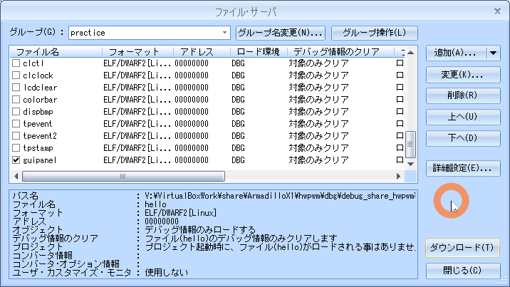

# 10.GUI

<!-- styleは、拡張機能 Markdown Preview Github Stylingをインストール-->
<!-- c:/Users/sfujimoto/.vscode/extensions/bierner.markdown-preview-github-styles-0.1.4/base.css -->
<!-- 参考URL: https://rui-log.com/vscode-markdown-preview-custom/ -->

[2024/7/18 Table of Contents]()

<!-- ctrl + ,  toc: level 1..3 へ変更-->

<div class="TOC">

<!-- @import "[TOC]" {cmd="toc" depthFrom=1 depthTo=2 orderedList=true} -->

<!-- code_chunk_output -->

1. [10.GUI](#10gui)
    1. [目的](#目的)
    2. [構成データ](#構成データ)
    3. [GUI](#gui)

<!-- /code_chunk_output -->

</div>

<div style="page-break-before:always"></div>  <!-- PDFで改ページ-->

## 目的

組込みアプリケーション開発 10.GUI

## 構成データ

### /media/sf_ArmadilloX1/hwpwm/work/R06_2024/Apllication_debug/text/practice ディレクトリ

<details open><summary> ･･･/share/ArmadilloX1/hwpwm/<span style="color: red">work</span>/R06_2024/Application<span style="color: red">_debug</span>/<span style="color: red">text</span>/practice/ の構成</summary>

```bash{.line-numbers}
user@1204PC-Z490M:/mnt/v/VirtualBoxWork/share/ArmadilloX1/hwpwm/work/R06_2024/Application_debug/text/practice$ tree -aF -L 3
./
├── 10.gui/
│   ├── drivers/
│   │   ├── leds/
│   │   └── motor/
│   ├── guipanel.c*             <───── 課題 デバイス制御用ソース
│   ├── image.bmp*              <───── 課題用ビットマップファイル
│   └── Makefile*               <───── デバイス制御用Makefile
```

</details>

## GUI

### 仕様

操作部 から 制御対象デバイスを制御し、その状態を表示するGUIアプリケーション

| 名称     | 機器        | 説明               |
| ------- | ----------- | ------------------ |
| 操作部   | タッチパネル | 制御対象を操作       |
| 表示部   | LCD         | 制御対象の状態を表示 |
| 制御対象 | LED         | 照明8箇所         |
|  ^      | Motor       | 換気扇              |

操作部と表示部のレイアウト


#### 照明コントロール機能の仕様

- 初期状態はLED全消灯
- 照明1～8のいずれかのボタンがタッチされたら、LEDの点灯・消灯を切り替え
- LED消灯中は灰色の照明ボタン、点灯中は緑色の照明ボタンを表示

#### 換気扇コントロール機能の仕様

- 初期状態はモータ停止、速度の初期値は50
- 現在のモータ速度を左矢印ボタンと右矢印ボタンの間に表示
- モータ停止時に換気扇ボタンがタッチされたら、表示されている速度でモータを回転
- モータ動作中に換気扇ボタンがタッチされたらモータを停止。表示速度は変更しない
- 左矢印ボタンがタッチされたらモータ速度表示を10減。下限0
- 右矢印ボタンがタッチされたらモータ速度表示を10増。上限100
- モータ速度変更時、モータ動作中であれば直ちにモータの速度を変更
- モータ停止中は水色の換気扇ボタン、モータ動作中はオレンジの換気扇ボタンを表示

#### 画像データ(image.bmp)


!!! note プログラムでは、image.bmp画像データを <span style="color:red">切り出して</span>使用する

#### 識別子

| 画像    | 識別子       | 用途               |
| ------- | ----------- | ------------------ |
|  | BTN_LIGHT1  | 照明1ON･OFFボタン   |
|   ^     | BTN_LIGHT2  | 照明1ON･OFFボタン   |
|   ^     | BTN_LIGHT3  | 照明1ON･OFFボタン   |
|   ^     | BTN_LIGHT4  | 照明1ON･OFFボタン   |
|   ^     | BTN_LIGHT5  | 照明1ON･OFFボタン   |
|   ^     | BTN_LIGHT6  | 照明1ON･OFFボタン   |
|   ^     | BTN_LIGHT7  | 照明1ON･OFFボタン   |
|   ^     | BTN_LIGHT8  | 照明1ON･OFFボタン   |
|  | BTN_FAN     | 換気扇ON･OFFボタン  |
|  | BTN_ARROW_L | 回転速度減少ボタン  |
|  | BTN_ARROW_R | 回転速度増加ボタン  |
|  | なし        | モータ速度表示用数字  |
|  ^      |  ^          | (0～9, 空白)   |

<details open><summary> 識別子 </summary>

```c{.line-numbers}
// 各種ボタンに対応した識別子設定
enum {
	IMAGE_LIGHT1_OFF = 0, IMAGE_LIGHT1_ON,
	IMAGE_LIGHT2_OFF, IMAGE_LIGHT2_ON,
	IMAGE_LIGHT3_OFF, IMAGE_LIGHT3_ON,
	IMAGE_LIGHT4_OFF, IMAGE_LIGHT4_ON,
	IMAGE_LIGHT5_OFF, IMAGE_LIGHT5_ON,
	IMAGE_LIGHT6_OFF, IMAGE_LIGHT6_ON,
	IMAGE_LIGHT7_OFF, IMAGE_LIGHT7_ON,
	IMAGE_LIGHT8_OFF, IMAGE_LIGHT8_ON,
	IMAGE_FAN_OFF, IMAGE_FAN_ON,
	IMAGE_ARROW_L, IMAGE_ARROW_R,
	IMAGE_0, IMAGE_1, IMAGE_2, IMAGE_3, IMAGE_4,
	IMAGE_5, IMAGE_6, IMAGE_7, IMAGE_8, IMAGE_9,
	IMAGE_WHITE,
	NIMAGES
};

enum {
	BTN_LIGHT1 = 0,
	BTN_LIGHT2,
	BTN_LIGHT3,
	BTN_LIGHT4,
	BTN_LIGHT5,
	BTN_LIGHT6,
	BTN_LIGHT7,
	BTN_LIGHT8,
	BTN_FAN,
	BTN_ARROW_L,
	BTN_ARROW_R,
	NBTNS
};

#define	BTN_OFF		0
#define	BTN_ON		1

struct imageinfo_t {
	int x, y;				/* position on the image file */
	int w, h;				/* width and height */
	unsigned int *data;		/* data (RGB888) */
} image[NIMAGES] = {
	{ 160,   0, 160, 160 },	/* IMAGE_LIGHT1_OFF */
	{   0,   0, 160, 160 },	/* IMAGE_LIGHT1_ON */
	{ 480,   0, 160, 160 },	/* IMAGE_LIGHT2_OFF */
	{ 320,   0, 160, 160 },	/* IMAGE_LIGHT2_ON */
	{   0, 160, 160, 160 },	/* IMAGE_LIGHT3_OFF */
	{ 160, 160, 160, 160 },	/* IMAGE_LIGHT3_ON */
	{ 320, 160, 160, 160 },	/* IMAGE_LIGHT4_OFF */
	{ 480, 160, 160, 160 },	/* IMAGE_LIGHT4_ON */
	{ 160, 320, 160, 160 },	/* IMAGE_LIGHT5_OFF */
	{   0, 320, 160, 160 },	/* IMAGE_LIGHT5_ON */
	{ 480, 320, 160, 160 },	/* IMAGE_LIGHT6_OFF */
	{ 320, 320, 160, 160 },	/* IMAGE_LIGHT6_ON */
	{   0, 480, 160, 160 },	/* IMAGE_LIGHT7_OFF */
	{ 160, 480, 160, 160 },	/* IMAGE_LIGHT7_ON */
	{ 320, 480, 160, 160 },	/* IMAGE_LIGHT8_OFF */
	{ 480, 480, 160, 160 },	/* IMAGE_LIGHT8_ON */
	{   0, 640, 160, 160 },	/* IMAGE_FAN_OFF */
	{ 160, 640, 160, 160 },	/* IMAGE_FAN_ON */
	{ 320, 640, 120, 160 },	/* IMAGE_ARROW_L */
	{ 440, 640, 120, 160 },	/* IMAGE_ARROW_R */
	{   0, 800,  80, 160 },	/* IMAGE_0 */
	{  80, 800,  80, 160 },	/* IMAGE_1 */
	{ 160, 800,  80, 160 },	/* IMAGE_2 */
	{ 240, 800,  80, 160 },	/* IMAGE_3 */
	{ 320, 800,  80, 160 },	/* IMAGE_4 */
	{ 400, 800,  80, 160 },	/* IMAGE_5 */
	{ 480, 800,  80, 160 },	/* IMAGE_6 */
	{ 560, 800,  80, 160 },	/* IMAGE_7 */
	{   0, 960,  80, 160 },	/* IMAGE_8 */
	{  80, 960,  80, 160 },	/* IMAGE_9 */
	{ 160, 960,  80, 160 },	/* IMAGE_WHITE */
};

struct btninfo_t {
	int x, y;		/* position on the screen */
	int w, h;		/* width and height */
	int off, on;	/* OFF image and ON image */
} btn[NBTNS] = {
	{  80, 160, 160, 160, IMAGE_LIGHT1_OFF, IMAGE_LIGHT1_ON },	/* BTN_LIGHT1 */
	{ 240, 160, 160, 160, IMAGE_LIGHT2_OFF, IMAGE_LIGHT2_ON },	/* BTN_LIGHT2 */
	{ 400, 160, 160, 160, IMAGE_LIGHT3_OFF, IMAGE_LIGHT3_ON },	/* BTN_LIGHT3 */
	{ 560, 160, 160, 160, IMAGE_LIGHT4_OFF, IMAGE_LIGHT4_ON },	/* BTN_LIGHT4 */
	{  80, 320, 160, 160, IMAGE_LIGHT5_OFF, IMAGE_LIGHT5_ON },	/* BTN_LIGHT5 */
	{ 240, 320, 160, 160, IMAGE_LIGHT6_OFF, IMAGE_LIGHT6_ON },	/* BTN_LIGHT6 */
	{ 400, 320, 160, 160, IMAGE_LIGHT7_OFF, IMAGE_LIGHT7_ON },	/* BTN_LIGHT7 */
	{ 560, 320, 160, 160, IMAGE_LIGHT8_OFF, IMAGE_LIGHT8_ON },	/* BTN_LIGHT8 */
	{ 560,   0, 160, 160, IMAGE_FAN_OFF   , IMAGE_FAN_ON    },	/* BTN_FAN */
	{  80,   0, 120, 160, IMAGE_ARROW_L   , IMAGE_ARROW_L   },	/* BTN_ARROW_L */
	{ 440,   0, 120, 160, IMAGE_ARROW_R   , IMAGE_ARROW_R   },	/* BTN_ARROW_R */
};
```

</details>

<details open><summary> 10.gui/guipanel.c load_bmp()</summary>

```c{.line-numbers}
// ビットマップ形式の画像ファイルを読み込み、
// ボタンのカラーデータを取得する関数。
int load_bmp(void)
{
	int fd;
	unsigned char *bmpdata, *bmp_offset;
	int datasize;
	int x, y;
	struct bmpheader_t bmp;
	unsigned char r, g, b;
	int padding;
	int i, c;

	// 画像ファイルをオープンします。
	// オープンに失敗した場合はエラーで終了します。
	if ((fd = open(IMAGE_FILE, O_RDONLY)) < 0) {
		perror("open(file)");
		return 1;
	}

	// 画像ファイルを読み込みます。
	// 読み込みに失敗した場合はエラーで終了します。
	if (read(fd, &bmp, sizeof(bmp)) != sizeof(bmp)){
		perror("read(file)");
		return 2;
	}

	// 取得した画像データより、
	// 識別子、1ピクセルあたりのビット数、圧縮タイプ、画像の高さをチェックします。
	if (bmp.fh.bfType != 0x4d42 || bmp.ih.biBitCount != 24
		|| bmp.ih.biCompression != 0 || bmp.ih.biHeight < 0){
		fprintf(stderr, "unsupported bitmap format\n");
		return 2;
	}

	// 画像データから、ビットマップファイルのヘッダ情報のデータサイズを引いた値を
	// データサイズとして、メモリ領域を確保します。
	datasize = bmp.fh.bfSize - sizeof(bmp);
	// 必要なメモリ領域を確保できない場合はエラーで終了します。
	if (!(bmpdata = malloc(datasize))){
		perror("malloc");
		return 1;
	}

	// 確保したメモリ領域に画像データを読み込みます。
	// 読み込みに失敗した場合はエラーで終了します。
	if (read(fd, bmpdata, datasize) != datasize){
		perror("read(file)");
		free(bmpdata);
		return 1;
	}

	// 画像ファイルをクローズします。
	close(fd);

	// 1ラインのデータサイズが4の倍数にならない場合のパディングを設定します。
	padding = (bmp.ih.biWidth * 3) % 4;
	// 各ボタンのカラーデータを設定します。
	// 画像データを元に、カラーデータを構造体imageに設定します。
	for (i = 0; i < NIMAGES; i++){
		// データの取得に必要な領域を確保します。
		image[i].data = malloc(image[i].w * image[i].h * BYTES_PER_PIXCEL);
		// 必要なメモリ領域を確保できない場合はエラーで終了します。
		if (!image[i].data){
			perror("malloc");
			for (; i; --i)
				free(image[i - 1].data);
			free(bmpdata);
			return 1;
		}
		c = 0;
		// カラーデータをセットします。
		for (y = 0; y < image[i].h; y++){
			// 対応するボタンのデータ開始位置を取得します。
			bmp_offset = &bmpdata[(bmp.ih.biHeight - image[i].y - y - 1) * (bmp.ih.biWidth * 3 + padding) + image[i].x * 3];
			for (x = 0; x < image[i].w; x++){
				// 1pixelから、R,G,B各色のカラーデータを取得します。
				b = *bmp_offset++;
				g = *bmp_offset++;
				r = *bmp_offset++;
				// カラーデータを格納します。
				image[i].data[c++] = RGB888(r, g, b);
			}
		}
	}
	// 画像データを取得するために確保した領域を開放します。
	free(bmpdata);

	return 0;
}
```

</details>

### 表示用ライブラリ関数

#### update_button()

| >      | void update_button(int index, int on) |
| ------ | -------------------------------------- |
| arg1   | ボタン識別子                            |
| arg2   | BTN_ON : 動作中ボタンを表示             |
| ^      | BTN_OFF: 停止中ボタンを表示             |
| 戻り値 | なし                                 |

<details open><summary>10.gui/guipanel.c update_button()</summary>

```c{.line-numbers}
(省略)
// ボタンを表示する関数。
void update_button(int index, int on)
{
	// 第2引数がONならONボタン、OFFならOFFボタンを表示します。
	if (on)
		// ONボタンを表示します。
		draw_image(btn[index].on, btn[index].x, btn[index].y);
	else
		// OFFボタンを表示します。
		draw_image(btn[index].off, btn[index].x, btn[index].y);
}
(省略)
```

</details>

#### update_number()

| >      | void update_number(int num) |
| ------ | ---------------------------- |
| arg1   | 表示する数値                  |
| 戻り値 | なし                          |

<details open><summary>10.gui/guipanel.c update_number()</summary>

```c{.line-numbers}
(省略)
// モータ速度表示用の数字を表示する関数。
void update_number(int num)
{
	int d100, d10, d1;

	// 100の位を算出します。
	d100 = num / 100;
	// 10の位を算出します。
	d10 = (num - d100 * 100) / 10;
	// 1の位を算出します。
	d1 = num - d100 * 100 - d10 * 10;

	// 1の位を表示します。
	draw_image(d1 + IMAGE_0, 360, 0);
	// 9より大きい数字なら10の位を表示します。
	if (num > 9)
		draw_image(d10 + IMAGE_0, 280, 0);
	else
		draw_image(IMAGE_WHITE, 280, 0);
	// 99より大きい数字なら100の位を表示します。
	if (num > 99)
		draw_image(d100 + IMAGE_0, 200, 0);
	else
		draw_image(IMAGE_WHITE, 200, 0);
}
(省略)
```

</details>

#### xy2button()

| >      | void xy2button(int x, int y) |
| ------ | ---------------------------- |
| arg1   | x座標                        |
| arg2   | y座標                        |
| 戻り値 | なし                          |

<details open><summary>10.gui/guipanel.c xy2button()</summary>

```c{.line-numbers}
(省略)
// 座標に対応するボタン識別子を返す関数。
int xy2button(int x, int y)
{
	int i;

	// 対応するボタン識別子を判定し、該当するものがある場合は
	// 識別子を戻り値として返します。
	for (i = 0; i < NBTNS; i++){
		// タッチされた位置に対応するボタンを判定します。
		if (x >= btn[i].x && x < btn[i].x + btn[i].w &&
			y >= btn[i].y && y < btn[i].y + btn[i].h)
			return i;
	}

	return -1;
}
(省略)
```

</details>

### guipanel.c の Q1～Q13

<details open><summary>10.gui/guipanel.c</summary>

```c{.line-numbers}
#include <stdio.h>
#include <stdlib.h>
#include <fcntl.h>
#include <sys/mman.h>
#include <string.h>
#include <unistd.h>
#include <tslib.h>

#define	SCREENWIDTH			800
#define	SCREENHEIGHT		480
#define	BYTES_PER_PIXCEL	4
#define	SCREENSIZE			(SCREENWIDTH * SCREENHEIGHT * BYTES_PER_PIXCEL)
#define	RGB888(r, g, b)		(((r) & 0xff) << 16 | \
							 ((g) & 0xff) <<  8 | \
							 ((b) & 0xff))

// フレームバッファデバイスファイル
#define	FBDEV_FILE		"/dev/fb0"
// タッチスクリーンイベントファイル
#define	TSDEV_FILE		"/dev/input/event1"
// モータ制御ファイル
#define	MOTOR_FILE		"/sys/class/motor/motor0/motor_rotation"
// LED制御用ファイル
#define	LED_FILE		"/sys/class/leds/led_ext/brightness"

// 画像ファイル
#define	IMAGE_FILE		"image.bmp"

// 各種ボタンに対応した識別子設定
enum {
	IMAGE_LIGHT1_OFF = 0, IMAGE_LIGHT1_ON,
	IMAGE_LIGHT2_OFF, IMAGE_LIGHT2_ON,
	IMAGE_LIGHT3_OFF, IMAGE_LIGHT3_ON,
	IMAGE_LIGHT4_OFF, IMAGE_LIGHT4_ON,
	IMAGE_LIGHT5_OFF, IMAGE_LIGHT5_ON,
	IMAGE_LIGHT6_OFF, IMAGE_LIGHT6_ON,
	IMAGE_LIGHT7_OFF, IMAGE_LIGHT7_ON,
	IMAGE_LIGHT8_OFF, IMAGE_LIGHT8_ON,
	IMAGE_FAN_OFF, IMAGE_FAN_ON,
	IMAGE_ARROW_L, IMAGE_ARROW_R,
	IMAGE_0, IMAGE_1, IMAGE_2, IMAGE_3, IMAGE_4,
	IMAGE_5, IMAGE_6, IMAGE_7, IMAGE_8, IMAGE_9,
	IMAGE_WHITE,
	NIMAGES
};

enum {
	BTN_LIGHT1 = 0,
	BTN_LIGHT2,
	BTN_LIGHT3,
	BTN_LIGHT4,
	BTN_LIGHT5,
	BTN_LIGHT6,
	BTN_LIGHT7,
	BTN_LIGHT8,
	BTN_FAN,
	BTN_ARROW_L,
	BTN_ARROW_R,
	NBTNS
};

#define	BTN_OFF		0
#define	BTN_ON		1

struct imageinfo_t {
	int x, y;				/* position on the image file */
	int w, h;				/* width and height */
	unsigned int *data;		/* data (RGB888) */
} image[NIMAGES] = {
	{ 160,   0, 160, 160 },	/* IMAGE_LIGHT1_OFF */
	{   0,   0, 160, 160 },	/* IMAGE_LIGHT1_ON */
	{ 480,   0, 160, 160 },	/* IMAGE_LIGHT2_OFF */
	{ 320,   0, 160, 160 },	/* IMAGE_LIGHT2_ON */
	{   0, 160, 160, 160 },	/* IMAGE_LIGHT3_OFF */
	{ 160, 160, 160, 160 },	/* IMAGE_LIGHT3_ON */
	{ 320, 160, 160, 160 },	/* IMAGE_LIGHT4_OFF */
	{ 480, 160, 160, 160 },	/* IMAGE_LIGHT4_ON */
	{ 160, 320, 160, 160 },	/* IMAGE_LIGHT5_OFF */
	{   0, 320, 160, 160 },	/* IMAGE_LIGHT5_ON */
	{ 480, 320, 160, 160 },	/* IMAGE_LIGHT6_OFF */
	{ 320, 320, 160, 160 },	/* IMAGE_LIGHT6_ON */
	{   0, 480, 160, 160 },	/* IMAGE_LIGHT7_OFF */
	{ 160, 480, 160, 160 },	/* IMAGE_LIGHT7_ON */
	{ 320, 480, 160, 160 },	/* IMAGE_LIGHT8_OFF */
	{ 480, 480, 160, 160 },	/* IMAGE_LIGHT8_ON */
	{   0, 640, 160, 160 },	/* IMAGE_FAN_OFF */
	{ 160, 640, 160, 160 },	/* IMAGE_FAN_ON */
	{ 320, 640, 120, 160 },	/* IMAGE_ARROW_L */
	{ 440, 640, 120, 160 },	/* IMAGE_ARROW_R */
	{   0, 800,  80, 160 },	/* IMAGE_0 */
	{  80, 800,  80, 160 },	/* IMAGE_1 */
	{ 160, 800,  80, 160 },	/* IMAGE_2 */
	{ 240, 800,  80, 160 },	/* IMAGE_3 */
	{ 320, 800,  80, 160 },	/* IMAGE_4 */
	{ 400, 800,  80, 160 },	/* IMAGE_5 */
	{ 480, 800,  80, 160 },	/* IMAGE_6 */
	{ 560, 800,  80, 160 },	/* IMAGE_7 */
	{   0, 960,  80, 160 },	/* IMAGE_8 */
	{  80, 960,  80, 160 },	/* IMAGE_9 */
	{ 160, 960,  80, 160 },	/* IMAGE_WHITE */
};

struct btninfo_t {
	int x, y;		/* position on the screen */
	int w, h;		/* width and height */
	int off, on;	/* OFF image and ON image */
} btn[NBTNS] = {
	{  80, 160, 160, 160, IMAGE_LIGHT1_OFF, IMAGE_LIGHT1_ON },	/* BTN_LIGHT1 */
	{ 240, 160, 160, 160, IMAGE_LIGHT2_OFF, IMAGE_LIGHT2_ON },	/* BTN_LIGHT2 */
	{ 400, 160, 160, 160, IMAGE_LIGHT3_OFF, IMAGE_LIGHT3_ON },	/* BTN_LIGHT3 */
	{ 560, 160, 160, 160, IMAGE_LIGHT4_OFF, IMAGE_LIGHT4_ON },	/* BTN_LIGHT4 */
	{  80, 320, 160, 160, IMAGE_LIGHT5_OFF, IMAGE_LIGHT5_ON },	/* BTN_LIGHT5 */
	{ 240, 320, 160, 160, IMAGE_LIGHT6_OFF, IMAGE_LIGHT6_ON },	/* BTN_LIGHT6 */
	{ 400, 320, 160, 160, IMAGE_LIGHT7_OFF, IMAGE_LIGHT7_ON },	/* BTN_LIGHT7 */
	{ 560, 320, 160, 160, IMAGE_LIGHT8_OFF, IMAGE_LIGHT8_ON },	/* BTN_LIGHT8 */
	{ 560,   0, 160, 160, IMAGE_FAN_OFF   , IMAGE_FAN_ON    },	/* BTN_FAN */
	{  80,   0, 120, 160, IMAGE_ARROW_L   , IMAGE_ARROW_L   },	/* BTN_ARROW_L */
	{ 440,   0, 120, 160, IMAGE_ARROW_R   , IMAGE_ARROW_R   },	/* BTN_ARROW_R */
};

typedef struct tagBITMAPFILEHEADER{			// ビットマップファイルヘッダ
	unsigned short	bfType;					// 識別子0x4d42(‘B’,‘M’)
	unsigned long	bfSize;					// ファイルサイズ
	unsigned short	bfReserved1;			// 使わない
	unsigned short	bfReserved2;			// 使わない
	unsigned long	bfOffBits;				// ファイル内の画像データ開始位置
} __attribute__((packed)) BITMAPFILEHEADER;

typedef struct tagBITMAPINFOHEADER{			// ビットマップ情報ヘッダ
	unsigned long	biSize;					// 情報ヘッダサイズ
	long		biWidth;					// 画像の幅
	long		biHeight;					// 画像の高さ
	unsigned short	biPlanes;				// プレーン数（1に固定）
	unsigned short	biBitCount;				// 1ピクセルあたりのビット数
	unsigned long	biCompression;			// 圧縮タイプ
	unsigned long	biSizeImage;			// 画像データサイズ
	long		biXPixPerMeter;				// 横1mあたりのピクセル数
	long		biYPixPerMeter;				// 縦1mあたりのピクセル数
	unsigned long	biClrUsed;				// パレット数
	unsigned long	biClrImporant;			// 重要パレット数
} __attribute__((packed)) BITMAPINFOHEADER;

struct bmpheader_t {
	BITMAPFILEHEADER fh;
	BITMAPINFOHEADER ih;
};

#define	MOTOR_OFF	0
#define	MOTOR_ON	1

unsigned int *pfb;
int fd_mt;
int fd_led;

// ビットマップ形式の画像ファイルを読み込み、
// ボタンのカラーデータを取得する関数。
int load_bmp(void)
{
	int fd;
	unsigned char *bmpdata, *bmp_offset;
	int datasize;
	int x, y;
	struct bmpheader_t bmp;
	unsigned char r, g, b;
	int padding;
	int i, c;

	// 画像ファイルをオープンします。
	// オープンに失敗した場合はエラーで終了します。
	if ((fd = open(IMAGE_FILE, O_RDONLY)) < 0) {
		perror("open(file)");
		return 1;
	}

	// 画像ファイルを読み込みます。
	// 読み込みに失敗した場合はエラーで終了します。
	if (read(fd, &bmp, sizeof(bmp)) != sizeof(bmp)){
		perror("read(file)");
		return 2;
	}

	// 取得した画像データより、
	// 識別子、1ピクセルあたりのビット数、圧縮タイプ、画像の高さをチェックします。
	if (bmp.fh.bfType != 0x4d42 || bmp.ih.biBitCount != 24
		|| bmp.ih.biCompression != 0 || bmp.ih.biHeight < 0){
		fprintf(stderr, "unsupported bitmap format\n");
		return 2;
	}

	// 画像データから、ビットマップファイルのヘッダ情報のデータサイズを引いた値を
	// データサイズとして、メモリ領域を確保します。
	datasize = bmp.fh.bfSize - sizeof(bmp);
	// 必要なメモリ領域を確保できない場合はエラーで終了します。
	if (!(bmpdata = malloc(datasize))){
		perror("malloc");
		return 1;
	}

	// 確保したメモリ領域に画像データを読み込みます。
	// 読み込みに失敗した場合はエラーで終了します。
	if (read(fd, bmpdata, datasize) != datasize){
		perror("read(file)");
		free(bmpdata);
		return 1;
	}

	// 画像ファイルをクローズします。
	close(fd);

	// 1ラインのデータサイズが4の倍数にならない場合のパディングを設定します。
	padding = (bmp.ih.biWidth * 3) % 4;
	// 各ボタンのカラーデータを設定します。
	// 画像データを元に、カラーデータを構造体imageに設定します。
	for (i = 0; i < NIMAGES; i++){
		// データの取得に必要な領域を確保します。
		image[i].data = malloc(image[i].w * image[i].h * BYTES_PER_PIXCEL);
		// 必要なメモリ領域を確保できない場合はエラーで終了します。
		if (!image[i].data){
			perror("malloc");
			for (; i; --i)
				free(image[i - 1].data);
			free(bmpdata);
			return 1;
		}
		c = 0;
		// カラーデータをセットします。
		for (y = 0; y < image[i].h; y++){
			// 対応するボタンのデータ開始位置を取得します。
			bmp_offset = &bmpdata[(bmp.ih.biHeight - image[i].y - y - 1) * (bmp.ih.biWidth * 3 + padding) + image[i].x * 3];
			for (x = 0; x < image[i].w; x++){
				// 1pixelから、R,G,B各色のカラーデータを取得します。
				b = *bmp_offset++;
				g = *bmp_offset++;
				r = *bmp_offset++;
				// カラーデータを格納します。
				image[i].data[c++] = RGB888(r, g, b);
			}
		}
	}
	// 画像データを取得するために確保した領域を開放します。
	free(bmpdata);

	return 0;
}

// LCDに画像を表示する関数。
void draw_image(int index, int x0, int y0)
{
	int x, y;
	unsigned int *p = image[index].data;

	// 開始位置から画像を表示します。
	// 最も上のラインから順番に、画像データを格納します。
	for (y = 0; y < image[index].h; y++){
		for (x = 0; x < image[index].w; x++){
			// LCDにカラーデータを表示します。
			pfb[(y0 + y) * SCREENWIDTH + (x0 + x)] = *p++;
		}
	}
}

// ボタンを表示する関数。
void update_button(int index, int on)
{
	// 第2引数がONならONボタン、OFFならOFFボタンを表示します。
	if (on)
		// ONボタンを表示します。
		draw_image(btn[index].on, btn[index].x, btn[index].y);
	else
		// OFFボタンを表示します。
		draw_image(btn[index].off, btn[index].x, btn[index].y);
}

// モータ速度表示用の数字を表示する関数。
void update_number(int num)
{
	int d100, d10, d1;

	// 100の位を算出します。
	d100 = num / 100;
	// 10の位を算出します。
	d10 = (num - d100 * 100) / 10;
	// 1の位を算出します。
	d1 = num - d100 * 100 - d10 * 10;

	// 1の位を表示します。
	draw_image(d1 + IMAGE_0, 360, 0);
	// 9より大きい数字なら10の位を表示します。
	if (num > 9)
		draw_image(d10 + IMAGE_0, 280, 0);
	else
		draw_image(IMAGE_WHITE, 280, 0);
	// 99より大きい数字なら100の位を表示します。
	if (num > 99)
		draw_image(d100 + IMAGE_0, 200, 0);
	else
		draw_image(IMAGE_WHITE, 200, 0);
}

// 座標に対応するボタン識別子を返す関数。
int xy2button(int x, int y)
{
	int i;

	// 対応するボタン識別子を判定し、該当するものがある場合は
	// 識別子を戻り値として返します。
	for (i = 0; i < NBTNS; i++){
		// タッチされた位置に対応するボタンを判定します。
		if (x >= btn[i].x && x < btn[i].x + btn[i].w &&
			y >= btn[i].y && y < btn[i].y + btn[i].h)
			return i;
	}

	return -1;
}

// 引数で渡された値に応じて
// モータの速度を変更する関数。
void change_motor(int rotation)
{
	/*** Question 1 ***/
}

// 引数に渡された値に応じて
// 対応するLEDを点灯させます。
void change_led(int value)
{
	/*** Question 2 ***/
}

int main(void) {
	int fd;
	int i;
	int ret;
	struct tsdev *ts;
	struct ts_sample samp;
	int enable = 1;
	int led_state = 0;
	int motor_state = MOTOR_OFF;
	int motor_speed = 50;
	int tmp;

	/*** Question 3 ***/

	/*** Question 4 ***/

	/*** Question 5 ***/

	/*** Question 6 ***/

	// 画像データを読み込み、ボタンのカラーデータを取得します。
	if (ret = load_bmp())
		return ret;

	/*** Question 7 ***/

	// タッチスクリーンイベントを受け付ける間ループさせます。
	for(;;){
		/*** Question 8 ***/

		// タッチイベントが1個以外の場合は無視します。
		if (ret != 1)
			continue;

		// 圧力がなくなったら、次に圧力がかかった初回のみ処理を実行するように、
		// enable に 1を設定します。
		if (samp.pressure == 0){
			enable = 1;
			continue;
		}

		// タッチされたボタンに該当する処理を実行します。
		if (enable){
			/*** Question 9 ***/

			// 識別子によって処理を変えます。
			switch(ret){
			// 照明1～8ボタンの処理。
			case BTN_LIGHT1 ... BTN_LIGHT8:
				/*** Question 10 ***/

				break;
			// 換気扇ボタンの処理。
			case BTN_FAN:
				/*** Question 11 ***/

				break;
			// 左矢印ボタンの処理。
			case BTN_ARROW_L:
				/*** Question 12 ***/

				break;
			// 右矢印ボタンの処理。
			case BTN_ARROW_R:
				/*** Question 13 ***/

				break;
			}

			// 圧力がなくなるまで、同じ処理をしないように
			// enableに0を設定します。
			enable = 0;
		}
	}

	// LED制御ファイルをクローズします。
	close(fd_led);
	// モータ制御ファイルをクローズします。
	close(fd_mt);
	// タッチスクリーンイベントファイルをクローズします。
	ts_close(ts);
	// フレームバッファのために確保した領域を開放します。
	munmap(pfb, SCREENSIZE);
	// フレームバッファをクローズします。
	close(fd);

	return 0;
}
```

</details>

| 項目 | 内容 |
| ----| ---------------------------- |
| Q1  | 引数として渡されるrotationをモータデバイスに書込む       |
| Q2  | 引数として渡されるvalueをLEDデバイスに書込む       |
| Q3  | fb0の初期化       |
| Q4  | タッチパネルデバイスの初期化       |
| Q5  | モータデバイスの初期化  |
| Q6  | LEDデバイスの初期化       |
| Q7  | 各ボタンおよびモータ速度の設定値を表示       |
| Q8  | タッチパネルイベントの読出し、構造体sampに格納、戻り値はretに格納 |
| Q9  | タッチ位置の座標をボタン識別子に変換、結果は変数retに格納      |
| Q10 | 照明ボタンがタッチされたときの処理、現在のledの状態は、led_stateへ格納       |
| Q11 | 換気扇ボタンがタッチされたときの処理、現在のモータの回転状態はmotor_state に MOTOR_ON または MOTOR_OFFを格納      |
| Q12 | 左矢印ボタンがタッチされたときの処理   |
| Q13 | 右矢印ボタンがタッチされたときの処理   |

### Makefile

<details open><summary> 10.gui/Makefile </summary>

```bash{.line-numbers}
CC = arm-linux-gnueabihf-gcc
TARGET = guipanel
CFLAGS = -I/work/linux/nfsroot/usr/local/include -gdwarf-2 -O0
LDFLAGS = -L/work/linux/nfsroot/usr/local/lib
LIBS = -lts

all: $(TARGET)

guipanel: guipanel.c
	$(CC) -o $@ $^ $(CFLAGS) $(LDFLAGS) $(LIBS)

install :
	cp -p $(TARGET) /work/linux/nfsroot/debug/04_practice
	cp -p $(TARGET) /media/sf_ArmadilloX1/hwpwm/dbg/debug_share_hwpwm/R06_2024/04_practice
	cp -p $(TARGET).c /media/sf_ArmadilloX1/hwpwm/dbg/debug_share_hwpwm/R06_2024/04_practice
	cp -p ./*.bmp     /work/linux/nfsroot/debug/04_practice
	cp -p ./*.bmp     /media/sf_ArmadilloX1/hwpwm/dbg/debug_share_hwpwm/R06_2024/04_practice

clean:
	rm -f $(TARGET)

.PHONY: clean
```

</details>

### 動作確認

#### make clean

<details open><summary> $ make clean </summary>

```bash{.line-numbers}
atmark@atde8:/media/sf_ArmadilloX1/hwpwm/work/R06_2024/Application_debug/text/practice-example/10.gui$ make clean
rm -f guipanel
```

</details>

#### make

<details open><summary> $ make </summary>

```bash{.line-numbers}
atmark@atde8:/media/sf_ArmadilloX1/hwpwm/work/R06_2024/Application_debug/text/practice-example/10.gui$ make guipanel
arm-linux-gnueabihf-gcc -o guipanel guipanel.c -I/work/linux/nfsroot/usr/local/include -gdwarf-2 -O0 -L/work/linux/nfsroot/usr/local/lib -lts
```

</details>

#### sudo make install

<details open><summary> $ sudo make install </summary>

```bash{.line-numbers}
atmark@atde8:/media/sf_ArmadilloX1/hwpwm/work/R06_2024/Application_debug/text/practice-example/10.gui$ sudo make install
[sudo] atmark のパスワード:
cp -p guipanel /work/linux/nfsroot/debug/04_practice
cp -p guipanel /media/sf_ArmadilloX1/hwpwm/dbg/debug_share_hwpwm/R06_2024/04_practice
cp -p guipanel.c /media/sf_ArmadilloX1/hwpwm/dbg/debug_share_hwpwm/R06_2024/04_practice
cp -p ./*.bmp     /work/linux/nfsroot/debug/04_practice
cp -p ./*.bmp     /media/sf_ArmadilloX1/hwpwm/dbg/debug_share_hwpwm/R06_2024/04_practice
```

</details>

#### CSIDEでロード

<details open><summary> メニュー「ファイル」-「ロード」</summary>

  

</details>

#### insmod（既にinsmod 済みなら割愛）

<details open><summary> # insmod leds.ko 他 </summary>

```bash{.line-numbers}
root@armadillo:/lib/modules/4.9.133-at27/extra# insmod leds.ko
root@armadillo:/lib/modules/4.9.133-at27/extra# insmod motor_hwpwm.ko
root@armadillo:/lib/modules/4.9.133-at27/extra# lsmod
Module                  Size  Used by
motor_hwpwm             4415  0
leds                    2103  0
```

</details>


#### タッチパネルのキャリブレーション（既に終えているなら割愛）

##### キャリブレーションファイルの指定

!!! warning ts_calibrate が反映しない場合、rm /etc/pointercal で削除した後、export TSLIB_CALIBFILE=/etc/pointercal で生成しておく

<details open><summary> root@armadillo:~/tslib-1.22# export TSLIB_CALIBFILE=/etc/pointercal </summary>

```bash{.line-numbers}
root@armadillo:~/tslib-1.22# export TSLIB_CALIBFILE=/etc/pointercal
```

</details>

##### キャリブレーション

<details open><summary> root@armadillo:/usr/lib# TSLIB_TSDEVICE=/dev/input/event1 ts_calibrate </summary>

```bash{.line-numbers}
root@armadillo:~# TSLIB_TSDEVICE=/dev/input/event1 ts_calibrate
xres = 800, yres = 480
Took 1 samples...
Top left : X =  483 Y =  991
Took 1 samples...
Top right : X = 9575 Y = 1020
Took 1 samples...
Bot right : X = 9516 Y = 9389
Took 1 samples...
Bot left : X =  525 Y = 9262
Took 1 samples...
Center : X = 4923 Y = 5140
12.199158 0.077410 0.000080
6.291077 -0.000394 0.045671
Calibration constants: 799484 5073 5 412292 -25 2993 65536
```

</details>

##### キャリブレーション結果の確認

<details open><summary> root@armadillo:~/tslib-1.19# cat /etc/pointercal </summary>

```bash{.line-numbers}
root@armadillo:~# cat /etc/pointercal
5073 5 799484 -25 2993 412292 65536 800 480 0
```

</details>

#### 実行結果

<details open><summary> root@armadillo:/debug/04_practice# ./guipanel </summary>

```bash{.line-numbers}
root@armadillo:/debug/04_practice# ./guipanel
```

</details>

#### 実行している様子

<details open><summary> guipanel を実行している動画 </summary>

  [https://youtu.be/b1VvFvKPQT0](https://youtu.be/b1VvFvKPQT0)

  <video controls src="assets/20240712_guipanel.mp4" title="Title" width="1024"></video>

</details>
