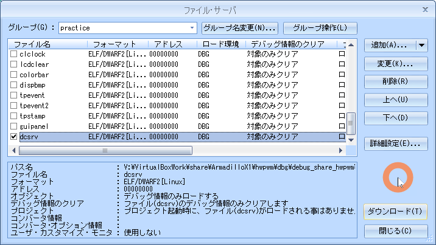
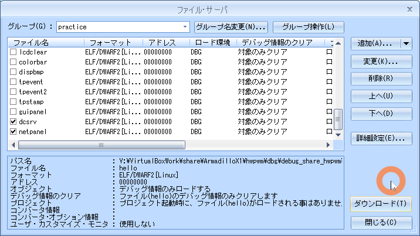

# 11.network

<!-- styleは、拡張機能 Markdown Preview Github Stylingをインストール-->
<!-- c:/Users/sfujimoto/.vscode/extensions/bierner.markdown-preview-github-styles-0.1.4/base.css -->
<!-- 参考URL: https://rui-log.com/vscode-markdown-preview-custom/ -->

[2024/7/18 Table of Contents]()

<!-- ctrl + ,  toc: level 1..3 へ変更-->

<div class="TOC">

<!-- @import "[TOC]" {cmd="toc" depthFrom=1 depthTo=2 orderedList=true} -->

<!-- code_chunk_output -->

- [11.network](#11network)
	- [目的](#目的)
	- [構成データ](#構成データ)
		- [/media/sf\_ArmadilloX1/hwpwm/work/R06\_2024/Apllication\_debug/text/practice ディレクトリ](#mediasf_armadillox1hwpwmworkr06_2024apllication_debugtextpractice-ディレクトリ)
	- [ネットワークアプリケーション dcsrv.c \& dccli.c](#ネットワークアプリケーション-dcsrvc--dcclic)
		- [仕様](#仕様)
	- [ソケット通信](#ソケット通信)
	- [課題1 ネットワークアプリケーション dcsrv](#課題1-ネットワークアプリケーション-dcsrv)
		- [デバイス制御サーバー dcsrv](#デバイス制御サーバー-dcsrv)
		- [動作確認](#動作確認)
	- [課題 ネットワークアプリケーション dccli](#課題-ネットワークアプリケーション-dccli)
		- [デバイス制御サーバー接続クライアントアプリケーション dccli](#デバイス制御サーバー接続クライアントアプリケーション-dccli)
		- [動作確認](#動作確認-1)
	- [課題 GUIネットワークアプリケーション netpanel](#課題-guiネットワークアプリケーション-netpanel)
		- [仕様](#仕様-1)
		- [動作確認](#動作確認-2)

<!-- /code_chunk_output -->

</div>

<div style="page-break-before:always"></div>  <!-- PDFで改ページ-->

## 目的

組込みアプリケーション開発 11.network

## 構成データ

### /media/sf_ArmadilloX1/hwpwm/work/R06_2024/Apllication_debug/text/practice ディレクトリ

<details open><summary> ･･･/share/ArmadilloX1/hwpwm/<span style="color: red">work</span>/R06_2024/Application<span style="color: red">_debug</span>/<span style="color: red">text</span>/practice/ の構成</summary>

```bash{.line-numbers}
user@1204PC-Z490M:/mnt/v/VirtualBoxWork/share/ArmadilloX1/hwpwm/work/R06_2024/Application_debug/text/practice$ tree -aF -L 3
./
├── 11.network/
│   ├── dccli.c*                <───── クライアントアプリケーション(ATDE8)
│   ├── dccmd.h*                <───── コマンド
│   ├── dcsrv.c*                <───── サーバーアプリケーション(ArmadilloX1)
│   ├── drivers/
│   │   ├── leds/
│   │   └── motor/
│   ├── Makefile*               <───── デバイス制御用Makefile
│   └── netpanel.c*             <───── GUIクライアントアプリケーション(ArmadilloX1)
```

</details>

## ネットワークアプリケーション dcsrv.c & dccli.c

### 仕様

#### ネットワーク構成


#### コマンド一覧

| コマンド名 | 内容 |
| ----| ---------------------------- |
| CMD_FAN_GET  | 換気扇の状態を取得     |
| CMD_FAN_SET  | 換気扇の状態を変更     |
| CMD_LIGHT_GET  | 照明の状態を取得     |
| CMD_LIGHT_SET  | 照明の状態を変更     |
| RSP_OK  | コマンド実行に成功     |
| RSP_NG  | コマンド実行に失敗     |
| ERR_UNKNOWN_CMD   | 不正なコマンド    |
| ERR_SYSCALL       | システムコールエラー   |
| ERR_OUT_OF_RANGE  | パラメータの値が不正   |

#### コマンド構造体

<details open><summary> 11.network/dccmd.h </summary>

```c{.line-numbers}
#ifndef __DSERV_H__
#define __DSERV_H__

#define	RSP_OK			1
#define	RSP_NG			2
#define	CMD_FAN_GET		3
#define CMD_FAN_SET		4
#define CMD_LIGHT_GET		5
#define CMD_LIGHT_SET		6

#define	ERR_BASE		-1024
#define	ERR_UNKNOWN_CMD		-1025
#define	ERR_SYSCALL		-1026
#define	ERR_OUT_OF_RANGE	-1027

#define	ISERR(x)		((x) < ERR_BASE)

struct command_t {
	int command;
	int value;
};

#endif
```

</details>

| >      | struct command_t |
| ------ | ---------------------------- |
| int command | コマンド(CMD_XXX)、レスポンス(RSP_XXX) |
| int value   | パラメータ、エラーコード                |

#### フレーム


## ソケット通信

参考: [通信プロトコル実装設計](https://jeedjp.sharepoint.com/:b:/s/R5747/EYrmJ1YGzghAnywc170EzlMBo0ZLEXteDVL8SF8JsRFIvg?e=mflJUC) のテキストp75～

## 課題1 ネットワークアプリケーション dcsrv

### デバイス制御サーバー dcsrv

<details open><summary> 11.network/dcsrv.c </summary>

```c{.line-numbers}
#include <stdio.h>
#include <stdlib.h>
#include <fcntl.h>
#include <sys/socket.h>
#include <netinet/in.h>
#include <arpa/inet.h>
#include <fcntl.h>
#include <unistd.h>
#include <string.h>
#include <signal.h>
#include "dccmd.h"

#define MOTOR_FILE	"/sys/class/motor/motor0/motor_rotation"
#define LED_FILE	"/sys/class/leds/led_ext/brightness"
#define	SRVPORT		50000

#define	MAX_ROTATION	100
#define	MIN_ROTATION	-100
#define	MAX_LED		255
#define MIN_LED		0

#define	BUFSIZE		16

int fd_mt;
int fd_led;

// シグナルハンドラの処理(ctrl+cが押された時の処理)。
void sig_handler(int sig)
{
	// モータ制御ファイルをクローズ
	close(fd_mt);
	// LED制御ファイルをクローズ
	close(fd_led);
}

int set_motor(int rotation)
{
	int n, ret;
	char data[BUFSIZE];

	// モータの上下限チェックを行います。
	if (rotation < MIN_ROTATION || rotation > MAX_ROTATION)
		return ERR_OUT_OF_RANGE;

	// モータの状態変化をライトします。
	n = sprintf(data, "%d", rotation);
	ret = write(fd_mt, data, n);
	// 書き込みに失敗したら、main関数をエラー終了します。
	if (ret < 0){
		perror("failed to write motor");
		return ERR_SYSCALL;
	}

	return 0;
}

int set_led(int value)
{
	int n, ret;
	char data[4];

	// モータの上下限チェックを行います。
	if (value < MIN_LED || value > MAX_LED)
		return ERR_OUT_OF_RANGE;

	// LEDを点灯/消灯させます。
	n = sprintf(data, "%d", value);
	ret = write(fd_led, data, n);
	// ライトに失敗したら、main関数をエラー終了します。
	if (ret < 0){
		perror("failed to write led");
		return ERR_SYSCALL;
	}

	return 0;
}

int main(void)
{
	int ret;
	int sd0, sd;
	struct sockaddr_in addr;
	socklen_t addr_len;
	int led_state = 0;
	int motor_speed = 0;
	struct command_t cmd;
	int tmp;
	struct sigaction act;

	// シグナルハンドラを登録します。
	act.sa_handler = sig_handler;
	memset(&act, 0, sizeof(act));
	ret = sigaction(SIGINT, &act, NULL);

	// 登録が失敗した場合、main関数をエラー終了します。
	if (ret){
		perror("sigaction");
		return 1;
	}

	// モータ制御用ファイルをオープンします。
	fd_mt = open(MOTOR_FILE, O_RDWR);
	// オープンに失敗したら、main関数をエラー終了します。
	if (fd_mt < 0){
		perror("failed to open motor");
		return 1;
	}
	// モータを停止します。
	set_motor(motor_speed);

	// LED制御用ファイルをオープンします。
	fd_led = open(LED_FILE, O_RDWR);
	// オープンに失敗したら、main関数をエラー終了します。
	if (fd_led < 0){
		perror("failed to open led");
		return 1;
	}
	// LEDを消灯します。
	set_led(led_state);

	/*** Question 1 ***/

	// 作成に失敗したら、main関数をエラー終了します。
	if (sd0 == -1){
		perror("socket");
		return 1;
	}

	/*** Question 2 ***/

	/*** Question 3 ***/

	if (ret == -1){
		perror("bind");
		return 1;
	}

	/*** Question 4 ***/

	if (ret == -1){
		perror("listen");
		return 1;
	}

	for(;;){
		/*** Question 5 ***/

		if (sd == -1){
			perror("accept");
			return 1;
		}

		printf("connected from %s:%d\n",
			inet_ntoa(addr.sin_addr), ntohs(addr.sin_port));

		for(;;){
			/*** Question 6 ***/

			if (ret == -1){
				perror("recv");
				return 1;
			}

			// ネットからホストへ4バイト値を変換します。
			cmd.command = ntohl(cmd.command);
			cmd.value = ntohl(cmd.value);

			if (ret == 0){
				printf("disconnected\n");
				break;
			}

			printf("command=%d value=%d\n", cmd.command, cmd.value);

			// 受信したコマンドを解析します。
			switch (cmd.command){
			case CMD_FAN_GET:
				// 換気扇の状態を取得するコマンドのレスポンスをセットします。
				cmd.value = motor_speed;
				cmd.command = ISERR(cmd.value) ? RSP_NG : RSP_OK;
				break;
			case CMD_FAN_SET:
				// 換気扇の状態を変更するコマンドのレスポンスをセットします。
				tmp = cmd.value;
				cmd.value = set_motor(cmd.value);
				if (ISERR(cmd.value))
					cmd.command = RSP_NG;
				else {
					cmd.command = RSP_OK;
					motor_speed = tmp;
				}
				break;
			case CMD_LIGHT_GET:
				// 照明の状態を取得するコマンドのレスポンスをセットします。
				cmd.value = led_state;
				cmd.command = ISERR(cmd.value) ? RSP_NG : RSP_OK;
				break;
			case CMD_LIGHT_SET:
				// 照明の状態を変更するコマンドのレスポンスをセットします。
				tmp = cmd.value;
				cmd.value = set_led(tmp);
				if (ISERR(cmd.value))
					cmd.command = RSP_NG;
				else {
					cmd.command = RSP_OK;
					led_state = tmp;
				}
				break;
			default:
				// 不明なコマンドを受信した際のレスポンスをセットします。
				cmd.command = RSP_NG;
				cmd.value = ERR_UNKNOWN_CMD;
				break;
			}

			// ホストからネットへ4バイト値を変換します。
			cmd.command = htonl(cmd.command);
			cmd.value = htonl(cmd.value);

			/*** Question 7 ***/

			if (ret == -1){
				perror("send");
				return 1;
			}
		}

		// ソケットを閉じます。
		close(sd);
	}

	return 0;
}
```

</details>

| 項目 | 内容 |
| ----| ---------------------------- |
| Q1  | socket()  |
| Q2  | sockaddr_in構造体にセット|
| Q3  | bind()    |
| Q4  | listen()  |
| Q5  | accept()  |
| Q6  | recv()    |
| Q7  | send()    |

#### Makefile

<details open><summary> 11.network/Makefile </summary>

```makefile{.line-numbers}
CC = arm-linux-gnueabihf-gcc
#TARGET = dcsrv dccli netpanel
TARGET = dcsrv
CFLAGS = -I/work/linux/nfsroot/usr/local/include
CFLAGS_DEBUG =  -gdwarf-2 -O0
LDFLAGS = -L/work/linux/nfsroot/usr/local/lib
LIBS = -lts

all: $(TARGET)

dccli: dccli.c
	gcc -o $@ $^ $(CFLAGS_DEBUG)

dcsrv: dcsrv.c
	$(CC) -o $@ $^ $(CFLAGS) $(CFLAGS_DEBUG)

netpanel: netpanel.c
	$(CC) -o $@ $^ $(CFLAGS) $(CFLAGS_DEBUG) $(LDFLAGS) $(LIBS)

install :
	cp -p $(TARGET) /work/linux/nfsroot/debug/04_practice
	cp -p $(TARGET) /media/sf_ArmadilloX1/hwpwm/dbg/debug_share_hwpwm/R06_2024/04_practice
	cp -p $(TARGET).c /media/sf_ArmadilloX1/hwpwm/dbg/debug_share_hwpwm/R06_2024/04_practice
	cp -p ./*.bmp     /media/sf_ArmadilloX1/hwpwm/dbg/debug_share_hwpwm/R06_2024/04_practice

clean:
	rm -f $(TARGET)

.PHONY: clean

```

</details>

### 動作確認

#### make clean

<details open><summary> $ make clean </summary>

```bash{.line-numbers}
atmark@atde8:/media/sf_ArmadilloX1/hwpwm/work/R06_2024/Application_debug/text/practice-example/11.network$ make clean
rm -f dcsrv
```

</details>

#### make

<details open><summary> $ make </summary>

```bash{.line-numbers}
atmark@atde8:/media/sf_ArmadilloX1/hwpwm/work/R06_2024/Application_debug/text/practice-example/11.network$ make dcsrv
arm-linux-gnueabihf-gcc -o dcsrv dcsrv.c -I/work/linux/nfsroot/usr/local/include -gdwarf-2 -O0
```

</details>

#### sudo make install

<details open><summary> $ sudo make install </summary>

```bash{.line-numbers}
atmark@atde8:/media/sf_ArmadilloX1/hwpwm/work/R06_2024/Application_debug/text/practice-example/11.network$ sudo make install
[sudo] atmark のパスワード:
cp -p dcsrv /work/linux/nfsroot/debug/04_practice
cp -p dcsrv /media/sf_ArmadilloX1/hwpwm/dbg/debug_share_hwpwm/R06_2024/04_practice
cp -p dcsrv.c /media/sf_ArmadilloX1/hwpwm/dbg/debug_share_hwpwm/R06_2024/04_practice
cp -p ./*.bmp     /media/sf_ArmadilloX1/hwpwm/dbg/debug_share_hwpwm/R06_2024/04_practice
```

</details>

#### CSIDEでロード

<details open><summary> メニュー「ファイル」-「ロード」</summary>

  

</details>

#### insmod（既にinsmod 済みなら割愛）

<details open><summary> # insmod network.ko </summary>

```bash{.line-numbers}
root@armadillo:/lib/modules/4.9.133-at27/extra# insmod leds.ko
root@armadillo:/lib/modules/4.9.133-at27/extra# insmod motor_hwpwm.ko
root@armadillo:/lib/modules/4.9.133-at27/extra# lsmod
Module                  Size  Used by
motor_hwpwm             4415  0
leds                    2103  0
```

</details>

## 課題 ネットワークアプリケーション dccli

### デバイス制御サーバー接続クライアントアプリケーション dccli

<details open><summary> </summary>

```c{.line-numbers}
#include <stdio.h>
#include <unistd.h>
#include <stdlib.h>
#include <sys/socket.h>
#include <netinet/in.h>
#include <arpa/inet.h>
#include "dccmd.h"

#define	SRVADDR	/*** Question 1 ***/
#define	SRVPORT	50000

void usage(void)
{
	fprintf(stderr, "Usage: dccli -m|-l [value]\n");
	exit(2);
}

int main(int argc, char *argv[])
{
	int ret;
	int sd;
	struct sockaddr_in addr;
	struct command_t cmd;
	int print_value = 0;
	char *p;

	// 引数チェックをします。
	if (argc < 2 || argc > 3)
		usage();

	if (argv[1][0] != '-')
		usage();

	// 引数の内容からコマンドを生成します。
	switch (argv[1][1]){
	case 'm':
		if (argc > 2){
			// 換気扇の状態を変更するコマンドをセットします。
			cmd.command = CMD_FAN_SET;
			cmd.value = strtol(argv[2], &p, 0);
			if (*p)
				usage();
		} else {
			// 換気扇の状態を取得するコマンドをセットします。
			cmd.command = CMD_FAN_GET;
			cmd.value = 0;
			print_value = 1;
		}
		break;
	case 'l':
		if (argc > 2){
			// 照明の状態を変更するコマンドをセットします。
			cmd.command = CMD_LIGHT_SET;
			cmd.value = strtol(argv[2], &p, 0);
			if (*p)
				usage();
		} else {
			// 照明の状態を取得するコマンドをセットします。
			cmd.command = CMD_LIGHT_GET;
			cmd.value = 0;
			print_value = 1;
		}
		break;
	default:
		usage();
	}

	/*** Question 2 ***/

	// 作成に失敗したら、main関数をエラー終了します。
	if (sd == -1){
		perror("socket");
		return 1;
	}

	/*** Question 3 ***/

	/*** Question 4 ***/

	// サーバーへの接続に失敗したら、main関数をエラー終了します。
	if (ret == -1){
		perror("connect");
		return 1;
	}

	// ホストからネットへ4バイト値を変換します。
	cmd.command = htonl(cmd.command);
	cmd.value = htonl(cmd.value);

	/*** Question 5 ***/

	if (ret == -1){
		perror("send");
		return 1;
	}

	/*** Question 6 ***/

	if (ret == -1){
		perror("recv");
		return 1;
	}

	// ネットからホストへ4バイト値を変換します。
	cmd.command = ntohl(cmd.command);
	cmd.value = ntohl(cmd.value);

	//  コマンド実行に失敗したら、main関数をエラー終了します。
	if (cmd.command == RSP_NG){
		fprintf(stderr, "command failed (error = %d)\n", cmd.value);
		return 3;
	}

	if (print_value)
		printf("%d\n", cmd.value);

	/*** Question 7 ***/

	return 0;
}
```

</details>

| 項目 | 内容 |
| ----| ---------------------------- |
| Q1  |  |
| Q2  | socket() |
| Q3  | sockaddr_in構造体にセット |
| Q4  | connect()|
| Q5  | send()   |
| Q6  | recv()   |
| Q7  | close    |

### 動作確認

#### make clean

<details open><summary> $ make clean </summary>

```bash{.line-numbers}
atmark@atde8:/media/sf_ArmadilloX1/hwpwm/work/R06_2024/Application_debug/text/practice-example/11.network$ make clean
rm -f dccli
```

</details>

#### make

<details open><summary> $ make </summary>

```bash{.line-numbers}
atmark@atde8:/media/sf_ArmadilloX1/hwpwm/work/R06_2024/Application_debug/text/practice-example/11.network$ make dccli
make: 'dccli' は更新済みです.
```

</details>

#### sudo make install

!!! warning dccli はatde8 で動作するので make install は不要

#### 実行

!!! warning dccli は ATDE8 で実行

##### dccli側

<details open><summary> atmark@atde8:/media/sf_ArmadilloX1/hwpwm/work/R06_2024/Application_debug/text/practice-example/11.network$ ./dccli -l 255 </summary>

```bash{.line-numbers}
atmark@atde8:/media/sf_ArmadilloX1/hwpwm/work/R06_2024/Application_debug/text/practice-example/11.network$ ./dccli -l 255
```

</details>

##### dcsrv側

<details open><summary> root@armadillo:/debug/04_practice# ./dcsrv </summary>

```bash{.line-numbers}
root@armadillo:/debug/04_practice# ./dcsrv
connected from 10.22.91.200:58296
command=6 value=255
disconnected
connected from 10.22.91.200:40784
command=6 value=0
disconnected
connected from 10.22.91.200:40796
command=4 value=100
disconnected
connected from 10.22.91.200:58060
command=4 value=0
disconnected
connected from 10.22.91.200:58064
command=4 value=-100
disconnected
connected from 10.22.91.200:38656
command=4 value=0
disconnected
```

</details>

#### 実行

<details open><summary> root@armadillo:/debug/04_practice# ./dcsrv </summary>

```bash{.line-numbers}
root@armadillo:/debug/04_practice# ./dcsrv
connected from 10.22.91.200:45282
command=6 value=255
disconnected
connected from 10.22.91.200:45298
command=6 value=0
disconnected
connected from 10.22.91.200:33618
command=4 value=50
disconnected
connected from 10.22.91.200:32858
command=4 value=0
disconnected
connected from 10.22.91.200:32860
command=4 value=-50
disconnected
connected from 10.22.91.200:58706
command=4 value=0
disconnected
connected from 10.22.91.200:58708
command=4 value=-100
disconnected
connected from 10.22.91.200:39522
command=4 value=100
disconnected
connected from 10.22.91.200:39524
command=4 value=0
disconnected
```

</details>

#### 実行している様子

<details open><summary> dcsrv を実行している動画 </summary>

  [https://youtu.be/IB73dB81qkc](https://youtu.be/IB73dB81qkc)

  <video controls src="assets/20240712_dcsrv&dccli.mp4" title="Title" width="1024"></video>

</details>

## 課題 GUIネットワークアプリケーション netpanel

### 仕様

前課題 10.gui/guipanel.c GUI に dccliの機能を追加
image.bmp のコピーを忘れないこと

この課題では、クライアントもサーバーもArmadilloX1


<details open><summary> 11.network/netpanel.c </summary>

```c{.line-numbers}
#include <stdio.h>
#include <stdlib.h>
#include <fcntl.h>
#include <unistd.h>
#include <sys/mman.h>
#include <string.h>
#include <tslib.h>
#include <sys/socket.h>
#include <netinet/in.h>
#include <arpa/inet.h>
#include <linux/input.h>
#include "dccmd.h"

#define SRVADDR	"127.0.0.1"
#define SRVPORT	50000

#define	SCREENWIDTH			800
#define	SCREENHEIGHT		480
#define	BYTES_PER_PIXCEL	4
#define	SCREENSIZE			(SCREENWIDTH * SCREENHEIGHT * BYTES_PER_PIXCEL)
#define	RGB888(r, g, b)		(((r) & 0xff) << 16 | \
							 ((g) & 0xff) <<  8 | \
							 ((b) & 0xff))

// フレームバッファデバイスファイル
#define	FBDEV_FILE		"/dev/fb0"
// タッチスクリーンイベントファイル
#define	TSDEV_FILE		"/dev/input/event1"
// モータ制御ファイル
#define	MOTOR_FILE		"/sys/class/motor/motor0/motor_rotation"
// LED制御用ファイル
#define	LED_FILE		"/sys/class/leds/led_ext/brightness"

// 画像ファイル
#define	IMAGE_FILE		"image.bmp"

// 各種ボタンに対応した識別子設定
enum {
	IMAGE_LIGHT1_OFF = 0, IMAGE_LIGHT1_ON,
	IMAGE_LIGHT2_OFF, IMAGE_LIGHT2_ON,
	IMAGE_LIGHT3_OFF, IMAGE_LIGHT3_ON,
	IMAGE_LIGHT4_OFF, IMAGE_LIGHT4_ON,
	IMAGE_LIGHT5_OFF, IMAGE_LIGHT5_ON,
	IMAGE_LIGHT6_OFF, IMAGE_LIGHT6_ON,
	IMAGE_LIGHT7_OFF, IMAGE_LIGHT7_ON,
	IMAGE_LIGHT8_OFF, IMAGE_LIGHT8_ON,
	IMAGE_FAN_OFF, IMAGE_FAN_ON,
	IMAGE_ARROW_L, IMAGE_ARROW_R,
	IMAGE_0, IMAGE_1, IMAGE_2, IMAGE_3, IMAGE_4,
	IMAGE_5, IMAGE_6, IMAGE_7, IMAGE_8, IMAGE_9,
	IMAGE_WHITE,
	NIMAGES
};

enum {
	BTN_LIGHT1 = 0,
	BTN_LIGHT2,
	BTN_LIGHT3,
	BTN_LIGHT4,
	BTN_LIGHT5,
	BTN_LIGHT6,
	BTN_LIGHT7,
	BTN_LIGHT8,
	BTN_FAN,
	BTN_ARROW_L,
	BTN_ARROW_R,
	NBTNS
};

#define	BTN_OFF		0
#define	BTN_ON		1

struct imageinfo_t {
	int x, y;				// 画像ファイルの位置
	int w, h;				// 画像ファイルの幅と高さ
	unsigned long *data;	// カラーデータ (RGB888)
} image[NIMAGES] = {
	{ 160,   0, 160, 160 },	/* IMAGE_LIGHT1_OFF */
	{   0,   0, 160, 160 },	/* IMAGE_LIGHT1_ON */
	{ 480,   0, 160, 160 },	/* IMAGE_LIGHT2_OFF */
	{ 320,   0, 160, 160 },	/* IMAGE_LIGHT2_ON */
	{   0, 160, 160, 160 },	/* IMAGE_LIGHT3_OFF */
	{ 160, 160, 160, 160 },	/* IMAGE_LIGHT3_ON */
	{ 320, 160, 160, 160 },	/* IMAGE_LIGHT4_OFF */
	{ 480, 160, 160, 160 },	/* IMAGE_LIGHT4_ON */
	{ 160, 320, 160, 160 },	/* IMAGE_LIGHT5_OFF */
	{   0, 320, 160, 160 },	/* IMAGE_LIGHT5_ON */
	{ 480, 320, 160, 160 },	/* IMAGE_LIGHT6_OFF */
	{ 320, 320, 160, 160 },	/* IMAGE_LIGHT6_ON */
	{   0, 480, 160, 160 },	/* IMAGE_LIGHT7_OFF */
	{ 160, 480, 160, 160 },	/* IMAGE_LIGHT7_ON */
	{ 320, 480, 160, 160 },	/* IMAGE_LIGHT8_OFF */
	{ 480, 480, 160, 160 },	/* IMAGE_LIGHT8_ON */
	{   0, 640, 160, 160 },	/* IMAGE_FAN_OFF */
	{ 160, 640, 160, 160 },	/* IMAGE_FAN_ON */
	{ 320, 640, 120, 160 },	/* IMAGE_ARROW_L */
	{ 440, 640, 120, 160 },	/* IMAGE_ARROW_R */
	{   0, 800,  80, 160 },	/* IMAGE_0 */
	{  80, 800,  80, 160 },	/* IMAGE_1 */
	{ 160, 800,  80, 160 },	/* IMAGE_2 */
	{ 240, 800,  80, 160 },	/* IMAGE_3 */
	{ 320, 800,  80, 160 },	/* IMAGE_4 */
	{ 400, 800,  80, 160 },	/* IMAGE_5 */
	{ 480, 800,  80, 160 },	/* IMAGE_6 */
	{ 560, 800,  80, 160 },	/* IMAGE_7 */
	{   0, 960,  80, 160 },	/* IMAGE_8 */
	{  80, 960,  80, 160 },	/* IMAGE_9 */
	{ 160, 960,  80, 160 },	/* IMAGE_WHITE */
};

struct btninfo_t {
	int x, y;		// LCDスクリーンの表示位置
	int w, h;		// LCDスクリーンに表示する幅と高さ
	int off, on;	// 各ボタンのOFF/ON画像
} btn[NBTNS] = {
	{  80, 160, 160, 160, IMAGE_LIGHT1_OFF, IMAGE_LIGHT1_ON },	/* BTN_LIGHT1 */
	{ 240, 160, 160, 160, IMAGE_LIGHT2_OFF, IMAGE_LIGHT2_ON },	/* BTN_LIGHT2 */
	{ 400, 160, 160, 160, IMAGE_LIGHT3_OFF, IMAGE_LIGHT3_ON },	/* BTN_LIGHT3 */
	{ 560, 160, 160, 160, IMAGE_LIGHT4_OFF, IMAGE_LIGHT4_ON },	/* BTN_LIGHT4 */
	{  80, 320, 160, 160, IMAGE_LIGHT5_OFF, IMAGE_LIGHT5_ON },	/* BTN_LIGHT5 */
	{ 240, 320, 160, 160, IMAGE_LIGHT6_OFF, IMAGE_LIGHT6_ON },	/* BTN_LIGHT6 */
	{ 400, 320, 160, 160, IMAGE_LIGHT7_OFF, IMAGE_LIGHT7_ON },	/* BTN_LIGHT7 */
	{ 560, 320, 160, 160, IMAGE_LIGHT8_OFF, IMAGE_LIGHT8_ON },	/* BTN_LIGHT8 */
	{ 560,   0, 160, 160, IMAGE_FAN_OFF   , IMAGE_FAN_ON    },	/* BTN_FAN */
	{  80,   0, 120, 160, IMAGE_ARROW_L   , IMAGE_ARROW_L   },	/* BTN_ARROW_L */
	{ 440,   0, 120, 160, IMAGE_ARROW_R   , IMAGE_ARROW_R   },	/* BTN_ARROW_R */
};

typedef struct tagBITMAPFILEHEADER{			// ビットマップファイルヘッダ
	unsigned short	bfType;					// 識別子0x4d42(‘B’,‘M’)
	unsigned long	bfSize;					// ファイルサイズ
	unsigned short	bfReserved1;			// 使わない
	unsigned short	bfReserved2;			// 使わない
	unsigned long	bfOffBits;				// ファイル内の画像データ開始位置
} __attribute__((packed)) BITMAPFILEHEADER;

typedef struct tagBITMAPINFOHEADER{			// ビットマップ情報ヘッダ
	unsigned long	biSize;					// 情報ヘッダサイズ
	long		biWidth;					// 画像の幅
	long		biHeight;					// 画像の高さ
	unsigned short	biPlanes;				// プレーン数（1に固定）
	unsigned short	biBitCount;				// 1ピクセルあたりのビット数
	unsigned long	biCompression;			// 圧縮タイプ
	unsigned long	biSizeImage;			// 画像データサイズ
	long		biXPixPerMeter;				// 横1mあたりのピクセル数
	long		biYPixPerMeter;				// 縦1mあたりのピクセル数
	unsigned long	biClrUsed;				// パレット数
	unsigned long	biClrImporant;			// 重要パレット数
} __attribute__((packed)) BITMAPINFOHEADER;

struct bmpheader_t {
	BITMAPFILEHEADER fh;
	BITMAPINFOHEADER ih;
};

#define	MOTOR_OFF	0
#define	MOTOR_ON	1

unsigned long *pfb;

// ビットマップ形式の画像ファイルを読み込み、
// カラーデータを取得する関数
int load_bmp(void)
{
	int fd;
	unsigned char *bmpdata, *bmp_offset;
	int datasize;
	int x, y;
	struct bmpheader_t bmp;
	unsigned char r, g, b;
	int padding;
	int i, c;

	// 画像ファイルをオープンします。
	// オープンに失敗した場合はエラーで終了します。
	if ((fd = open(IMAGE_FILE, O_RDONLY)) < 0) {
		perror("open(file)");
		return 1;
	}

	// 画像ファイルを読み込みます。
	// 読み込みに失敗した場合はエラーで終了します。
	if (read(fd, &bmp, sizeof(bmp)) != sizeof(bmp)){
		perror("read(file)");
		return 2;
	}

	// 取得した画像データより、
	// 識別子、1ピクセルあたりのビット数、圧縮タイプ、画像の高さをチェックします。
	if (bmp.fh.bfType != 0x4d42 || bmp.ih.biBitCount != 24
		|| bmp.ih.biCompression != 0 || bmp.ih.biHeight < 0){
		fprintf(stderr, "unsupported bitmap format\n");
		return 2;
	}

	// 画像データから、ビットマップファイルのヘッダ情報のデータサイズを引いた値を
	// データサイズとして、メモリ領域を確保します。
	datasize = bmp.fh.bfSize - sizeof(bmp);
	// 必要なメモリ領域を確保できない場合はエラーで終了します。
	if (!(bmpdata = malloc(datasize))){
		perror("malloc");
		return 1;
	}

	// 確保したメモリ領域に画像データを読み込みます。
	// 読み込みに失敗した場合はエラーで終了します。
	if (read(fd, bmpdata, datasize) != datasize){
		perror("read(file)");
		free(bmpdata);
		return 1;
	}

	// 画像ファイルをクローズします。
	close(fd);

	// 1ラインのデータサイズが4の倍数にならない場合のパディングを設定します。
	padding = (bmp.ih.biWidth * 3) % 4;
	// カラーデータを設定します。
	// 画像データを元に、カラーデータを構造体imageに設定します。
	for (i = 0; i < NIMAGES; i++){
		// データの取得に必要な領域を確保します。
		image[i].data = malloc(image[i].w * image[i].h * BYTES_PER_PIXCEL);
		// 必要なメモリ領域を確保できない場合はエラーで終了します。
		if (!image[i].data){
			perror("malloc");
			for (; i; --i)
				free(image[i - 1].data);
			free(bmpdata);
			return 1;
		}
		c = 0;
		// カラーデータをセットします。
		for (y = 0; y < image[i].h; y++){
			// 対応するボタンのデータ開始位置を取得します。
			bmp_offset = &bmpdata[(bmp.ih.biHeight - image[i].y - y - 1) * (bmp.ih.biWidth * 3 + padding) + image[i].x * 3];
			for (x = 0; x < image[i].w; x++){
				// 1pixelから、R,G,B各色のカラーデータを取得します。
				b = *bmp_offset++;
				g = *bmp_offset++;
				r = *bmp_offset++;
				// カラーデータを格納します。
				image[i].data[c++] = RGB888(r, g, b);
			}
		}
	}
	// 画像データを取得するために確保した領域を開放します。
	free(bmpdata);

	return 0;
}

// LCDに画像を表示する関数
void draw_image(int index, int x0, int y0)
{
	int x, y;
	unsigned long *p = image[index].data;

	// 開始位置から画像を表示します。
	// 最も上のラインから順番に、画像データを格納します。
	for (y = 0; y < image[index].h; y++){
		for (x = 0; x < image[index].w; x++){
			// LCDにカラーデータを表示します。
			pfb[(y0 + y) * SCREENWIDTH + (x0 + x)] = *p++;
		}
	}
}

// ボタンを表示する関数
void update_button(int index, int on)
{
	// 第2引数がONならONボタン、OFFならOFFボタンを表示します。
	if (on)
		// ONボタンを表示します。
		draw_image(btn[index].on, btn[index].x, btn[index].y);
	else
		// OFFボタンを表示します。
		draw_image(btn[index].off, btn[index].x, btn[index].y);
}

// モータ速度表示用の数字を表示する関数
void update_number(int num)
{
	int d100, d10, d1;

	// 100の位を算出します。
	d100 = num / 100;
	// 10の位を算出します。
	d10 = (num - d100 * 100) / 10;
	// 1の位を算出します。
	d1 = num - d100 * 100 - d10 * 10;

	// 1の位を表示します。
	draw_image(d1 + IMAGE_0, 360, 0);
	// 9より大きい数字なら10の位を表示します。
	if (num > 9)
		draw_image(d10 + IMAGE_0, 280, 0);
	else
		draw_image(IMAGE_WHITE, 280, 0);
	// 99より大きい数字なら100の位を表示します。
	if (num > 99)
		draw_image(d100 + IMAGE_0, 200, 0);
	else
		draw_image(IMAGE_WHITE, 200, 0);
}

// 座標に対応するボタン識別子を返す関数
int xy2button(int x, int y)
{
	int i;

	// 対応するボタン識別子を判定し、該当するものがある場合は
	// 識別子を戻り値として返します。
	for (i = 0; i < NBTNS; i++){
		// タッチされた位置に対応するボタンを判定します。
		if (x >= btn[i].x && x < btn[i].x + btn[i].w &&
			y >= btn[i].y && y < btn[i].y + btn[i].h)
			return i;
	}

	return -1;
}

// コマンドを送受信する関数
struct command_t *send_cmd(int sd, int command, int value)
{
	static struct command_t cmd;
	int ret;

	// ホストからネットへ4バイト値を変換します。


	// コマンドを送信します。


	// ソケットからレスポンスを受信します。


	// ネットからホストへ4バイト値を変換します。


	//  コマンド実行に失敗したら、main関数をエラー終了します。


	return &cmd;
}


int main(void) {
	int fd;
	int i;
	int ret;
	struct tsdev *ts;
	struct ts_sample samp;
	int enable = 1;
	int led_state = 0;
	int motor_state = MOTOR_OFF;
	int motor_speed = 50;
	int tmp;
	int sd;
	struct sockaddr_in addr;
	struct command_t *resp;

	// フレームバッファをオープンします。
	// オープンに失敗した場合はエラーで終了します。
	if ((fd = open(FBDEV_FILE, O_RDWR)) < 0) {
		perror("open(fb)");
		return 1;
	}

	// mmapによりバッファの先頭アドレスを取得します。
	pfb = mmap(0, SCREENSIZE, PROT_READ|PROT_WRITE, MAP_SHARED, fd, 0);
	// 取得に失敗した場合はエラーで終了します。
	if (pfb == MAP_FAILED){
		perror("mmap");
		return 1;
	}

	// LCDの画面表示を全て消去するために、
	// 取得したアドレスから確保領域を0で初期化します。
	for (i = 0; i < SCREENSIZE / BYTES_PER_PIXCEL; i++)
		pfb[i] = 0;

	// タッチスクリーンイベントファイルをオープンします。
	ts = ts_open(TSDEV_FILE, 0);
	// オープンに失敗した場合はエラーで終了します。
	if (!ts){
		perror("ts_open");
		return 1;
	}

	// コンフィグファイルを読み込み、フィルタモジュールをロードします。
	ret = ts_config(ts);
	// ロードに失敗した場合はエラーで終了します。
	if (ret){
		perror("ts_config");
		return 1;
	}

	// 画像データを読み込み、カラーデータを取得します。
	ret = load_bmp();
	if (ret > 0)
		return ret;

	// ソケットを作成します。

	// 作成に失敗したら、main関数をエラー終了します。


	// アドレスファミリー、IPアドレス、ポート番号をセットします。

		return 1;
	}

	// サーバーに接続します。

	// サーバーへの接続に失敗したら、main関数をエラー終了します。


	// 換気扇の状態を取得するコマンドを送信します。


	// 照明の状態を取得するコマンドを送信します。


	// LCDに各種ボタンを表示します。
	for (i = 0; i < 8; i++)
		update_button(BTN_LIGHT1 + i, led_state & (1 << i) ? BTN_ON : BTN_OFF);
	update_button(BTN_ARROW_L, BTN_OFF);
	update_button(BTN_ARROW_R, BTN_OFF);
	update_button(BTN_FAN, motor_state ? BTN_ON : BTN_OFF);
	// LCDにモータ速度を表示します。
	update_number(motor_speed);

	// タッチスクリーンイベントを受け付ける間ループします。
	for(;;){
		// タッチスクリーンイベントから、圧力・x座標・y座標を読み込みます。
		ret = ts_read(ts, &samp, 1);
		// 読み込みに失敗した場合はエラーで終了します。
		if (ret < 0){
			perror("ts_read");
			return 1;
		}


		// タッチイベントが1個以外の場合は無視します。
		if (ret != 1)
			continue;

		// 圧力がなくなったら、次に圧力がかかった初回のみ処理を実行するように、
		// enable に 1を設定します。
		if (samp.pressure == 0){
			enable = 1;
			continue;
		}


		// タッチされたボタンに該当する処理を実行します。
		if (enable){
			// タッチされた座標を調べ、識別子を取得します。
			ret =  xy2button(samp.x, samp.y);
			// 識別子によって処理を変えます。
			switch(ret){
			// 照明1～8ボタンの処理
			case BTN_LIGHT1 ... BTN_LIGHT8:
				// 対象のLEDを点灯させるために、立てるビットを算出します。
				tmp = ret - BTN_LIGHT1;
				// 対象のLEDが点灯か消灯かを判定します。
				if (led_state & (1 << tmp)){
					// 点灯していた場合はOFFボタンを表示します。
					update_button(ret, BTN_OFF);
					// タッチされたボタンに対応するLEDの対象ビットを落とします。
					led_state &= ~(1 << tmp);
					// 照明の状態を変更するコマンドを送信します。
					send_cmd(sd, CMD_LIGHT_SET, led_state);
				} else {
					// 消灯していた場合はONボタンを表示します。
					update_button(ret, BTN_ON);
					// タッチされたボタンに対応するLEDの対象ビットを立てます。
					led_state |= 1 << tmp;
					// 照明の状態を変更するコマンドを送信します。
					send_cmd(sd, CMD_LIGHT_SET, led_state);
				}
				break;
			// 換気扇ボタンの処理
			case BTN_FAN:
				// 現在のモータの状態が動作中か停止中かを判定します。
				if (motor_state == MOTOR_OFF){
					// 停止中であった場合はONボタンを表示します。
					update_button(BTN_FAN, BTN_ON);
					// 換気扇の状態を変更するコマンドを送信します。
					send_cmd(sd, CMD_FAN_SET, motor_speed);
					// モータの状態を動作中に設定します。
					motor_state = MOTOR_ON;
				} else {
					// 動作中であった場合はOFFボタンを表示します。
					update_button(BTN_FAN, BTN_OFF);
					// 換気扇の状態を変更するコマンドを送信します。
					send_cmd(sd, CMD_FAN_SET, 0);
					// モータの状態を停止中に設定します。
					motor_state = MOTOR_OFF;
				}
				break;
			// 左矢印ボタンの処理
			case BTN_ARROW_L:
				// モータ速度表示を10減らします。
				tmp = motor_speed - 10;
				// 減らした値が0以上なら、モータ速度表示に反映します。
				if (tmp >= 0)
					motor_speed = tmp;
				// LCDに表示されているモータ速度表示を更新します。
				update_number(motor_speed);
				// モータが動作中なら、直ちにモータの速度を変更します。
				if (motor_state == MOTOR_ON)
					// 換気扇の状態を変更するコマンドを送信します。
					send_cmd(sd, CMD_FAN_SET, motor_speed);
				break;
			// 右矢印ボタンの処理
			case BTN_ARROW_R:
				// モータ速度表示を10増やします。
				tmp = motor_speed + 10;
				// 増やした値が100以下なら、モータ速度表示に反映します。
				if (tmp <= 100)
					motor_speed = tmp;
				// LCDに表示されているモータ速度表示を更新します。
				update_number(motor_speed);
				// モータが動作中なら、直ちにモータの速度を変更します。
				if (motor_state == MOTOR_ON)
					// 換気扇の状態を変更するコマンドを送信します。
					send_cmd(sd, CMD_FAN_SET, motor_speed);
				break;
			}

			// 圧力がなくなるまで、同じ処理をしないように
			// enableに0を設定します。
			enable = 0;
		}
	}

	// ソケットを閉じます。
	close(sd);
	// タッチスクリーンイベントファイルをクローズします。
	ts_close(ts);
	// フレームバッファのために確保した領域を開放します。
	munmap(pfb, SCREENSIZE);
	// フレームバッファをクローズします。
	close(fd);

	return 0;
}
```

</details>

#### Makefile

<details open><summary> 11.network/Makefile </summary>

```makefile{.line-numbers}
CC = arm-linux-gnueabihf-gcc
#TARGET = dcsrv dccli netpanel
TARGET = netpanel
CFLAGS = -I/work/linux/nfsroot/usr/local/include
CFLAGS_DEBUG =  -gdwarf-2 -O0
LDFLAGS = -L/work/linux/nfsroot/usr/local/lib
LIBS = -lts

all: $(TARGET)

dccli: dccli.c
	gcc -o $@ $^ $(CFLAGS_DEBUG)

dcsrv: dcsrv.c
	$(CC) -o $@ $^ $(CFLAGS) $(CFLAGS_DEBUG)

netpanel: netpanel.c
	$(CC) -o $@ $^ $(CFLAGS) $(CFLAGS_DEBUG) $(LDFLAGS) $(LIBS)

install :
	cp -p $(TARGET) /work/linux/nfsroot/debug/04_practice
	cp -p $(TARGET) /media/sf_ArmadilloX1/hwpwm/dbg/debug_share_hwpwm/R06_2024/04_practice
	cp -p $(TARGET).c /media/sf_ArmadilloX1/hwpwm/dbg/debug_share_hwpwm/R06_2024/04_practice
	cp -p ./*.bmp     /media/sf_ArmadilloX1/hwpwm/dbg/debug_share_hwpwm/R06_2024/04_practice

clean:
	rm -f $(TARGET)

.PHONY: clean
```

</details>

### 動作確認

#### make clean

<details open><summary> $ make clean </summary>

```bash{.line-numbers}
atmark@atde8:/media/sf_ArmadilloX1/hwpwm/work/R06_2024/Application_debug/text/practice-example/11.network$ make clean
rm -f netpanel
```

</details>

#### make

<details open><summary> $ make </summary>

```bash{.line-numbers}
atmark@atde8:/media/sf_ArmadilloX1/hwpwm/work/R06_2024/Application_debug/text/practice-example/11.network$ make netpanel
arm-linux-gnueabihf-gcc -o netpanel netpanel.c -I/work/linux/nfsroot/usr/local/include -gdwarf-2 -O0 -L/work/linux/nfsroot/usr/local/lib -lts
```

</details>

#### sudo make install

<details open><summary> $ sudo make install </summary>

```bash{.line-numbers}
atmark@atde8:/media/sf_ArmadilloX1/hwpwm/work/R06_2024/Application_debug/text/practice-example/11.network$ sudo make install
[sudo] atmark のパスワード:
cp -p netpanel /work/linux/nfsroot/debug/04_practice
cp -p netpanel /media/sf_ArmadilloX1/hwpwm/dbg/debug_share_hwpwm/R06_2024/04_practice
cp -p netpanel.c /media/sf_ArmadilloX1/hwpwm/dbg/debug_share_hwpwm/R06_2024/04_practice
cp -p ./*.bmp     /media/sf_ArmadilloX1/hwpwm/dbg/debug_share_hwpwm/R06_2024/04_practice
```

</details>

#### CSIDEでロード

<details open><summary> メニュー「ファイル」-「ロード」</summary>

  

</details>

#### insmod（既にinsmod 済みなら割愛）

<details open><summary>  # insmod leds.ko & #insmod motor_hwpwm </summary>

```bash{.line-numbers}
root@armadillo:/lib/modules/4.9.133-at27/extra# insmod leds.ko
root@armadillo:/lib/modules/4.9.133-at27/extra# insmod motor_hwpwm.ko
root@armadillo:/lib/modules/4.9.133-at27/extra# lsmod
Module                  Size  Used by
motor_hwpwm             4415  0
leds                    2103  0
```

</details>

#### タッチパネルのキャリブレーション（既に終えているなら割愛）

##### キャリブレーションファイルの指定

!!! warning ts_calibrate が反映しない場合、rm /etc/pointercal で削除した後、export TSLIB_CALIBFILE=/etc/pointercal で生成しておく

<details open><summary> root@armadillo:~/tslib-1.22# export TSLIB_CALIBFILE=/etc/pointercal </summary>

```bash{.line-numbers}
root@armadillo:~# export TSLIB_CALIBFILE=/etc/pointercal
```

</details>

##### キャリブレーション

<details open><summary> root@armadillo:/usr/lib# TSLIB_TSDEVICE=/dev/input/event1 ts_calibrate </summary>

```bash{.line-numbers}
root@armadillo:~# TSLIB_TSDEVICE=/dev/input/event1 ts_calibrate
xres = 800, yres = 480
Took 1 samples...
Top left : X =  612 Y =  791
Took 1 samples...
Top right : X = 9597 Y =  927
Took 1 samples...
Bot right : X = 9638 Y = 9159
Took 1 samples...
Bot left : X =  683 Y = 9296
Took 1 samples...
Center : X = 5128 Y = 5052
2.186951 0.078038 -0.000524
10.968384 0.000001 0.045396
Calibration constants: 143324 5114 -34 718824 0 2975 65536
```

</details>

##### キャリブレーション結果の確認

<details open><summary> root@armadillo:~/tslib-1.19# cat /etc/pointercal </summary>

```bash{.line-numbers}
root@armadillo:~# cat /etc/pointercal
5114 -34 143324 0 2975 718824 65536 800 480 0root@armadillo:~# cd /debug/04_practice/
```

</details>

#### 実行

<details open><summary> root@armadillo:/debug/04_practice# ./netpanel </summary>

```bash{.line-numbers}
root@armadillo:/debug/04_practice# ./netpanel
connected from 127.0.0.1:34136
command=3 value=0
command=5 value=0
command=6 value=1
command=6 value=3
command=6 value=7
command=6 value=15
command=6 value=31
command=6 value=63
command=6 value=127
command=6 value=255
command=6 value=127
command=6 value=63
command=6 value=31
command=6 value=15
command=6 value=14
command=6 value=12
command=6 value=8
command=6 value=0
command=6 value=4
command=6 value=68
command=6 value=196
command=6 value=204
command=6 value=206
command=6 value=238
command=6 value=254
command=6 value=255
command=6 value=239
command=6 value=207
command=6 value=143
command=6 value=15
command=6 value=7
command=6 value=3
command=6 value=1
command=6 value=0
command=4 value=50
command=4 value=60
command=4 value=70
command=4 value=80
command=4 value=90
command=4 value=100
command=4 value=90
command=4 value=80
command=4 value=70
command=4 value=60
command=4 value=50
command=4 value=40
command=4 value=30
command=4 value=20
command=4 value=10
command=4 value=0
command=4 value=0
command=4 value=0
command=6 value=8
command=6 value=12
command=6 value=76
command=6 value=204
command=6 value=236
command=6 value=238
command=6 value=239
command=6 value=255
command=4 value=10
command=4 value=20
command=4 value=30
command=4 value=40
command=4 value=50
command=4 value=60
command=4 value=70
command=4 value=80
command=4 value=90
command=4 value=100
command=4 value=100
command=4 value=100
command=4 value=0
```

</details>

#### 実行している様子

<details open><summary>  </summary>

  [https://youtu.be/ACyrRbNtBnA](https://youtu.be/ACyrRbNtBnA)

  <video controls src="assets/20240712_netpanel.mp4" title="Title" width="1024"></video>

</details>
