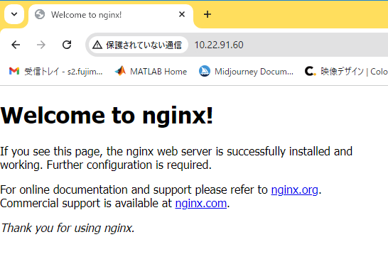
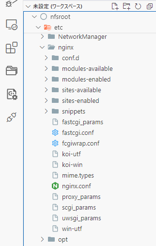
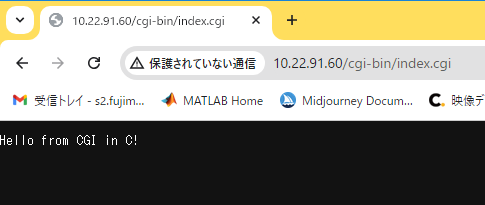
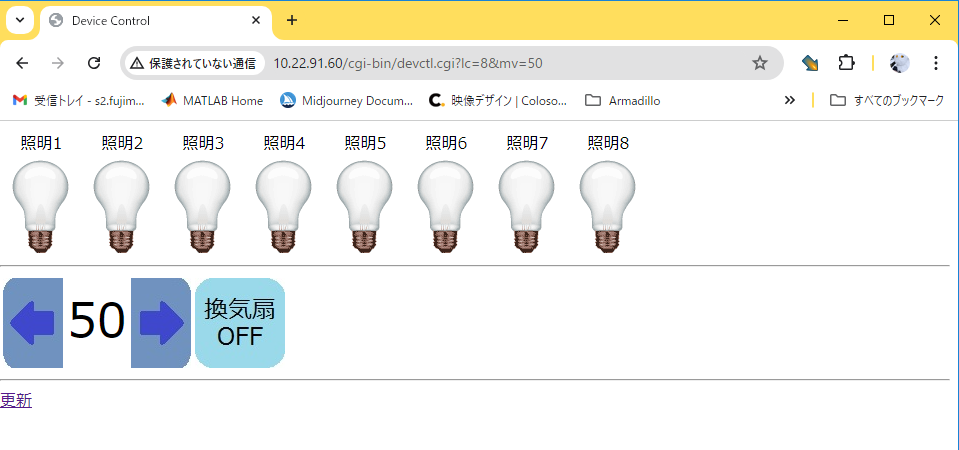
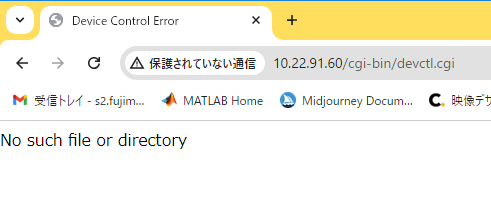
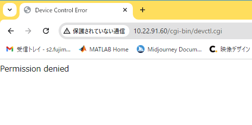

# 12.webapp Nginx

<!-- styleは、拡張機能 Markdown Preview Github Stylingをインストール-->
<!-- c:/Users/sfujimoto/.vscode/extensions/bierner.markdown-preview-github-styles-0.1.4/base.css -->
<!-- 参考URL: https://rui-log.com/vscode-markdown-preview-custom/ -->

[2024/7/18 Table of Contents]()

<!-- ctrl + ,  toc: level 1..3 へ変更-->

<div class="TOC">

<!-- @import "[TOC]" {cmd="toc" depthFrom=1 depthTo=2 orderedList=true} -->

<!-- code_chunk_output -->

1. [12.webapp Nginx](#12webapp-nginx)
    1. [目的](#目的)
    2. [構成データ](#構成データ)
    3. [HTTPプロトコル](#httpプロトコル)
    4. [CGI](#cgi)
    5. [Webサーバー Nginx](#webサーバー-nginx)
    6. [Nginx + FastCGI](#nginx--fastcgi)
    7. [Webアプリケーション devctl.cgi](#webアプリケーション-devctlcgi)
    8. [トラブル](#トラブル)
    9. [その他](#その他)

<!-- /code_chunk_output -->

</div>

<div style="page-break-before:always"></div>  <!-- PDFで改ページ-->

## 目的

組込みアプリケーション開発 12.webapp

## 構成データ

### /media/sf_ArmadilloX1/hwpwm/work/R06_2024/Apllication_debug/text/practice ディレクトリ

<details open><summary> ･･･/share/ArmadilloX1/hwpwm/<span style="color: red">work</span>/R06_2024/Application<span style="color: red">_debug</span>/<span style="color: red">text</span>/practice/ の構成</summary>

```bash{.line-numbers}
user@1204PC-Z490M:/mnt/v/VirtualBoxWork/share/ArmadilloX1/hwpwm/work/R06_2024/Application_debug/text/practice$ tree -aF -L 3
./
└── 12.webapp/
    ├── devctl.c*               <─────課題
    ├── drivers/                <───── デバイスドライバ
    │   ├── leds/               <───── Nginx は デバイスファイルの chmod 必要
    │   └── motor/              <───── Nginx は デバイスファイルの chmod 必要
    └── image/
        ├── arrow_l.jpg*        <───── 画像ファイル
        ├── arrow_r.jpg*        <─────
        ├── fan_off.jpg*        <─────
        ├── fan_on.jpg*         <─────
        ├── light_off.gif*      <─────
        └── light_on.gif*       <─────
```

</details>

## HTTPプロトコル

参考: [通信プロトコル実装実習(HTTPプロトコルとHTML)](https://jeedjp.sharepoint.com/:b:/s/R5747/Eb-ZoZFjtYBCjZGDKw0Z9B8BKuIDPIaK4lMYHRS8vTmKvQ?e=ZfIdU5) のテキスト

## CGI

参考:[通信プロトコル実装実習(CGIプログラミング)](https://jeedjp.sharepoint.com/:b:/s/R5747/EcJSSs43q2ZJvnZFGbU1A4YBkNAkt3pPVfzVnJBhhsO_2g?e=gOLbuH)のテキスト

## Webサーバー Nginx

### Nginx のデータ構成

| 項目               | 場所                                    |              |
| ------------------ | -------------------------------------- |---------------|
| ドキュメントルート | /work/linux/nfsroot/var/www/html/        | *.html       |
| 画像データ         | /work/linux/nfsroot/var/www/html/image/ | *.jpg, *.gif |
| CGI保存場所        | /work/linux/nfsroot/var/www/cgi-bin/    | *.py, *.cgi  |

<details open><summary> atmark@atde8:~$ tree -aF -L 3 /work/linux/nfsroot/var/www/ </summary>

```bash{.line-numbers}
atmark@atde8:~$ tree -aF -L 3 /work/linux/nfsroot/var/www/
/work/linux/nfsroot/var/www/
├── cgi-bin/                  <───── Nginx FastCGI 保存場所
│   ├── devctl.cgi*           <───── 課題
│   ├── index.cgi*            <───── テスト用（c言語）
│   └── index.py*             <───── テスト用（python）
└── html/                     <───── ドキュメントルート
    ├── image/                <───── 画像ファイル保存場所
    │   ├── arrow_l.jpg*      <───── 12.webapp/image からコピーしてきた画像ファイル
    │   ├── arrow_r.jpg*
    │   ├── fan_off.jpg*
    │   ├── fan_on.jpg*
    │   ├── light_off.gif*
    │   └── light_on.gif*
    └── index.nginx-debian.html <───── Nginx index.html
3 directories, 8 files
```

</details>

### lighttpd アンインストール（アンインストールしなくても良いかもしれない）

<details open><summary> root@armadillo:~# apt purge lighttpd </summary>

```bash{.line-numbers}
root@armadillo:~# apt purge lighttpd
パッケージリストを読み込んでいます... 完了
依存関係ツリーを作成しています
状態情報を読み取っています... 完了
以下のパッケージが自動でインストールされましたが、もう必要とされていません:
  libevent-core-2.1-6 libevent-pthreads-2.1-6 libfam0 libmariadb3 libopts25
  mariadb-common mysql-common sntp spawn-fcgi
これを削除するには 'apt autoremove' を利用してください。
以下のパッケージは「削除」されます:
  lighttpd* lighttpd-modules-ldap* lighttpd-modules-mysql*
アップグレード: 0 個、新規インストール: 0 個、削除: 3 個、保留: 0 個。
この操作後に 893 kB のディスク容量が解放されます。
続行しますか? [Y/n] Y
(データベースを読み込んでいます ... 現在 44793 個のファイルとディレクトリがインストールされています。)
lighttpd-modules-mysql (1.4.53-4+deb10u3) を削除しています ...
lighttpd-modules-ldap (1.4.53-4+deb10u3) を削除しています ...
lighttpd (1.4.53-4+deb10u3) を削除しています ...
man-db (2.8.5-2+deb10u1) のトリガを処理しています ...
(データベースを読み込んでいます ... 現在 44719 個のファイルとディレクトリがインストールされています。)
lighttpd (1.4.53-4+deb10u3) の設定ファイルを削除しています ...
dpkg: 警告: lighttpd の削除中、ディレクトリ '/etc/lighttpd/conf-enabled' が空でないため削除できませんでした
systemd (241-7~deb10u10) のトリガを処理しています ...
root@armadillo:~#
```

</details>

### Nginx インストール

##### apt install nginx-full

<details open><summary> root@armadillo:~# apt install nginx-full </summary>

```bash{.line-numbers}
root@armadillo:~# apt install nginx-full
パッケージリストを読み込んでいます... 完了
依存関係ツリーを作成しています
状態情報を読み取っています... 完了
以下のパッケージが自動でインストールされましたが、もう必要とされていません:
  libevent-core-2.1-6 libevent-pthreads-2.1-6 libfam0 libmariadb3 libopts25
  mariadb-common mysql-common sntp spawn-fcgi
これを削除するには 'apt autoremove' を利用してください。
以下の追加パッケージがインストールされます:
  libgd3 libjbig0 libjpeg62-turbo libnginx-mod-http-auth-pam
  libnginx-mod-http-dav-ext libnginx-mod-http-echo libnginx-mod-http-geoip
  libnginx-mod-http-image-filter libnginx-mod-http-subs-filter
  libnginx-mod-http-upstream-fair libnginx-mod-http-xslt-filter
  libnginx-mod-mail libnginx-mod-stream libtiff5 libwebp6 libxslt1.1
  nginx-common
提案パッケージ:
  libgd-tools fcgiwrap nginx-doc ssl-cert
以下のパッケージが新たにインストールされます:
  libgd3 libjbig0 libjpeg62-turbo libnginx-mod-http-auth-pam
  libnginx-mod-http-dav-ext libnginx-mod-http-echo libnginx-mod-http-geoip
  libnginx-mod-http-image-filter libnginx-mod-http-subs-filter
  libnginx-mod-http-upstream-fair libnginx-mod-http-xslt-filter
  libnginx-mod-mail libnginx-mod-stream libtiff5 libwebp6 libxslt1.1
  nginx-common nginx-full
アップグレード: 0 個、新規インストール: 18 個、削除: 0 個、保留: 0 個。
2,566 kB のアーカイブを取得する必要があります。
この操作後に追加で 4,428 kB のディスク容量が消費されます。
続行しますか? [Y/n] Y
取得:1 http://archive.debian.org/debian buster/main armhf libjpeg62-turbo armhf 1:1.5.2-2+deb10u1 [113 kB]
取得:2 http://archive.debian.org/debian buster/main armhf libjbig0 armhf 2.1-3.1+b2 [28.4 kB]
取得:3 http://security.debian.org buster/updates/main armhf libwebp6 armhf 0.6.1-2+deb10u3 [230 kB]
取得:4 http://security.debian.org buster/updates/main armhf libtiff5 armhf 4.1.0+git191117-2~deb10u9 [254 kB]
取得:5 http://security.debian.org buster/updates/main armhf libgd3 armhf 2.2.5-5.2+deb10u1 [117 kB]
取得:6 http://security.debian.org buster/updates/main armhf nginx-common all 1.14.2-2+deb10u5 [121 kB]
取得:7 http://security.debian.org buster/updates/main armhf libnginx-mod-http-auth-pam armhf 1.14.2-2+deb10u5 [92.5 kB]
取得:8 http://security.debian.org buster/updates/main armhf libxslt1.1 armhf 1.1.32-2.2~deb10u2 [217 kB]
取得:9 http://security.debian.org buster/updates/main armhf libnginx-mod-http-dav-ext armhf 1.14.2-2+deb10u5 [99.2 kB]
取得:10 http://security.debian.org buster/updates/main armhf libnginx-mod-http-echo armhf 1.14.2-2+deb10u5 [102 kB]
取得:11 http://security.debian.org buster/updates/main armhf libnginx-mod-http-geoip armhf 1.14.2-2+deb10u5 [93.7 kB]
取得:12 http://security.debian.org buster/updates/main armhf libnginx-mod-http-image-filter armhf 1.14.2-2+deb10u5 [96.9 kB]
取得:13 http://security.debian.org buster/updates/main armhf libnginx-mod-http-subs-filter armhf 1.14.2-2+deb10u5 [95.6 kB]
取得:14 http://security.debian.org buster/updates/main armhf libnginx-mod-http-upstream-fair armhf 1.14.2-2+deb10u5 [95.6 kB]
取得:15 http://security.debian.org buster/updates/main armhf libnginx-mod-http-xslt-filter armhf 1.14.2-2+deb10u5 [95.2 kB]
取得:16 http://security.debian.org buster/updates/main armhf libnginx-mod-mail armhf 1.14.2-2+deb10u5 [122 kB]
取得:17 http://security.debian.org buster/updates/main armhf libnginx-mod-stream armhf 1.14.2-2+deb10u5 [139 kB]
取得:18 http://security.debian.org buster/updates/main armhf nginx-full armhf 1.14.2-2+deb10u5 [453 kB]
2,566 kB を 1秒 で取得しました (2,043 kB/s)
debconf: delaying package configuration, since apt-utils is not installed
以前に未選択のパッケージ libjpeg62-turbo:armhf を選択しています。
(データベースを読み込んでいます ... 現在 44688 個のファイルとディレクトリがインストールされています。)
.../00-libjpeg62-turbo_1%3a1.5.2-2+deb10u1_armhf.deb を展開する準備をしています ...
libjpeg62-turbo:armhf (1:1.5.2-2+deb10u1) を展開しています...
以前に未選択のパッケージ libjbig0:armhf を選択しています。
.../01-libjbig0_2.1-3.1+b2_armhf.deb を展開する準備をしています ...
libjbig0:armhf (2.1-3.1+b2) を展開しています...
以前に未選択のパッケージ libwebp6:armhf を選択しています。
.../02-libwebp6_0.6.1-2+deb10u3_armhf.deb を展開する準備をしています ...
libwebp6:armhf (0.6.1-2+deb10u3) を展開しています...
以前に未選択のパッケージ libtiff5:armhf を選択しています。
.../03-libtiff5_4.1.0+git191117-2~deb10u9_armhf.deb を展開する準備をしています ...
libtiff5:armhf (4.1.0+git191117-2~deb10u9) を展開しています...
以前に未選択のパッケージ libgd3:armhf を選択しています。
.../04-libgd3_2.2.5-5.2+deb10u1_armhf.deb を展開する準備をしています ...
libgd3:armhf (2.2.5-5.2+deb10u1) を展開しています...
以前に未選択のパッケージ nginx-common を選択しています。
.../05-nginx-common_1.14.2-2+deb10u5_all.deb を展開する準備をしています ...
nginx-common (1.14.2-2+deb10u5) を展開しています...
以前に未選択のパッケージ libnginx-mod-http-auth-pam を選択しています。
.../06-libnginx-mod-http-auth-pam_1.14.2-2+deb10u5_armhf.deb を展開する準備をしています ...
libnginx-mod-http-auth-pam (1.14.2-2+deb10u5) を展開しています...
以前に未選択のパッケージ libxslt1.1:armhf を選択しています。
.../07-libxslt1.1_1.1.32-2.2~deb10u2_armhf.deb を展開する準備をしています ...
libxslt1.1:armhf (1.1.32-2.2~deb10u2) を展開しています...
以前に未選択のパッケージ libnginx-mod-http-dav-ext を選択しています。
.../08-libnginx-mod-http-dav-ext_1.14.2-2+deb10u5_armhf.deb を展開する準備をしています ...
libnginx-mod-http-dav-ext (1.14.2-2+deb10u5) を展開しています...
以前に未選択のパッケージ libnginx-mod-http-echo を選択しています。
.../09-libnginx-mod-http-echo_1.14.2-2+deb10u5_armhf.deb を展開する準備をしています ...
libnginx-mod-http-echo (1.14.2-2+deb10u5) を展開しています...
以前に未選択のパッケージ libnginx-mod-http-geoip を選択しています。
.../10-libnginx-mod-http-geoip_1.14.2-2+deb10u5_armhf.deb を展開する準備をしています ...
libnginx-mod-http-geoip (1.14.2-2+deb10u5) を展開しています...
以前に未選択のパッケージ libnginx-mod-http-image-filter を選択しています。
.../11-libnginx-mod-http-image-filter_1.14.2-2+deb10u5_armhf.deb を展開する準備をしています ...
libnginx-mod-http-image-filter (1.14.2-2+deb10u5) を展開しています...
以前に未選択のパッケージ libnginx-mod-http-subs-filter を選択しています。
.../12-libnginx-mod-http-subs-filter_1.14.2-2+deb10u5_armhf.deb を展開する準備をしています ...
libnginx-mod-http-subs-filter (1.14.2-2+deb10u5) を展開しています...
以前に未選択のパッケージ libnginx-mod-http-upstream-fair を選択しています。
.../13-libnginx-mod-http-upstream-fair_1.14.2-2+deb10u5_armhf.deb を展開する準備をしています ...
libnginx-mod-http-upstream-fair (1.14.2-2+deb10u5) を展開しています...
以前に未選択のパッケージ libnginx-mod-http-xslt-filter を選択しています。
.../14-libnginx-mod-http-xslt-filter_1.14.2-2+deb10u5_armhf.deb を展開する準備をしています ...
libnginx-mod-http-xslt-filter (1.14.2-2+deb10u5) を展開しています...
以前に未選択のパッケージ libnginx-mod-mail を選択しています。
.../15-libnginx-mod-mail_1.14.2-2+deb10u5_armhf.deb を展開する準備をしています ...
libnginx-mod-mail (1.14.2-2+deb10u5) を展開しています...
以前に未選択のパッケージ libnginx-mod-stream を選択しています。
.../16-libnginx-mod-stream_1.14.2-2+deb10u5_armhf.deb を展開する準備をしています ...
libnginx-mod-stream (1.14.2-2+deb10u5) を展開しています...
以前に未選択のパッケージ nginx-full を選択しています。
.../17-nginx-full_1.14.2-2+deb10u5_armhf.deb を展開する準備をしています ...
nginx-full (1.14.2-2+deb10u5) を展開しています...
nginx-common (1.14.2-2+deb10u5) を設定しています ...
Created symlink /etc/systemd/system/multi-user.target.wants/nginx.service → /lib/systemd/system/nginx.service.
libjbig0:armhf (2.1-3.1+b2) を設定しています ...
libjpeg62-turbo:armhf (1:1.5.2-2+deb10u1) を設定しています ...
libnginx-mod-http-auth-pam (1.14.2-2+deb10u5) を設定しています ...
libnginx-mod-http-geoip (1.14.2-2+deb10u5) を設定しています ...
libwebp6:armhf (0.6.1-2+deb10u3) を設定しています ...
libnginx-mod-http-echo (1.14.2-2+deb10u5) を設定しています ...
libnginx-mod-http-subs-filter (1.14.2-2+deb10u5) を設定しています ...
libxslt1.1:armhf (1.1.32-2.2~deb10u2) を設定しています ...
libtiff5:armhf (4.1.0+git191117-2~deb10u9) を設定しています ...
libnginx-mod-http-dav-ext (1.14.2-2+deb10u5) を設定しています ...
libnginx-mod-mail (1.14.2-2+deb10u5) を設定しています ...
libnginx-mod-stream (1.14.2-2+deb10u5) を設定しています ...
libnginx-mod-http-upstream-fair (1.14.2-2+deb10u5) を設定しています ...
libnginx-mod-http-xslt-filter (1.14.2-2+deb10u5) を設定しています ...
libgd3:armhf (2.2.5-5.2+deb10u1) を設定しています ...
libnginx-mod-http-image-filter (1.14.2-2+deb10u5) を設定しています ...
nginx-full (1.14.2-2+deb10u5) を設定しています ...
libc-bin (2.28-10+deb10u4) のトリガを処理しています ...
systemd (241-7~deb10u10) のトリガを処理しています ...
man-db (2.8.5-2+deb10u1) のトリガを処理しています ...
root@armadillo:~#
```

</details>

##### Nginx 状態確認

<details open><summary> root@armadillo:~# systemctl status nginx.service</summary>

```bash{.line-numbers}
root@armadillo:~# systemctl status nginx.service
● nginx.service - A high performance web server and a reverse proxy server
   Loaded: loaded (/lib/systemd/system/nginx.service; enabled; vendor preset: ena
   Active: active (running) since Sat 2024-07-13 17:38:51 JST; 28s ago
     Docs: man:nginx(8)
 Main PID: 3696 (nginx)
   Memory: 18.0M
   CGroup: /system.slice/nginx.service
           ├─3696 nginx: master process /usr/sbin/nginx -g daemon on; master_proc
           ├─3698 nginx: worker process
           └─3699 nginx: worker process

 7月 13 17:38:48 armadillo systemd[1]: Starting A high performance web server and
 7月 13 17:38:51 armadillo systemd[1]: Started A high performance web server and
root@armadillo:~#
```

</details>

##### Nginx バージョンチェック

<details open><summary> root@armadillo:~# nginx -v </summary>

```bash{.line-numbers}
root@armadillo:~# nginx -v
nginx version: nginx/1.14.2
```

</details>

##### <span style="color: red">Nginx 設定ファイルの構文チェック</span>

<details open><summary> root@armadillo:~# nginx -t </summary>

```bash{.line-numbers}
root@armadillo:~# nginx -t
nginx: the configuration file /etc/nginx/nginx.conf syntax is ok
nginx: configuration file /etc/nginx/nginx.conf test is successful
```

</details>

### Nginx 動作確認

##### Welcome ページ

<details open><summary> http://10.22.91.60</summary>

  

  

</details>

##### index.html の場所

<details open><summary> root@armadillo:~# ls -al /var/www/html/ </summary>

```bash{.line-numbers}
root@armadillo:~# ls -al /var/www/html/
合計 12
drwxr-xr-x 2 root root 4096  7月 13 17:38 .
drwxr-xr-x 4 root root 4096  7月 13 18:02 ..
-rw-r--r-- 1 root root  612  7月 13 17:38 index.nginx-debian.html
root@armadillo:~#
```

</details>

### Nginx index.py の動作確認

#### index.py

#### apt install fcgiwrap

<details open><summary> root@armadillo:~# apt install fcgiwrap </summary>

```bash{.line-numbers}
root@armadillo:~# apt install fcgiwrap
パッケージリストを読み込んでいます... 完了
依存関係ツリーを作成しています
状態情報を読み取っています... 完了
以下のパッケージが自動でインストールされましたが、もう必要とされていません:
  libevent-core-2.1-6 libevent-pthreads-2.1-6 libfam0 libmariadb3 libopts25
  mariadb-common mysql-common sntp
これを削除するには 'apt autoremove' を利用してください。
以下の追加パッケージがインストールされます:
  libfcgi-bin libfcgi0ldbl
以下のパッケージが新たにインストールされます:
  fcgiwrap libfcgi-bin libfcgi0ldbl
アップグレード: 0 個、新規インストール: 3 個、削除: 0 個、保留: 0 個。
180 kB のアーカイブを取得する必要があります。
この操作後に追加で 535 kB のディスク容量が消費されます。
続行しますか? [Y/n] Y
取得:1 http://archive.debian.org/debian buster/main armhf libfcgi0ldbl armhf 2.4.0-10 [151 kB]
取得:2 http://archive.debian.org/debian buster/main armhf fcgiwrap armhf 1.1.0-12 [17.4 kB]
取得:3 http://archive.debian.org/debian buster/main armhf libfcgi-bin armhf 2.4.0-10 [11.6 kB]
180 kB を 2秒 で取得しました (80.7 kB/s)
debconf: delaying package configuration, since apt-utils is not installed
以前に未選択のパッケージ libfcgi0ldbl:armhf を選択しています。
(データベースを読み込んでいます ... 現在 44856 個のファイルとディレクトリがインストールされています。)
.../libfcgi0ldbl_2.4.0-10_armhf.deb を展開する準備をしています ...
libfcgi0ldbl:armhf (2.4.0-10) を展開しています...
以前に未選択のパッケージ fcgiwrap を選択しています。
.../fcgiwrap_1.1.0-12_armhf.deb を展開する準備をしています ...
fcgiwrap (1.1.0-12) を展開しています...
以前に未選択のパッケージ libfcgi-bin を選択しています。
.../libfcgi-bin_2.4.0-10_armhf.deb を展開する準備をしています ...
libfcgi-bin (2.4.0-10) を展開しています...
libfcgi0ldbl:armhf (2.4.0-10) を設定しています ...
libfcgi-bin (2.4.0-10) を設定しています ...
fcgiwrap (1.1.0-12) を設定しています ...
Created symlink /etc/systemd/system/sockets.target.wants/fcgiwrap.socket → /lib/systemd/system/fcgiwrap.socket.
man-db (2.8.5-2+deb10u1) のトリガを処理しています ...
libc-bin (2.28-10+deb10u4) のトリガを処理しています ...
systemd (241-7~deb10u10) のトリガを処理しています ...
root@armadillo:~#
```

</details>

#### fcgiwrap.conf の作成

<details open><summary> root@armadillo:~# cp /usr/share/doc/fcgiwrap/examples/nginx.conf /etc/nginx/fcgiwrap.conf </summary>

```bash{.line-numbers}
root@armadillo:~# cp /usr/share/doc/fcgiwrap/examples/nginx.conf /etc/nginx/fcgiwrap.conf
```



</details>

##### fcgiwrap.conf（編集前）

<details open><summary> /work/linux/nfsroot/etc/nginx/fcgiwrap.conf </summary>

```bash{.line-numbers}
# Include this file on your nginx.conf to support debian cgi-bin scripts using
# fcgiwrap
location /cgi-bin/ {
  # Disable gzip (it makes scripts feel slower since they have to complete
  # before getting gzipped)
  gzip off;

  # Set the root to /usr/lib (inside this location this means that we are
  # giving access to the files under /usr/lib/cgi-bin)
  root	/usr/lib;

  # Fastcgi socket
  fastcgi_pass  unix:/var/run/fcgiwrap.socket;

  # Fastcgi parameters, include the standard ones
  include /etc/nginx/fastcgi_params;

  # Adjust non standard parameters (SCRIPT_FILENAME)
  fastcgi_param SCRIPT_FILENAME  /usr/lib$fastcgi_script_name;
}
```

</details>

##### fcgiwrap.conf（編集後）

<details open><summary> /work/linux/nfsroot/etc/nginx/fcgiwrap.conf </summary>

```bash{.line-numbers}
# Include this file on your nginx.conf to support debian cgi-bin scripts using
# fcgiwrap
location /cgi-bin/ {
  # Disable gzip (it makes scripts feel slower since they have to complete
  # before getting gzipped)
  gzip off;

  # Set the root to /usr/lib (inside this location this means that we are
  # giving access to the files under /usr/lib/cgi-bin)
  root	/var/www;  <───────────────────────────────────────────────────────── 変更

  # Fastcgi socket
  fastcgi_pass  unix:/var/run/fcgiwrap.socket;

  # Fastcgi parameters, include the standard ones
  include /etc/nginx/fastcgi_params;

  # Adjust non standard parameters (SCRIPT_FILENAME)
  #fastcgi_param SCRIPT_FILENAME  /usr/lib$fastcgi_script_name;
  fastcgi_param SCRIPT_FILENAME  $document_root$fastcgi_script_name; <──────── 変更
}
```

</details>

<details open><summary> root@armadillo:~# cat /etc/nginx/fcgiwrap.conf </summary>

```bash{.line-numbers}
root@armadillo:~# cat /etc/nginx/fcgiwrap.conf
# Include this file on your nginx.conf to support debian cgi-bin scripts using
# fcgiwrap
location /cgi-bin/ {
  # Disable gzip (it makes scripts feel slower since they have to complete
  # before getting gzipped)
  gzip off;

  # Set the root to /usr/lib (inside this location this means that we are
  # giving access to the files under /usr/lib/cgi-bin)
  root  /var/www;

  # Fastcgi socket
  fastcgi_pass  unix:/var/run/fcgiwrap.socket;

  # Fastcgi parameters, include the standard ones
  include /etc/nginx/fastcgi_params;

  # Adjust non standard parameters (SCRIPT_FILENAME)
  #fastcgi_param SCRIPT_FILENAME  /usr/lib$fastcgi_script_name;
  fastcgi_param SCRIPT_FILENAME  $document_root$fastcgi_script_name;
}
```

</details>

#### cgi-bin ディレクトリ作成 & パーミション変更

<details open><summary> root@armadillo:~# mkdir /var/www/cgi-bin </summary>

```bash{.line-numbers}
root@armadillo:~# mkdir /var/www/cgi-bin
```

</details>

<details open><summary> root@armadillo:~# chmod 755 /var/www/cgi-bin/ </summary>

```bash{.line-numbers}
root@armadillo:~# chmod 755 /var/www/cgi-bin/
```

</details>

<details open><summary> root@armadillo:~# ls -al </summary>

```bash{.line-numbers}
root@armadillo:~# ls -al /var/www/
合計 16
drwxr-xr-x  4 root root 4096  7月 13 18:02 .
drwxr-xr-x 12 root root 4096  7月 13 17:38 ..
drwxr-xr-x  2 root root 4096  7月 13 18:02 cgi-bin
drwxr-xr-x  2 root root 4096  7月 13 17:38 html
```

</details>

### sites-availabel/default の編集

#### 編集前

<details open><summary> /work/linux/nfsroot/etc/nginx/sites-available/default </summary>

```bash{.line-numbers}
##
# You should look at the following URL's in order to grasp a solid understanding
# of Nginx configuration files in order to fully unleash the power of Nginx.
# https://www.nginx.com/resources/wiki/start/
# https://www.nginx.com/resources/wiki/start/topics/tutorials/config_pitfalls/
# https://wiki.debian.org/Nginx/DirectoryStructure
#
# In most cases, administrators will remove this file from sites-enabled/ and
# leave it as reference inside of sites-available where it will continue to be
# updated by the nginx packaging team.
#
# This file will automatically load configuration files provided by other
# applications, such as Drupal or Wordpress. These applications will be made
# available underneath a path with that package name, such as /drupal8.
#
# Please see /usr/share/doc/nginx-doc/examples/ for more detailed examples.
##

# Default server configuration
#
server {
	listen 80 default_server;
	listen [::]:80 default_server;

	# SSL configuration
	#
	# listen 443 ssl default_server;
	# listen [::]:443 ssl default_server;
	#
	# Note: You should disable gzip for SSL traffic.
	# See: https://bugs.debian.org/773332
	#
	# Read up on ssl_ciphers to ensure a secure configuration.
	# See: https://bugs.debian.org/765782
	#
	# Self signed certs generated by the ssl-cert package
	# Don't use them in a production server!
	#
	# include snippets/snakeoil.conf;

	root /var/www/html;

	# Add index.php to the list if you are using PHP
	index index.html index.htm index.nginx-debian.html;

	server_name _;

	location / {
		# First attempt to serve request as file, then
		# as directory, then fall back to displaying a 404.
		try_files $uri $uri/ =404;
	}

	# pass PHP scripts to FastCGI server
	#
	#location ~ \.php$ {
	#	include snippets/fastcgi-php.conf;
	#
	#	# With php-fpm (or other unix sockets):
	#	fastcgi_pass unix:/run/php/php7.3-fpm.sock;
	#	# With php-cgi (or other tcp sockets):
	#	fastcgi_pass 127.0.0.1:9000;
	#}

	# deny access to .htaccess files, if Apache's document root
	# concurs with nginx's one
	#
	#location ~ /\.ht {
	#	deny all;
	#}
}


# Virtual Host configuration for example.com
#
# You can move that to a different file under sites-available/ and symlink that
# to sites-enabled/ to enable it.
#
#server {
#	listen 80;
#	listen [::]:80;
#
#	server_name example.com;
#
#	root /var/www/example.com;
#	index index.html;
#
#	location / {
#		try_files $uri $uri/ =404;
#	}
#}
```

</details>

#### 編集後

<details open><summary> /work/linux/nfsroot/etc/nginx/sites-available/default </summary>

```bash{.line-numbers}
##
# You should look at the following URL's in order to grasp a solid understanding
# of Nginx configuration files in order to fully unleash the power of Nginx.
# https://www.nginx.com/resources/wiki/start/
# https://www.nginx.com/resources/wiki/start/topics/tutorials/config_pitfalls/
# https://wiki.debian.org/Nginx/DirectoryStructure
#
# In most cases, administrators will remove this file from sites-enabled/ and
# leave it as reference inside of sites-available where it will continue to be
# updated by the nginx packaging team.
#
# This file will automatically load configuration files provided by other
# applications, such as Drupal or Wordpress. These applications will be made
# available underneath a path with that package name, such as /drupal8.
#
# Please see /usr/share/doc/nginx-doc/examples/ for more detailed examples.
##

# Default server configuration
#
server {
	listen 80 default_server;
	listen [::]:80 default_server;

	# SSL configuration
	#
	# listen 443 ssl default_server;
	# listen [::]:443 ssl default_server;
	#
	# Note: You should disable gzip for SSL traffic.
	# See: https://bugs.debian.org/773332
	#
	# Read up on ssl_ciphers to ensure a secure configuration.
	# See: https://bugs.debian.org/765782
	#
	# Self signed certs generated by the ssl-cert package
	# Don't use them in a production server!
	#
	# include snippets/snakeoil.conf;

	root /var/www/html;

	# Add index.php to the list if you are using PHP
	index index.html index.htm index.nginx-debian.html;

	server_name myAlmadilloX1.chugoku-pc.ac.jp; <───────────────────────────────────────── 適当

	location / {
		# First attempt to serve request as file, then
		# as directory, then fall back to displaying a 404.
		try_files $uri $uri/ =404;
	}

	# pass PHP scripts to FastCGI server
	#
	#location ~ \.php$ {
	#	include snippets/fastcgi-php.conf;
	#
	#	# With php-fpm (or other unix sockets):
	#	fastcgi_pass unix:/run/php/php7.3-fpm.sock;
	#	# With php-cgi (or other tcp sockets):
	#	fastcgi_pass 127.0.0.1:9000;
	#}

	# deny access to .htaccess files, if Apache's document root
	# concurs with nginx's one
	#
	#location ~ /\.ht {
	#	deny all;
	#}
  include fcgiwrap.conf; <───────────────────────────────────────── 追加


# Virtual Host configuration for example.com
#
# You can move that to a different file under sites-available/ and symlink that
# to sites-enabled/ to enable it.
#
#server {
#	listen 80;
#	listen [::]:80;
#
#	server_name example.com;
#
#	root /var/www/example.com;
#	index index.html;
#
#	location / {
#		try_files $uri $uri/ =404;
#	}
#}
```

</details>

#### チェック

<details open><summary> root@armadillo:~# nginx -t </summary>

```bash{.line-numbers}
root@armadillo:~# nginx -t
nginx: the configuration file /etc/nginx/nginx.conf syntax is ok
nginx: configuration file /etc/nginx/nginx.conf test is successful
```

</details>

### nginex 再起動

<details open><summary> root@armadillo:~# systemctl restart nginx.service  </summary>

```bash{.line-numbers}
root@armadillo:~# systemctl restart nginx.service
```

</details>

### nginx 状態確認

<details open><summary> root@armadillo:~# systemctl status nginx.service </summary>

```bash{.line-numbers}
root@armadillo:~# systemctl status nginx.service
● nginx.service - A high performance web server and a reverse proxy server
   Loaded: loaded (/lib/systemd/system/nginx.service; enabled; vendor preset: ena
   Active: active (running) since Sat 2024-07-13 18:19:58 JST; 1min 26s ago
     Docs: man:nginx(8)
  Process: 4396 ExecStartPre=/usr/sbin/nginx -t -q -g daemon on; master_process o
  Process: 4418 ExecStart=/usr/sbin/nginx -g daemon on; master_process on; (code=
 Main PID: 4423 (nginx)
   Memory: 2.0M
   CGroup: /system.slice/nginx.service
           ├─4423 nginx: master process /usr/sbin/nginx -g daemon on; master_proc
           ├─4425 nginx: worker process
           └─4426 nginx: worker process

 7月 13 18:19:58 armadillo systemd[1]: Starting A high performance web server and
 7月 13 18:19:58 armadillo systemd[1]: nginx.service: Failed to parse PID from fi
 7月 13 18:19:58 armadillo systemd[1]: Started A high performance web server and
root@armadillo:~#
```

</details>

### index.py

<details open><summary> /var/www/cgi-bin/index.py の新規作成 </summary>

```bash{.line-numbers}
#!/usr/bin/env python

print "Content-type: text/html\n\n"
print "<html>\n<body>"
print "<div style=\"width: 100%; font-size: 40px; font-weight: bold; text-align: center;\">"
print "Python Script Test Page"
print "</div>\n</body>\n</html>"
```

</details>

<details open><summary> root@armadillo:/var/www/cgi-bin# touch index.py </summary>

```bash{.line-numbers}
root@armadillo:~# cd /var/www/cgi-bin/

root@armadillo:/var/www/cgi-bin# touch index.py
```

</details>

<details open><summary> root@armadillo:/var/www/cgi-bin# cat index.py </summary>

```py{.line-numbers}
root@armadillo:/var/www/cgi-bin# cat index.py
#!/usr/bin/env python

print "Content-type: text/html\n\n"
print "<html>\n<body>"
print "<div style=\"width: 100%; font-size: 40px; font-weight: bold; text-align: center;\">"
print "Python Script Test Page"
print "</div>\n</body>\n</html>"
```

</details>

#### パーミションの変更

<details open><summary> root@armadillo:/var/www/cgi-bin# chmod 755 index.py </summary>

```bash{.line-numbers}
root@armadillo:/var/www/cgi-bin# chmod 755 index.py

root@armadillo:/var/www/cgi-bin# ls -al
合計 12
drwxr-xr-x 2 root root 4096  7月 13 18:23 .
drwxr-xr-x 4 root root 4096  7月 13 18:02 ..
-rwxr-xr-x 1 root root  240  7月 13 18:24 index.py
```

</details>

### index.py 確認

<details open><summary> http://10.22.91.60/cgi-bin/index.py </summary>

	

  

</details>

## Nginx + FastCGI

[FastCGI Developer's Kit](https://fastcgi-archives.github.io/FastCGI_Developers_Kit_FastCGI.html)

### /work/linux/nfsroot/etc/nginx/fcgiwrap.conf （再編集）

<details open><summary> /work/linux/nfsroot/etc/nginx/fcgiwrap.conf </summary>

```bash{.line-numbers}
# Include this file on your nginx.conf to support debian cgi-bin scripts using
# fcgiwrap
location /cgi-bin/ {
  # Disable gzip (it makes scripts feel slower since they have to complete
  # before getting gzipped)
  gzip off;

  # Set the root to /usr/lib (inside this location this means that we are
  # giving access to the files under /usr/lib/cgi-bin)
  root	/var/www;

  # Fastcgi socket
  fastcgi_pass  unix:/var/run/fcgiwrap.socket;

  # Fastcgi parameters, include the standard ones
  include /etc/nginx/fastcgi_params;

  # Adjust non standard parameters (SCRIPT_FILENAME)
  #fastcgi_param SCRIPT_FILENAME  /usr/lib$fastcgi_script_name;
  fastcgi_param SCRIPT_FILENAME  $document_root$fastcgi_script_name;

  fastcgi_index index.cgi; <──────────────────────────────────────── 追加

}
```

</details>

### apt install libfcgi-dev（不要かも）

<details open><summary> root@armadillo:~# apt install libfcgi-dev </summary>

```bash{.line-numbers}
root@armadillo:~# apt install libfcgi-dev
パッケージリストを読み込んでいます... 完了
依存関係ツリーを作成しています
状態情報を読み取っています... 完了
以下のパッケージが自動でインストールされましたが、もう必要とされていません:
  libevent-core-2.1-6 libevent-pthreads-2.1-6 libfam0 libmariadb3 libopts25
  mariadb-common mysql-common sntp
これを削除するには 'apt autoremove' を利用してください。
以下のパッケージが新たにインストールされます:
  libfcgi-dev
アップグレード: 0 個、新規インストール: 1 個、削除: 0 個、保留: 0 個。
29.6 kB のアーカイブを取得する必要があります。
この操作後に追加で 106 kB のディスク容量が消費されます。
取得:1 http://archive.debian.org/debian buster/main armhf libfcgi-dev armhf 2.4.0-10 [29.6 kB]
29.6 kB を 1秒 で取得しました (27.7 kB/s)
debconf: delaying package configuration, since apt-utils is not installed
以前に未選択のパッケージ libfcgi-dev:armhf を選択しています。
(データベースを読み込んでいます ... 現在 44913 個のファイルとディレクトリがインストールされています。)
.../libfcgi-dev_2.4.0-10_armhf.deb を展開する準備をしています ...
libfcgi-dev:armhf (2.4.0-10) を展開しています...
libfcgi-dev:armhf (2.4.0-10) を設定しています ...
root@armadillo:~#
```

</details>

### apt install spawn-fcgi（不要かも要調査）

<details open><summary> root@armadillo:~# apt install spawn-fcgi </summary>

```bash{.line-numbers}
root@armadillo:~# apt install spawn-fcgi
パッケージリストを読み込んでいます... 完了
依存関係ツリーを作成しています
状態情報を読み取っています... 完了
spawn-fcgi はすでに最新バージョン (1.6.4-2) です。
spawn-fcgi は手動でインストールしたと設定されました。
以下のパッケージが自動でインストールされましたが、もう必要とされていません:
  libevent-core-2.1-6 libevent-pthreads-2.1-6 libfam0 libmariadb3 libopts25
  mariadb-common mysql-common sntp
これを削除するには 'apt autoremove' を利用してください。
アップグレード: 0 個、新規インストール: 0 個、削除: 0 個、保留: 0 個。
root@armadillo:~#
```

</details>

#### Nginx再起動

<details open><summary> root@armadillo:~# nginx -t </summary>

```bash{.line-numbers}
root@armadillo:~# nginx -t
nginx: the configuration file /etc/nginx/nginx.conf syntax is ok
nginx: configuration file /etc/nginx/nginx.conf test is successful
```

</details>

<details open><summary> root@armadillo:~# systemctl restart nginx.service </summary>

```bash{.line-numbers}
root@armadillo:~# systemctl restart nginx.service
```

</details>

### C言語によるFastCGI テスト

#### ソース

##### index.c

<details open><summary> atmark@atde8:/media/sf_ArmadilloX1/hwpwm/work/R06_2024/Application_debug/text/practice-example/12.webapp$ cat index.c </summary>

```bash{.line-numbers}
atmark@atde8:/media/sf_ArmadilloX1/hwpwm/work/R06_2024/Application_debug/text/practice-example/12.webapp$ cat index.c
```

</details>

##### Makefile

<details open><summary> $ cat Makefile</summary>

```bash{.line-numbers}
CC = arm-linux-gnueabihf-gcc
TARGET = index <─────────────────────────────────────── 変更
#CFLAGS = -I/work/linux/nfsroot/usr/local/include
CFLAGS_DEBUG =  -gdwarf-2 -O0
#LDFLAGS = -L/work/linux/nfsroot/usr/local/lib
#LIBS = -lts

all: $(TARGET)

devctl: devctl.c
	$(CC) -o $(TARGET).cgi $^ $(CFLAGS) $(CFLAGS_DEBUG)

index : index.c
	$(CC) -o $(TARGET).cgi $^ $(CFLAGS) $(CFLAGS_DEBUG)

myinstall :
	cp -p $(TARGET).cgi /work/linux/nfsroot/var/www/cgi-bin/
	chmod 755           /work/linux/nfsroot/var/www/cgi-bin/$(TARGET).cgi
	cp -p $(TARGET).cgi /media/sf_ArmadilloX1/hwpwm/dbg/debug_share_hwpwm/R06_2024/04_practice
	cp -p $(TARGET).c   /media/sf_ArmadilloX1/hwpwm/dbg/debug_share_hwpwm/R06_2024/04_practice
	cp -r ./image       /work/linux/nfsroot/var/www/html/
	chmod -R 755        /work/linux/nfsroot/var/www/html/image

clean:
	rm -f $(TARGET)

.PHONY: clean
```

</details>

#### make

<details open><summary> $ make index </summary>

```bash{.line-numbers}
atmark@atde8:/media/sf_ArmadilloX1/hwpwm/work/R06_2024/Application_debug/text/practice-example/12.webapp$ make
arm-linux-gnueabihf-gcc -o index.cgi index.c  -gdwarf-2 -O0
```

</details>

#### sudo make myinstall

<details open><summary> $ sudo make myinstall </summary>

```bash{.line-numbers}
atmark@atde8:/media/sf_ArmadilloX1/hwpwm/work/R06_2024/Application_debug/text/practice-example/12.webapp$ sudo make myinstall
cp -p index.cgi /work/linux/nfsroot/var/www/cgi-bin/
chmod 755 /work/linux/nfsroot/var/www/cgi-bin/devctl.cgi
cp -p index.cgi /media/sf_ArmadilloX1/hwpwm/dbg/debug_share_hwpwm/R06_2024/04_practice
cp -p index.c   /media/sf_ArmadilloX1/hwpwm/dbg/debug_share_hwpwm/R06_2024/04_practice
cp -r ./image       /work/linux/nfsroot/var/www/cgi-bin/
chmod -R 755        /work/linux/nfsroot/var/www/html/image
```

</details>

#### パーミションの確認

<details open><summary> root@armadillo:/var/www/cgi-bin# ls -al </summary>

```bash{.line-numbers}
root@armadillo:/var/www/cgi-bin# ls -al
合計 24
drwxr-xr-x 2 root root  4096  7月 14 18:14 .
drwxr-xr-x 4 root root  4096  7月 13 18:02 ..
-rwxr-xr-x 1 root  998 10856  7月 14 18:13 index.cgi
-rwxr-xr-x 1 root root   240  7月 13 18:24 index.py
```

</details>

### index.cgi の動作確認

<details open><summary> http://10.22.91.60/cgi-bin/index.cgi </summary>

  

  

</details>

## Webアプリケーション devctl.cgi

### 仕様

#### ネットワーク構成


#### 画面レイアウト例


<details open><summary> chrome メニュー「その他のルール」-「デベロッパーモード」</summary>


Webページを「名前を付けて保存」
[DeviceControl.html](<assets/20240715/Device Control.html>)

```HTML{.line-numbers}
<html>

<head>
    <title>Device Control</title>
    <style data-emotion="css" data-s=""></style>
</head>

<body style="transition: margin 0.25s cubic-bezier(0, 0, 0.3, 1) 0s; margin-left: 0px;">
    <table>
        <tbody>
            <tr>
                <td align="center">照明1</td>
                <td align="center">照明2</td>
                <td align="center">照明3</td>
                <td align="center">照明4</td>
                <td align="center">照明5</td>
                <td align="center">照明6</td>
                <td align="center">照明7</td>
                <td align="center">照明8</td>
            </tr>
            <tr>
                <td>
                    <a href="?lc=1&amp;mv=50"></a>
                </td>
                <td>
                    <a href="?lc=2&amp;mv=50"></a>
                </td>
                <td>
                    <a href="?lc=3&amp;mv=50"></a>
                </td>
                <td>
                    <a href="?lc=4&amp;mv=50"></a>
                </td>
                <td>
                    <a href="?lc=5&amp;mv=50"></a>
                </td>
                <td>
                    <a href="?lc=6&amp;mv=50"></a>
                </td>
                <td>
                    <a href="?lc=7&amp;mv=50"></a>
                </td>
                <td>
                    <a href="?lc=8&amp;mv=50"></a>
                </td>
            </tr>
        </tbody>
    </table>
    <hr>
    <table>
        <tbody>
            <tr>
                <td>
                    <a href="?mv=40"></a>
                </td>
                <td>
                    <font size="7"> 50 </font>
                </td>
                <td><a href="?mv=60"></a>
                </td>
                <td>
                    <a href="?mc=50"></a>
                </td>
            </tr>
        </tbody>
    </table>
    <hr>
    <a href="devctl.cgi">更新</a>


    <div id="vt-sidebar-root">
        <div id="vt-sidebar-container" class="css-1xahjpf css-1gfm7th css-1yw75t3 css-azetmj css-i87elh ">
            <div
                style="position: relative; user-select: auto; border-image: linear-gradient(rgb(255, 131, 7) 0%, rgb(255, 176, 112) 100%) 30 / 1 / 0 stretch; width: 250px; height: 100%; max-width: 716px; min-width: 250px; box-sizing: border-box; flex-shrink: 0;">
                <div style="display: flex; height: 100%;">
                    <div style="flex: 1 1 0%;"><iframe title="vt-sidebar-iframe" class="css-19x99hd"
                            src="chrome-extension://pddljdmihkpdfpkgmbhdomeeifpklgnm/sidebar.html"
                            style="background-position: center center; background-repeat: no-repeat; height: 100vh;"></iframe>
                    </div>
                </div>
                <div></div>
            </div>
        </div>
    </div>
    <div id="tab-preview-frame-root"
        style="transition: all 0.1s ease-in-out 0s; position: fixed; z-index: -100; visibility: hidden;"></div>
    <div id="vt-update-notice"></div>
</body>

</html>
```

</details>

#### 初期状態

- 初回アクセスで現在のデバイスの状態表示

#### 照明コントロール機能の仕様

- 照明1～8のいずれかのアイコンがクリックされたら、LEDの点灯・消灯を切り替え
- LED消灯中は灰色の電球アイコン、点灯中は緑色の電球アイコンを表示

#### 換気扇コントロール機能の仕様

- 初期状態はモータ停止、回転速度の初期値は50
- 現在のモータ速度を左矢印ボタンと右矢印ボタンの間に表示
- モータ停止時に換気扇アイコンがクリックされたら、表示されている速度でモータを回転
- モータ動作中に換気扇アイコンがクリックされたらモータを停止。表示速度は変更しない
- 左矢印アイコンがクリックされたらモータ速度表示を10減。下限0
- 右矢印アイコンがクリックされたらモータ速度表示を10増。上限100
- モータ速度変更時、モータ動作中であれば直ちにモータの速度を変更
- モータ停止中は水色の換気扇アイコン、モータ動作中はオレンジの換気扇アイコンを表示

#### 利用する画像データ

| 画像                              | 識別子               | 用途         |
| --------------------------------- | -------------------- | ------------ |
|  | /image/light_off.gif | 照明 OFF     |
|   | /image/light_on.gif  | 照明 ON      |
|    | /image/fan_off.jpg   | 換気扇 OFF   |
|     | /image/fan_on.jpg    | 換気扇 ON    |
|    | /image/arrow_l.jpg   | 回転速度減少 |
|    | /image/arrow_r.jpg   | 回転速度増加 |

!!! warning 画像ファイルのパーミションに注意すること

<details open><summary> $ sudo cp image -dR /work/linux/nfsroot/var/www/html/ </summary>

```bash
atmark@atde8:/media/sf_ArmadilloX1/hwpwm/work/R06_2024/Application_debug/text/practice-example/12.webapp$ sudo cp image -dR /work/linux/nfsroot/var/www/html/
```

</details>

<details open><summary> root@armadillo:/var/www# chmod -R 755 html/image</summary>

```bash
root@armadillo:/var/www# chmod -R 755 html/image
```

</details>

<details open><summary> root@armadillo:/var/www# ls -al </summary>

```bash{.line-numbers}
root@armadillo:/var/www# ls -al
合計 16
drwxr-xr-x  4 root root 4096  7月 15 14:04 .
drwxr-xr-x 12 root root 4096  7月 13 17:38 ..
drwxr-xr-x  2 root root 4096  7月 15 14:04 cgi-bin
drwxr-xr-x  3 root root 4096  7月 15 13:31 html

root@armadillo:/var/www# ls -la html/
合計 16
drwxr-xr-x 3 root root 4096  7月 15 13:31 .
drwxr-xr-x 4 root root 4096  7月 15 14:04 ..
drwxr-xr-x 2 root root 4096  7月 15 13:31 image
-rw-r--r-- 1 root root  612  7月 13 17:38 index.nginx-debian.html

root@armadillo:/var/www# ls -la html/image/
合計 40
drwxr-xr-x 2 root root 4096  7月 15 13:31 .
drwxr-xr-x 3 root root 4096  7月 15 13:31 ..
-rwxr-xr-x 1 root root 1757  7月 15 14:52 arrow_l.jpg
-rwxr-xr-x 1 root root 1922  7月 15 14:52 arrow_r.jpg
-rwxr-xr-x 1 root root 4792  7月 15 14:52 fan_off.jpg
-rwxr-xr-x 1 root root 4507  7月 15 14:52 fan_on.jpg
-rwxr-xr-x 1 root root 1822  7月 15 14:52 light_off.gif
-rwxr-xr-x 1 root root 1865  7月 15 14:52 light_on.gif
root@armadillo:/var/www#
```

</details>

### CGIプログラム

#### 構成


#### CGIへのパラメータ

GETメソッドで以下のパラメータをCGIプログラムへ渡す

| パラメータ | 内容                          |
| ---------- | ----------------------------- |
| lc=n       | 照明のON･OFF n=1～8           |
| mv=n       | 換気扇の回転速度変更 n=1～100 |
| mc=n       | 換気扇のON･OFF n=1～100       |

##### GETメソッドの例

http://(ArmadilloX1のIPアドレス):80/cgi-bin/devctl.cgi<span style="color: red">?</span>lc=1<span style="color: red">&</span>mv=40

#### devctl.cgi のソース devctl.c

<details open><summary> 12.webapp/devctl.c </summary>

```c{.line-numbers}
#include <stdio.h>
#include <fcntl.h>
#include <string.h>
#include <errno.h>
#include <unistd.h>
#include <stdlib.h>

#define LED_FILE	"/sys/class/leds/led_ext/brightness" <───────― chmod 777 必要
#define MOTOR_FILE	"/sys/class/motor/motor0/motor_rotation" <── chmod 777 必要
#define BUFSIZE		16

int main(int argc, char **argv)
{
	int fd_led, fd_mt;
	int val_led, val_mt;
	int q_val;
	int ret;
	char *p, *q;
	int i;
	char buf[BUFSIZE];
	int motor_on = 0;

	/*** Question 1 ***/

	/*** Question 2 ***/

	// 環境変数QUERY_STRINGからパラメータを取得します。
	q = (char *)getenv("QUERY_STRING");

	// 取得したパラメータを処理するまで繰り返します。
	while(q){
		p = strchr(q, '&');
		if (p)
			*p = '\0';

		// パラメータから"lc"を探します。
		if (!strncmp(q, "lc=", 3)){
			q_val = strtol(q + 3, NULL, 10);

			/*** Question 3 ***/

		// パラメータから"mv"を探します。
		} else if (!strncmp(q, "mv=", 3)){
			q_val = strtol(q + 3, NULL, 10);

			// q_valの値に基づいてモータの駆動状態を変更します。
			if (val_mt){
				ret = dprintf(fd_mt, "%d", q_val);
				if (ret < 0)
					goto print_err;
				motor_on = 1;
			}
			val_mt = q_val;

		// パラメータから"mc"を探します。
		} else if (!strncmp(q, "mc=", 3)){
			q_val = strtol(q + 3, NULL, 10);

			/*** Question 4 ***/

			if (ret < 0)
				goto print_err;
			motor_on = val_mt ? 0 : 1;
			val_mt = q_val;
		}

		// パラメータがなければ、繰り返しを抜けます。
		q = (p ? p + 1 : NULL);
	}

	// val_mtが0なら初期値をセットします。
	if (val_mt == 0)
		val_mt = 50;

	// LEDデバイスをクローズします。
	close(fd_led);

	// モータデバイスをクローズします。
	close(fd_mt);

	/*** Question 5 ***/

	printf("<html>\n");
	printf("<head>\n");
	printf("<title>Device Control</title>\n");
	printf("</head>\n");
	printf("<body>\n");

	printf("<table>\n");
	printf("<tr>\n");

	// 「照明」の文字を並べます。
	for (i = 0; i < 8; i++){
		printf("<td align=\"center\">照明%d</td>\n", i + 1);
	}
	printf("</tr>\n");
	printf("<tr>\n");

	// 電球アイコンを表示し、並べます。
	for (i = 0; i < 8; i++, val_led >>= 1){
		printf("<td>\n");
		printf("<a href=\"?lc=%d&mv=%d\">", i + 1, val_mt);

		/*** Question 6 ***/

		printf("</a>\n");
		printf("</td>\n");
	}
	printf("</tr>\n");
	printf("</table>\n");
	printf("<hr>\n");

	printf("<table>\n");
	printf("<tr>\n");
	printf("<td>\n");

	/*** Question 7 ***/

	printf("</td>\n");
	printf("<td>\n");
	printf("<font size=\"7\">");
	printf(" %d ", val_mt);
	printf("</font>\n");
	printf("</td>\n");
	printf("<td>");

	/*** Question 8 ***/

	printf("</td>\n");
	printf("<td>\n");

	/*** Question 9 ***/

	printf("</a>\n");
	printf("</td>\n");
	printf("</tr>\n");
	printf("</table>\n");

	printf("<hr>\n");
	printf("<a href=\"devctl.cgi\">更新</a>\n");

	printf("</body>\n");
	printf("</html>\n");

	return 0;

print_err:
	printf("Content-type: text/html\n\n");
	printf("<html>\n");
	printf("<head>\n");
	printf("<title>Device Control Error</title>\n");
	printf("</head>\n");
	printf("<body>\n");
	printf("%s\n", strerror(errno));
	printf("</body>\n");
	printf("</html>\n");

	return 0;
}
```

</details>

| 項目 | 内容                     |
| ---- | ------------------------ |
| Q1   | 必要なデバイスオープン   |
| Q2   | デバイスの現在の値を取得 |
| Q3   | LEDの点灯状態を変更      |
| Q4   | モータの回転状態を変更   |
| Q5   | HTTPヘッダ               |
| Q6   | 電球アイコンの表示       |
| Q7   | 左矢印アイコンの表示     |
| Q8   | 右矢印アイコンの表示     |
| Q7   | 換気扇アイコンの表示     |

##### Makefile

<details open><summary> 12.webapp/Makefile </summary>

```bash{.line-numbers}
CC = arm-linux-gnueabihf-gcc
TARGET = devctl
#CFLAGS = -I/work/linux/nfsroot/usr/local/include
CFLAGS_DEBUG =  -gdwarf-2 -O0
#LDFLAGS = -L/work/linux/nfsroot/usr/local/lib
#LIBS = -lts

all: $(TARGET)

devctl: devctl.c
	$(CC) -o $(TARGET).cgi $^ $(CFLAGS) $(CFLAGS_DEBUG)

index : index.c
	$(CC) -o $(TARGET).cgi $^ $(CFLAGS) $(CFLAGS_DEBUG)

myinstall :
	cp -p $(TARGET).cgi /work/linux/nfsroot/var/www/cgi-bin/
	chmod 755           /work/linux/nfsroot/var/www/cgi-bin/$(TARGET).cgi
	cp -p $(TARGET).cgi /media/sf_ArmadilloX1/hwpwm/dbg/debug_share_hwpwm/R06_2024/04_practice
	cp -p $(TARGET).c   /media/sf_ArmadilloX1/hwpwm/dbg/debug_share_hwpwm/R06_2024/04_practice
	cp -r ./image       /work/linux/nfsroot/var/www/html/
	chmod -R 755        /work/linux/nfsroot/var/www/html/image

clean:
	rm -f $(TARGET)

.PHONY: clean
```

</details>

### 動作確認

##### make clean

<details open><summary> $ make clean </summary>

```bash{.line-numbers}
atmark@atde8:/media/sf_ArmadilloX1/hwpwm/work/R06_2024/Application_debug/text/practice-example/12.webapp$ make clean
rm -f devctl
```

</details>

##### make

<details open><summary> $ make devctl </summary>

```bash{.line-numbers}
atmark@atde8:/media/sf_ArmadilloX1/hwpwm/work/R06_2024/Application_debug/text/practice-example/12.webapp$ make devctl
arm-linux-gnueabihf-gcc -o devctl.cgi devctl.c  -gdwarf-2 -O0
```

</details>

##### sudo make myinstall

<details open><summary> $ sudo make myinstall </summary>

```bash{.line-numbers}
atmark@atde8:/media/sf_ArmadilloX1/hwpwm/work/R06_2024/Application_debug/text/practice-example/12.webapp$ sudo make myinstall
cp -p devctl.cgi /work/linux/nfsroot/var/www/cgi-bin/
chmod 755 /work/linux/nfsroot/var/www/cgi-bin/devctl.cgi
cp -p devctl.cgi /media/sf_ArmadilloX1/hwpwm/dbg/debug_share_hwpwm/R06_2024/04_practice
cp -p devctl.c   /media/sf_ArmadilloX1/hwpwm/dbg/debug_share_hwpwm/R06_2024/04_practice
cp -r ./image       /work/linux/nfsroot/var/www/cgi-bin/
chmod -R 755        /work/linux/nfsroot/var/www/html/image
```

</details>

#### devctl.cgi のパーミション確認

<details open><summary> root@armadillo:/var/www# ls -al cgi-bin/ </summary>

```bash{.line-numbers}
root@armadillo:/var/www# ls -al cgi-bin/
合計 40
drwxr-xr-x 2 root root  4096  7月 15 14:04 .
drwxr-xr-x 4 root root  4096  7月 15 14:04 ..
-rwxr-xr-x 1 root  998 16364  7月 15 14:52 devctl.cgi
-rwxr-xr-x 1 root  998 10856  7月 14 18:13 index.cgi
-rwxr-xr-x 1 root root   240  7月 13 18:24 index.py
```

</details>

#### CSIDEでロード

<details open><summary> メニュー「ファイル」-「ロード」</summary>

  

</details>

#### insmod（既にinsmod 済みなら割愛）

<details open><summary> # insmod leds.ko & #insmod motor_hwpwm </summary>

```bash{.line-numbers}
root@armadillo:/lib/modules/4.9.133-at27/extra# insmod leds.ko
root@armadillo:/lib/modules/4.9.133-at27/extra# insmod motor_hwpwm.ko
root@armadillo:/lib/modules/4.9.133-at27/extra# lsmod
Module                  Size  Used by
motor_hwpwm             4415  0
leds                    2103  0
```

</details>

#### <span style="color: red">デバイスファイルのパーミション変更</span>

<details open><summary> root@armadillo:/sys/class/leds/led_ext# chmod 777 brightness </summary>

```bash{.line-numbers}
root@armadillo:/sys/class/leds/led_ext# chmod 777 brightness
root@armadillo:/sys/class/leds/led_ext# chmod 777 ../../motor/motor0/motor_rotation
```

</details>

### 実行結果

#### Webブラウザによる動作確認

<details open><summary> devctl を Webブラウザから実行している様子 </summary>

  

  

  [https://youtu.be/JNXQb-oGVOM](https://youtu.be/JNXQb-oGVOM)

  <video controls src="assets/20240715/20240715_Nginx_chrome_devctl.mp4" title="Title" width="1024"></video>

</details>

#### curl による動作確認

<details open><summary> root@armadillo:~# curl http://10.22.91.60/cgi-bin/devctl.cgi?lc=1 </summary>

```bash{.line-numbers}
root@armadillo:~# curl http://10.22.91.60/cgi-bin/devctl.cgi?lc=1
<html>
<head>
<title>Device Control</title>
</head>
<body>
<table>
<tr>
<td align="center">照明1</td>
<td align="center">照明2</td>
<td align="center">照明3</td>
<td align="center">照明4</td>
<td align="center">照明5</td>
<td align="center">照明6</td>
<td align="center">照明7</td>
<td align="center">照明8</td>
</tr>
<tr>
<td>
<a href="?lc=1&mv=50"></a>
</td>
<td>
<a href="?lc=2&mv=50"></a>
</td>
<td>
<a href="?lc=3&mv=50"></a>
</td>
<td>
<a href="?lc=4&mv=50"></a>
</td>
<td>
<a href="?lc=5&mv=50"></a>
</td>
<td>
<a href="?lc=6&mv=50"></a>
</td>
<td>
<a href="?lc=7&mv=50"></a>
</td>
<td>
<a href="?lc=8&mv=50"></a>
</td>
</tr>
</table>
<hr>
<table>
<tr>
<td>
<a href="?mv=40"></a>
</td>
<td>
<font size="7"> 50 </font>
</td>
<td><a href="?mv=60"></a>
</td>
<td>
<a href="?mc=50"></a>
</td>
</tr>
</table>
<hr>
<a href="devctl.cgi">更新</a>
</body>
</html>
root@armadillo:~#
```

  [https://youtu.be/DFiZbdZ-sTE](https://youtu.be/DFiZbdZ-sTE)

  <video controls src="assets/20240715/20240715_Nginx_curl_devctl.mp4" title="Title" width="1024"></video>

</details>

## トラブル

### 原因の切り分けは Nginx 側なのか? それとも 自作 CGI 側なのか? を見極める

- Nginx の index.nginx-debian.html は表示するか?
- Nginx の index.py は表示するか?
- Nginx の index.cgi は表示するか?

#### Nginx 側 ならば /var/log/nginx/error.log を調査

<details open><summary> root@armadillo:/var/www/cgi-bin# cat  <span style="color: red">/var/log/nginx/error.log</span> </summary>

```bash{.line-numbers}
root@armadillo:/var/www/cgi-bin# cat /var/log/nginx/error.log
2024/07/13 18:10:25 [emerg] 4190#4190: unexpected "}" in /etc/nginx/sites-enabled/default:92
2024/07/13 18:10:37 [emerg] 4215#4215: unexpected "}" in /etc/nginx/sites-enabled/default:92
2024/07/13 18:13:07 [emerg] 4280#4280: unexpected "}" in /etc/nginx/sites-enabled/default:92
2024/07/13 18:17:56 [emerg] 4357#4357: unexpected "}" in /etc/nginx/sites-enabled/default:72
2024/07/13 18:18:04 [emerg] 4392#4392: unexpected "}" in /etc/nginx/sites-enabled/default:72
2024/07/14 17:36:21 [error] 1516#1516: *1 FastCGI sent in stderr: "Cannot get script name, are DOCUMENT_ROOT and SCRIPT_NAME (or SCRIPT_FILENAME) set and is the script executable?" while reading response header from upstream, client: 10.22.91.30, server: _, request: "GET /cgi-bin/index.cgi HTTP/1.1", upstream: "fastcgi://unix:/var/run/fcgiwrap.socket:", host: "10.22.91.60"
2024/07/14 17:36:40 [error] 1516#1516: *1 FastCGI sent in stderr: "Cannot get script name, are DOCUMENT_ROOT and SCRIPT_NAME (or SCRIPT_FILENAME) set and is the script executable?" while reading response header from upstream, client: 10.22.91.30, server: _, request: "GET /cgi-bin/index.httml HTTP/1.1", upstream: "fastcgi://unix:/var/run/fcgiwrap.socket:", host: "10.22.91.60"
2024/07/14 17:41:28 [emerg] 3141#3141: duplicate location "/cgi-bin/" in /etc/nginx/fcgiwrap.conf:3
2024/07/14 19:08:58 [error] 3360#3360: *9 FastCGI sent in stderr: "Cannot get script name, are DOCUMENT_ROOT and SCRIPT_NAME (or SCRIPT_FILENAME) set and is the script executable?" while reading response header from upstream, client: 10.22.91.30, server: myalmadillox1.chugoku-pc.ac.jp, request: "GET /cgi-bin/image/ HTTP/1.1", upstream: "fastcgi://unix:/var/run/fcgiwrap.socket:", host: "10.22.91.60"
2024/07/14 19:09:28 [error] 3360#3360: *9 FastCGI sent in stderr: "Cannot get script name, are DOCUMENT_ROOT and SCRIPT_NAME (or SCRIPT_FILENAME) set and is the script executable?" while reading response header from upstream, client: 10.22.91.30, server: myalmadillox1.chugoku-pc.ac.jp, request: "GET /cgi-bin/image/arrow_1.jpg HTTP/1.1", upstream: "fastcgi://unix:/var/run/fcgiwrap.socket:", host: "10.22.91.60"
```

</details>

### 自作CGI側

#### No such file or directory

  

- insmod しているか?

#### Permission denied



- デバイスファイルのパーミションは変更しているか?

#### curl コマンド

<details open><summary> $ curl http://10.22.91.60/cgi-bin/devctl.cgi </summary>

```bash{.line-numbers}
atmark@atde8:/media/sf_ArmadilloX1/hwpwm/work/R06_2024/Application_debug/text/practice-example/12.webapp$ curl http://10.22.91.60/cgi-bin/devctl.cgi
<html>
<head>
<title>Device Control Error</title>
</head>
<body>
No such file or directory
</body>
</html>
```

</details>

## その他

### 参考サイト

- [Nginx公式サイト（英語）](https://nginx.org/en/)
- [Nginx翻訳サイト](https://mogile.web.fc2.com/nginx/index.html)
- [nginx 変数の値を確認したい時は add_header ディレイクティブを使うと超絶簡単](https://qiita.com/kotarella1110/items/33d6cfbe6cb897c2af4d)
- [Nginx : CGI 実行環境を設定する](https://www.server-world.info/query?os=Debian_10&p=nginx&f=5)
